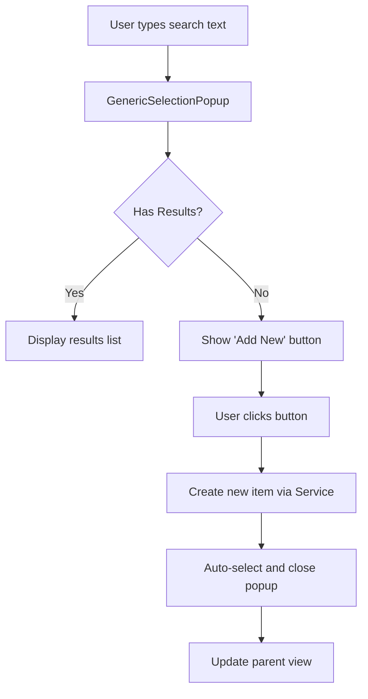

# Add New Provider and Material Creation from Search

## Overview

Implement the ability to create new providers and materials directly from the GenericSelectionPopup when search returns no results. The new items will be auto-selected after creation.

## Architecture Changes

The implementation follows this flow:



## 1. UI Layout Recommendation - GenericSelectionPopup Button

### Recommended Design

Add an "Add New" button in the DataGrid area when no results are found. Use the `primary-button` style for emphasis:

**Layout Structure:**

```
┌─────────────────────────────────────┐
│  Search: [input field]              │
├─────────────────────────────────────┤
│                                     │
│   No matching results found         │
│                                     │
│   ┌─────────────────────────┐      │
│   │  ➕ Add New "[text]"    │      │  <- primary-button
│   └─────────────────────────┘      │
│                                     │
├─────────────────────────────────────┤
│  Page info  [pagination]            │
└─────────────────────────────────────┘
```

**Style Details:**

- Button: `Classes="primary-button"` (blue background, white text from [`MaterialClient/App.axaml:129-134`](MaterialClient/App.axaml))
- Height: 36px (standard button height)
- FontSize: 12
- Icon: Use "➕" character or Path element
- Center aligned in the empty results area
- Display search text in button: "Add New 'XXX'"

### Alternative Design (if preferred)

Show button in the bottom toolbar alongside pagination:

```
┌─────────────────────────────────────┐
│  Search: [input field]              │
├─────────────────────────────────────┤
│  (Empty or filtered results)        │
├─────────────────────────────────────┤
│  [➕ Add New]  | Page info [<<][>>] │
└─────────────────────────────────────┘
```

## 2. Backend Implementation - MaterialService.cs

Add two new methods to [`MaterialClient.Common/Services/MaterialService.cs`](MaterialClient.Common/Services/MaterialService.cs):

### 2.1 CreateProviderAsync

**Interface addition to `IMaterialService`:**

```csharp
/// <summary>
/// Create a new provider
/// </summary>
/// <param name="providerName">Provider name</param>
/// <param name="deliveryType">Delivery type (0=Receiving, 1=Sending)</param>
/// <returns>Created provider entity</returns>
Task<Provider> CreateProviderAsync(string providerName, DeliveryType deliveryType);
```

**Implementation in `MaterialService`:**

```csharp
[UnitOfWork]
public async Task<Provider> CreateProviderAsync(string providerName, DeliveryType deliveryType)
{
    var provider = new Provider(
        providerType: (int)deliveryType,  // Match delivery type
        providerName: providerName.Trim())
    {
        CoId = 1,  // TODO update in next version
        AddDate = DateTime.Now,
        AddTime = (int)DateTimeOffset.Now.ToUnixTimeSeconds(),
        IsDeleted = false
    };
    
    var created = await _providerRepository.InsertAsync(provider, autoSave: true);
    return created;
}
```

### 2.2 CreateMaterialAsync

**Interface addition to `IMaterialService`:**

```csharp
/// <summary>
/// Create a new material with default unit
/// </summary>
/// <param name="materialName">Material name</param>
/// <returns>Created material entity</returns>
Task<Material> CreateMaterialAsync(string materialName);
```

**Implementation in `MaterialService`:**

```csharp
[UnitOfWork]
public async Task<Material> CreateMaterialAsync(string materialName)
{
    var material = new Material(
        name: materialName.Trim(),
        coId: 1)  // TODO update in next version
    {
        UnitName = "个",  // Default unit
        UnitRate = 1,      // Default ratio 1:1
        AddDate = DateTime.Now,
        AddTime = (int)DateTimeOffset.Now.ToUnixTimeSeconds(),
        IsDeleted = false
    };
    
    var created = await _materialRepository.InsertAsync(material, autoSave: true);
    return created;
}
```

## 3. GenericSelectionPopup Enhancements

### 3.1 Update GenericSelectionPopup.axaml

Modify [`MaterialClient/Views/GenericSelectionPopup.axaml`](MaterialClient/Views/GenericSelectionPopup.axaml):

- Add `IsVisible` binding for the DataGrid when results exist
- Add new section for "no results" state with "Add New" button
- Bind button command to new `AddNewItemCommand`
- Button should be visible when `TotalCount == 0` and `SearchText` is not empty

### 3.2 Update GenericSelectionPopupViewModel.cs

Modify [`MaterialClient/ViewModels/GenericSelectionPopupViewModel.cs`](MaterialClient/ViewModels/GenericSelectionPopupViewModel.cs):

**Add properties:**

```csharp
public bool ShowAddNewButton => TotalCount == 0 && !string.IsNullOrWhiteSpace(SearchText);
public string AddNewButtonText => $"Add New '{SearchText?.Trim()}'";
```

**Add optional callback:**

```csharp
private readonly Func<string, Task<T?>>? _createNewItemFunc;
```

**Add command:**

```csharp
[ReactiveCommand]
private async Task AddNewItemAsync()
{
    if (_createNewItemFunc == null || string.IsNullOrWhiteSpace(SearchText))
        return;
        
    try
    {
        var newItem = await _createNewItemFunc(SearchText.Trim());
        if (newItem != null)
        {
            // Auto-select the newly created item
            SelectedItem = new GenericSelectionItem<T>
            {
                Value = newItem,
                DisplayText = _displayTextSelector(newItem)
            };
            
            // Trigger refresh to show in list
            await RefreshAsync();
        }
    }
    catch (Exception ex)
    {
        Logger?.LogError(ex, "Failed to create new item");
        // Consider showing error notification to user
    }
}
```

**Update constructor** to accept `createNewItemFunc` parameter.

## 4. ViewModel Integration - AttendedWeighingDetailViewModel.cs

Update [`MaterialClient/ViewModels/AttendedWeighingDetailViewModel.cs`](MaterialClient/ViewModels/AttendedWeighingDetailViewModel.cs) where the popup ViewModels are initialized:

### 4.1 Update ProvidersPopupViewModel Initialization

```csharp
private void InitializeSolidWasteSelectionPopups()
{
    // ... existing code ...
    
    ProvidersPopupViewModel = new GenericSelectionPopupViewModel<Provider>(
        pagingMode: GenericSelectionPagingMode.ServerSide,
        displayTextSelector: p => p.ProviderName ?? string.Empty,
        logger: Logger,
        loadPageFunc: async (search, page, size) =>
            await _materialService.GetPagedProvidersAsync(search, page, size)
                .ContinueWith(t => new PagedResultDto<Provider>(
                    t.Result.TotalCount,
                    t.Result.Items.Select(dto => new Provider(dto.Id, dto.ProviderType, dto.ProviderName)).ToList())),
        createNewItemFunc: async (name) =>
        {
            // Get DeliveryType from current Record or Waybill
            var deliveryType = _listItem.DeliveryType ?? DeliveryType.Receiving;
            return await _materialService.CreateProviderAsync(name, deliveryType);
        },
        pageSize: 10);
        
    // Subscribe to selection changes to auto-close popup
    ProvidersPopupViewModel.WhenAnyValue(x => x.SelectedValue)
        .Where(p => p != null)
        .Subscribe(provider =>
        {
            SelectedProvider = provider;
            IsProvidersPopupOpen = false;
        });
}
```

### 4.2 Update MaterialsPopupViewModel Initialization

```csharp
MaterialsPopupViewModel = new GenericSelectionPopupViewModel<Material>(
    pagingMode: GenericSelectionPagingMode.ServerSide,
    displayTextSelector: m => m.Name ?? string.Empty,
    logger: Logger,
    loadPageFunc: async (search, page, size) =>
        await _materialService.GetPagedMaterialsAsync(search, page, size),
    createNewItemFunc: async (name) =>
        await _materialService.CreateMaterialAsync(name),
    pageSize: 10);
    
// Subscribe to selection changes to auto-close popup
MaterialsPopupViewModel.WhenAnyValue(x => x.SelectedValue)
    .Where(m => m != null)
    .Subscribe(material =>
    {
        SelectedSolidWasteMaterial = material;
        IsMaterialsPopupOpen = false;
    });
```

## 5. Testing Considerations

After implementation, verify:

1. **Provider Creation:**

   - Search for non-existent provider name
   - Click "Add New" button
   - Verify provider created with correct ProviderType matching DeliveryType
   - Verify provider auto-selected and popup closed

2. **Material Creation:**

   - Search for non-existent material name
   - Click "Add New" button
   - Verify material created with unit "个" and rate 1
   - Verify material auto-selected and popup closed

3. **Edge Cases:**

   - Empty search text should not show button
   - Button should disappear when results appear
   - Duplicate name handling (database constraint)
   - Long names display correctly in button text

## 6. Future Enhancements (Optional)

- Add validation for duplicate names before creation
- Show success notification after creation
- Allow editing newly created item immediately
- Add undo functionality for accidental creation
- Support creating MaterialUnit when creating Material

## Files Modified Summary

1. [`MaterialClient.Common/Services/MaterialService.cs`](MaterialClient.Common/Services/MaterialService.cs) - Add CreateProviderAsync and CreateMaterialAsync
2. [`MaterialClient/Views/GenericSelectionPopup.axaml`](MaterialClient/Views/GenericSelectionPopup.axaml) - Add "Add New" button UI
3. [`MaterialClient/ViewModels/GenericSelectionPopupViewModel.cs`](MaterialClient/ViewModels/GenericSelectionPopupViewModel.cs) - Add command and callback support
4. [`MaterialClient/ViewModels/AttendedWeighingDetailViewModel.cs`](MaterialClient/ViewModels/AttendedWeighingDetailViewModel.cs) - Wire up creation callbacks