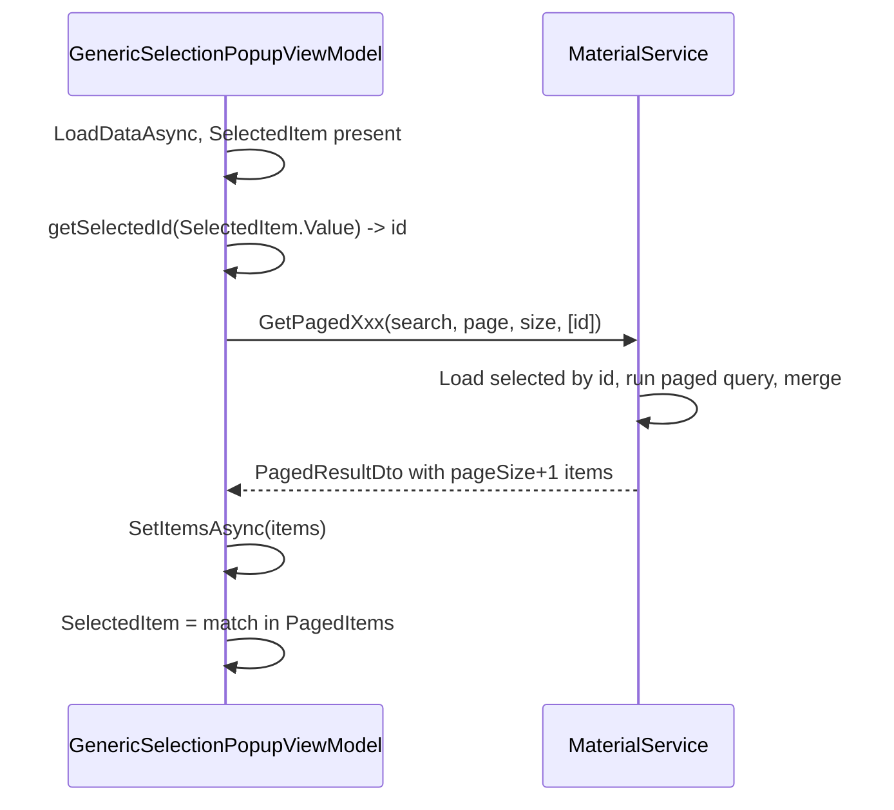

# Add selectedIds to loadPageFunc and all GenericSelectionPopupViewModel usages

## Scope

- **GenericSelectionPopupViewModel** ([MaterialClient/ViewModels/GenericSelectionPopupViewModel.cs](MaterialClient/ViewModels/GenericSelectionPopupViewModel.cs)): change `loadPageFunc` signature to include `IReadOnlyList<int>? selectedIds`, and add optional `Func<T, int?>? getSelectedId` so the VM can pass the current selection when loading.
- **IMaterialService / MaterialService** ([MaterialClient.Common/Services/MaterialService.cs](MaterialClient.Common/Services/MaterialService.cs) and interface): add optional `IReadOnlyList<int>? selectedIds = null` to `GetPagedMaterialsAsync` and `GetPagedProvidersAsync`; implement merge so returned `Items` = selected items (by id) + page data, length up to `pageSize + selectedIds.Count`.
- **AttendedWeighingDetailViewModel** ([MaterialClient/ViewModels/AttendedWeighingDetailViewModel.cs](MaterialClient/ViewModels/AttendedWeighingDetailViewModel.cs)): wire `getSelectedId` and the new `selectedIds` parameter for Materials and Providers popups only. Streets popup does not use `loadPageFunc` (client-side), so no change.

**Out of scope:** [MaterialsSelectionPopupViewModel.cs](MaterialClient/ViewModels/MaterialsSelectionPopupViewModel.cs) is a different ViewModel (not GenericSelectionPopupViewModel); it calls `GetPagedMaterialsAsync` directly. It will call the new overload with `selectedIds: null` (or the method can have a default parameter so existing callers are unchanged).

---

## 1. GenericSelectionPopupViewModel

**Constructor and field**

- Add optional parameter: `Func<T, int?>? getSelectedId = null`.
- Change `_loadPageFunc` type from `Func<string?, int, int, Task<PagedResultDto<T>>>?` to `Func<string?, int, int, IReadOnlyList<int>?, Task<PagedResultDto<T>>>?`.
- Store `getSelectedId` in a readonly field `_getSelectedId` (only used when `_loadPageFunc != null`).

**LoadDataAsync (server-side branch)**

- Before calling `_loadPageFunc`, build `selectedIds`:
  - If `_getSelectedId != null` and `SelectedItem != null`, compute `id = _getSelectedId(SelectedItem.Value)`; then `selectedIds = id.HasValue ? new List<int> { id.Value } : null`; otherwise `selectedIds = null`.
- Call: `_loadPageFunc(SearchText?.Trim(), CurrentPage, PageSize, selectedIds)`.
- Rest of logic unchanged (TotalCount, SetItemsAsync, etc.).

**Backward compatibility**

- Existing callers that pass a 3-argument delegate will break (signature change). All current call sites (Materials and Providers in AttendedWeighingDetailViewModel) will be updated to the 4-argument form and will pass `getSelectedId` where applicable.

---

## 2. IMaterialService and MaterialService

**Interface**

- `GetPagedMaterialsAsync(string? searchText = null, int pageIndex = 1, int pageSize = 10, IReadOnlyList<int>? selectedIds = null)`.
- `GetPagedProvidersAsync(string? searchText = null, int pageIndex = 1, int pageSize = 10, IReadOnlyList<int>? selectedIds = null)`.

**Implementation (both methods)**

- If `selectedIds == null` or empty: keep current behavior (same query, same return).
- If `selectedIds` has values:
  - **Materials:** Load entities for those ids (e.g. `await _materialRepository.GetListAsync(x => selectedIds.Contains(x.Id))` with same filters as main query if needed). Then run the existing paged query (same filter, OrderBy, Skip, Take pageSize). Merge: selected items first (order by selectedIds), then page items that are not in selectedIds, until combined list has length `pageSize + selectedIds.Count` (or less if not enough data). Return `new PagedResultDto<Material>(totalCount, mergedList)`. TotalCount can remain the query count (so pagination math stays correct).
  - **Providers:** Same idea: load providers by selectedIds, run existing paged query, merge (selected first, then page excluding selected), return `pageSize + selectedIds.Count` items; TotalCount unchanged.

Ensure selected ids are loaded with the same filters (e.g. WeighingMode, !IsDeleted) so we don’t include invalid rows.

---

## 3. AttendedWeighingDetailViewModel

**MaterialsPopupViewModel construction**

- Add `getSelectedId: m => m.Id`.
- Change `loadPageFunc` from `(search, pageIndex, pageSize) => _materialService.GetPagedMaterialsAsync(search, pageIndex, pageSize)` to `(search, pageIndex, pageSize, selectedIds) => _materialService.GetPagedMaterialsAsync(search, pageIndex, pageSize, selectedIds)`.

**ProvidersPopupViewModel construction**

- Add `getSelectedId: p => p.Id`.
- Change `loadPageFunc` from `(search, pageIndex, pageSize) => _materialService.GetPagedProvidersAsync(search, pageIndex, pageSize)` to `(search, pageIndex, pageSize, selectedIds) => _materialService.GetPagedProvidersAsync(search, pageIndex, pageSize, selectedIds)`.

**StreetsPopupViewModel**

- No change (no `loadPageFunc`, client-side only).

---

## 4. MaterialsSelectionPopupViewModel (call site only)

- Update the existing `GetPagedMaterialsAsync` call to pass the fourth argument: `selectedIds: null` (or rely on default parameter). No other logic change.

---

## 5. Flow after change

Opening the popup and calling RefreshAsync will then load a first page that includes the selected id(s), so the selected option exists in PagedItems and can be set without being cleared by the grid.

---

## 6. Files to change

| File                                                                                                                           | Change                                                                                                                           |
| ------------------------------------------------------------------------------------------------------------------------------ | -------------------------------------------------------------------------------------------------------------------------------- |
| [MaterialClient/ViewModels/GenericSelectionPopupViewModel.cs](MaterialClient/ViewModels/GenericSelectionPopupViewModel.cs)     | Add `getSelectedId`, change `loadPageFunc` to 4-arg with `IReadOnlyList<int>?`, compute and pass `selectedIds` in LoadDataAsync. |
| [MaterialClient.Common/Services/MaterialService.cs](MaterialClient.Common/Services/MaterialService.cs) (interface + impl)      | Add `selectedIds` to GetPagedMaterialsAsync and GetPagedProvidersAsync; implement merge logic.                                   |
| [MaterialClient/ViewModels/AttendedWeighingDetailViewModel.cs](MaterialClient/ViewModels/AttendedWeighingDetailViewModel.cs)   | Pass `getSelectedId` and 4-arg `loadPageFunc` for Materials and Providers.                                                       |
| [MaterialClient/ViewModels/MaterialsSelectionPopupViewModel.cs](MaterialClient/ViewModels/MaterialsSelectionPopupViewModel.cs) | Call GetPagedMaterialsAsync with `selectedIds: null` (or omit if default).                                                       |

