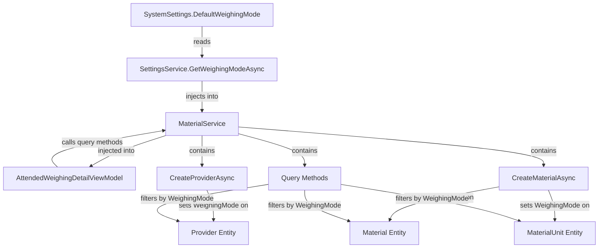

# Add WeighingMode Field and Filtering

## Overview

Add `WeighingMode` property to Provider, Material, and MaterialUnit entities. Update MaterialService to set WeighingMode from system settings during creation and filter all queries by the current system WeighingMode. Additionally, refactor AttendedWeighingDetailViewModel to use IMaterialService instead of direct repository access to ensure single source of truth for data filtering.

## Implementation Steps

### 1. Update Entity Classes

Add the WeighingMode property to three entity files with default value of `WeighingMode.Standard`:

**[MaterialClient.Common/Entities/Provider.cs](D:\CodeUp\MaterialClient\MaterialClient.Common\Entities\Provider.cs)**

- Add property after line 69 (after `CoId` property):
```csharp
public WeighingMode WeighingMode { get; set; } = WeighingMode.Standard;
```


**[MaterialClient.Common/Entities/Material.cs](D:\CodeUp\MaterialClient\MaterialClient.Common\Entities\Material.cs)**

- Add property after line 95 (after `UnitRate` property):
```csharp
public WeighingMode WeighingMode { get; set; } = WeighingMode.Standard;
```


**[MaterialClient.Common/Entities/MaterialUnit.cs](D:\CodeUp\MaterialClient\MaterialClient.Common\Entities\MaterialUnit.cs)**

- Add property after line 70 (after `RateName` property):
```csharp
public WeighingMode WeighingMode { get; set; } = WeighingMode.Standard;
```


### 2. Update MaterialService - Add Dependencies

**[MaterialClient.Common/Services/MaterialService.cs](D:\CodeUp\MaterialClient\MaterialClient.Common\Services\MaterialService.cs)**

Inject `ISettingsService` into MaterialService:

- Add field: `private readonly ISettingsService _settingsService;`
- Update constructor (lines 86-94) to accept and store ISettingsService

### 3. Update CreateProviderAsync Method

In `CreateProviderAsync` (lines 228-248):

- Get current WeighingMode from settings using `await _settingsService.GetWeighingModeAsync()`
- Set `WeighingMode` property on the new Provider instance before inserting

### 4. Update CreateMaterialAsync Method

In `CreateMaterialAsync` (lines 252-289):

- Get current WeighingMode from settings
- Set `WeighingMode` property on the new Material instance (line 261-270)
- Set `WeighingMode` property on the default MaterialUnit instance (line 275-284)

### 5. Add WeighingMode Filtering to All Query Methods

Update all query methods to filter by current system WeighingMode:

**GetPagedMaterialsAsync** (lines 98-135)

- Get WeighingMode from settings
- Add filter: `.Where(m => m.WeighingMode == weighingMode)` after the `!m.IsDeleted` filter

**GetAllMaterialsAsync** (lines 138-152)

- Get WeighingMode from settings
- Add filter: `.Where(m => m.WeighingMode == weighingMode)` after the `!m.IsDeleted` filter

**GetMaterialUnitsByMaterialIdAsync** (lines 155-169)

- Get WeighingMode from settings
- Add filter: `&& u.WeighingMode == weighingMode` to existing Where clause

**GetAllProvidersAsync** (lines 172-186)

- Get WeighingMode from settings
- Add filter: `.Where(p => p.WeighingMode == weighingMode)` after the `!p.IsDeleted` filter

**GetPagedProvidersAsync** (lines 189-224)

- Get WeighingMode from settings
- Add filter: `.Where(p => p.WeighingMode == weighingMode)` after the `!p.IsDeleted` filter (line 204)

### 6. Refactor AttendedWeighingDetailViewModel

**[MaterialClient/ViewModels/AttendedWeighingDetailViewModel.cs](D:\CodeUp\MaterialClient\MaterialClient\ViewModels\AttendedWeighingDetailViewModel.cs)**

Remove direct repository usage and use IMaterialService instead:

**Remove repository fields** (lines 43-45):

- Remove `_materialRepository`
- Remove `_materialUnitRepository`
- Remove `_providerRepository`

**Remove repository initialization** (lines 59-61 in constructor):

- Remove lines that get these repositories from service provider

**Update LoadProvidersAsync** (lines 721-742):

- Replace `_providerRepository.GetListAsync()` with `_materialService.GetAllProvidersAsync()`
- The method already returns sorted data, so just map to ProviderDto

**Update LoadMaterialsAsync** (lines 744-757):

- Replace `_materialRepository.GetListAsync()` with `_materialService.GetAllMaterialsAsync()`
- The method already returns sorted and filtered data

**Update LoadMaterialUnitsForRowAsync** (lines 759-784):

- Replace `_materialUnitRepository.GetListAsync(u => u.MaterialId == materialId)` with `_materialService.GetMaterialUnitsByMaterialIdAsync(materialId)`
- Remove `.OrderBy(u => u.UnitName)` since the service already returns sorted data

**Update line 105-106** (in SelectedSolidWasteMaterial subscription):

- Remove direct repository access
- Use the existing `LoadMaterialUnitsForRowAsync` method instead

**Update LoadConfigurationDataAsync** (line 804):

- Replace `_materialRepository.GetListAsync()` with `_materialService.GetAllMaterialsAsync()`

This refactoring ensures:

- Single source of truth: All data queries go through IMaterialService
- Consistent filtering: WeighingMode filtering is applied automatically
- Better maintainability: Business logic centralized in the service layer

## Architecture Diagram



## Notes

- The WeighingMode enum already exists at `MaterialClient.Common/Entities/Enums/WeighingMode.cs` with values: Standard (0) and SolidWaste (1)
- All entities will default to `WeighingMode.Standard` for backward compatibility
- EF migration will be handled manually by the user
- The filtering ensures data isolation between different weighing modes
- ISettingsService.GetWeighingModeAsync() provides centralized access to the current system WeighingMode setting
- Refactoring the ViewModel to use IMaterialService ensures all data queries are filtered consistently by WeighingMode
- This follows the Single Source of Truth principle: all business logic and filtering is centralized in the service layer