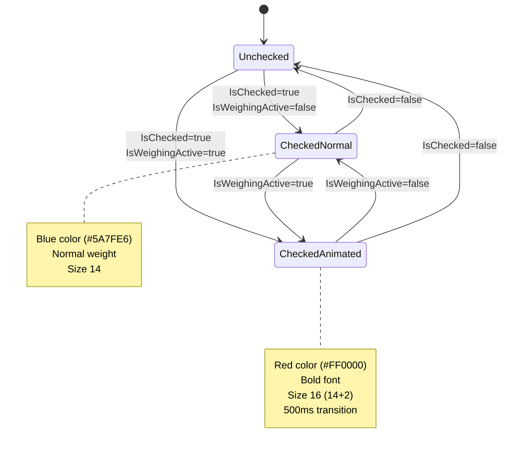

# Animated RadioButton Component Implementation

## Overview

Create a custom UserControl component `AnimatedDeliveryTypeRadioButton` that wraps RadioButton with animation capabilities. The component will animate font properties (color, weight, size) over 500ms when both `IsWeighingActive==true` AND the RadioButton is checked.

## Current State Analysis

**Files involved:**

- [`MaterialClient/Views/AttendedWeighing/AttendedWeighingWindow.axaml`](MaterialClient/Views/AttendedWeighing/AttendedWeighingWindow.axaml) (lines 156-176, 187-217) - Contains two RadioButtons: "收料" and "发料"
- [`MaterialClient/ViewModels/AttendedWeighingViewModel.cs`](MaterialClient/ViewModels/AttendedWeighingViewModel.cs) (line 940) - Defines `IsWeighingActive` property
- [`MaterialClient/Views/LoadingDotsAnimation.axaml.cs`](MaterialClient/Views/LoadingDotsAnimation.axaml.cs) - Reference pattern for custom animated controls

**Current RadioButton implementation:**

- Uses custom `ControlTemplate` with `Border` and `TextBlock`
- Style changes on `:checked` state (white background, blue text)
- No animation transitions currently implemented

## Implementation Strategy

### 1. Create Custom Animated RadioButton Component

**New files to create:**

- `MaterialClient/Views/AnimatedDeliveryTypeRadioButton.axaml`
- `MaterialClient/Views/AnimatedDeliveryTypeRadioButton.axaml.cs`

**Component features:**

- Dependency properties: `IsChecked`, `Text`, `GroupName`, `Command`, `IsWeighingActive`
- Animation triggers when: `IsWeighingActive==true` AND `IsChecked==true`
- Uses Avalonia `Transitions` for smooth property animations (500ms duration)

### 2. Animation Implementation Details

**Target animation properties:**

- **FontSize**: Current (14) → Target (16) - increase by 2
- **FontWeight**: Current (Normal) → Target (Bold)
- **Foreground**: Current (#5A7FE6 when checked) → Target (#FF0000 red)

**Animation approach:**

Use Avalonia's Transitions on the TextBlock:

```xml
<Transitions>
    <DoubleTransition Property="FontSize" Duration="0:0:0.5" />
    <BrushTransition Property="Foreground" Duration="0:0:0.5" />
</Transitions>
```

Use Styles with DataTrigger or code-behind to set target values when both conditions are met.

### 3. Code Implementation Pattern

**In `.axaml.cs`:**

- Define StyledProperties for all bindable properties
- Subscribe to property changes for `IsChecked` and `IsWeighingActive`
- Implement `UpdateAnimationState()` method to apply target styles when both conditions are true
- Set TextBlock properties dynamically based on animation state

**In `.axaml`:**

- Define RadioButton template similar to current implementation
- Add Transitions to TextBlock for smooth animations
- Bind all properties to parent UserControl properties

### 4. Integration into AttendedWeighingWindow

**Update [`AttendedWeighingWindow.axaml`](MaterialClient/Views/AttendedWeighing/AttendedWeighingWindow.axaml):**

- Replace the two existing RadioButton declarations (lines 156-186, 187-217)
- Use new `AnimatedDeliveryTypeRadioButton` component instead
- Pass through bindings: `IsChecked`, `Command`, `IsWeighingActive` from ViewModel

Example replacement:

```xml
<views1:AnimatedDeliveryTypeRadioButton 
    Text="收料"
    GroupName="DeliveryType"
    IsChecked="{Binding IsReceiving}"
    Command="{Binding SetReceivingCommand}"
    IsWeighingActive="{Binding IsWeighingActive}" />
```

## Technical Considerations

1. **Font Weight Animation**: Avalonia doesn't support direct FontWeight transitions. We'll need to set it immediately (no animation) or use a custom approach
2. **Foreground Brush Animation**: Use `SolidColorBrushTransition` for smooth color changes
3. **Multiple states**: Normal → Checked → Checked+WeighingActive
4. **Reverse animation**: When conditions become false, animate back smoothly

## Files to Modify/Create

- **CREATE**: `MaterialClient/Views/AnimatedDeliveryTypeRadioButton.axaml`
- **CREATE**: `MaterialClient/Views/AnimatedDeliveryTypeRadioButton.axaml.cs`
- **MODIFY**: `MaterialClient/Views/AttendedWeighing/AttendedWeighingWindow.axaml` (replace RadioButton implementations)

## Animation State Machine

