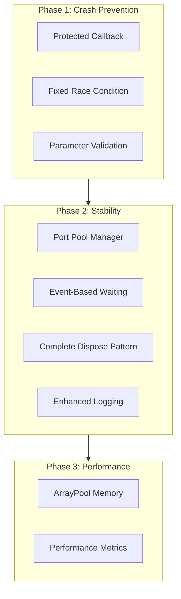

# Hikvision OpenStream Crash Fix Implementation

## Overview

Implement all 3 phases of the crash fix plan to resolve critical issues in the Hikvision camera capture system. The fixes address process crashes, race conditions, resource leaks, and performance issues.

## Architecture Changes



## Implementation Details

### Phase 1: Emergency Crash Fixes (Issues 1, 2, 3)

#### 1.1 Fix PlayM4Decoder.cs

**File**: [`MaterialClient.Common/Services/Hikvision/PlayM4Decoder.cs`](MaterialClient.Common/Services/Hikvision/PlayM4Decoder.cs)

**Changes**:

- Add `System.Buffers` using for ArrayPool
- Add `ManualResetEventSlim _playingEvent` field for event-based waiting
- Add `bool _disposed` field to track disposal state
- Implement complete Dispose pattern with `Dispose(bool disposing)` and finalizer
- Add `ThrowIfDisposed()` method for all public methods
- Add parameter validation in `OpenStream()`
- Prevent duplicate stream opening
- Add error handling in `OpenStream()` for each SDK call
- Implement `WaitForPlaying(int timeoutMs)` for event-based waiting
- Replace `CaptureJpeg()` to use ArrayPool instead of direct byte array allocation
- Update all public methods to call `ThrowIfDisposed()`

**Key Code Sections**:

- Lines 1-51: Add new fields and complete Dispose pattern
- Lines 122-151: Fix OpenStream with validation and error handling
- Lines 208-230: Replace CaptureJpeg with ArrayPool implementation

#### 1.2 Fix HikvisionService.cs CaptureJpegFromStream

**File**: [`MaterialClient.Common/Services/Hikvision/HikvisionService.cs`](MaterialClient.Common/Services/Hikvision/HikvisionService.cs)

**Changes**:

- Add `using System.Diagnostics` for Stopwatch
- Wrap callback function (lines 427-480) with try-catch block
- Add `disposed` local state flag (closure-captured variable)
- Add parameter validation in callback (check for null/zero pointers)
- Add logging in callback for debugging
- Replace polling wait (lines 521-527) with `decoder.WaitForPlaying(5000)`
- Fix finally block order (lines 556-568):

  1. Set disposed flag first
  2. Stop preview stream
  3. Wait 200ms for callbacks to complete
  4. Then dispose decoder within lock

- Add Stopwatch for performance metrics
- Add detailed logging at each step

**Key Code Section**:

```csharp
// Before callback definition
var disposed = false;  // Local flag captured by closure

// Callback with full protection
NET_DVR.REALDATACALLBACK realDataCallback = (handle, dataType, buffer, bufSize, user) =>
{
    try
    {
        if (disposed) return;
        
        lock (streamLock)
        {
            if (disposed || decoder == null) return;
            if (buffer == IntPtr.Zero || bufSize == 0) return;
            // ... rest of callback logic
        }
    }
    catch (Exception ex)
    {
        _logger?.LogError(ex, "Callback exception: DataType={DataType}", dataType);
    }
};

// Finally block fix
finally
{
    disposed = true;  // 1. Set flag
    
    if (lRealHandle >= 0)
    {
        NET_DVR.NET_DVR_StopRealPlay(lRealHandle);  // 2. Stop stream
        Thread.Sleep(200);  // 3. Wait for callbacks
    }
    
    lock (streamLock)
    {
        decoder?.Dispose();  // 4. Finally dispose
    }
}
```

### Phase 2: Stability Enhancements (Issues 4, 5, 7, 8)

#### 2.1 Create Port Pool Manager

**New File**: `MaterialClient.Common/Services/Hikvision/PlayM4PortPool.cs`

**Purpose**: Manage PlayM4 port allocation to prevent resource exhaustion

**Implementation**:

```csharp
using System.Collections.Concurrent;

namespace MaterialClient.Common.Services.Hikvision;

/// <summary>
/// Manages PlayM4 port allocation to prevent exhaustion
/// </summary>
public static class PlayM4PortPool
{
    private static readonly SemaphoreSlim _semaphore = new(16, 16);
    private static readonly ConcurrentBag<int> _availablePorts = new();
    
    public static async Task<int> AcquirePortAsync(int timeoutMs = 5000)
    {
        if (!await _semaphore.WaitAsync(timeoutMs))
            throw new TimeoutException("Cannot acquire PlayM4 port: limit reached");
        
        try
        {
            if (_availablePorts.TryTake(out var port))
                return port;
            
            int newPort = -1;
            if (!PlayM4.PlayM4_GetPort(ref newPort))
                throw new InvalidOperationException("PlayM4_GetPort failed");
            
            return newPort;
        }
        catch
        {
            _semaphore.Release();
            throw;
        }
    }
    
    public static void ReleasePort(int port)
    {
        if (port >= 0)
        {
            try
            {
                PlayM4.PlayM4_Stop(port);
                PlayM4.PlayM4_CloseStream(port);
                PlayM4.PlayM4_FreePort(port);
            }
            finally
            {
                _semaphore.Release();
            }
        }
    }
}
```

#### 2.2 Update PlayM4Decoder to Use Port Pool

**File**: [`MaterialClient.Common/Services/Hikvision/PlayM4Decoder.cs`](MaterialClient.Common/Services/Hikvision/PlayM4Decoder.cs)

**Changes**:

- Modify `Initialize()` to use `PlayM4PortPool.AcquirePortAsync().Result`
- Modify `Dispose()` to use `PlayM4PortPool.ReleasePort(_port)`

#### 2.3 Add Error Description Helper

**File**: [`MaterialClient.Common/Services/Hikvision/HikvisionService.cs`](MaterialClient.Common/Services/Hikvision/HikvisionService.cs)

**Add new method**:

```csharp
private static string GetErrorDescription(uint errorCode)
{
    return errorCode switch
    {
        1 => "Username or password error",
        2 => "No permission",
        3 => "SDK not initialized",
        4 => "Channel number error",
        5 => "Max client connections exceeded",
        6 => "Version mismatch",
        7 => "Failed to connect to device",
        8 => "Send failed",
        9 => "Receive failed",
        10 => "Timeout",
        11 => "Data transfer failed",
        12 => "Port incorrect",
        _ => $"Unknown error ({errorCode})"
    };
}
```

### Phase 3: Performance Optimization (Issue 6)

**Already included in Phase 1 - ArrayPool implementation in CaptureJpeg**

### Testing Implementation

#### 3.1 Create Unit Test Project Structure

**New File**: `MaterialClient.Tests/Services/Hikvision/HikvisionServiceTests.cs`

**Tests to implement**:

1. **ConcurrentCaptureTest** - Verify no crashes with 4 concurrent captures
2. **StressTest** - 100 iterations of 4 concurrent captures
3. **ResourceLeakTest** - Verify ports are properly released after 100 operations
4. **CallbackExceptionTest** - Verify exceptions in callback don't crash process
5. **DisposePatternTest** - Verify proper cleanup on multiple Dispose calls
6. **PortExhaustionTest** - Verify graceful handling when ports exhausted
7. **TimeoutTest** - Verify timeout handling for decoder initialization

**Test Structure**:

```csharp
using Xunit;
using MaterialClient.Common.Services.Hikvision;

namespace MaterialClient.Tests.Services.Hikvision;

public class HikvisionServiceTests
{
    [Fact]
    public async Task CaptureJpegFromStream_Concurrent_ShouldNotCrash()
    {
        // Test 4 concurrent captures
    }
    
    [Fact]
    public async Task CaptureJpegFromStream_StressTest()
    {
        // 100 iterations x 4 concurrent
    }
    
    [Fact]
    public void PlayM4Decoder_DisposeTest()
    {
        // Test resource cleanup
    }
    
    // ... more tests
}
```

#### 3.2 Create Integration Test

**New File**: `MaterialClient.Tests/Services/Hikvision/HikvisionIntegrationTests.cs`

**Purpose**: Real camera integration tests (requires actual hardware)

## File Changes Summary

### Modified Files

1. `MaterialClient.Common/Services/Hikvision/PlayM4Decoder.cs` - Complete rewrite with all fixes
2. `MaterialClient.Common/Services/Hikvision/HikvisionService.cs` - Fix CaptureJpegFromStream method

### New Files

3. `MaterialClient.Common/Services/Hikvision/PlayM4PortPool.cs` - Port management
4. `MaterialClient.Tests/Services/Hikvision/HikvisionServiceTests.cs` - Unit tests
5. `MaterialClient.Tests/Services/Hikvision/HikvisionIntegrationTests.cs` - Integration tests

## Risk Mitigation

1. **Backward Compatibility**: All public APIs remain unchanged
2. **Testing**: Comprehensive unit and integration tests
3. **Logging**: Enhanced logging for production debugging
4. **Phased Rollout**: Can deploy Phase 1 immediately for crash fixes

## Success Criteria

- No process crashes during concurrent camera captures
- All unit tests pass
- No resource leaks detected in stress tests
- Performance metrics show improvement in memory usage
- Detailed logs available for troubleshooting