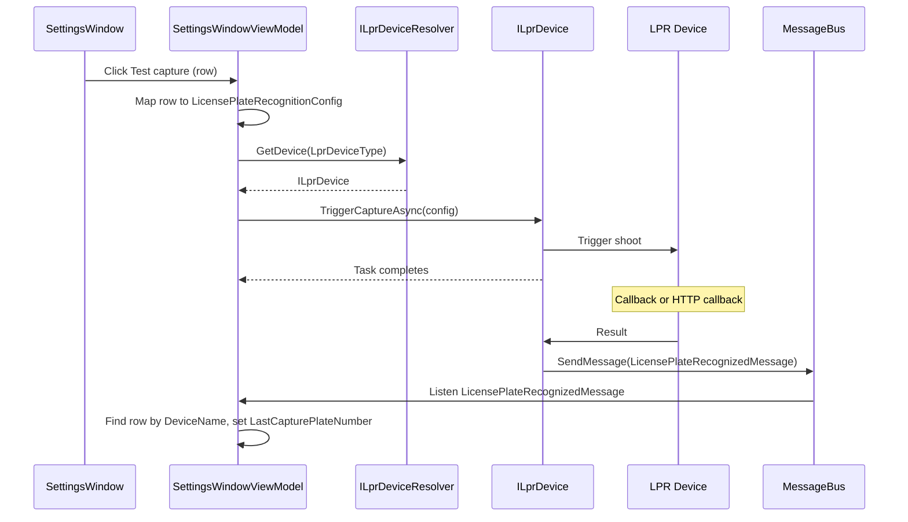

# LPR MessageBus Unification and Settings Test Capture

## 1. Goals

- **Part A**: Unify active LPR capture to MessageBus: change `ILprDevice.TriggerCaptureAsync` to only trigger capture (return `Task`); recognition results are delivered only via `LicensePlateRecognizedMessage`; remove LPR's public IObservable surface (including `PlateRecognized` and the returned stream).
- **Part B**: In the Settings LPR DataGrid, add a "Test capture" button and a "Capture result" column; subscribe to MessageBus and write the result (plate string) into the corresponding row by device name.

## 2. Architecture and Data Flow (After Change)

- **Passive recognition**: Hardware callback → LPR services → already send `LicensePlateRecognizedMessage` (unchanged).
- **Active capture**: Call `TriggerCaptureAsync(config)` → only triggers; result still comes from device callback; same callback path sends `LicensePlateRecognizedMessage`; Settings updates the "Capture result" column by subscribing to that message.

## 3. Part A: Unify Active Capture to MessageBus

### 3.1 Interface and Implementations

- **[ILprDevice](MaterialClient.Common/Services/ILprDevice.cs)**  
  - Change `IObservable<LicensePlateRecognizedEvent> TriggerCaptureAsync(LicensePlateRecognitionConfig config)` to `Task TriggerCaptureAsync(LicensePlateRecognitionConfig config)`.  
  - Update docs: only triggers capture; recognition results are delivered via MessageBus's `LicensePlateRecognizedMessage`; throw `NotSupportedException` when not supported.
- **[HikvisionLprService](MaterialClient.Common/Services/Hikvision/HikvisionLprService.cs)**  
  - `TriggerCaptureAsync`: Keep "login + `NET_DVR_ContinuousShoot`" logic; change to `async Task`, return after trigger; stop subscribing to `PlateRecognized` and stop pushing to an observer.  
  - Callbacks (`HandlePlateResult` / `HandleItsPlateResult`) already send `LicensePlateRecognizedMessage`; leave them as-is.  
  - Remove public `PlateRecognized` and internal `_plateRecognizedSubject`: delete `IHikvisionLprService.PlateRecognized`, implementation's `PlateRecognized` and `_plateRecognizedSubject`; in callbacks keep only `MessageBus.Current.SendMessage(message)`.
- **[IHikvisionLprService](MaterialClient.Common/Services/Hikvision/HikvisionLprService.cs)**  
  - Remove `IObservable<LicensePlateRecognizedEvent> PlateRecognized { get; }`.
- **[LprAllInOneService](MaterialClient.Common/Services/LprAllInOne/LprAllInOneService.cs)**  
  - `TriggerCaptureAsync`: Change to `async Task`; inside only `await TriggerManualRecognitionAsync(config)` then return; results continue to be published via existing HTTP callback as `LicensePlateRecognizedMessage`; no other changes.
- **[HuaxiazhixinLprService](MaterialClient.Common/Services/Huaxiazhixin/HuaxiazhixinLprService.cs)**  
  - `TriggerCaptureAsync`: Change to `Task`; inside throw `new NotSupportedException(...)` (or `Task.FromException`); keep current semantics.

### 3.2 Tests and Mock

- **[MockHikvisionLprService](MaterialClient.Common.Tests/Mocks/MockHikvisionLprService.cs)**  
  - Implement new `Task TriggerCaptureAsync(LicensePlateRecognitionConfig config)` (return immediately or optionally call `SimulatePlateRecognition`).  
  - Remove `PlateRecognized` from interface implementation.  
  - In `SimulatePlateRecognition`, in addition to pushing to Subject, add `MessageBus.Current.SendMessage(new LicensePlateRecognizedMessage { PlateNumber, DeviceName, ... })` so tests that rely on MessageBus receive the result.
- **[HikvisionLprServiceTests](MaterialClient.Common.Tests/Tests/HikvisionLprServiceTests.cs)**  
  - Change tests that depend on `_service.PlateRecognized.Subscribe(...)` to collect results via `MessageBus.Current.Listen<LicensePlateRecognizedMessage>()`, driven by Mock's `SimulatePlateRecognition` (or `TriggerCaptureAsync` if the mock sends via MessageBus).
- **[HikvisionLprServiceMemoryLeakTests](MaterialClient.Common.Tests/Tests/HikvisionLprServiceMemoryLeakTests.cs)**  
  - Change leak tests from `PlateRecognized` subscription to MessageBus subscription (or remove/rewrite to verify Dispose of MessageBus subscription), aligned with the new delivery model.
- **[LicensePlateRecognizedEvent](MaterialClient.Common/Events/LicensePlateRecognizedEvent.cs)**  
  - Keep the type (optional: tests or internal use only); external delivery uses only `LicensePlateRecognizedMessage`.

## 4. Part B: Settings Test Button and Capture Result Column

### 4.1 Resolve LPR Device by Type

- **Add [ILprDeviceResolver**](MaterialClient.Common/Services/ILprDeviceResolver.cs)  
  - Interface: `ILprDevice GetDevice(LprDeviceType type);`  
  - Implementation injects `IHikvisionLprService`, `ILprAllInOneService`, `HuaxiazhixinLprService` (or the Huaxiazhixin `ILprDevice` implementation) and returns the instance for the given `type`.  
  - Register as singleton in [MaterialClientCommonModule](MaterialClient.Common/MaterialClientCommonModule.cs).

### 4.2 ViewModel

- **[LicensePlateRecognitionConfigViewModel](MaterialClient/ViewModels/SettingsWindowViewModel.cs)**  
  - Add property: `[Reactive] private string _lastCapturePlateNumber = string.Empty;` (or `string?`) for binding the "Capture result" column.
- **[SettingsWindowViewModel](MaterialClient/ViewModels/SettingsWindowViewModel.cs)**  
  - Inject `ILprDeviceResolver` (and `IDisposable`/CompositeDisposable if needed for disposal).  
  - **TestLprCaptureCommand**: `ReactiveCommand<LicensePlateRecognitionConfigViewModel, Unit>` (or async Task), parameter is the current row.  
    - Map row to `LicensePlateRecognitionConfig` (Name, Ip, Direction, UserName, Password, Port, Channel).  
    - Call `_lprDeviceResolver.GetDevice(LprDeviceType)`; if device does not support (e.g. Huaxiazhixin), show a message and return.  
    - `await lprDevice.TriggerCaptureAsync(config);` (no return value; result comes via MessageBus).
  - **MessageBus subscription**: In constructor, `MessageBus.Current.Listen<LicensePlateRecognizedMessage>().Subscribe(msg => { ... })`.  
    - In the handler, find the item in `LicensePlateRecognitionConfigs` by `msg.DeviceName` and set `item.LastCapturePlateNumber = msg.PlateNumber`.  
    - Use `Avalonia.Threading.Dispatcher.UIThread.Post` or ensure updates to the collection/property happen on the UI thread.
  - Dispose the subscription when the window/ViewModel is destroyed (e.g. tied to window lifetime or CompositeDisposable) to avoid leaks.

### 4.3 View

- **[SettingsWindow.axaml](MaterialClient/Views/SettingsWindow.axaml)** (LPR DataGrid, approx. lines 464–505)  
  - Add a "Capture result" column before the "Operation" column:  
    - `<DataGridTextColumn Header="Capture result" Width="100" Binding="{Binding LastCapturePlateNumber}" />` (width as needed).
  - In the "Operation" column, add a button in the same `StackPanel` as Edit/Delete:  
    - `Content="Test capture"`, `Command="{Binding $parent[Window].((vm:SettingsWindowViewModel)DataContext).TestLprCaptureCommand}"`, `CommandParameter="{Binding}"`, style consistent with existing buttons (e.g. transparent background, suitable foreground).

## 5. File List (Changes and Additions)

| Change type | File                                                                                                                                               |
| ----------- | -------------------------------------------------------------------------------------------------------------------------------------------------- |
| Modify      | `MaterialClient.Common/Services/ILprDevice.cs`                                                                                                     |
| Modify      | `MaterialClient.Common/Services/Hikvision/IHikvisionLprService` (remove PlateRecognized) and `HikvisionLprService.cs`                              |
| Modify      | `MaterialClient.Common/Services/LprAllInOne/LprAllInOneService.cs`                                                                                 |
| Modify      | `MaterialClient.Common/Services/Huaxiazhixin/HuaxiazhixinLprService.cs`                                                                            |
| Add         | `MaterialClient.Common/Services/ILprDeviceResolver.cs` and implementation, then register                                                           |
| Modify      | `MaterialClient.Common/MaterialClientCommonModule.cs` (register Resolver)                                                                          |
| Modify      | `MaterialClient/ViewModels/SettingsWindowViewModel.cs` (Resolver, TestLprCaptureCommand, MessageBus subscription, row VM's LastCapturePlateNumber) |
| Modify      | `MaterialClient/Views/SettingsWindow.axaml` (new column and Test capture button)                                                                   |
| Modify      | `MaterialClient.Common.Tests/Mocks/MockHikvisionLprService.cs`                                                                                     |
| Modify      | `MaterialClient.Common.Tests/Tests/HikvisionLprServiceTests.cs`, `HikvisionLprServiceMemoryLeakTests.cs`                                           |

## 6. Acceptance Criteria

- Passive LPR: Still delivered only via `LicensePlateRecognizedMessage`; behavior unchanged.  
- Active capture: Calling `TriggerCaptureAsync` only triggers; no IObservable; Hikvision/LprAllInOne results come from existing callbacks via MessageBus; Huaxiazhixin call throws `NotSupportedException`.  
- Settings: After clicking "Test capture" on a row, that row's "Capture result" column shows the plate from the latest `LicensePlateRecognizedMessage` for that device; when there are multiple devices, match by `DeviceName` to the correct row.

