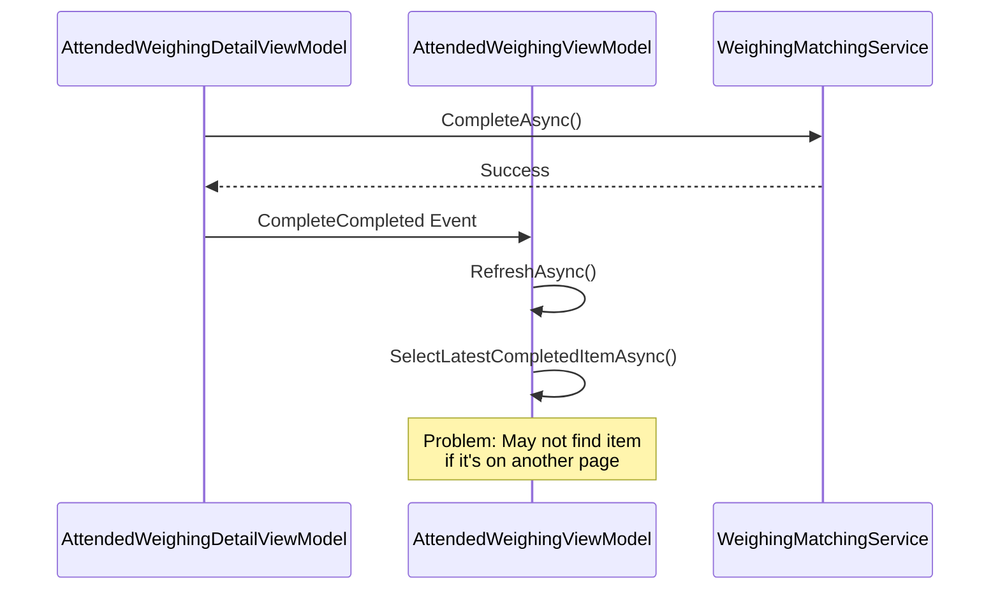
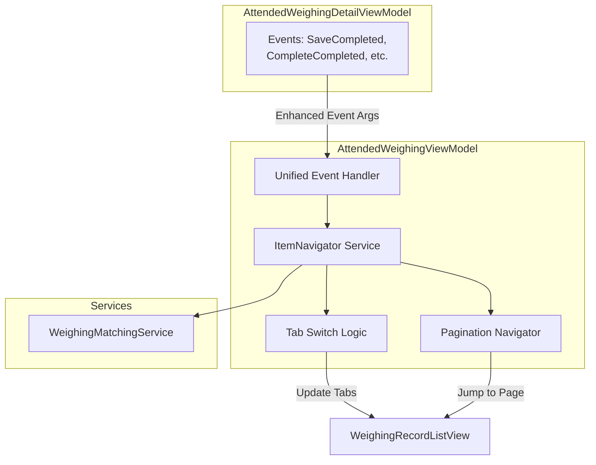

# Refactor WeighingListItemDto Object Tracking and Navigation

## Problem Statement

The current implementation has confusion in event handling after operations on `WeighingListItemDto` objects. Specifically:

1. **Event Handler Confusion**: Events from [`AttendedWeighingDetailViewModel`](D:\CodeUp\MaterialClient\MaterialClient\ViewModels\AttendedWeighingDetailViewModel.cs) (lines 1345-1351) cannot properly track and finalize `WeighingListItemDto` objects after operations
2. **Incorrect View Selection**: After `CompleteAsync`, the system doesn't properly navigate between [`AttendedWeighingDetailView.axaml`](D:\CodeUp\MaterialClient\MaterialClient\Views\AttendedWeighing\AttendedWeighingDetailView.axaml) and [`AttendedWeighingMainView.axaml`](D:\CodeUp\MaterialClient\MaterialClient\Views\AttendedWeighing\AttendedWeighingMainView.axaml) based on object type
3. **Tab Switching Logic**: Missing proper tab navigation rules for [`WeighingRecordListView.axaml`](D:\CodeUp\MaterialClient\MaterialClient\Views\AttendedWeighing\WeighingRecordListView.axaml) when objects move between states
4. **Pagination Issues**: No mechanism to navigate to the correct page when tracking objects across pages

## Current Behavior Analysis

### Event Flow



### Current Event Handlers

In [`AttendedWeighingViewModel.cs`](D:\CodeUp\MaterialClient\MaterialClient\ViewModels\AttendedWeighingViewModel.cs):

- `OnDetailCompleteCompleted` (line 1272): Calls `SelectLatestCompletedItemAsync()`
- `OnDetailSaveCompleted` (line 1251): Only refreshes, no proper navigation
- `OnDetailMatchCompleted` (line 1265): Calls `SelectUnmatchedNextItemAsync()`
- `OnDetailAbolishCompleted` (line 1258): Calls `SelectUnmatchedNextItemAsync()`

## Expected Behavior (Based on User Requirements)

### 1. After CompleteAsync Operation

- **Item Selection**: Stay on the completed Waybill object
- **View Display**: Show `AttendedWeighingMainView` (not `DetailView`)
- **Tab Behavior**: 
  - If `IsShowAllRecords` is true: Don't switch tabs
  - Otherwise: Switch to the appropriate tab containing the completed item
- **Pagination**: Refresh data, search for the object, and auto-navigate to the correct page

### 2. Tab Switching Rules

- **When `IsShowAllRecords == true`**: Never switch tabs (all items visible)
- **When `IsShowUnmatched == true`**: Switch to `IsShowCompleted` if item moves to completed state
- **When `IsShowCompleted == true`**: Switch to `IsShowUnmatched` if item moves to unmatched state

### 3. View Selection Logic

Based on `ItemType` and status:

- **Waybill + Completed**: Show `AttendedWeighingMainView`
- **Everything else**: Show `AttendedWeighingDetailView`

## Proposed Solution

### Architecture Changes



### Key Components to Modify

1. **[`AttendedWeighingDetailViewModel.cs`](D:\CodeUp\MaterialClient\MaterialClient\ViewModels\AttendedWeighingDetailViewModel.cs)**

   - Enhance event arguments to include `ItemType`, `OrderType`, and `IsCompleted` status
   - Add operation context to events (e.g., "user completed order")

2. **[`AttendedWeighingViewModel.cs`](D:\CodeUp\MaterialClient\MaterialClient\ViewModels\AttendedWeighingViewModel.cs)**

   - Refactor `SelectLatestCompletedItemAsync` (line 1301) to support pagination navigation
   - Extract tab switching logic into dedicated method `NavigateToItemAsync`
   - Consolidate event handlers to use unified navigation logic

3. **Tab Switch Decision Logic**
   ```csharp
   private bool ShouldSwitchTab(WeighingListItemDto targetItem)
   {
       if (IsShowAllRecords) return false; // Never switch when showing all
       
       bool itemIsCompleted = targetItem.OrderType == OrderTypeEnum.Completed;
       bool currentTabMatchesItem = 
           (IsShowCompleted && itemIsCompleted) ||
           (IsShowUnmatched && !itemIsCompleted);
           
       return !currentTabMatchesItem; // Switch if mismatch
   }
   ```

4. **Pagination Navigation Strategy**

   - After `RefreshAsync()`, search for target item in `ListItems`
   - If not found, calculate potential page based on timestamp and ordering
   - Iterate through pages (with limit) until item is found
   - Select item and apply view selection logic

### Event Args Enhancement

Create new event argument classes:

```csharp
public class ItemOperationCompletedEventArgs : EventArgs
{
    public long ItemId { get; init; }
    public WeighingListItemType ItemType { get; init; }
    public OrderTypeEnum? OrderType { get; init; }
    public bool IsCompleted { get; init; }
    public string OperationType { get; init; } // "Save", "Complete", "Match", "Abolish"
}
```

## Implementation Tasks

### Phase 1: Event Infrastructure

1. Create enhanced event argument classes
2. Update event definitions in `AttendedWeighingDetailViewModel`
3. Modify event invocations to pass complete context

### Phase 2: Navigation Logic

4. Implement `NavigateToItemAsync(ItemOperationCompletedEventArgs args)` method
5. Extract tab switching logic into `DetermineTargetTab(WeighingListItemDto item)`
6. Implement pagination search logic `FindItemAcrossPagesAsync(long itemId, WeighingListItemType itemType)`

### Phase 3: Event Handler Refactoring

7. Refactor all `OnDetail*Completed` event handlers to use unified `NavigateToItemAsync`
8. Ensure proper view selection (MainView vs DetailView) after navigation

### Phase 4: Testing & Validation

9. Test all operation paths (Save, Complete, Match, Abolish)
10. Verify tab switching behavior in all scenarios
11. Validate pagination navigation across multiple pages
12. Ensure proper view display after operations

## Files to Modify

1. **ViewModels**

   - [`MaterialClient/ViewModels/AttendedWeighingDetailViewModel.cs`](D:\CodeUp\MaterialClient\MaterialClient\ViewModels\AttendedWeighingDetailViewModel.cs)
   - [`MaterialClient/ViewModels/AttendedWeighingViewModel.cs`](D:\CodeUp\MaterialClient\MaterialClient\ViewModels\AttendedWeighingViewModel.cs)

2. **Event Classes** (New)

   - `MaterialClient.Common/Events/ItemOperationCompletedEventArgs.cs`

3. **Views** (No changes needed, onlyViewModel bindings)

   - [`MaterialClient/Views/AttendedWeighing/WeighingRecordListView.axaml`](D:\CodeUp\MaterialClient\MaterialClient\Views\AttendedWeighing\WeighingRecordListView.axaml)
   - [`MaterialClient/Views/AttendedWeighing/AttendedWeighingMainView.axaml`](D:\CodeUp\MaterialClient\MaterialClient\Views\AttendedWeighing\AttendedWeighingMainView.axaml)
   - [`MaterialClient/Views/AttendedWeighing/AttendedWeighingDetailView.axaml`](D:\CodeUp\MaterialClient\MaterialClient\Views\AttendedWeighing\AttendedWeighingDetailView.axaml)

## Benefits

1. **Consistency**: Unified navigation logic for all operations
2. **Reliability**: Proper object tracking across tabs and pages
3. **User Experience**: Intuitive navigation that follows user expectations
4. **Maintainability**: Centralized logic reduces duplication and bugs

## Risks and Mitigations

| Risk | Mitigation |

|------|------------|

| Breaking existing behavior | Comprehensive testing of all operation paths |

| Performance with many pages | Limit pagination search to reasonable range (e.g., ±10 pages) |

| Event timing issues | Use proper async/await patterns and state synchronization |

## Success Criteria

- ✅ After `CompleteAsync`, user stays on completed Waybill in MainView
- ✅ Tab switching respects `IsShowAllRecords` flag
- ✅ Pagination automatically navigates to correct page
- ✅ View selection (MainView/DetailView) follows ItemType rules
- ✅ All existing operations (Save, Match, Abolish) work correctly