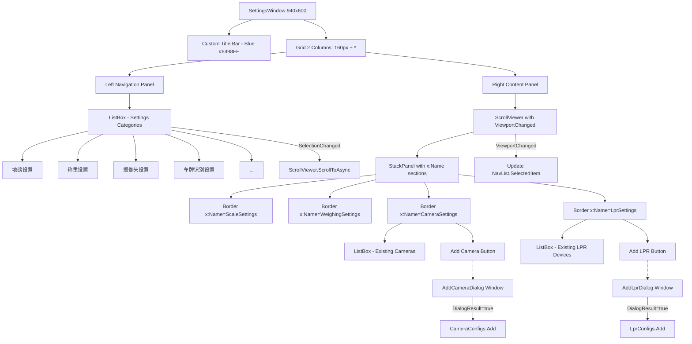
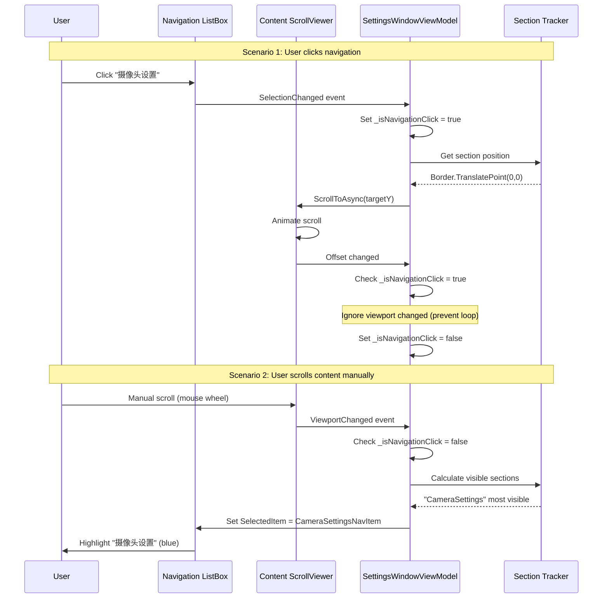

# Settings Window Layout Migration Analysis & Implementation Plan

## Executive Summary

Migrate `MaterialClient.Views.SettingsWindow` from a vertical-stacked single-column layout to a left-navigation + scrollable-content two-column layout pattern based on `FdSoft.Material.WpfClient.Setting.Index`.

## Current State Analysis

### MaterialClient (Avalonia) - Current Implementation

**File**: [MaterialClient/Views/SettingsWindow.axaml](d:\CodeUp\MaterialClient\MaterialClient\Views\SettingsWindow.axaml)

**Layout Structure**:

```
Window (800x700)
└── Grid (3 rows: Title, Content, Buttons)
    ├── Title: "系统设置" (FontSize 24, Bold)
    ├── ScrollViewer (VerticalScrollBarVisibility)
    │   └── StackPanel (Spacing 24)
    │       ├── Border (地磅设置)
    │       ├── Border (称重设置)
    │       ├── Border (摄像头设置) - ItemsControl with inline cards
    │       ├── Border (车牌识别设置) - ItemsControl with inline cards
    │       ├── Border (系统设置)
    │       ├── Border (音响设备设置)
    │       └── Border (打印机设置)
    └── Buttons Grid (取消, 保存)
```

**Key Characteristics**:

- Single column, vertical scroll
- All sections visible in single ScrollViewer
- Camera/LPR configs displayed as inline ItemsControl cards
- No navigation menu
- 7 setting sections total

### FdSoft.Material.Client (WPF) - Target Reference

**File**: [FdSoft.Material.WpfClient/Setting/Index.xaml](d:\CodeUp\FdSoft.Material.Client\FdSoft.Material.WpfClient\Setting\Index.xaml)

**Layout Structure**:

```
Window (940x530, NoResize)
├── Title Bar (Blue #6498FE, Height 50)
│   └── "系统设置" + Close Button
├── Grid (2 columns: 140px Navigation + 800px Content)
│   ├── ListBox (Left Navigation, Width 140)
│   │   └── ListBoxItems (Height 50 each)
│   │       - Style: Selected = White bg + 3px blue left border
│   │       - Background: #F2F2F2
│   │       - Selected text: #6398FF
│   └── ScrollViewer (Right Content, 800x480)
│       └── StackPanel with named sections
│           ├── Label with x:Name (e.g., "SystemModel", "DiBang")
│           └── Content below each label
└── Save Button (Bottom center, Blue #4A85F9)
```

**Key Characteristics**:

- Two-column layout (140px nav + 800px content)
- ListBox navigation with custom styled items
- ScrollViewer content with named Label anchors
- Camera/LPR configs open in dialogs (via buttons)
- Navigation syncs via `PreviewMouseDown` + `boxScrollViewer.ScrollToVerticalOffset()`
- 10 navigation items (切换模式, 地磅设置, 扫码箱设置, 摄像头, 高拍仪, 音响, 无人值守, 车牌识别, 功能设置, 皮重预警)

## Layout Comparison Matrix

| Aspect | MaterialClient (Current) | FdSoft.Material.Client (Target) |

|--------|--------------------------|----------------------------------|

| **Overall Layout** | Single column | Two-column (Nav + Content) |

| **Navigation** | None | Left ListBox (140px) |

| **Content Width** | ~768px (full width) | 800px (right panel) |

| **Window Size** | 800x700 | 940x530 |

| **Multi-Item Config** | Inline ItemsControl cards | Dialog windows |

| **Section Headers** | TextBlock in Border | Label with BorderBrush separator |

| **Scroll Behavior** | Single ScrollViewer | Content ScrollViewer + Nav sync |

| **Save Button** | Bottom right | Bottom center |

| **Title Bar** | Default Avalonia | Custom blue bar (#6498FE) |

## Requirements Implementation

### Requirement 1: Left-Right Layout

**Goal**: Navigation menu on left (140-160px), scrollable content on right (remaining width)

**Implementation**:

```xml
<Grid ColumnDefinitions="160,*">
    <!-- Left Navigation -->
    <ListBox Grid.Column="0" 
             x:Name="NavigationList"
             Background="#F2F2F2"
             SelectionChanged="OnNavigationSelectionChanged">
        <ListBoxItem Tag="ScaleSettings">地磅设置</ListBoxItem>
        <ListBoxItem Tag="WeighingSettings">称重设置</ListBoxItem>
        <ListBoxItem Tag="CameraSettings">摄像头设置</ListBoxItem>
        <!-- ... more items -->
    </ListBox>
    
    <!-- Right Content -->
    <ScrollViewer Grid.Column="1" 
                  x:Name="ContentScrollViewer"
                  VerticalScrollBarVisibility="Auto">
        <StackPanel>
            <Border x:Name="ScaleSettings" />
            <Border x:Name="WeighingSettings" />
            <!-- ... sections -->
        </StackPanel>
    </ScrollViewer>
</Grid>
```

### Requirement 2: Scroll-to-Navigation Synchronization

**User Selected**: Option A - Intersection Observer Pattern

**Implementation Strategy**:

1. **Data Structure**: Track section positions and visibility
```csharp
private readonly Dictionary<string, Border> _sectionElements = new();
private readonly Dictionary<string, ListBoxItem> _navigationItems = new();
private bool _isNavigationClick = false; // Prevent recursive updates
```

2. **ScrollViewer.ViewportChanged Event Handler**:
```csharp
private void OnContentScrollChanged(object? sender, EventArgs e)
{
    if (_isNavigationClick) return; // Ignore during programmatic scroll
    
    var scrollViewer = ContentScrollViewer;
    var viewport = scrollViewer.Viewport;
    var offset = scrollViewer.Offset;
    
    // Find which section is most visible in viewport
    string? topVisibleSection = null;
    double maxVisibility = 0;
    
    foreach (var (tag, border) in _sectionElements)
    {
        var bounds = border.Bounds;
        var relativeTop = border.TranslatePoint(new Point(0, 0), scrollViewer)?.Y ?? 0;
        
        // Calculate visibility percentage
        if (relativeTop < viewport.Height && relativeTop + bounds.Height > 0)
        {
            var visibleHeight = Math.Min(bounds.Height, viewport.Height - relativeTop);
            var visibilityRatio = visibleHeight / viewport.Height;
            
            if (visibilityRatio > maxVisibility)
            {
                maxVisibility = visibilityRatio;
                topVisibleSection = tag;
            }
        }
    }
    
    // Update navigation selection
    if (topVisibleSection != null && _navigationItems.TryGetValue(topVisibleSection, out var navItem))
    {
        NavigationList.SelectedItem = navItem;
    }
}
```

3. **Navigation Click Handler** (Scroll to Section):
```csharp
private async void OnNavigationSelectionChanged(object? sender, SelectionChangedEventArgs e)
{
    if (NavigationList.SelectedItem is not ListBoxItem item) return;
    if (item.Tag is not string sectionTag) return;
    
    if (!_sectionElements.TryGetValue(sectionTag, out var targetBorder)) return;
    
    _isNavigationClick = true;
    
    // Get target position
    var targetPoint = targetBorder.TranslatePoint(new Point(0, 0), ContentScrollViewer);
    if (targetPoint.HasValue)
    {
        // Smooth scroll to section
        await ContentScrollViewer.ScrollToAsync(targetPoint.Value.Y);
    }
    
    _isNavigationClick = false;
}
```

4. **Initialization** (in `OnLoaded`):
```csharp
private void InitializeSectionTracking()
{
    // Map navigation items to sections
    _navigationItems["ScaleSettings"] = ScaleSettingsNavItem;
    _navigationItems["WeighingSettings"] = WeighingSettingsNavItem;
    // ... more mappings
    
    _sectionElements["ScaleSettings"] = ScaleSettingsBorder;
    _sectionElements["WeighingSettings"] = WeighingSettingsBorder;
    // ... more mappings
    
    // Subscribe to scroll events
    ContentScrollViewer.GetObservable(ScrollViewer.OffsetProperty)
        .Throttle(TimeSpan.FromMilliseconds(100))
        .ObserveOn(RxApp.MainThreadScheduler)
        .Subscribe(_ => OnContentScrollChanged(null, EventArgs.Empty));
}
```


**Advantages of This Approach**:

- Automatic, smooth synchronization like modern SPAs
- No manual tracking required from user
- Visual feedback matches scroll position
- Avalonia-native implementation (no WPF dependencies)

### Requirement 3: Multi-Item Configuration via Dialogs

**User Selected**: Option A - Separate Avalonia Window Dialogs

**Implementation**:

1. **Create Dialog Windows**:

**File**: `MaterialClient/Views/Dialogs/AddCameraDialog.axaml`

```xml
<Window xmlns="https://github.com/avaloniaui"
        Title="添加摄像头"
        Width="500" Height="400"
        WindowStartupLocation="CenterOwner">
    <Grid RowDefinitions="*,Auto" Margin="16">
        <StackPanel Grid.Row="0" Spacing="12">
            <TextBlock Text="摄像头配置" FontSize="18" FontWeight="SemiBold"/>
            
            <!-- Name -->
            <TextBlock Text="名称:"/>
            <TextBox Text="{Binding Name}"/>
            
            <!-- IP -->
            <TextBlock Text="IP地址:"/>
            <TextBox Text="{Binding Ip}"/>
            
            <!-- Port -->
            <TextBlock Text="端口:"/>
            <TextBox Text="{Binding Port}"/>
            
            <!-- Channel -->
            <TextBlock Text="通道:"/>
            <TextBox Text="{Binding Channel}"/>
            
            <!-- Username -->
            <TextBlock Text="用户名:"/>
            <TextBox Text="{Binding UserName}"/>
            
            <!-- Password -->
            <TextBlock Text="密码:"/>
            <TextBox Text="{Binding Password}" PasswordChar="*"/>
        </StackPanel>
        
        <StackPanel Grid.Row="1" Orientation="Horizontal" 
                    HorizontalAlignment="Right" Spacing="12">
            <Button Content="取消" Command="{Binding CancelCommand}"/>
            <Button Content="确定" Command="{Binding SaveCommand}" Classes="primary-button"/>
        </StackPanel>
    </Grid>
</Window>
```

**File**: `MaterialClient/Views/Dialogs/AddLprDialog.axaml` (similar structure, 3 fields)

2. **Update ViewModel Commands**:

**File**: [MaterialClient/ViewModels/SettingsWindowViewModel.cs](d:\CodeUp\MaterialClient\MaterialClient\ViewModels\SettingsWindowViewModel.cs)

```csharp
[ReactiveCommand]
private async Task AddCameraAsync()
{
    var viewModel = new CameraConfigViewModel
    {
        Name = $"camera_{CameraConfigs.Count + 1}",
        Port = "8000",
        Channel = "1",
        UserName = "admin"
    };
    
    var dialog = new AddCameraDialog
    {
        DataContext = viewModel
    };
    
    var result = await dialog.ShowDialog<bool?>(GetWindow());
    
    if (result == true)
    {
        CameraConfigs.Add(viewModel);
    }
}

[ReactiveCommand]
private async Task AddLicensePlateRecognitionAsync()
{
    var viewModel = new LicensePlateRecognitionConfigViewModel
    {
        Name = $"camera_{LicensePlateRecognitionConfigs.Count + 1}",
        Direction = LicensePlateDirection.In
    };
    
    var dialog = new AddLprDialog
    {
        DataContext = viewModel
    };
    
    var result = await dialog.ShowDialog<bool?>(GetWindow());
    
    if (result == true)
    {
        LicensePlateRecognitionConfigs.Add(viewModel);
    }
}

private Window GetWindow()
{
    // Helper to get current window instance for ShowDialog parent
    return (Application.Current?.ApplicationLifetime as IClassicDesktopStyleApplicationLifetime)
        ?.Windows.FirstOrDefault(w => w.DataContext == this) 
        ?? throw new InvalidOperationException("Cannot find window");
}
```

3. **Update XAML to Remove Inline ItemsControl**:

- Replace camera section ItemsControl with simple DataGrid/ListBox showing existing configs
- Add "Edit" button per row to open dialog
- "Add" button opens blank dialog

### Requirement 4: Visual Style

**User Selected**: Modernized Avalonia version with Semi Design System

**Navigation Panel Style**:

```xml
<Styles>
    <Style Selector="ListBox.settings-nav">
        <Setter Property="Background" Value="#F5F5F5"/>
        <Setter Property="BorderThickness" Value="0"/>
    </Style>
    
    <Style Selector="ListBox.settings-nav > ListBoxItem">
        <Setter Property="Height" Value="50"/>
        <Setter Property="Padding" Value="20,0"/>
        <Setter Property="FontSize" Value="14"/>
        <Setter Property="Background" Value="Transparent"/>
    </Style>
    
    <Style Selector="ListBox.settings-nav > ListBoxItem:pointerover">
        <Setter Property="Background" Value="#E8E8E8"/>
    </Style>
    
    <Style Selector="ListBox.settings-nav > ListBoxItem:selected">
        <Setter Property="Background" Value="White"/>
        <Setter Property="Foreground" Value="#6398FF"/>
        <Setter Property="BorderBrush" Value="#6398FF"/>
        <Setter Property="BorderThickness" Value="3,0,0,0"/>
    </Style>
</Styles>
```

**Section Header Style** (matching screenshot's Label with border):

```xml
<Style Selector="Border.section-header">
    <Setter Property="BorderBrush" Value="#E6E6E6"/>
    <Setter Property="BorderThickness" Value="0,0,0,2"/>
    <Setter Property="Margin" Value="0,20,0,16"/>
</Style>
```

## Architecture Diagram



## Scroll Synchronization Flow



## Implementation Tasks

### Phase 1: Layout Structure (2-3 hours)

1. Update `SettingsWindow.axaml`:

   - Change root Grid to 2-column layout (160px + *)
   - Add custom title bar (blue background, close button)
   - Move existing content to right column
   - Add ListBox navigation to left column
   - Update window size to 940x600

2. Add navigation items:

   - 地磅设置 (Scale Settings)
   - 称重设置 (Weighing Configuration)
   - 摄像头设置 (Camera Settings)
   - 车牌识别设置 (License Plate Recognition)
   - 系统设置 (System Settings)
   - 音响设备设置 (Sound Device)
   - 打印机设置 (Printer Settings)

3. Add x:Name attributes to all section Borders for tracking

### Phase 2: Scroll Synchronization (3-4 hours)

1. Implement section tracking system:

   - Dictionary mapping tags to Border elements
   - Dictionary mapping tags to ListBoxItem elements
   - Boolean flag for navigation-initiated scroll

2. Implement `OnContentScrollChanged` handler:

   - Calculate section visibility percentages
   - Select most visible section in navigation

3. Implement `OnNavigationSelectionChanged` handler:

   - Get target section position
   - Smooth scroll to section
   - Prevent recursive updates

4. Wire up events in code-behind:

   - ScrollViewer.Offset observable
   - NavigationList.SelectionChanged
   - Initialize dictionaries in OnLoaded

### Phase 3: Dialog-Based Configuration (3-4 hours)

1. Create `AddCameraDialog.axaml` and ViewModel:

   - Form with 6 fields (name, IP, port, channel, username, password)
   - Cancel/Save buttons
   - Validation (IP format, port range)

2. Create `AddLprDialog.axaml` and ViewModel:

   - Form with 3 fields (name, IP, direction)
   - Cancel/Save buttons
   - Validation

3. Update camera/LPR sections in main window:

   - Replace ItemsControl with ListBox showing summary
   - Add "Edit" button per row (opens dialog with existing data)
   - Add "Delete" button per row
   - "Add" button opens blank dialog

4. Update ViewModel commands:

   - Change `AddCamera` to `AddCameraAsync` with dialog
   - Change `AddLicensePlateRecognition` to async with dialog
   - Add `EditCamera` and `EditLpr` commands

### Phase 4: Visual Styling (2-3 hours)

1. Create navigation panel styles:

   - Background colors (#F5F5F5, hover #E8E8E8)
   - Selected state (white bg, blue left border, blue text)
   - Typography (14pt, proper padding)

2. Create section header styles:

   - Bottom border separator (#E6E6E6)
   - Consistent margins (20px top, 16px bottom)
   - FontSize 18, SemiBold

3. Update button styles:

   - Primary button: Blue #4A85F9
   - Save button: Centered at bottom (not bottom-right)

4. Add custom title bar:

   - Blue background (#6498FF)
   - White text
   - Close button (white X)

### Phase 5: Testing & Refinement (2-3 hours)

1. Test scroll synchronization:

   - Click each navigation item → content scrolls
   - Scroll content → navigation updates
   - Fast scrolling doesn't break sync
   - Edge cases (first/last section)

2. Test dialog workflows:

   - Add new camera → saves to list
   - Edit existing camera → updates correctly
   - Cancel dialog → no changes
   - Validation works correctly

3. Test existing functionality:

   - All settings load correctly
   - All settings save correctly
   - Printer/serial port dropdowns populate
   - Test capture still works

## Key Files to Modify

1. **[MaterialClient/Views/SettingsWindow.axaml](d:\CodeUp\MaterialClient\MaterialClient\Views\SettingsWindow.axaml)** - Main layout changes
2. **MaterialClient/Views/SettingsWindow.axaml.cs** - Code-behind for scroll sync
3. **[MaterialClient/ViewModels/SettingsWindowViewModel.cs](d:\CodeUp\MaterialClient\MaterialClient\ViewModels\SettingsWindowViewModel.cs)** - Dialog commands
4. **MaterialClient/Views/Dialogs/AddCameraDialog.axaml** - NEW FILE
5. **MaterialClient/Views/Dialogs/AddCameraDialog.axaml.cs** - NEW FILE
6. **MaterialClient/Views/Dialogs/AddLprDialog.axaml** - NEW FILE
7. **MaterialClient/Views/Dialogs/AddLprDialog.axaml.cs** - NEW FILE

## Estimated Total Time

12-17 hours of development work across all phases.

## Risk Considerations

1. **Scroll Performance**: ViewportChanged events fire frequently. Throttling (100ms) is essential to prevent UI lag.

2. **Circular Updates**: Navigation selection → scroll → viewport changed → navigation selection. The `_isNavigationClick` flag prevents infinite loops.

3. **Section Visibility Calculation**: TranslatePoint may return null if elements aren't rendered yet. Need null checks.

4. **Dialog Parenting**: ShowDialog requires correct parent window reference. Use helper method to find owner window.

5. **Backward Compatibility**: Existing settings must load/save correctly. Test thoroughly with existing config files.

## Open Questions

1. Should we add animation duration control for smooth scroll?
2. Should dialog validation show inline errors or use a notification system?
3. Should we add keyboard shortcuts for navigation (e.g., Ctrl+1 for first section)?

## Visual Reference

The screenshot shows the WPF version with:

- Light gray left panel (#F2F2F2) with dark text
- Blue selected state (#6398FF text, 3px left border, white background)
- Clean separation between navigation and content
- Blue title bar with close button
- Bottom-center save button

Our Avalonia implementation will match this visual style while using modern Avalonia best practices.