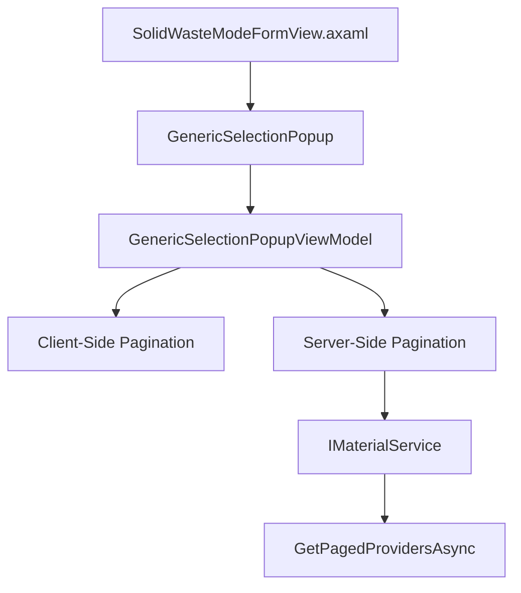

# SolidWaste Dropdown Search & Pagination Implementation

## Overview

Replace basic ComboBox controls in SolidWasteModeFormView with a generic popup component that supports search and pagination, similar to the existing MaterialsSelectionPopup.

## Architecture



## Implementation Steps

### 1. Backend Service Enhancement

**File:** [`MaterialClient.Common/Services/MaterialService.cs`](MaterialClient.Common/Services/MaterialService.cs)

Add new interface method in `IMaterialService`:

```csharp
Task<PagedResultDto<Provider>> GetPagedProvidersAsync(
    string? searchText = null,
    int pageIndex = 1,
    int pageSize = 10);
```

Implement the method in `MaterialService` class following the same pattern as `GetPagedMaterialsAsync()`:

- Use `IRepository<Provider, int>`
- Filter by `searchText` (search in `ProviderName`)
- Apply `!IsDeleted` filter
- Return `PagedResultDto<Provider>` with items ordered by `ProviderName`

### 2. Generic Selection Popup Component

**Create new files:**

- `MaterialClient/Views/GenericSelectionPopup.axaml`
- `MaterialClient/Views/GenericSelectionPopup.axaml.cs`
- `MaterialClient/ViewModels/GenericSelectionPopupViewModel.cs`

**Design approach:**

- Generic type support: `GenericSelectionPopupViewModel<T>` where T is the item type (string, Material, Provider, etc.)
- Configuration-based: Accept delegates for display text, search, and data loading
- Support both client-side and server-side pagination modes
- Reuse UI structure from [`MaterialsSelectionPopup.axaml`](MaterialClient/Views/MaterialsSelectionPopup.axaml):
  - Search TextBox at top
  - DataGrid in middle (single column for simple display)
  - Ursa Pagination control at bottom

**Key features:**

- `PaginationMode` enum: `ClientSide` or `ServerSide`
- `DisplayTextSelector`: Func<T, string> to get display text
- `SearchPredicate`: Func<T, string, bool> for client-side search
- `LoadDataFunc`: Func<string?, int, int, Task<PagedResultDto<T>>> for server-side loading
- `InitialDataFunc`: Func<Task<List<T>>> for client-side loading

### 3. XAML Integration

**File:** [`MaterialClient/Views/AttendedWeighing/SolidWasteModeFormView.axaml`](MaterialClient/Views/AttendedWeighing/SolidWasteModeFormView.axaml)

Replace three ComboBox controls with Button + Popup combinations, following the pattern from [`StandardModeFormView.axaml`](MaterialClient/Views/AttendedWeighing/StandardModeFormView.axaml) (Lines 311-319):

**所属镇街 (Lines 86-93)** - Client-side pagination:

```xml
<Button Grid.Column="1" Height="20" FontSize="12"
        Content="{Binding SelectedStreet, TargetNullValue='--请选择--'}"
        Click="StreetsSelectionButton_Click" />
```

**材料名称 (Lines 122-135)** - Client-side pagination, display Name only:

```xml
<Button Grid.Column="1" Height="20" FontSize="12"
        Content="{Binding SelectedSolidWasteMaterial.Name, TargetNullValue='--请选择--'}"
        Click="MaterialsSelectionButton_Click" />
```

**供应商 (Lines 46-59)** - Server-side pagination:

```xml
<Button Grid.Column="1" Height="20" FontSize="12"
        Content="{Binding SelectedProvider.ProviderName, TargetNullValue='--请选择--'}"
        Click="ProvidersSelectionButton_Click" />
```

Keep "类型选择" ComboBox unchanged (Lines 104-111).

**Add three Popup controls** at the end of the Grid (similar to StandardModeFormView.axaml Line 311):

```xml
<!-- 所属镇街选择弹窗 -->
<Popup Name="StreetsSelectionPopup"
       Placement="Bottom"
       IsLightDismissEnabled="True"
       HorizontalOffset="0"
       VerticalOffset="0"
       IsOpen="{Binding IsStreetsPopupOpen, Mode=TwoWay}">
    <views:GenericSelectionPopup x:Name="StreetsSelectionPopupControl"
                                 DataContext="{Binding StreetsPopupViewModel}" />
</Popup>

<!-- 材料名称选择弹窗 -->
<Popup Name="MaterialsSelectionPopup"
       Placement="Bottom"
       IsLightDismissEnabled="True"
       HorizontalOffset="0"
       VerticalOffset="0"
       IsOpen="{Binding IsMaterialsPopupOpen, Mode=TwoWay}">
    <views:GenericSelectionPopup x:Name="MaterialsSelectionPopupControl"
                                 DataContext="{Binding MaterialsPopupViewModel}" />
</Popup>

<!-- 供应商选择弹窗 -->
<Popup Name="ProvidersSelectionPopup"
       Placement="Bottom"
       IsLightDismissEnabled="True"
       HorizontalOffset="0"
       VerticalOffset="0"
       IsOpen="{Binding IsProvidersPopupOpen, Mode=TwoWay}">
    <views:GenericSelectionPopup x:Name="ProvidersSelectionPopupControl"
                                 DataContext="{Binding ProvidersPopupViewModel}" />
</Popup>
```

### 4. Code-Behind for Popup Positioning

**File:** [`MaterialClient/Views/AttendedWeighing/SolidWasteModeFormView.axaml.cs`](MaterialClient/Views/AttendedWeighing/SolidWasteModeFormView.axaml.cs)

Add three Click event handlers following the pattern from [`StandardModeFormView.axaml.cs`](MaterialClient/Views/AttendedWeighing/StandardModeFormView.axaml.cs) (Lines 13-37):

```csharp
private void StreetsSelectionButton_Click(object? sender, RoutedEventArgs e)
{
    if (sender is Button button && StreetsSelectionPopup != null && StreetsSelectionPopupControl != null)
    {
        StreetsSelectionPopup.PlacementTarget = button;
        
        var popupWidth = StreetsSelectionPopupControl.Width > 0
            ? StreetsSelectionPopupControl.Width
            : 400;
        
        var buttonWidth = button.Bounds.Width > 0
            ? button.Bounds.Width
            : button.DesiredSize.Width;
        
        if (buttonWidth <= 0)
        {
            buttonWidth = 80;
        }
        
        StreetsSelectionPopup.HorizontalOffset = (popupWidth / 2) - (buttonWidth / 2);
    }
}

private void MaterialsSelectionButton_Click(object? sender, RoutedEventArgs e)
{
    // Similar implementation for Materials popup
}

private void ProvidersSelectionButton_Click(object? sender, RoutedEventArgs e)
{
    // Similar implementation for Providers popup
}
```

This ensures the popup appears below the button with proper horizontal alignment.

### 5. ViewModel Enhancement

**File:** [`MaterialClient/ViewModels/AttendedWeighingDetailViewModel.cs`](MaterialClient/ViewModels/AttendedWeighingDetailViewModel.cs)

Add new properties:

```csharp
// Popup ViewModels
[Reactive] private GenericSelectionPopupViewModel<string>? _streetsPopupViewModel;
[Reactive] private GenericSelectionPopupViewModel<Material>? _materialsPopupViewModel;
[Reactive] private GenericSelectionPopupViewModel<Provider>? _providersPopupViewModel;

// Popup visibility flags
[Reactive] private bool _isStreetsPopupOpen;
[Reactive] private bool _isMaterialsPopupOpen;
[Reactive] private bool _isProvidersPopupOpen;
```

Initialize popups in constructor or initialization method:

**Streets (Client-side):**

- Load all streets from `_streetsConfig`
- Configure `GenericSelectionPopupViewModel<string>` with `PaginationMode.ClientSide`
- PageSize: 10
- DisplayTextSelector: `s => s`

**Materials (Client-side):**

- Load all materials using `_materialRepository`
- Configure `GenericSelectionPopupViewModel<Material>` with `PaginationMode.ClientSide`
- PageSize: 10
- DisplayTextSelector: `m => m.Name` (Name only, no other columns)

**Providers (Server-side):**

- Inject `IMaterialService`
- Configure `GenericSelectionPopupViewModel<Provider>` with `PaginationMode.ServerSide`
- PageSize: 10
- DisplayTextSelector: `p => p.ProviderName`
- LoadDataFunc: Call `_materialService.GetPagedProvidersAsync()`

Subscribe to `SelectedItem` changes in each popup to update the corresponding SelectedXXX property.

### 6. Popup Interaction

In `GenericSelectionPopup.axaml.cs`:

- Handle `DoubleTapped` event on DataGrid for item selection
- Close popup by setting `IsOpen = false` in the ViewModel
- Follow the pattern from [`MaterialsSelectionPopup.axaml.cs`](MaterialClient/Views/MaterialsSelectionPopup.axaml.cs)

## Key Implementation Details

### Popup Positioning

Following the pattern from [`StandardModeFormView.axaml.cs`](MaterialClient/Views/AttendedWeighing/StandardModeFormView.axaml.cs):

1. **Popup XAML Setup:**

   - `Placement="Bottom"` - Places popup below the button
   - `IsLightDismissEnabled="True"` - Closes on click outside
   - `PlacementTarget` - Set in code-behind to the clicked button

2. **Horizontal Offset Calculation:**

   - Center alignment formula: `HorizontalOffset = (PopupWidth / 2) - (ButtonWidth / 2)`
   - Default popup width: 400px (from GenericSelectionPopup)
   - Ensures left edge of popup aligns with left edge of button

3. **Event Flow:**

   - User clicks Button → Click event handler fired
   - Set `PlacementTarget` to the button
   - Calculate and set `HorizontalOffset`
   - ViewModel property `IsXXXPopupOpen` set to `true` (bound to Popup.IsOpen)
   - Popup appears below button

### GenericSelectionPopup DataGrid Configuration

Single column template for simple display:

```xml
<DataGrid.Columns>
    <DataGridTemplateColumn Width="*">
        <DataGridTemplateColumn.Header>
            <TextBlock FontSize="10" Text="名称" />
        </DataGridTemplateColumn.Header>
        <DataGridTemplateColumn.CellTemplate>
            <DataTemplate>
                <TextBlock Text="{Binding DisplayText}" />
            </DataTemplate>
        </DataGridTemplateColumn.CellTemplate>
    </DataGridTemplateColumn>
</DataGrid.Columns>
```

### Client-Side Pagination Logic

- Load all data once during initialization
- Filter in-memory based on search text
- Slice data for current page
- Update TotalCount and PagedItems

### Server-Side Pagination Logic

- Call service method with search text, pageIndex, pageSize
- Update TotalCount from response
- Update PagedItems from response.Items

## Files to Modify/Create

**New Files:**

1. `MaterialClient/Views/GenericSelectionPopup.axaml`
2. `MaterialClient/Views/GenericSelectionPopup.axaml.cs`
3. `MaterialClient/ViewModels/GenericSelectionPopupViewModel.cs`

**Modified Files:**

1. [`MaterialClient.Common/Services/MaterialService.cs`](MaterialClient.Common/Services/MaterialService.cs) - Add GetPagedProvidersAsync
2. [`MaterialClient/Views/AttendedWeighing/SolidWasteModeFormView.axaml`](MaterialClient/Views/AttendedWeighing/SolidWasteModeFormView.axaml) - Replace ComboBoxes with Buttons and add Popup controls
3. [`MaterialClient/Views/AttendedWeighing/SolidWasteModeFormView.axaml.cs`](MaterialClient/Views/AttendedWeighing/SolidWasteModeFormView.axaml.cs) - Add Click event handlers for popup positioning
4. [`MaterialClient/ViewModels/AttendedWeighingDetailViewModel.cs`](MaterialClient/ViewModels/AttendedWeighingDetailViewModel.cs) - Add popup ViewModels and initialization logic

## Testing Considerations

- Verify client-side search and pagination for Streets
- Verify client-side search and pagination for Materials (Name only display)
- Verify server-side search and pagination for Providers
- Test search text throttling (300ms debounce)
- Test double-click selection behavior
- Test popup open/close behavior
- Ensure "类型选择" remains unchanged with native ComboBox