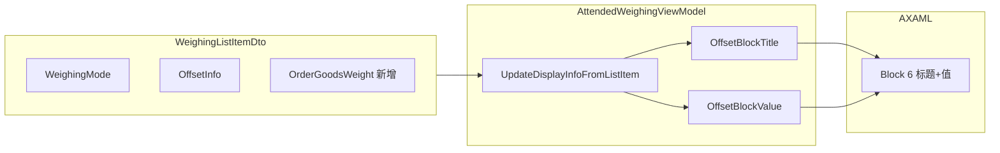

# SolidWaste 模式下「偏差」块改为「净重」显示

## 现状

- [AttendedWeighingMainView.axaml](D:\CodeUp\MaterialClient\MaterialClient\Views\AttendedWeighing\AttendedWeighingMainView.axaml) 第 204–233 行：Block 6 固定显示标题「偏差」、值 `OffsetInfo`。
- 数据来源：`AttendedWeighingViewModel` 的 `OffsetInfo` 等，由 `UpdateDisplayInfoFromListItem(WeighingListItemDto item)` 从 `SelectedListItem` 同步。
- [WeighingListItemDto](D:\CodeUp\MaterialClient\MaterialClient.Common\Models\WeighingListItemDto.cs) 已有 `WeighingMode`、`OffsetInfo`；FromWaybill 中 `Weight = OrderTotalWeight`，**没有** 顶层 `OrderGoodsWeight`（仅 Materials[0].Weight 来自 waybill.OrderGoodsWeight）。

## 实现思路

按「waybill 是否为 SolidWaste」在 ViewModel 中算出 Block 6 的**标题**和**值**，XAML 只绑定这两个属性，无需转换器或条件可见性。

## 修改项

### 1. DTO 增加 OrderGoodsWeight

**文件**: [MaterialClient.Common/Models/WeighingListItemDto.cs](D:\CodeUp\MaterialClient\MaterialClient.Common\Models\WeighingListItemDto.cs)

- 在现有属性（如 `OffsetInfo` 附近）增加：`public decimal? OrderGoodsWeight { get; set; }`
- 在 `FromWaybill` 方法中为 DTO 赋值：`OrderGoodsWeight = waybill.OrderGoodsWeight`（与 WeighingMode、OffsetInfo 同处一段即可）。

### 2. ViewModel 增加 Block 6 的标题与值

**文件**: [MaterialClient/ViewModels/AttendedWeighingViewModel.cs](D:\CodeUp\MaterialClient\MaterialClient\ViewModels\AttendedWeighingViewModel.cs)

- **新增两个 [Reactive] 属性**（与 `_offsetInfo` 等放在一起）：
  - `_offsetBlockTitle` → 生成 `OffsetBlockTitle`
  - `_offsetBlockValue` → 生成 `OffsetBlockValue`
- **在 `UpdateDisplayInfoFromListItem` 中**：
  - 若 `item.WeighingMode == WeighingMode.SolidWaste`：
    - `OffsetBlockTitle = "净重"`
    - `OffsetBlockValue = item.OrderGoodsWeight.HasValue ? $"{item.OrderGoodsWeight.Value} 吨" : "--"`  
    （若需与其它重量格式一致可用 `F2`，例如 `$"{item.OrderGoodsWeight.Value:F2} 吨"`）
  - 否则：
    - `OffsetBlockTitle = "偏差"`
    - `OffsetBlockValue = item.OffsetInfo`
- **在 `ClearDisplayInfo` 中**：`OffsetBlockTitle = null`；`OffsetBlockValue = null`。

### 3. XAML 绑定到新属性

**文件**: [MaterialClient/Views/AttendedWeighing/AttendedWeighingMainView.axaml](D:\CodeUp\MaterialClient\MaterialClient\Views\AttendedWeighing\AttendedWeighingMainView.axaml)

- Block 6 标题（约 216 行）：`Text="偏差"` 改为  
`Text="{Binding OffsetBlockTitle, TargetNullValue='偏差'}"`
- Block 6 值（约 224 行）：`Text="{Binding OffsetInfo, TargetNullValue='--'}"` 改为  
`Text="{Binding OffsetBlockValue, TargetNullValue='--'}"`

## 小结

- **DTO**：新增 `OrderGoodsWeight`，FromWaybill 赋值。
- **ViewModel**：新增 `OffsetBlockTitle`、`OffsetBlockValue`，在 `UpdateDisplayInfoFromListItem` / `ClearDisplayInfo` 中按 `WeighingMode.SolidWaste` 分支赋值/清空。
- **XAML**：Block 6 标题与值改为绑定 `OffsetBlockTitle`、`OffsetBlockValue`。

无需新增转换器或多套 IsVisible 的 UI，逻辑集中在 ViewModel，便于测试与维护。