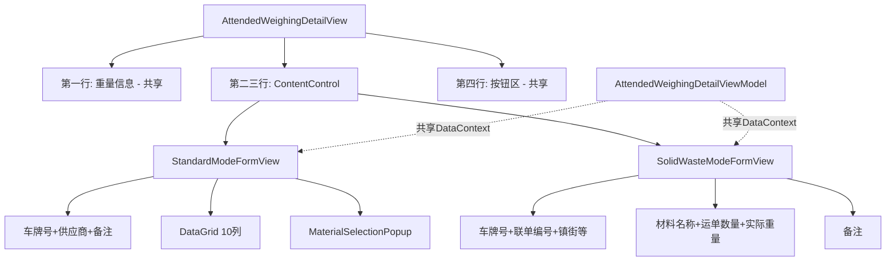

# SubView封装重构计划

## 架构设计

将会创建以下结构：



## 实施步骤

### 1. 创建标准模式SubView

创建 [`MaterialClient/Views/AttendedWeighing/StandardModeFormView.axaml`](D:\CodeUp\MaterialClient\MaterialClient\Views\AttendedWeighing\StandardModeFormView.axaml)

**内容包括：**

- 第二行Border：车牌号 + 供应商 + 备注
- 第三行Border：DataGrid（10列完整定义）
- MaterialSelectionPopup（从主View移动过来）

**关键点：**

- DataContext继承父级（AttendedWeighingDetailViewModel）
- 保留DataGrid的所有列定义和模板
- 保留MaterialSelectionButton_Click事件处理

### 2. 创建废料模式SubView

创建 [`MaterialClient/Views/AttendedWeighing/SolidWasteModeFormView.axaml`](D:\CodeUp\MaterialClient\MaterialClient\Views\AttendedWeighing\SolidWasteModeFormView.axaml)

**内容包括：**

- 第二行Border：车牌号 + 联单编号 + 所属镇街 + 类型选择 + 材料名称 + 运单数量 + 实际重量 + 备注
- 第三行可以省略或保留空Border（保持布局一致性）

**关键点：**

- 所有字段移除 `IsVisible="{Binding IsSolidWasteMode}"` 绑定
- 字段顺序与当前保持一致

### 3. 修改主View使用ContentControl

修改 [`MaterialClient/Views/AttendedWeighing/AttendedWeighingDetailView.axaml`](D:\CodeUp\MaterialClient\MaterialClient\Views\AttendedWeighing\AttendedWeighingDetailView.axaml)

**变更内容：**

删除现有的Grid.Row="1"和Grid.Row="2"的完整内容，替换为：

```xml
<!-- 第二三行：模式切换区域 -->
<ContentControl Grid.Row="1" Grid.RowSpan="2">
    <ContentControl.Content>
        <MultiBinding Converter="{StaticResource BooleanToModeViewConverter}">
            <Binding Path="IsSolidWasteMode" />
        </MultiBinding>
    </ContentControl.Content>
    <ContentControl.DataTemplates>
        <DataTemplate DataType="{x:Type x:Boolean}">
            <!-- 使用触发器根据IsSolidWasteMode切换 -->
            <Panel>
                <views:StandardModeFormView IsVisible="{Binding !IsSolidWasteMode}" />
                <views:SolidWasteModeFormView IsVisible="{Binding IsSolidWasteMode}" />
            </Panel>
        </DataTemplate>
    </ContentControl.DataTemplates>
</ContentControl>
```

**简化方案（推荐）：**

```xml
<!-- 第二三行：模式切换区域 -->
<Panel Grid.Row="1" Grid.RowSpan="2">
    <views:StandardModeFormView IsVisible="{Binding !IsSolidWasteMode}" />
    <views:SolidWasteModeFormView IsVisible="{Binding IsSolidWasteMode}" />
</Panel>
```

保留第一行（重量信息）和第四行（按钮区）不变。

### 4. 创建CodeBehind文件

**StandardModeFormView.axaml.cs:**

- 移动 `MaterialSelectionButton_Click` 事件处理
- 保持对DataGrid的引用（如果需要）

**SolidWasteModeFormView.axaml.cs:**

- 基本的UserControl初始化
- 无特殊逻辑

### 5. 更新主View的CodeBehind

修改 [`MaterialClient/Views/AttendedWeighing/AttendedWeighingDetailView.axaml.cs`](D:\CodeUp\MaterialClient\MaterialClient\Views\AttendedWeighing\AttendedWeighingDetailView.axaml.cs)

- 移除或保留 `MaterialSelectionButton_Click` 事件（取决于是否需要在父级处理）
- 如果移动到SubView，确保事件可以正确触发ViewModel命令

## 关键技术点

### DataContext继承

SubView不设置独立DataContext，自动继承父级的`AttendedWeighingDetailViewModel`，所有绑定路径保持不变。

### 事件处理

`MaterialSelectionButton_Click` 需要访问Popup控件，有两种方案：

1. **方案A（推荐）**：将Popup移到StandardModeFormView中，事件也在该View的CodeBehind处理
2. **方案B**：保持纯MVVM，移除Click事件，完全使用Command绑定

### 样式继承

两个SubView会自动继承App.axaml中定义的全局样式（DataGridColumnHeader等）。

### 布局一致性

- StandardModeFormView：Border(第二行) + Border(第三行DataGrid)
- SolidWasteModeFormView：Border(第二行，包含所有字段) + 可选的空Border或去掉第三行

## 测试验证

重构完成后需要验证：

1. 标准模式下DataGrid正常显示和编辑
2. 废料模式下所有字段正常显示
3. 模式切换时UI正确刷新
4. MaterialSelectionPopup在标准模式下正常工作
5. 所有绑定和命令正常工作

## 优势

- 清晰的关注点分离，每个SubView专注于一种模式
- 消除9个IsVisible绑定
- 主View代码量减少约70%
- 未来扩展更容易（如添加新模式）
- 便于独立测试和维护