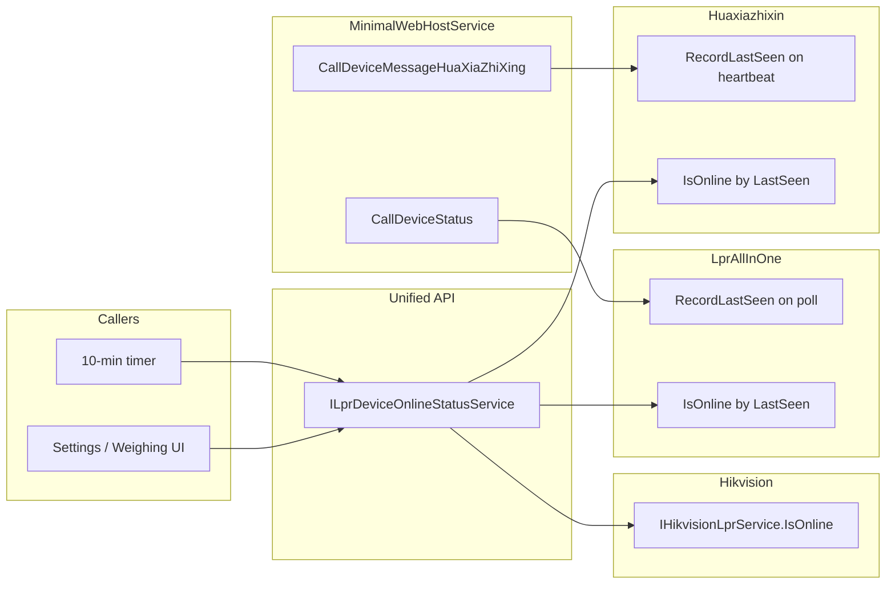

# Unified LPR device online status management

## Goal

Provide one place to query "is this LPR device online?" for **Hikvision**, **LprAllInOne**, and **Huaxiazhixin**, so callers (e.g. a 10-minute timer or Settings UI) can use a single API regardless of `LprDeviceType`. Hikvision already supports this via active probe; LprAllInOne and Huaxiazhixin need last-seen recording and an IsOnline API.

## Architecture

- **Unified service**: one interface that takes `(LprDeviceType, LicensePlateRecognitionConfig)` and returns `bool` (or a small DTO with device key + online). Implementation delegates by type.
- **Hikvision**: keep using existing [IHikvisionLprService.IsOnline(LicensePlateRecognitionConfig)](MaterialClient.Common/Services/Hikvision/HikvisionLprService.cs) (no change).
- **LprAllInOne**: record last-seen when device hits `LprAllInOneCallDeviceStatusPath`; add `IsOnline(deviceIp, timeout?)` (and optionally `RecordLastSeen`) to [ILprAllInOneService](MaterialClient.Common/Services/LprAllInOne/LprAllInOneService.cs).
- **Huaxiazhixin**: record last-seen when device sends heartbeat to `CallDeviceMessageHuaXiaZhiXingApiPath` (`type=heartbeat`, `cam_ip`); add an interface (or extend [HuaxiazhixinLprService](MaterialClient.Common/Services/Huaxiazhixin/HuaxiazhixinLprService.cs)) with `RecordLastSeen(deviceIp)` and `IsOnline(deviceIp, timeout?)`.

## Implementation plan

### 1. LprAllInOne: last-seen storage and IsOnline

- **File**: [MaterialClient.Common/Services/LprAllInOne/LprAllInOneService.cs](MaterialClient.Common/Services/LprAllInOne/LprAllInOneService.cs)
  - Add a `ConcurrentDictionary<string, DateTime>` (or `DateTimeOffset`) for last-seen per device IP (key = device IP, value = last request time in UTC).
  - Extend **ILprAllInOneService** with:
    - `void RecordLastSeen(string deviceIp)` — set last-seen to `DateTime.UtcNow` for `deviceIp`.
    - `bool IsOnline(string deviceIp, TimeSpan? timeout = null)` — default timeout e.g. 2–3 minutes; online if `UtcNow - LastSeen <= timeout`.
  - Implement both in `LprAllInOneService`.
- **File**: [MaterialClient/Services/MinimalWebHostService.cs](MaterialClient/Services/MinimalWebHostService.cs) — in the **LprAllInOneCallDeviceStatusPath** handler, after resolving `deviceIp` (and before or after `CheckAndClearTriggerFlag`), resolve `ILprAllInOneService` and call `RecordLastSeen(deviceIp)`.

### 2. Huaxiazhixin: last-seen storage and IsOnline

- **New or existing interface**: Prefer adding an explicit interface (e.g. `IHuaxiazhixinLprOnlineState`) or extending the existing service so the web host does not depend on the concrete type. Options:
  - **Option A**: Add `RecordLastSeen(string deviceIp)` and `bool IsOnline(string deviceIp, TimeSpan? timeout = null)` to a new interface in the Huaxiazhixin folder, implemented by [HuaxiazhixinLprService](MaterialClient.Common/Services/Huaxiazhixin/HuaxiazhixinLprService.cs) (same process as LprAllInOne: internal dictionary keyed by device IP, default timeout e.g. 30 seconds for 10s heartbeat).
  - **Option B**: Single shared “LPR last-seen store” service keyed by `(LprDeviceType, deviceIp)` used by both LprAllInOne and Huaxiazhixin; then each only needs to call “record” from the web host and the unified service reads from the store. This avoids two separate dictionaries but introduces a new shared service.
  Recommendation: **Option A** (each service owns its last-seen) to keep changes local and avoid a new cross-cutting store.
- **File**: [MaterialClient.Common/Services/Huaxiazhixin/HuaxiazhixinLprService.cs](MaterialClient.Common/Services/Huaxiazhixin/HuaxiazhixinLprService.cs)
  - Add internal `ConcurrentDictionary<string, DateTime>` for last-seen by `cam_ip`.
  - Add `RecordLastSeen(string deviceIp)` and `bool IsOnline(string deviceIp, TimeSpan? timeout = null)` (default e.g. 30 seconds).
- **File**: [MaterialClient/Services/MinimalWebHostService.cs](MaterialClient/Services/MinimalWebHostService.cs) — in the **华夏智信** handler, inside the `type.Equals("heartbeat", ...)` branch after reading `cam_ip`, resolve the Huaxiazhixin service (by the new interface or `HuaxiazhixinLprService`) and call `RecordLastSeen(camIp)`.

### 3. Unified LPR online status service

- **New file**: e.g. `MaterialClient.Common/Services/LprDeviceOnlineStatusService.cs` (interface + implementation).
  - **Interface** `ILprDeviceOnlineStatusService`:
    - `bool IsOnline(LprDeviceType deviceType, LicensePlateRecognitionConfig config);`
    - Optionally: `IReadOnlyList<(LicensePlateRecognitionConfig Config, bool IsOnline)> GetOnlineStatuses(LprDeviceType deviceType, IReadOnlyList<LicensePlateRecognitionConfig> configs);` for batch (e.g. for UI list).
  - **Implementation**:
    - Inject `IHikvisionLprService`, `ILprAllInOneService`, and the Huaxiazhixin service (interface that exposes `IsOnline(deviceIp, timeout)`).
    - `IsOnline(deviceType, config)`:
      - **Hikvision**: call `_hikvisionLprService.IsOnline(config)` (existing).
      - **LprAllInOne**: call `_lprAllInOneService.IsOnline(config.Ip, defaultTimeoutLprAllInOne)`.
      - **Huaxiazhixin**: call `_huaxiazhixinService.IsOnline(config.Ip, defaultTimeoutHuaxiazhixin)`.
    - Handle invalid/empty config (e.g. empty Ip) by returning false. Use sensible defaults for timeouts (e.g. 2 min LprAllInOne, 30 s Huaxiazhixin) or make them configurable later.
  - Register the new service in DI (ABP convention or explicit registration in [MaterialClientCommonModule](MaterialClient.Common/MaterialClientCommonModule.cs) if needed).

### 4. Optional: periodic check and UI binding

- **Periodic check**: Any caller that needs “every 10 minutes” can use a `Timer` or existing pattern (e.g. similar to [AttendedWeighingViewModel](MaterialClient/ViewModels/AttendedWeighingViewModel.cs) `StartScaleStatusCheckTimer` / `StartCameraStatusCheckTimer`). The timer callback would:
  - Read current `LprDeviceType` and `LicensePlateRecognitionConfigs` from settings.
  - Call `ILprDeviceOnlineStatusService.GetOnlineStatuses(type, configs)` or loop `IsOnline(type, config)`.
  - Update UI state (e.g. `LicensePlateRecognitionConfigViewModel.IsOnline` or a separate list of statuses).
- **Settings UI**: To show “在线” in the LPR list in [SettingsWindow](MaterialClient/Views/SettingsWindow.axaml), add an `IsOnline` (or `OnlineStatus`) property to [LicensePlateRecognitionConfigViewModel](MaterialClient/ViewModels/SettingsWindowViewModel.cs) and optionally a column in the LPR DataGrid; start a 10-minute timer (or on-demand when the settings LPR tab is visible) that uses `ILprDeviceOnlineStatusService` and updates those properties. This can be a follow-up step if the current scope is “unified management” only (service layer).

## Files to add or change (summary)

| Action                            | File                                                                                                                                                                                                                                                                           |
| --------------------------------- | ------------------------------------------------------------------------------------------------------------------------------------------------------------------------------------------------------------------------------------------------------------------------------ |
| Extend interface + implementation | [MaterialClient.Common/Services/LprAllInOne/LprAllInOneService.cs](MaterialClient.Common/Services/LprAllInOne/LprAllInOneService.cs) — RecordLastSeen, IsOnline, internal last-seen dictionary                                                                                 |
| Call RecordLastSeen on poll       | [MaterialClient/Services/MinimalWebHostService.cs](MaterialClient/Services/MinimalWebHostService.cs) — LprAllInOneCallDeviceStatusPath handler                                                                                                                                 |
| Add interface + implementation    | [MaterialClient.Common/Services/Huaxiazhixin/HuaxiazhixinLprService.cs](MaterialClient.Common/Services/Huaxiazhixin/HuaxiazhixinLprService.cs) — RecordLastSeen, IsOnline, internal last-seen dictionary (and optional `IHuaxiazhixinLprOnlineState` interface in same folder) |
| Call RecordLastSeen on heartbeat  | [MaterialClient/Services/MinimalWebHostService.cs](MaterialClient/Services/MinimalWebHostService.cs) — 华夏智信 heartbeat branch                                                                                                                                                   |
| Add unified service               | New: `MaterialClient.Common/Services/LprDeviceOnlineStatusService.cs` (ILprDeviceOnlineStatusService + impl), register in DI                                                                                                                                                   |
| Optional (UI/timer)               | [MaterialClient/ViewModels/SettingsWindowViewModel.cs](MaterialClient/ViewModels/SettingsWindowViewModel.cs), [MaterialClient/Views/SettingsWindow.axaml](MaterialClient/Views/SettingsWindow.axaml) — IsOnline property, column, 10-min timer                                 |

## Testing notes

- **Hikvision**: Existing [HikvisionLprServiceTests](MaterialClient.Common.Tests/Tests/HikvisionLprServiceTests.cs) already cover `IsOnline`; unified service can be tested by mocking `IHikvisionLprService` and asserting delegation.
- **LprAllInOne**: Unit test: after `RecordLastSeen(ip)`, `IsOnline(ip, timeout)` is true within timeout and false after; no record => false.
- **Huaxiazhixin**: Same pattern for `RecordLastSeen` + `IsOnline`.
- **Unified**: Test that for each `LprDeviceType` the correct underlying service is called (and return value propagated).

## Dependency and threading

- `MinimalWebHostService` already has access to `_sharedServiceProvider`; resolve `ILprAllInOneService` and the Huaxiazhixin service from it when handling the respective endpoints. No new dependency from MaterialClient.Common to MaterialClient: the web host (MaterialClient) calls into services defined in Common.
- Last-seen writes happen on the request path (LprAllInOne poll, Huaxiazhixin heartbeat); reads happen on the timer or UI thread. Use thread-safe structures (`ConcurrentDictionary`) and `DateTime.UtcNow` so timeouts are consistent.

