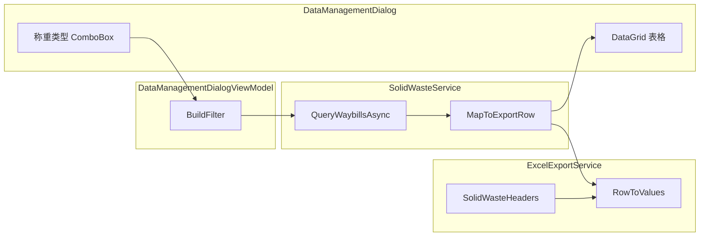

# 称重类型字段与过滤条件实施计划

## 背景

- **称重类型** 对应业务中的 `DeliveryType` 枚举（`Receiving`=收料、`Sending`=发料）
- `Waybill` 实体已有 `DeliveryType?` 属性
- 需在 DataManagementDialog 表格、Excel 导出及过滤条件中统一支持该字段

## 数据流概览

## 变更清单

### 1. 模型层

**[MaterialClient.Common/Models/SolidWasteExportRow.cs](MaterialClient.Common/Models/SolidWasteExportRow.cs)**

- 在 `VehicleNumber` 之后新增属性：`public string WeighingType { get; set; } = string.Empty;`
- 用于展示「收料」或「发料」

**[MaterialClient.Common/Models/SolidWasteExportFilter.cs](MaterialClient.Common/Models/SolidWasteExportFilter.cs)**

- 新增：`public DeliveryType? WeighingType { get; set; }`
- `null` 表示不过滤（全部）

### 2. 服务层

**[MaterialClient.Common/Services/SolidWasteService.cs](MaterialClient.Common/Services/SolidWasteService.cs)**

- **QueryWaybillsAsync**：当 `filter.WeighingType.HasValue` 时，增加 `w.DeliveryType == filter.WeighingType` 条件
- **MapToExportRow**：根据 `waybill.DeliveryType` 映射为 `"收料"` 或 `"发料"`，空值映射为 `""`

### 3. 台账管理对话框 UI

**[MaterialClient/Views/AttendedWeighing/DataManagementDialogWindow.axaml](MaterialClient/Views/AttendedWeighing/DataManagementDialogWindow.axaml)**

- **查询区**：在车牌号与发货单位之间增加称重类型 ComboBox
  - 选项：全部、收料、发料
  - 绑定到 ViewModel 的 `SelectedWeighingType`
- **DataGrid**：在「车号」列后新增列：`<DataGridTextColumn Binding="{Binding WeighingType}" Header="称重类型" MinWidth="80" />`

**[MaterialClient/ViewModels/DataManagementDialogViewModel.cs](MaterialClient/ViewModels/DataManagementDialogViewModel.cs)**

- 新增 `WeighingTypeFilterOption` 记录类型（DisplayName + DeliveryType?）
- 新增 `WeighingTypeOptions` 静态列表：`[("全部", null), ("收料", Receiving), ("发料", Sending)]`
- 新增 `[Reactive] public WeighingTypeFilterOption? SelectedWeighingType { get; set; }`，构造函数中默认 `SelectedWeighingType = WeighingTypeOptions[0]`
- **BuildFilter**：增加 `WeighingType = SelectedWeighingType?.Value`
- **CreateTestRow**：为测试行设置 `WeighingType = "收料"`

### 4. Excel 导出服务

**[MaterialClient.Common/Services/ExcelExportService.cs](MaterialClient.Common/Services/ExcelExportService.cs)**

- **SolidWasteHeaders**：在「车号」后插入 `"称重类型"`，列数由 17 增至 18
- **RowToValues**：在 `VehicleNumber` 后插入 `row.WeighingType`
- **GetSummaryRow**：将 `arr` 长度由 17 改为 18，汇总列索引不变（第 0、5、6、7 列）

## 列顺序（18 列）

| 序号  | 列名       | 序号  | 列名   |
| --- | -------- | --- | ---- |
| 1   | 流水号      | 10  | 皮重时间 |
| 2   | 车号       | 11  | 所属街道 |
| 3   | **称重类型** | 12  | 类型   |
| 4   | 发货单位     | 13  | 联单编号 |
| 5   | 收货单位     | 14  | 上传结果 |
| 6   | 货名       | 15  | 上传状态 |
| 7   | 毛重       | 16  | 上传时间 |
| 8   | 皮重       |     |      |
| 9   | 净重       |     |      |

## 注意事项

- 称重类型 ComboBox 需引用 `MaterialClient.Common.Entities.Enums` 的 `DeliveryType`
- ViewModel 中 `WeighingTypeFilterOption` 可放在 `DataManagementDialogViewModel.cs` 文件内或单独文件
- 汇总行中称重类型列为空，与备注、车号等非数值列一致

