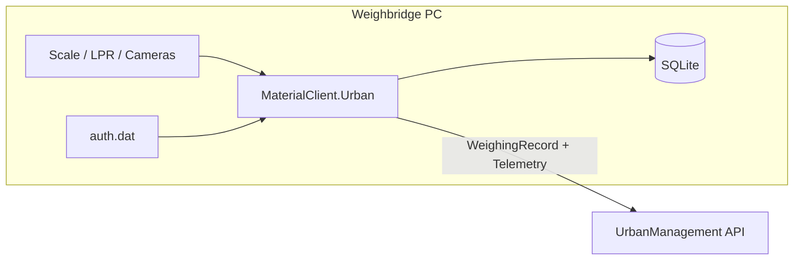

# Architecture Decision Document: MaterialClient.Urban

## 1. Context

MaterialClient is a .NET 10 / Avalonia / ABP / SQLite desktop system with hardware integration and periodic sync to a material platform. Urban variant narrows scope: **WeighingRecord upload + telemetry** to **UrbanManagement**, static file auth, no UI, no waybills.

## 2. Goals & Constraints

| Goal | Constraint |
|------|------------|
| Fast delivery of Urban host | Reuse `MaterialClient.Common` |
| Data isolation | `WeighingMode.UrbanManagement = 201`, `ProductCode = 5030` |
| Operational visibility | Device + app + error telemetry |
| Safe shutdown | Existing exit order: WebHost → hardware → ABP |
| No login v1 | No session/token pipeline |

## 3. Decision Summary

| ID | Decision | Status |
|----|----------|--------|
| AD-1 | New `MaterialClient.Urban` WinExe project | Accepted |
| AD-2 | Share `MaterialClient.Common` for domain/EF | Accepted |
| AD-3 | Headless host (no Avalonia window v1) | Accepted |
| AD-4 | Urban-specific ABP module, not fork Common | Accepted |
| AD-5 | Refit client `IUrbanManagementApi` behind interface | Accepted (stub until OQ-1) |
| AD-6 | Separate background worker, not extend `PollingBackgroundService` | Accepted |
| AD-7 | Static auth via `IUrbanAuthorizationFileService` | Accepted |
| AD-8 | Sync state on `WeighingRecord.ExtraProperties` initially | Proposed |

## 4. System Context



## 5. Module Structure

```
MaterialClient.Urban/
├── Program.cs                    # Generic host or minimal Avalonia-free entry
├── MaterialClientUrbanModule.cs  # ABP module
├── Backgrounds/
│   └── UrbanOperationsBackgroundService.cs
├── Services/
│   ├── UrbanAuthorizationFileService.cs
│   ├── UrbanWeighingUploadService.cs
│   └── UrbanTelemetryService.cs
├── Api/
│   └── IUrbanManagementApi.cs    # Refit
└── appsettings.json
```

**Does not include:** Views, ViewModels, `StartupService` login flow, waybill UI.

## 6. Startup Sequence

1. Build ABP application with `MaterialClientUrbanModule`.
2. `IUrbanAuthorizationFileService.ValidateAtStartup()` → log only (v1).
3. Apply EF migrations / DB init (shared `MaterialClientDbContext`).
4. Start `MinimalWebHostService` if LPR device requires HTTP callbacks (config-gated, same as main app).
5. Initialize hardware services (scale, LPR) — reuse registrations from Common where possible.
6. Start `UrbanOperationsBackgroundService`.
7. Block until shutdown signal (Windows Service future; v1 console or hidden host).

## 7. Data Model

- **No new entity** for weighing events; use `WeighingRecord`.
- All Urban records: `WeighingMode = UrbanManagement (201)`.
- Optional ExtraProperties keys:
  - `Urban.UploadStatus`: Pending | Uploaded | Failed
  - `Urban.UploadedAt`: ISO timestamp
  - `Urban.LastError`: string

## 8. Integration Boundaries

| Boundary | Direction | Notes |
|----------|-----------|-------|
| UrbanManagement REST | Outbound | Refit + Polly; stub in dev |
| Static auth file | Local read | No network |
| Hardware SDKs | In-process | Same cautions as AGENTS.md (no UI thread in SDK callbacks) |
| Material platform API | **None** v1 | No login, no IMaterialPlatformApi for sync |

## 9. Background Worker Responsibilities

`UrbanOperationsBackgroundService` (single worker, configurable period):

| Step | Action |
|------|--------|
| 1 | Upload pending `WeighingRecord` (Urban mode) |
| 2 | Push telemetry (devices + app + errors) |

**Excluded:** `VerifyAuthAsync`, material sync, waybill push, OSS upload.

## 10. Observability

- Serilog: file + optional telemetry sink.
- Structured logs: `UrbanUpload`, `UrbanTelemetry`, `UrbanAuth`, `DeviceStatus`.
- Error batching: ring buffer last N errors for telemetry payload.

## 11. Security

- Auth file path outside repo; not committed.
- No credentials in logs.
- HTTPS for UrbanManagement when API known.
- v1: no real-time license — document risk in deployment guide.

## 12. Risks

| Risk | Mitigation |
|------|------------|
| API unknown | Stub + contract tests when OpenAPI arrives |
| Enum value 201 vs sequential | Document in migration/filter queries |
| Shared DB with Standard records | Always filter by `WeighingMode` |
| Hardware code assumes UI | Use headless service entry points only |

## 13. Implementation Phases

1. **Foundation:** enums, Urban project, module, config, auth file log.
2. **Capture:** wire weighing pipeline with Urban mode default.
3. **Upload:** DTO + stub API + sync flags.
4. **Telemetry:** device probe + error sink + stub API.
5. **Hardening:** shutdown, retries, integration tests.

## 14. Open Items

See PRD §8 (OQ-1 through OQ-5).
