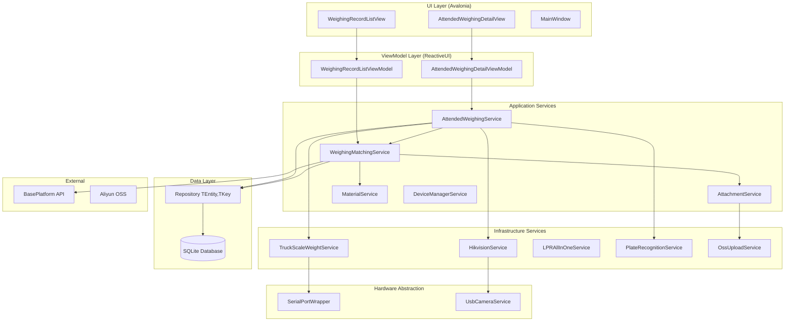
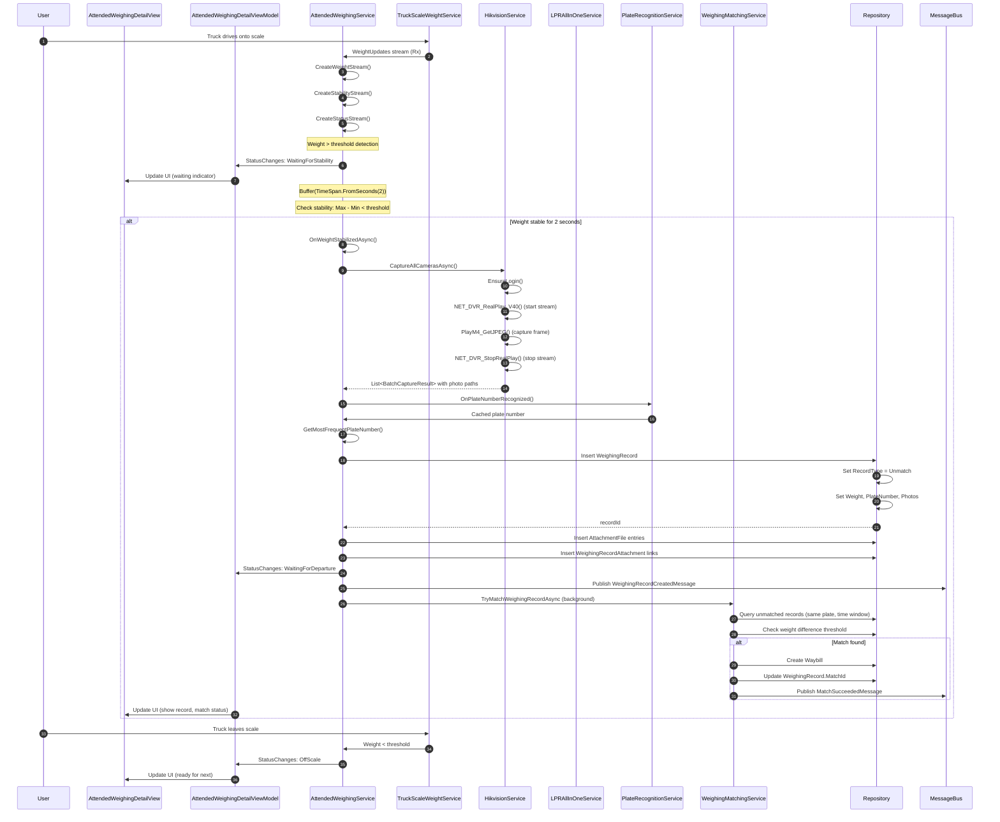
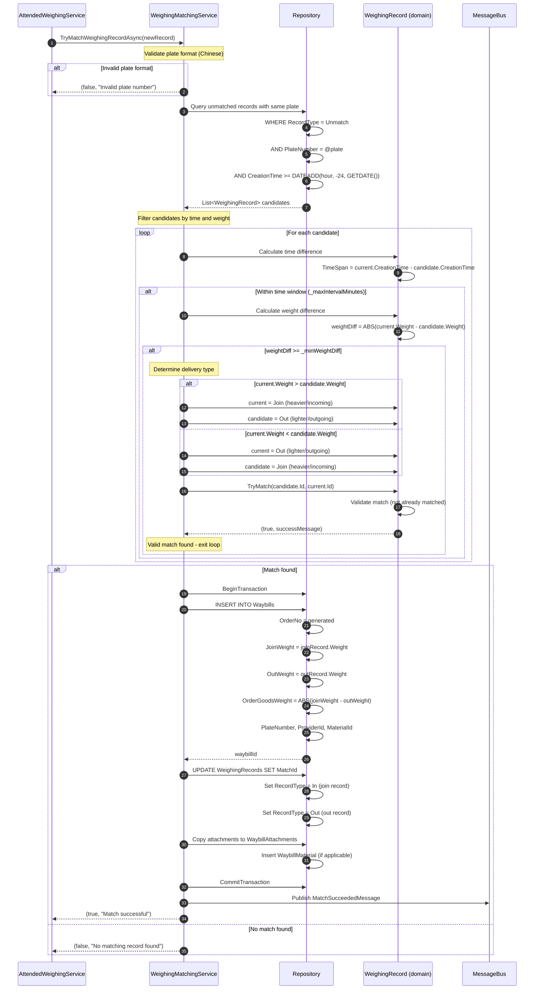
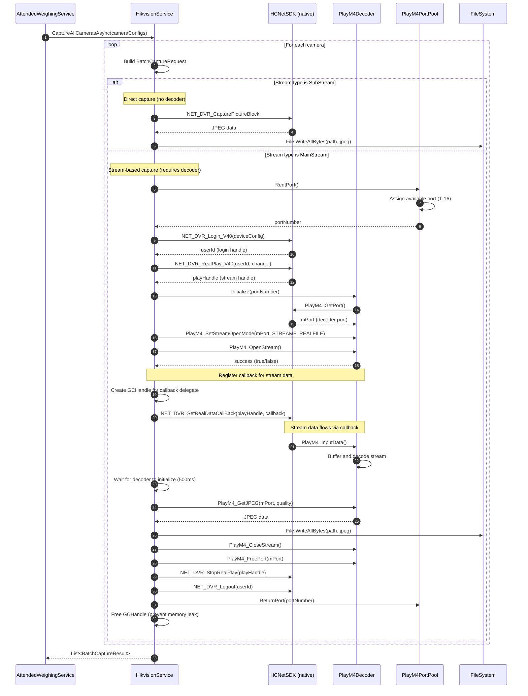
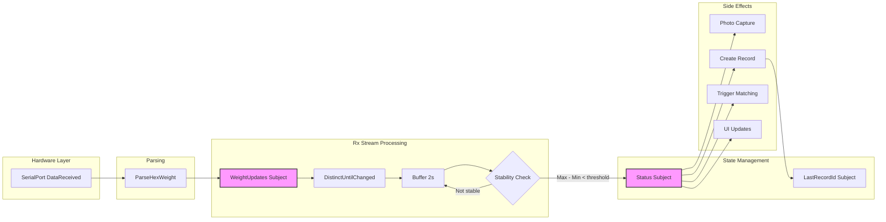
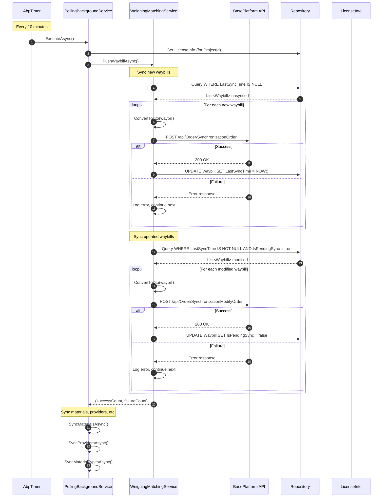
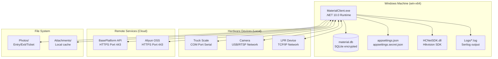

# Software Design Document

**Project**: MaterialClient
**Version**: 1.0
**Last Updated**: 2026-01-15
**Status**: DRAFT

---

## Table of Contents

1. [Architecture Overview](#1-architecture-overview)
2. [Module Design](#2-module-design)
3. [State Management Architecture](#3-state-management-architecture)
4. [Data Model](#4-data-model)
5. [Architecture Diagrams](#5-architecture-diagrams)
6. [Technical Decisions](#6-technical-decisions)
7. [Constraints & Risks](#7-constraints--risks)
8. [Development Guidelines](#8-development-guidelines)

---

## 1. Architecture Overview

### 1.1 System Positioning

**MaterialClient** is a Windows desktop application for truck weighing management and material flow tracking. The system integrates with hardware devices (truck scales, surveillance cameras, license plate recognition) to automate weighing operations, capture evidence photos, and synchronize data with a remote platform.

**Key Characteristics**:
- Single-user desktop application
- Hardware-dependent (serial ports, USB cameras, proprietary SDKs)
- 24/7 operation capable
- Remote platform synchronization (optional)
- Windows-only platform

**Primary Use Cases**:
- Attended weighing: Operator monitors weighing process, system captures photos and records
- Unattended weighing: Automated weighing with license plate recognition
- Material matching: Match incoming/outgoing weighing records to create waybills
- Data synchronization: Push waybills and attachments to remote platform

---

### 1.2 Technology Stack

| Layer | Technology | Version | Purpose |
|-------|------------|---------|---------|
| **Language** | C# | 13 (.NET 10.0) | Primary language |
| **Platform** | .NET | 10.0 | Runtime framework |
| **Target** | Windows | x64 only | Deployment target |
| **UI Framework** | Avalonia UI | 11.3.9 | Cross-platform UI |
| **UI Components** | Irihi.Ursa | 1.14.0 | Component library |
| **State Management** | ReactiveUI + Rx.NET | 20.1.1 + 7.0.0-preview.1 | MVVM + Reactive streams |
| **DI Container** | Volo.Abp + Autofac | 10.0.1 | Dependency injection |
| **ORM** | Entity Framework Core | 10.0.1 | Data access |
| **Database** | SQLite | (via EF Core) | Local storage |
| **HTTP Client** | Refit | 9.0.2 | Type-safe HTTP |
| **Resilience** | Polly | (via MS Extensions) | HTTP retry policies |
| **Logging** | Serilog | 4.3.0 | Structured logging |
| **ID Generation** | Yitter.IdGenerator | 1.0.14 | Distributed IDs |
| **Camera Capture** | FlashCap | 1.11.0 | USB camera access |
| **Cloud Storage** | Aliyun.OSS | 2.14.1 | File storage |
| **Serial I/O** | System.IO.Ports | 10.0.1 | Serial communication |

**Third-Party Dependencies**:
- **HCNetSDK**: Hikvision camera SDK (unmanaged DLLs)

---

### 1.3 Architecture Patterns

The system follows a layered architecture with DDD principles:

```
┌─────────────────────────────────────────────────────────────┐
│                    Presentation Layer                       │
│  ┌──────────────┐  ┌──────────────┐  ┌──────────────┐      │
│  │   Avalonia   │  │  ReactiveUI  │  │    ViewModels│      │
│  │      Views   │  │   Bindings   │  │   (Rx State) │      │
│  └──────────────┘  └──────────────┘  └──────────────┘      │
└─────────────────────────────────────────────────────────────┘
                              ↓
┌─────────────────────────────────────────────────────────────┐
│                     Application Layer                       │
│  ┌──────────────┐  ┌──────────────┐  ┌──────────────┐      │
│  │   Services   │  │   Domain     │  │   DTOs       │      │
│  │  (Business   │  │   Logic      │  │  (Contracts) │      │
│  │   Logic)     │  │              │  │              │      │
│  └──────────────┘  └──────────────┘  └──────────────┘      │
└─────────────────────────────────────────────────────────────┘
                              ↓
┌─────────────────────────────────────────────────────────────┐
│                     Infrastructure Layer                     │
│  ┌──────────────┐  ┌──────────────┐  ┌──────────────┐      │
│  │  Hardware    │  │  Data Access │  │  External    │      │
│  │  Abstraction │  │  (EF Core)   │  │  APIs        │      │
│  └──────────────┘  └──────────────┘  └──────────────┘      │
└─────────────────────────────────────────────────────────────┘
                              ↓
┌─────────────────────────────────────────────────────────────┐
│                      Hardware Layer                         │
│  ┌──────────────┐  ┌──────────────┐  ┌──────────────┐      │
│  │Truck Scale   │  │  Cameras     │  │  LPR Device  │      │
│  │(Serial Port) │  │  (USB/RTSP)  │  │  (Network)   │      │
│  └──────────────┘  └──────────────┘  └──────────────┘      │
└─────────────────────────────────────────────────────────────┘
```

**Pattern Descriptions**:

| Pattern | Usage | Rationale |
|---------|-------|-----------|
| **MVVM** | UI layer | Separation of concerns, testable ViewModels |
| **RxState** | State management | Reactive streams for real-time updates |
| **Repository** | Data access | Abstraction over EF Core, testability |
| **Dependency Injection** | All layers | Loose coupling, testability |
| **Observer** | Cross-component communication | MessageBus.Current for decoupled messaging |
| **Factory** | Hardware creation | ISerialPortFactory for device abstraction |
| **Unit of Work** | Database operations | Transactional consistency via ABP |

---

### 1.4 System Boundaries

**In Scope**:
- Single-user Windows desktop application
- Local SQLite database storage
- Hardware device integration (truck scales, cameras, LPR)
- Local business logic execution
- Optional remote platform synchronization
- Manual data entry and correction

**Out of Scope**:
- Multi-user concurrent operations
- Web/mobile interfaces
- Real-time multi-site synchronization
- Complex reporting/analytics (delegated to remote platform)

**Integration Points**:
- **BasePlatform API**: Remote material management platform (HTTP/REST)
- **Aliyun OSS**: Cloud storage for attachment files
- **Hardware Devices**: Local serial/USB/network devices

---

## 2. Module Design

### 2.1 Service Catalog

| Service | Responsibility | Layer | Thread-Safe |
|---------|----------------|-------|-------------|
| `AttendedWeighingService` | Attended weighing workflow, state machine, photo coordination | Application | Yes |
| `WeighingMatchingService` | Record matching, waybill creation, sync orchestration | Application | Yes |
| `TruckScaleWeightService` | Serial port communication, weight parsing, reactive updates | Infrastructure | Yes |
| `HikvisionService` | Hikvision SDK integration, photo capture, device management | Infrastructure | Yes |
| `LPRAllInOneService` | License plate recognition device integration | Infrastructure | Yes |
| `PlateRecognitionService` | Plate recognition orchestration, caching | Application | Yes |
| `AttachmentService` | Attachment CRUD, OSS sync, file management | Application | Yes |
| `MaterialService` | Material/supplier/unit CRUD and queries | Application | Yes |
| `SyncMaterialService` | Material sync from remote platform | Application | Yes |
| `OssUploadService` | Aliyun OSS upload, retry logic | Infrastructure | Yes |
| `DeviceManagerService` | Device lifecycle, health monitoring | Application | Yes |
| `SettingsService` | Application settings persistence | Infrastructure | Yes |
| `SoundDeviceService` | Audio playback for notifications | Infrastructure | Yes |

---

### 2.2 AttendedWeighingService

**Purpose**: Manages the attended weighing workflow including weight stability detection, automatic photo capture, weighing record creation, and automatic matching with outgoing records.

**File**: `MaterialClient.Common/Services/AttendedWeighingService.cs`

**Interface**:
```csharp
public interface IAttendedWeighingService : ITransientDependency
{
    // Lifecycle
    Task StartAsync();
    Task StopAsync();

    // State Access
    AttendedWeighingStatus GetCurrentStatus();
    DeliveryType CurrentDeliveryType { get; }

    // Commands
    void SetDeliveryType(DeliveryType deliveryType);
    void OnPlateNumberRecognized(string plateNumber);
    string? GetMostFrequentPlateNumber();

    // Observables
    IObservable<AttendedWeighingStatus> StatusChanges { get; }
    IObservable<decimal> WeightChanges { get; }
    IObservable<long?> LastCreatedWeighingRecordIdChanges { get; }
}
```

**Dependencies**:
- `ITruckScaleWeightService` - Weight stream
- `IHikvisionCameraService` - Photo capture
- `ILPRAllInOneService` - LPR device trigger
- `IWeighingMatchingService` - Automatic matching
- `IRepository<WeighingRecord>` - Data persistence
- `ISettingsService`, `ISoundDeviceService`

**State Machine**:
```
                    ┌─────────────────┐
                    │   OffScale      │
                    └────────┬────────┘
                             │ weight > threshold
                             ↓
                    ┌─────────────────┐
                    │WaitingForStability│
                    └────────┬────────┘
                             │ weight stable 2s
                             ↓
                    ┌─────────────────┐
                    │WeightStabilized │
                    └────────┬────────┘
                             │ record created
                             ↓
                    ┌─────────────────┐
                    │WaitingForDeparture│
                    └────────┬────────┘
                             │ weight < threshold
                             ↓
                    ┌─────────────────┐
                    │   OffScale      │
                    └─────────────────┘

Abnormal: weight < threshold at any time before departure
```

**State Management**:
- Multiple `BehaviorSubject<T>` for reactive state:
  - `_statusSubject: BehaviorSubject<AttendedWeighingStatus>`
  - `_deliveryTypeSubject: BehaviorSubject<DeliveryType>`
  - `_lastCreatedWeighingRecordIdSubject: BehaviorSubject<long?>`
- `ConcurrentDictionary<string, int>` for plate number caching
- Rx pipeline for weight stability detection:
  ```csharp
  _truckScaleWeightService.WeightUpdates
      .DistinctUntilChanged()
      .Buffer(TimeSpan.FromSeconds(2))
      .Where(buffer => buffer.Count > 0 && buffer.Max() - buffer.Min() < _stabilityThreshold)
      .Subscribe(...)
  ```

**Key Business Logic**:
1. **Stability Detection**: Weight must be stable (variance < threshold) for 2 seconds
2. **Auto Capture**: On stability, trigger photo capture (entry/exit photos)
3. **Record Creation**: Create `WeighingRecord` with weight, plate, photos
4. **Auto Matching**: Trigger `WeighingMatchingService` for automatic match
5. **Plate Caching**: Cache recognized plates, use most frequent if multiple

---

### 2.3 WeighingMatchingService

**Purpose**: Matches weighing records (incoming/outgoing pairs) to create waybills, manages material flow tracking, and synchronizes completed waybills to remote platform.

**File**: `MaterialClient.Common/Services/WeighingMatchingService.cs`

**Interface**:
```csharp
public interface IWeighingMatchingService : ITransientDependency
{
    // Matching Operations
    Task<(bool success, string message)> TryMatchWeighingRecordAsync(WeighingRecord record);
    Task<(bool success, string message)> AutoMatchAsync(long weighingRecordId);
    Task<(bool success, string message)> ManualMatchAsync(
        WeighingRecord current,
        WeighingRecord matched,
        DeliveryType type);

    // Waybill Operations
    Task CompleteOrderAsync(long waybillId);
    Task PushWaybillAsync();

    // Queries
    Task<PagedResultDto<WeighingListItemDto>> GetListItemsAsync(GetWeighingListItemsInput input);
    Task<List<RecommendPlateNumberDto>> GetRecommendationByPlateNumberAsync(string plateNumber);

    // Updates
    Task UpdateListItemAsync(UpdateListItemInput input);
}
```

**Dependencies**:
- `IRepository<WeighingRecord>`, `IRepository<Waybill>`, etc.
- `IMaterialPlatformApi` - Remote sync
- `ISettingsService` - Configuration

**Matching Algorithm**:

**Automatic Match Criteria**:
1. **Time Window**: Records within configured interval (default: 24 hours)
2. **Weight Difference**: |currentWeight - matchedWeight| < threshold
3. **Plate Number**: Optional, improves match confidence
4. **Record Type**: Incoming → Outgoing pair matching
5. **One-to-One**: Each record can only be matched once

**Match Confidence Levels**:
- **High**: Plate number matches + weight within threshold
- **Medium**: Weight within threshold, no plate conflict
- **Low**: Weight difference acceptable, no other data

**Data Flow**:
```
WeighingRecord created
         ↓
TryMatchWeighingRecordAsync (background)
         ↓
Query candidates (time window, opposite type)
         ↓
Filter by weight difference
         ↓
Select best match (plate number if available)
         ↓
Create Waybill with matched records
         ↓
Notify UI via MessageBus.Current
```

---

### 2.4 TruckScaleWeightService

**Purpose**: Handles serial communication with truck scale hardware, parses weight data from different scale manufacturers, and provides real-time weight updates via reactive streams.

**File**: `MaterialClient.Common/Services/Hardware/TruckScaleWeightService.cs`

**Interface**:
```csharp
public interface ITruckScaleWeightService : ITransientDependency
{
    // Lifecycle
    Task InitializeAsync(ScaleSettings settings);
    Task RestartAsync();
    Task StopAsync();

    // Data Access
    IObservable<decimal> WeightUpdates { get; }
    Task<decimal> GetCurrentWeightAsync();
    bool IsOnline { get; }

    // Testing
    void SetWeight(decimal weight); // For UI testing
}
```

**Dependencies**:
- `ISerialPortFactory` - Serial port abstraction
- `ISettingsService` - Configuration

**Supported Protocols**:
- **HEX Format**: Binary protocol (common in Chinese scales)
- **String Format**: ASCII protocol
- **Scale Types**: Multiple manufacturer-specific formats

**Thread Safety**:
- `ReaderWriterLockSlim` for weight access
- **Issue**: Write lock held during serial I/O (blocks reads, documented in performance report)

**Rx Stream**:
```csharp
_weightSubject
    .Publish()
    .RefCount(); // Shared stream for multiple subscribers
```

---

### 2.5 HikvisionService

**Purpose**: Integrates with Hikvision surveillance cameras for photo capture during weighing operations, supports both direct capture and stream-based capture methods.

**File**: `MaterialClient.Common/Services/Hikvision/HikvisionService.cs`

**Interface**:
```csharp
public interface IHikvisionCameraService : ITransientDependency
{
    // Capture Operations
    Task<string> CaptureJpegAsync(HikvisionDeviceConfig config, int channel, string saveFullPath);
    Task<List<BatchCaptureResult>> CaptureJpegFromStreamBatchAsync(List<BatchCaptureRequest> requests);

    // Device Management
    Task<bool> IsOnlineAsync(HikvisionDeviceConfig config);
    void AddOrUpdateDevice(HikvisionDeviceConfig config);
    Task<List<CaptureResult>> TestCaptureAsync();
}
```

**Dependencies**:
- **HCNetSDK** - Unmanaged Hikvision SDK (P/Invoke)
- `ISettingsService` - Camera configuration

**Resource Management**:
- **Port Pooling**: `PlayM4PortPool` manages decoder ports (max 16 simultaneous)
- **Session Management**: `ConcurrentDictionary<string, int>` for device login IDs
- **Cleanup**: Proper disposal of GCHandle and decoder resources

**Capture Methods**:
1. **Direct Capture**: `NET_DVR_CapturePictureBlock` (SDK API)
2. **Stream Capture**: Open stream → Decode → Capture frame

---

### 2.6 AttachmentService

**Purpose**: Manages file attachments for weighing records and waybills, handles local to OSS synchronization, and provides unified attachment query interfaces.

**File**: `MaterialClient.Common/Services/AttachmentService.cs`

**Interface**:
```csharp
public interface IAttachmentService : ITransientDependency
{
    // Queries
    Task<List<AttachmentDto>> GetAttachmentsByWeighingRecordIdsAsync(IEnumerable<long> ids);
    Task<List<AttachmentDto>> GetAttachmentsByWaybillIdsAsync(IEnumerable<long> ids);
    Task<AttachmentDto> GetAttachmentsByListItemAsync(WeighingListItemDto item);

    // Operations
    Task CreateOrReplaceBillPhotoAsync(WeighingListItemDto item, string photoPath);

    // Synchronization
    Task SyncWaybillAttachmentsToOssAsync(long waybillId);
    Task SyncPendingAttachmentsToOssAsync();
}
```

**Dependencies**:
- `IRepository<AttachmentFile>`, `IRepository<WeighingRecordAttachment>`, `IRepository<WaybillAttachment>`
- `IOssUploadService` - OSS uploads
- `IMaterialPlatformApi` - Server sync

**Sync Flow**:
```
Query pending attachments (OssFullPath is null)
         ↓
Upload to Aliyun OSS via IOssUploadService
         ↓
Update AttachmentFile.OssFullPath
         ↓
Push attachment metadata to remote platform
         ↓
Commit transaction
```

---

## 3. State Management Architecture

### 3.1 Reactive Extensions (Rx.NET) Usage

The system uses **Rx.NET** (`System.Reactive`) for reactive state management across UI and service layers.

**Key Concepts**:
- **Observable Streams**: Represent asynchronous event sequences
- **Subjects**: Both observable and observer (event stream + ability to push events)
- **Operators**: Transform, filter, compose streams
- **Schedulers**: Control threading

---

### 3.2 State Management Patterns

#### Pattern 1: BehaviorSubject for Current State

**Used in**: `AttendedWeighingService`, `TruckScaleWeightService`

```csharp
// BehaviorSubject always has a current value
private readonly BehaviorSubject<AttendedWeighingStatus> _statusSubject =
    new(AttendedWeighingStatus.OffScale);

// Expose as read-only observable
public IObservable<AttendedWeighingStatus> StatusChanges =>
    _statusSubject.AsObservable();

// Update state
_statusSubject.OnNext(AttendedWeighingStatus.WaitingForStability);

// Get current value synchronously
public AttendedWeighingStatus GetCurrentStatus() => _statusSubject.Value;
```

**Pros**:
- New subscribers get current value immediately
- Simple state access pattern

**Cons** (documented in optimization report):
- Multiple BehaviorSubjects → state synchronization issues
- Complex `CombineLatest` logic when combining multiple states

---

#### Pattern 2: Shared Stream with Publish().RefCount()

**Used in**: `TruckScaleWeightService`

```csharp
// Single shared stream, multiple subscribers
public IObservable<decimal> WeightUpdates =>
    _weightSubject
        .Publish()
        .RefCount();

// Multiple subscribers share the same stream
WeightUpdates.Subscribe(subscriber1); // Triggers source
WeightUpdates.Subscribe(subscriber2); // Shares source
```

**Purpose**: Avoid duplicate subscriptions to hot sources (e.g., serial port events)

---

#### Pattern 3: Rx Pipeline for Data Processing

**Used in**: `AttendedWeighingService` for stability detection

```csharp
_truckScaleWeightService.WeightUpdates
    .DistinctUntilChanged()              // Suppress duplicates
    .Buffer(TimeSpan.FromSeconds(2))    // Collect 2s window
    .Where(buffer =>
        buffer.Count > 0 &&
        buffer.Max() - buffer.Min() < _stabilityThreshold) // Stability check
    .Subscribe(async buffer =>
    {
        // Handle stable weight
        var weight = buffer.Last();
        await OnWeightStabilizedAsync(weight);
    })
    .DisposeWith(_disposables);
```

**Operations**:
1. `DistinctUntilChanged()` - Only notify when weight actually changes
2. `Buffer()` - Collect samples for stability detection
3. `Where()` - Filter for stable periods
4. `Subscribe()` - Handle result

---

### 3.3 Subscription Lifecycle Management

**Critical Requirement**: All subscriptions MUST be disposed to prevent memory leaks in 24/7 operation.

**Pattern**:
```csharp
private readonly CompositeDisposable _disposables = new();

public void Initialize()
{
    _service.StateChanges
        .Subscribe(UpdateUI)
        .DisposeWith(_disposables); // Extension method

    // Or manually:
    _disposables.Add(_service.StateChanges.Subscribe(UpdateUI));
}

public void Dispose()
{
    _disposables.Dispose(); // Disposes all subscriptions
}
```

**Disposal in ViewModels** (ReactiveUI):
```csharp
public class MyViewModel : ReactiveObject, IDisposable
{
    private readonly CompositeDisposable _disposables = new();

    public MyViewModel()
    {
        _service.StateChanges
            .Subscribe(state => Status = state)
            .DisposeWith(_disposables);
    }

    public void Dispose() => _disposables.Dispose();
}
```

---

### 3.4 Threading Model

**UI Updates**:
```csharp
_heavyComputation
    .ObserveOn(RxApp.MainThreadScheduler) // Switch to UI thread
    .Subscribe(result => ui.Text = result);
```

**Background Work**:
```csharp
observable
    .SubscribeOn(TaskPoolScheduler) // Run on thread pool
    .Subscribe(...);
```

---

### 3.5 Known Issues (from Performance Reports)

**Issue**: Multiple BehaviorSubjects causing state synchronization complexity
**Status**: Proposed unified state pattern (not implemented)
**Reference**: `AttendedWeighingService-RxState-Optimization-Report.md`

**Issue**: Subscription disposal not consistently implemented
**Risk**: Memory leaks in long-running application
**Mitigation**: Pending Rx programming guidelines (Section 8.2)

---

## 4. Data Model

### 4.1 Core Entities

**Location**: `MaterialClient.Common/Entities/`

| Entity | Primary Key | Base Class | Audited | Purpose |
|--------|-------------|------------|---------|---------|
| `MaterialDefinition` | `int` | `Entity<int>` | No | Material definitions |
| `MaterialUnit` | `int` | `Entity<int>` | No | Material units (conversion rates) |
| `Provider` | `int` | `Entity<int>` | No | Suppliers |
| `Waybill` | `long` | `FullAuditedEntity<long>` | Yes | Shipping orders |
| `WeighingRecord` | `long` | `FullAuditedEntity<long>` | Yes | Weighing records |
| `AttachmentFile` | `int` | `FullAuditedEntity<int>` | Yes | File attachments |
| `WaybillAttachment` | `int` | `Entity<int>` | No | Waybill-attachment junction |
| `WeighingRecordAttachment` | `int` | `Entity<int>` | No | Record-attachment junction |
| `LicenseInfo` | `Guid` | `Entity<Guid>` | No | Software license (archived) |
| `UserCredential` | `int` | `Entity<int>` | Yes | Saved credentials (archived) |
| `UserSession` | `int` | `Entity<int>` | Yes | Login sessions (archived) |

---

### 4.2 Entity Relationships

```
MaterialDefinition (1) ──┬────> (N) MaterialUnit
                         └────> (N) WeighingRecord

Provider (1) ──┬─────────> (N) Waybill
               ├─────────> (N) WeighingRecord
               └─────────> (N) MaterialUnit

Waybill (N) ─────────────<──> (M) AttachmentFile
              [via WaybillAttachment]

WeighingRecord (N) ──────<──> (M) AttachmentFile
                      [via WeighingRecordAttachment]
```

---

### 4.3 Key Enumerations

**Location**: `MaterialClient.Common/Entities/Enums/`

```csharp
public enum OffsetResultType : short
{
    Default = 0,
    OverPositiveDeviation = 1,
    Normal = 2,
    OverNegativeDeviation = 3
}

public enum OrderSource : short
{
    MannedStation = 1,
    ManualEntry = 2,
    MobileAcceptance = 3,
    UnmannedStation = 4
}

public enum AttachType : short
{
    EntryPhoto = 0,
    ExitPhoto = 1,
    TicketPhoto = 2
}

public enum WeighingRecordType : short
{
    Unmatch = 0,
    In = 1,
    Out = 2
}

public enum DeliveryType
{
    Receiving = 1,
    Sending = 2
}

public enum AttendedWeighingStatus
{
    OffScale = 0,
    WaitingForStability = 1,
    WeightStabilized = 2,
    WaitingForDeparture = 3
}
```

---

### 4.4 DbContext Configuration

**File**: `MaterialClient.Common/EntityFrameworkCore/MaterialClientDbContext.cs`

```csharp
public class MaterialClientDbContext : AbpDbContext<MaterialClientDbContext>
{
    // DbSets for all entities
    public DbSet<WeighingRecord> WeighingRecords { get; set; }
    public DbSet<Waybill> Waybills { get; set; }
    public DbSet<MaterialDefinition> MaterialDefinitions { get; set; }
    public DbSet<MaterialUnit> MaterialUnits { get; set; }
    public DbSet<Provider> Providers { get; set; }
    public DbSet<AttachmentFile> AttachmentFiles { get; set; }
    // ... other DbSets

    protected override void OnModelCreating(ModelBuilder modelBuilder)
    {
        base.OnModelCreating(modelBuilder);

        // Configure entity relationships and indexes
        ConfigureWeighingRecord(modelBuilder);
        ConfigureWaybill(modelBuilder);
        // ... other configurations
    }
}
```

**Database Provider**: SQLite (EF Core 10.0.1)
**Migration Strategy**: Automatic migration on application startup

---

### 4.5 Repository Pattern

All entities use ABP framework's `IRepository<TEntity, TKey>`:

```csharp
// Example usage
public class MyService
{
    private readonly IRepository<WeighingRecord, long> _weighingRecordRepository;

    public async Task<WeighingRecord> GetAsync(long id)
    {
        return await _weighingRecordRepository.GetAsync(id);
    }

    public async Task<List<WeighingRecord>> GetUnmatchedRecordsAsync()
    {
        return await _weighingRecordRepository
            .Where(r => r.RecordType == WeighingRecordType.Unmatch)
            .ToListAsync();
    }
}
```

**No custom repository classes** - ABP provides implementation automatically.

---

## 5. Architecture Diagrams

### 5.1 Component Diagram



**Component Relationships**:

| Component | Depends On | Provides To |
|-----------|------------|-------------|
| `AttendedWeighingDetailView` | `AttendedWeighingDetailViewModel` | UI for weighing operations |
| `AttendedWeighingDetailViewModel` | `AttendedWeighingService` | State management for UI |
| `AttendedWeighingService` | `TruckScaleWeightService`, `HikvisionService`, `PlateRecognitionService` | Weighing workflow orchestration |
| `WeighingMatchingService` | `AttachmentService`, `MaterialService` | Record matching and waybill creation |
| `TruckScaleWeightService` | `SerialPortWrapper` | Real-time weight data |
| `HikvisionService` | Native SDK | Photo capture functionality |

---

### 5.2 Sequence Diagram - Attended Weighing Flow



**State Transitions**:

| Current State | Condition | Next State | Action |
|---------------|-----------|------------|--------|
| `OffScale` | weight > threshold | `WaitingForStability` | Start stability monitoring |
| `WaitingForStability` | stable for 2s AND no record exists | `WeightStabilized` | Trigger capture and record creation |
| `WaitingForStability` | weight < threshold | `OffScale` | Abnormal exit, no record |
| `WeightStabilized` | Record created | `WaitingForDeparture` | Wait for truck to leave |
| `WaitingForDeparture` | weight < threshold | `OffScale` | Ready for next cycle |

---

### 5.3 Sequence Diagram - Automatic Matching Flow



**Matching Algorithm**:

| Step | Check | Condition | Result |
|------|-------|-----------|--------|
| 1 | Plate number | Same as new record | Candidate pool |
| 2 | Time window | `|now - then| <= _maxIntervalMinutes` | Time-qualified |
| 3 | Weight difference | `|w1 - w2| >= _minWeightDiff` | Weight-qualified |
| 4 | Delivery type | Compare weights | Join (heavier) / Out (lighter) |
| 5 | Match validation | Not already matched | Valid match |

**Configuration Parameters**:
- `_maxIntervalMinutes`: Default 24 hours (1440 minutes)
- `_minWeightDiff`: Configurable weight threshold

---

### 5.4 Sequence Diagram - Photo Capture Flow



**Resource Management**:

| Resource | Allocation | Deallocation | Max Concurrent |
|----------|------------|--------------|----------------|
| Decoder ports | `PlayM4PortPool.RentPort()` | `PlayM4PortPool.ReturnPort()` | 16 |
| Camera logins | `NET_DVR_Login_V40()` | `NET_DVR_Logout()` | Per device |
| Stream handles | `NET_DVR_RealPlay_V40()` | `NET_DVR_StopRealPlay()` | Per capture |
| GCHandles | `GCHandle.Alloc()` | `GCHandle.Free()` | Per callback |

---

### 5.5 Data Flow Diagram - Rx Pipeline



**Rx Operators Explained**:

| Operator | Purpose | Configuration |
|----------|---------|---------------|
| `DistinctUntilChanged()` | Suppress duplicate weight values | No params |
| `Buffer(TimeSpan)` | Collect samples for stability detection | 2 seconds |
| `Where()` | Filter for stable periods | Max - Min < threshold |
| `Select()` | Transform to status enum | State machine logic |
| `ObserveOn()` | Switch to UI thread | `RxApp.MainThreadScheduler` |
| `Subscribe()` | Handle side effects | Create record, capture photos |

---

### 5.6 Sequence Diagram - Remote Sync Flow



**Sync Strategy**:

| Entity | Endpoint | Condition | Update Logic |
|--------|----------|-----------|--------------|
| New Waybills | `POST /api/Order/SynchronizationOrder` | `LastSyncTime == null` | Set `LastSyncTime` |
| Updated Waybills | `POST /api/Order/SynchronizationModifyOrder` | `IsPendingSync == true` | Reset `IsPendingSync` |
| Materials | `GET /api/Material/MaterialGoodList` | Periodic | Insert/update local |
| Providers | `GET /api/Provider/MaterialProviderList` | Periodic | Insert/update local |
| Attachments | `POST /api/Order/SynchronizationOrder` | Per waybill | Upload to OSS first |

---

### 5.7 Deployment Diagram



**Deployment Components**:

| Component | Location | Purpose | Required |
|-----------|----------|---------|----------|
| `MaterialClient.exe` | Program Files | Main application | Yes |
| `material.db` | AppData | SQLite database | Auto-created |
| `appsettings.json` | App directory | Configuration | Yes |
| `appsettings.secret.json` | App directory | Secrets (encryption keys) | Auto-created |
| `HCNetSDK.dll` | Program Files | Hikvision SDK | Yes |
| `HCNetSDKCom/` | Program Files | SDK components | Yes |
| `Logs/` | AppData | Log files | Auto-created |
| `Photos/` | AppData | Captured photos | Auto-created |

**Runtime Requirements**:
- Windows 10/11 x64
- .NET 10.0 Desktop Runtime (or self-contained)
- Serial port driver (for truck scale)
- Network connectivity (for cameras, LPR, sync)

**Installation**:
1. Copy application files to `C:\Program Files\MaterialClient\`
2. Create desktop shortcut
3. Configure `appsettings.json` (serial port, cameras, API)
4. Run application (auto-creates database and directories)

**Configuration**:
```json
{
  "ScaleSettings": {
    "PortName": "COM1",
    "BaudRate": 9600
  },
  "HikvisionDevices": [
    {
      "IpAddress": "192.168.1.100",
      "Port": 8000,
      "Username": "admin",
      "Password": "password"
    }
  ],
  "BasePlatform": {
    "BaseUrl": "https://api.example.com",
    "ProductCode": "MATERIAL_CLIENT"
  }
}
```

---

## 6. Technical Decisions

### ADR-001: Use Reactive Extensions (Rx.NET) for State Management

**Status**: Accepted
**Date**: 2025 (initial), documented 2026-01-15

**Context**:
- Need to manage complex async state (weight updates, stability detection, UI synchronization)
- Multiple UI components need real-time updates from same data sources
- Hardware events (serial port, cameras) are inherently event-driven
- Need to compose and transform event streams

**Decision**:
Use System.Reactive (Rx.NET) for all reactive state management in services and ViewModels.

**Rationale**:

| Benefits | Description |
|----------|-------------|
| Unified async model | Events, async operations, UI updates all use same paradigm |
| Powerful operators | CombineLatest, Buffer, DistinctUntilChanged simplify complex logic |
| Declarative style | Data flow is explicit and easier to reason about |
| Threading control | ObserveOn/SubscribeOn provide thread switching |
| ReactiveUI integration | Native support for Avalonia UI bindings |

**Trade-offs**:

| Drawbacks | Mitigation |
|-----------|------------|
| Steep learning curve | Rx programming guidelines (Section 8.2) |
| Harder to debug | Unit tests for Rx pipelines |
| Memory leak risk | Mandatory disposal patterns |

**Alternatives Considered**:
1. **C# events/delegates** - Rejected: No composition, hard to coordinate multiple sources
2. **async/await + Task** - Rejected: Pull-based, not suited for push scenarios
3. **Manual INotifyPropertyChanged** - Rejected: Too verbose for complex scenarios

**Consequences**:
- All state changes use Rx subjects/observables
- UI components subscribe to observables via ReactiveUI
- Services use `CompositeDisposable` for cleanup
- Training required for new developers

---

### ADR-002: Use Avalonia UI for Cross-Platform Desktop UI

**Status**: Accepted
**Date**: Initial project choice, documented 2026-01-15

**Context**:
- Need desktop application UI
- Windows deployment requirement, but wanted cross-platform option
- WPF is Windows-only and in maintenance mode
- WinUI 3 is Windows 11+ only

**Decision**:
Use Avalonia UI 11.3.9 as the UI framework.

**Rationale**:
- Cross-platform support (Windows, macOS, Linux) despite current Windows-only deployment
- XAML-based (familiar to WPF developers)
- Active community and development
- Fluent and Semi design themes available
- Good ReactiveUI integration

**Trade-offs**:
- Smaller ecosystem than WPF
- Some WPF features not available
- Third-party control library needed (Irihi.Ursa)

---

### ADR-003: Use SQLite for Local Database

**Status**: Accepted
**Date**: Initial project choice, documented 2026-01-15

**Context**:
- Single-user desktop application
- Need local data storage
- No multi-user concurrency requirements

**Decision**:
Use SQLite via Entity Framework Core 10.0.1.

**Rationale**:
- Zero configuration, no database server installation
- Single file storage (easy backup/restore)
- Full SQL and ORM support via EF Core
- Sufficient performance for single-user workload
- Cross-platform (consistent with Avalonia choice)

**Trade-offs**:
- Limited concurrent write performance (not an issue for single-user app)
- No built-in user management (application handles this)

---

### ADR-004: Use ABP Framework for DDD Infrastructure

**Status**: Accepted
**Date**: Initial project choice, documented 2026-01-15

**Context**:
- Want DDD patterns (Repository, Unit of Work)
- Need dependency injection container
- Want audit trail support (creation/modification time)

**Decision**:
Use Volo.Abp 10.0.1 framework.

**Rationale**:
- Pre-built DDD infrastructure (entities, repositories, UoW)
- Integrated dependency injection with Autofac
- Audit entity base classes (`FullAuditedEntity`)
- Modular architecture support
- Active development and documentation

---

### ADR-005: Hardware Abstraction with Mock Support

**Status**: Accepted
**Date**: Initial project choice, documented 2026-01-15

**Context**:
- Need to integrate with hardware devices (serial ports, cameras, LPR)
- Development machines don't have hardware
- Need to test without physical devices

**Decision**:
Define interfaces for hardware services with mock implementations for testing.

**Rationale**:
- Interface isolation (ISP)
- Mock implementations for development/testing
- Easy to swap implementations
- Supports dependency injection

**Example**:
```csharp
public interface ITruckScaleWeightService
{
    IObservable<decimal> WeightUpdates { get; }
    Task InitializeAsync(ScaleSettings settings);
}

// Production implementation
public class TruckScaleWeightService : ITruckScaleWeightService
{
    // Uses real serial port
}

// Mock implementation for testing
public class MockTruckScaleWeightService : ITruckScaleWeightService
{
    private readonly Subject<decimal> _weightSubject = new();

    public IObservable<decimal> WeightUpdates => _weightSubject;

    public void SetTestWeight(decimal weight) => _weightSubject.OnNext(weight);
}
```

---

### ADR-006: Use Refit for Type-Safe HTTP Client

**Status**: Accepted
**Date**: Initial project choice, documented 2026-01-15

**Context**:
- Need to communicate with BasePlatform API
- Want compile-time type safety for API calls
- Need retry and resilience policies

**Decision**:
Use Refit 9.0.2 for HTTP client generation with Polly for resilience.

**Rationale**:
- Type-safe interface definitions (compile-time checking)
- Automatic serialization/deserialization
- Integrated with HttpClientFactory (proper lifecycle)
- Polly integration for retry policies
- No manual URL construction

**Example**:
```csharp
[Headers("Authorization: Bearer")]
public interface IMaterialPlatformApi
{
    [Post("/api/Order/SynchronizationOrder")]
    Task<ApiResult<bool>> SynchronizationOrderAsync([Body] WaybillDto dto);

    [Get("/api/Material/MaterialGoodList")]
    Task<ApiResult<List<MaterialDto>>> GetMaterialsAsync();
}
```

**Trade-offs**:
- Less flexibility than raw HttpClient
- Requires interface definitions for all endpoints
- Refit attribute syntax can be verbose

---

### ADR-007: Use Serilog for Structured Logging

**Status**: Accepted
**Date**: Initial project choice, documented 2026-01-15

**Context**:
- Need structured logging for 24/7 operation
- Want to log to files for troubleshooting
- Need correlation across async operations

**Decision**:
Use Serilog 4.3.0 with file and console sinks.

**Rationale**:
- Structured logging (log properties, not just strings)
- Multiple sinks (file, console, future: Seq, Elasticsearch)
- Rich output templates
- Excellent integration with .NET
- Log level filtering per sink

**Configuration**:
```json
{
  "Serilog": {
    "MinimumLevel": "Information",
    "WriteTo": [
      {
        "Name": "Console",
        "Args": {
          "outputTemplate": "[{Timestamp:HH:mm:ss} {Level:u3}] {Message:lj}{NewLine}{Exception}"
        }
      },
      {
        "Name": "File",
        "Args": {
          "path": "Logs/material-.log",
          "rollingInterval": "Day",
          "retainedFileCountLimit": 30
        }
      }
    ]
  }
}
```

---

### ADR-008: Use Aliyun OSS for Cloud Storage

**Status**: Accepted
**Date**: Initial project choice, documented 2026-01-15

**Context**:
- Need to store attachment photos off-site
- Want scalable cloud storage
- Customer already uses Aliyun services

**Decision**:
Use Aliyun OSS SDK 2.14.1 for cloud storage.

**Rationale**:
- Scalable object storage
- CDN integration for fast downloads
- Lifecycle policies for cost management
- High durability (99.999999999%)
- Regional availability

**Usage Pattern**:
```csharp
// Upload photo
await _ossClient.PutObjectAsync(new PutObjectRequest(bucket, key, file));

// Generate signed URL for download
var url = _ossClient.GeneratePresignedUrl(bucket, key, expiration);
```

**Trade-offs**:
- Vendor lock-in to Aliyun
- Network dependency for uploads
- Cost for storage and bandwidth

**Sync Strategy**:
- Upload to OSS immediately after capture
- Store OSS URL in AttachmentFile.OssFullPath
- Use signed URLs for API transmission
- Retain local copy as backup

---

### ADR-009: Use MessageBus for Cross-Component Communication

**Status**: Accepted
**Date**: Initial project choice, documented 2026-01-15

**Context**:
- Services need to notify UI of events (match succeeded, record created)
- Want loose coupling between services
- Multiple subscribers may need same event

**Decision**:
Use ReactiveUI MessageBus.Current for event aggregation.

**Rationale**:
- Decoupled publisher/subscriber
- Thread-safe
- Already available via ReactiveUI
- Strongly typed messages
- No DI registration needed

**Example**:
```csharp
// Publish
MessageBus.Current.SendMessage(new MatchSucceededMessage(waybillId));

// Subscribe
MessageBus.Current.Listen<MatchSucceededMessage>()
    .Subscribe(msg => HandleMatchSuccess(msg.WaybillId));
```

**Trade-offs**:
- No message persistence (in-memory only)
- No durable subscriptions
- Potential memory leaks if subscriptions not disposed

**Usage Guidelines**:
- Use for UI notifications, not critical business logic
- Always dispose subscriptions
- Prefer service method calls for critical operations

---

### ADR-010: Use ReaderWriterLockSlim for Thread-Safe Weight Access

**Status**: Accepted (with known issues)
**Date**: Initial implementation, documented 2026-01-15

**Context**:
- `TruckScaleWeightService` needs thread-safe weight access
- Multiple readers (UI updates) vs. single writer (serial port)
- Want to maximize read concurrency

**Decision**:
Use `ReaderWriterLockSlim` for weight property protection.

**Current Implementation**:
```csharp
private readonly ReaderWriterLockSlim _lock = new();
private decimal _currentWeight;

public decimal CurrentWeight
{
    get
    {
        _lock.EnterReadLock();
        try { return _currentWeight; }
        finally { _lock.ExitReadLock(); }
    }
    set
    {
        _lock.EnterWriteLock();
        try { _currentWeight = value; }
        finally { _lock.ExitWriteLock(); }
    }
}
```

**Known Issues** (from performance report):
- **Write lock held during serial I/O** - Blocks all reads for ~8ms
- **Nested locks** - Recursive locks cause 15-20% performance penalty
- **Priority**: P0 fix recommended

**Proposed Fix** (NOT YET IMPLEMENTED):
- Use `ReadOnlySpan<byte>` for zero-allocation parsing
- Parse first, then acquire write lock briefly
- Eliminate nested lock usage

**Alternatives Considered**:
1. **lock statement** - Rejected: Single lock, readers block each other
2. **Interlocked operations** - Rejected: Only works for simple types
3. **Immutable state** - Rejected: Creates garbage, GC pressure

---

### ADR-011: Use Behavioral Subjects for State Management

**Status**: Accepted (with proposed migration)
**Date**: Initial implementation, documented 2026-01-15

**Context**:
- Need to expose current state and stream of changes
- UI needs both current value and updates

**Current Implementation** (Fragmented):
```csharp
// Multiple subjects for related state
private readonly BehaviorSubject<AttendedWeighingStatus> _statusSubject = new(...);
private readonly BehaviorSubject<DeliveryType> _deliveryTypeSubject = new(...);
private readonly BehaviorSubject<long?> _lastRecordIdSubject = new(...);
```

**Known Issues** (from optimization report):
- State synchronization complexity
- Complex `CombineLatest` logic
- Difficult to ensure consistency

**Proposed Solution** (NOT YET IMPLEMENTED):
```csharp
// Unified state object
public record WeighingServiceState
{
    public AttendedWeighingStatus Status { get; init; }
    public DeliveryType DeliveryType { get; init; }
    public long? LastRecordId { get; init; }
}

// Single subject
private readonly BehaviorSubject<WeighingServiceState> _stateSubject = new(...);
```

**Decision**: Defer migration to unified state until performance issues justify refactoring effort.

---

## 7. Constraints & Risks

### 7.1 Platform Constraints

| Constraint | Description | Impact |
|------------|-------------|--------|
| **Operating System** | Windows x64 ONLY | No macOS/Linux support |
| **Runtime** | .NET 10.0 Runtime required | Users must install runtime |
| **Deployment** | Single-user desktop | No multi-user scenarios |
| **Architecture** | x64 only | No 32-bit support |

**Rationale for Windows-only**:
- HCNetSDK.dll (Hikvision) is Windows-only
- System.IO.Ports has limited Linux support
- Customer requirement is Windows deployment

---

### 7.2 Hardware Constraints

| Constraint | Description | Impact | Mitigation |
|------------|-------------|--------|------------|
| **Serial Port Exclusivity** | Serial ports can only be opened by one process | Must handle port-in-use errors gracefully | Proper error messages, restart capability |
| **Camera Bandwidth** | USB cameras have limited simultaneous streams | Performance degradation with multiple cameras | Limit simultaneous streams |
| **Hikvision Decoder Ports** | Max 16 simultaneous decoder ports | Resource exhaustion | Port pooling with proper disposal |
| **Network Dependency** | LPR and remote sync require network | Offline degradation | Graceful offline handling |

---

### 7.3 Performance Constraints

| Requirement | Target | Measurement |
|-------------|--------|-------------|
| **UI Responsiveness** | < 100ms | Subjective user perception |
| **Weight Stream Frequency** | > 100 updates/second | Serial port baud rate |
| **Memory Usage** | < 500MB working set | Task Manager / perf counters |
| **Startup Time** | < 5 seconds | Stopwatch measurement |
| **24/7 Operation** | Continuous | Memory leak monitoring |

---

### 7.4 Known Technical Debt

| Priority | Debt | Impact | Fix Effort | Reference |
|----------|------|--------|------------|-----------|
| **P0** | Rx subscriptions not consistently disposed | Memory leaks in long-running app | 2 days | Section 3.3 |
| **P0** | Write lock blocks reads in TruckScaleWeightService | UI freezes during serial I/O | 4 hours | `ReaderWriterLockSlim-Performance-Evaluation.md` |
| **P1** | No unified state management | Complex state sync, fragile | 2-3 days | `AttendedWeighingService-RxState-Optimization-Report.md` |
| **P2** | Error handling incomplete | Potential crashes | 1 week | TBD |
| **P3** | Low test coverage | Bugs, regression risk | 2 weeks | TBD |

---

## 8. Development Guidelines

### 8.1 Code Style and Naming Conventions

**Language**: English for all code, comments, and documentation

**Naming Conventions**:
```csharp
// Classes: PascalCase
public class AttendedWeighingService { }

// Interfaces: PascalCase with I prefix
public interface IAttendedWeighingService { }

// Methods: PascalCase
public async Task<WeighingRecord> CreateRecordAsync() { }

// Properties: PascalCase
public AttendedWeighingStatus CurrentStatus { get; }

// Local variables: camelCase
var currentWeight = 0.0m;

// Private fields: _camelCase
private readonly BehaviorSubject<AttendedWeighingStatus> _statusSubject;

// Constants: PascalCase
private const decimal StabilityThreshold = 0.5m;

// Async methods: Async suffix
public async Task StartAsync() { }
```

**File Organization**:
- One class per file
- File name matches class name
- Folder structure matches namespace

---

### 8.2 Rx Programming Guidelines

#### Subscription Disposal (MANDATORY)

✅ **DO** - Always dispose subscriptions:
```csharp
private readonly CompositeDisposable _disposables = new();

public void Initialize()
{
    _service.StateChanges
        .Subscribe(UpdateUI)
        .DisposeWith(_disposables);
}

public void Dispose()
{
    _disposables.Dispose();
}
```

❌ **DON'T** - Never leave subscriptions undisposed:
```csharp
// BAD: Memory leak!
_service.StateChanges.Subscribe(UpdateUI);
```

---

#### Shared Streams

✅ **DO** - Use `Publish().RefCount()` for multiple subscribers:
```csharp
public IObservable<decimal> WeightUpdates =>
    _weightUpdates
        .Publish()
        .RefCount();
```

❌ **DON'T** - Subscribe multiple times to hot sources:
```csharp
// BAD: Multiple subscriptions = duplicate work
_weightUpdates.Subscribe(subscriber1);
_weightUpdates.Subscribe(subscriber2);
```

---

#### Threading

✅ **DO** - Use `ObserveOn` for UI updates:
```csharp
_heavyComputation
    .ObserveOn(RxApp.MainThreadScheduler)
    .Subscribe(result => ui.Text = result);
```

❌ **DON'T** - Update UI on background thread:
```csharp
// BAD: UI update on wrong thread = crash
_heavyComputation.Subscribe(result => ui.Text = result);
```

---

#### Error Handling

✅ **DO** - Handle errors in Rx pipelines:
```csharp
observable
    .Catch((Exception ex) =>
    {
        _logger.LogError(ex, "Operation failed");
        return Observable.Empty<Result>();
    })
    .Subscribe(...);
```

✅ **DO** - Use `Retry` for transient failures:
```csharp
apiClient.GetData()
    .Retry(3)
    .Subscribe(...);
```

---

#### Performance

✅ **DO** - Use `DistinctUntilChanged()` to suppress duplicates:
```csharp
_weightUpdates
    .DistinctUntilChanged()
    .Subscribe(...);
```

✅ **DO** - Use `Throttle`/`Sample` for high-frequency events:
```csharp
_searchTextChanged
    .Throttle(TimeSpan.FromSeconds(0.5))
    .Subscribe(Search);
```

✅ **DO** - Use `Buffer` with size limits:
```csharp
_weightUpdates
    .Buffer(TimeSpan.FromSeconds(2), 100) // Max 100 items
    .Subscribe(...);
```

---

### 8.3 Hardware Integration Best Practices

✅ **DO** - Use abstract interfaces:
```csharp
public interface ITruckScaleWeightService
{
    IObservable<decimal> WeightUpdates { get; }
}
```

✅ **DO** - Provide mock implementations for testing:
```csharp
public class MockTruckScaleWeightService : ITruckScaleWeightService
{
    public void SetTestWeight(decimal weight) { ... }
}
```

✅ **DO** - Handle hardware failures gracefully:
```csharp
try
{
    await _serialPort.OpenAsync();
}
catch (UnauthorizedAccessException)
{
    _logger.LogError("Port already in use");
    // Show user-friendly error
}
```

✅ **DO** - Properly dispose hardware resources:
```csharp
public async ValueTask DisposeAsync()
{
    _serialPort?.Dispose();
    _decoder?.Dispose();
}
```

❌ **DON'T** - Call hardware SDK directly from business logic:
```csharp
// BAD: Tight coupling to hardware
NET_DVR_CapturePictureBlock(...); // SDK call in service
```

---

### 8.4 Testing Strategy

#### Unit Tests

**What to test**:
- Pure functions (reducers, state transformers)
- Business logic (matching algorithms, validation)
- Service methods with mocked dependencies

**Tools**: xUnit, Moq

```csharp
[Fact]
public async Task AutoMatch_WithValidMatch_ReturnsWaybill()
{
    // Arrange
    var mockRepo = new Mock<IRepository<WeighingRecord>>();
    var service = new WeighingMatchingService(mockRepo.Object);

    // Act
    var result = await service.AutoMatchAsync(recordId);

    // Assert
    Assert.True(result.success);
}
```

---

#### Integration Tests

**What to test**:
- Service interactions
- Rx pipeline behavior
- Database operations (with in-memory SQLite)

**Tools**: xUnit, EF Core InMemory

```csharp
[Fact]
public async Task WeightStabilityDetector_StableWeight_TriggersCapture()
{
    // Arrange
    var service = new AttendedWeighingService(...);

    // Act
    await service.StartAsync();
    SimulateStableWeight();

    // Assert
    Assert.Equal(AttendedWeighingStatus.WeightStabilized, service.GetCurrentStatus());
}
```

---

#### Memory Leak Tests

**What to test**:
- Subscription disposal
- Resource cleanup (serial ports, decoders)

**Tools**: dotMemory, memory profiling

```csharp
[Fact]
public void RepeatedStartStop_DoesNotLeakMemory()
{
    var service = new AttendedWeighingService(...);

    for (int i = 0; i < 100; i++)
    {
        service.StartAsync().Wait();
        service.StopAsync().Wait();
    }

    // Check memory hasn't grown significantly
}
```

---

#### Test Coverage Goals

| Component | Target Coverage |
|-----------|-----------------|
| Business logic (matching, validation) | > 80% |
| State transformation logic | 100% |
| Rx pipelines | > 70% |
| UI ViewModels | > 60% |
| Hardware integration | > 50% (with mocks) |

---

### 8.5 Git Workflow

**Branching**:
- `main` - Production branch
- `workspace/*` - Feature branches (via OpenSpec)
- `hotfix/*` - Emergency fixes

**Commit Messages**:
```
<type>(<scope>): <subject>

<body>

<footer>
```

Types: feat, fix, docs, refactor, test, chore

**Example**:
```
feat(weighing): Add automatic photo capture on stability

- Implement stability detection using Rx Buffer
- Integrate with HikvisionService for capture
- Add entry/exit photo attachments

Closes #123
```

---

### 8.6 Code Review Checklist

**Functionality**:
- [ ] Code works as intended
- [ ] Edge cases handled
- [ ] Error handling present

**Rx Specific**:
- [ ] All subscriptions disposed
- [ ] UI updates on main thread
- [ ] Error handling in pipelines

**Hardware**:
- [ ] Interface abstraction used
- [ ] Resources properly disposed
- [ ] Failures handled gracefully

**Testing**:
- [ ] Unit tests added
- [ ] Tests cover main scenarios
- [ ] No test coupling

**Documentation**:
- [ ] Public methods documented
- [ ] Complex logic explained
- [ ] SDD updated if architecture changed

---

## Appendix

### A. References

**Related Documents**:
- [Existing Documentation Inventory](./existing-docs-inventory.md)
- [Gap Analysis Report](./sdd-gap-analysis.md)
- [Quality Assessment](./sdd-quality-assessment.md)
- [AttendedWeighingService RxState Optimization Report](./AttendedWeighingService-RxState-Optimization-Report.md)
- [ReaderWriterLockSlim Performance Evaluation](./ReaderWriterLockSlim-Performance-Evaluation.md)

**Feature Specifications**:
- [001-attended-weighing](../specs/001-attended-weighing/)
- [001-entity-init](../specs/001-entity-init/)

---

### B. External Resources

**Technology Documentation**:
- [Reactive Extensions (Rx.NET)](https://github.com/dotnet/reactive)
- [Avalonia UI](https://docs.avaloniaui.net/)
- [Entity Framework Core](https://docs.microsoft.com/ef/core/)
- [Volo.Abp Framework](https://docs.abp.io/)
- [ReactiveUI](https://www.reactiveui.net/)

**Tools**:
- [Mermaid Diagrams](https://mermaid.js.org/)
- [System.Reactive](https://github.com/dotnet/reactive)

---

### C. Document Metadata

| Attribute | Value |
|-----------|-------|
| **Version** | 1.0 |
| **Created** | 2026-01-15 |
| **Last Updated** | 2026-01-15 |
| **Status** | COMPLETE |
| **Next Review** | 2026-04-15 (Quarterly) |
| **Maintainer** | Lead Architect / Tech Lead |

---

### D. Maintenance

**Maintenance Guide**: [SDD Maintenance Guide](./sdd-maintenance-guide.md)

**Update Process**:
1. Identify need (GitHub issue with `sdd` label)
2. Create branch `docs/update-sdd-<section>-<date>`
3. Update affected sections
4. Create PR with `docs` label
5. Tech lead review
6. Squash merge to `main`

**Quarterly Review**: January, April, July, October

---

### E. Change Log

| Version | Date | Changes | Author |
|---------|------|---------|--------|
| 1.0 | 2026-01-15 | Initial SDD creation - All sections complete | Claude (AI Assistant) |

---

**Document Status**: ✅ COMPLETE - All phases delivered (Phases 1-7)
