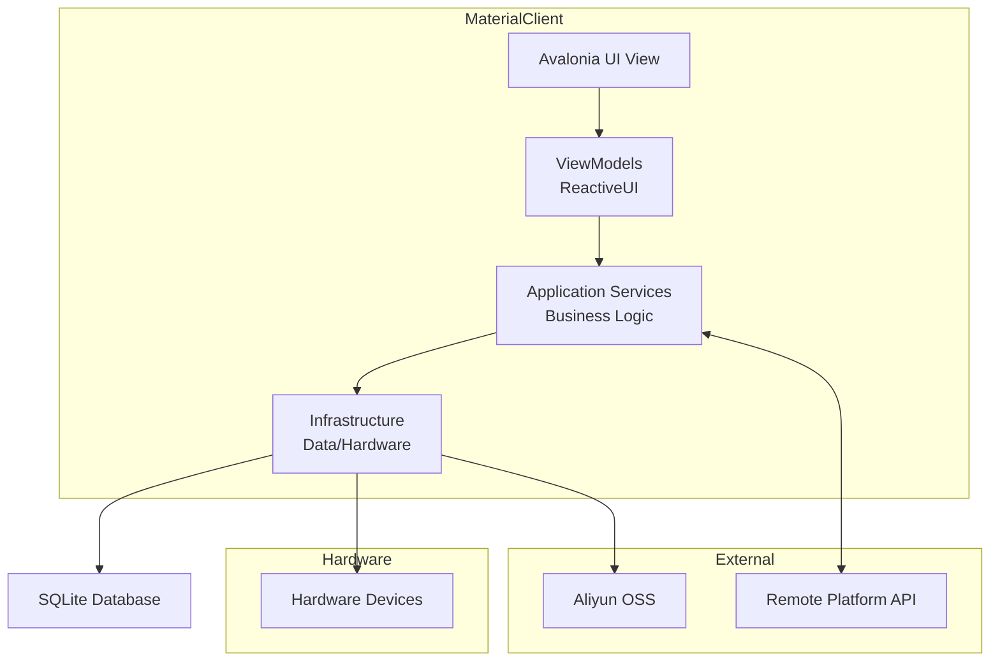
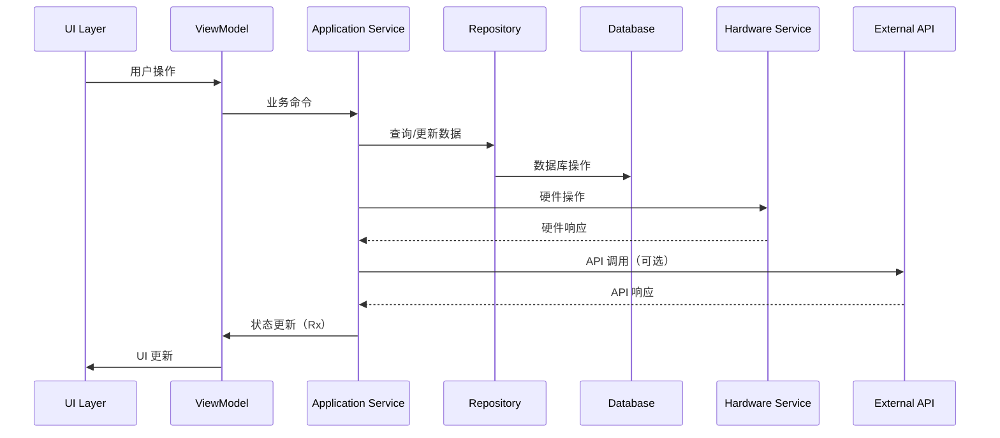

# 软件设计文档

**项目**: MaterialClient
**版本**: 1.0
**最后更新**: 2026-01-15
**状态**: 草稿

---

## 目录

1. [架构概述](#1-架构概述)
2. [模块设计](#2-模块设计)
3. [状态管理架构](#3-状态管理架构)
4. [数据模型](#4-数据模型)
5. [架构图](#5-架构图)
6. [技术决策](#6-技术决策)
7. [约束与风险](#7-约束与风险)
8. [开发指南](#8-开发指南)

---

## 1. 架构概述

### 1.1 系统定位

**MaterialClient** 是一个用于卡车称重管理和物料流程跟踪的 Windows 桌面应用程序。该系统集成硬件设备（卡车秤、监控摄像头、车牌识别）以自动化称重操作，采集证据照片，并与远程平台同步数据。

**关键特性**:
- 单用户桌面应用程序
- 硬件依赖（串口、USB 摄像头、专用 SDK）
- 支持 24/7 运行
- 远程平台同步（可选）
- 仅限 Windows 平台

**主要用例**:
- 人工称重：操作员监控称重过程，系统采集照片和记录
- 无人称重：基于车牌识别的自动化称重
- 物料匹配：匹配进场/出场称重记录以创建运单
- 数据同步：将运单和附件推送到远程平台

---

### 1.2 技术栈

| 层级 | 技术 | 版本 | 用途 |
|-------|------------|---------|---------|
| **语言** | C# | 13 (.NET 10.0) | 主要编程语言 |
| **平台** | .NET | 10.0 | 运行时框架 |
| **目标** | Windows | 仅 x64 | 部署目标 |
| **UI 框架** | Avalonia UI | 11.3.9 | 跨平台 UI |
| **UI 组件** | Irihi.Ursa | 1.14.0 | 组件库 |
| **状态管理** | ReactiveUI + Rx.NET | 20.1.1 + 7.0.0-preview.1 | MVVM + 响应式流 |
| **DI 容器** | Volo.Abp + Autofac | 10.0.1 | 依赖注入 |
| **ORM** | Entity Framework Core | 10.0.1 | 数据访问 |
| **数据库** | SQLite | (通过 EF Core) | 本地存储 |
| **HTTP 客户端** | Refit | 9.0.2 | 类型安全的 HTTP |
| **弹性策略** | Polly | (通过 MS Extensions) | HTTP 重试策略 |
| **日志记录** | Serilog | 4.3.0 | 结构化日志 |
| **ID 生成** | Yitter.IdGenerator | 1.0.14 | 分布式 ID |
| **摄像头采集** | FlashCap | 1.11.0 | USB 摄像头访问 |
| **云存储** | Aliyun.OSS | 2.14.1 | 文件存储 |
| **串口 I/O** | System.IO.Ports | 10.0.1 | 串口通信 |

**第三方依赖**:
- **HCNetSDK**: 海康威视摄像头 SDK（非托管 DLL）

---

### 1.3 架构模式

系统遵循具有 DDD 原则的分层架构：

```
┌─────────────────────────────────────────────────────────────┐
│                    表现层                       │
│  ┌──────────────┐  ┌──────────────┐  ┌──────────────┐      │
│  │   Avalonia   │  │  ReactiveUI  │  │    ViewModels│      │
│  │      Views   │  │   Bindings   │  │   (Rx State) │      │
│  └──────────────┘  └──────────────┘  └──────────────┘      │
└─────────────────────────────────────────────────────────────┘
                              ↓
┌─────────────────────────────────────────────────────────────┐
│                     应用层                       │
│  ┌──────────────┐  ┌──────────────┐  ┌──────────────┐      │
│  │   Services   │  │   Domain     │  │   DTOs       │      │
│  │  (Business   │  │   Logic      │  │  (Contracts) │      │
│  │   Logic)     │  │              │  │              │      │
│  └──────────────┘  └──────────────┘  └──────────────┘      │
└─────────────────────────────────────────────────────────────┘
                              ↓
┌─────────────────────────────────────────────────────────────┐
│                     基础设施层                     │
│  ┌──────────────┐  ┌──────────────┐  ┌──────────────┐      │
│  │  Hardware    │  │  Data Access │  │  External    │      │
│  │  Abstraction │  │  (EF Core)   │  │  APIs        │      │
│  └──────────────┘  └──────────────┘  └──────────────┘      │
└─────────────────────────────────────────────────────────────┘
                              ↓
┌─────────────────────────────────────────────────────────────┐
│                      硬件层                         │
│  ┌──────────────┐  ┌──────────────┐  ┌──────────────┐      │
│  │Truck Scale   │  │  Cameras     │  │  LPR Device  │      │
│  │(Serial Port) │  │  (USB/RTSP)  │  │  (Network)   │      │
│  └──────────────┘  └──────────────┘  └──────────────┘      │
└─────────────────────────────────────────────────────────────┘
```

**模式说明**:

| 模式 | 使用场景 | 理由 |
|---------|-------|-----------|
| **MVVM** | UI 层 | 关注点分离，可测试的 ViewModels |
| **RxState** | 状态管理 | 用于实时更新的响应式流 |
| **Repository** | 数据访问 | EF Core 的抽象，可测试性 |
| **Dependency Injection** | 所有层 | 松耦合，可测试性 |
| **Observer** | 跨组件通信 | MessageBus.Current 用于解耦消息传递 |
| **Factory** | 硬件创建 | ISerialPortFactory 用于设备抽象 |
| **Unit of Work** | 数据库操作 | 通过 ABP 实现事务一致性 |

---

### 1.4 系统边界

**范围内**:
- 单用户 Windows 桌面应用程序
- 本地 SQLite 数据库存储
- 硬件设备集成（卡车秤、摄像头、LPR）
- 本地业务逻辑执行
- 可选的远程平台同步
- 手动数据录入和更正

**范围外**:
- 多用户并发操作
- Web/移动端接口
- 实时多站点同步
- 复杂的报表/分析（委托给远程平台）

**集成点**:
- **BasePlatform API**: 远程物料管理平台（HTTP/REST）
- **Aliyun OSS**: 附件文件的云存储
- **硬件设备**: 本地串口/USB/网络设备

---

## 2. 模块设计

### 2.1 服务目录

| 服务 | 职责 | 层级 | 线程安全 |
|---------|----------------|-------|-------------|
| `AttendedWeighingService` | 人工称重流程、状态机、照片协调 | 应用层 | 是 |
| `WeighingMatchingService` | 记录匹配、运单创建、同步编排 | 应用层 | 是 |
| `TruckScaleWeightService` | 串口通信、重量解析、响应式更新 | 基础设施层 | 是 |
| `HikvisionService` | 海康威视 SDK 集成、照片采集、设备管理 | 基础设施层 | 是 |
| `LPRAllInOneService` | 车牌识别设备集成 | 基础设施层 | 是 |
| `PlateRecognitionService` | 车牌识别编排、缓存 | 应用层 | 是 |
| `AttachmentService` | 附件 CRUD、OSS 同步、文件管理 | 应用层 | 是 |
| `MaterialService` | 物料/供应商/单位 CRUD 和查询 | 应用层 | 是 |
| `SyncMaterialService` | 从远程平台同步物料 | 应用层 | 是 |
| `OssUploadService` | 阿里云 OSS 上传、重试逻辑 | 基础设施层 | 是 |
| `DeviceManagerService` | 设备生命周期、健康监控 | 应用层 | 是 |
| `SettingsService` | 应用程序设置持久化 | 基础设施层 | 是 |
| `SoundDeviceService` | 用于通知的音频播放 | 基础设施层 | 是 |

---

### 2.2 AttendedWeighingService

**目的**: 管理人工称重流程，包括重量稳定性检测、自动照片采集、称重记录创建以及与出场记录的自动匹配。

**文件**: `MaterialClient.Common/Services/AttendedWeighingService.cs`

**接口**:
```csharp
public interface IAttendedWeighingService : ITransientDependency
{
    // 生命周期
    Task StartAsync();
    Task StopAsync();

    // 状态访问
    AttendedWeighingStatus GetCurrentStatus();
    DeliveryType CurrentDeliveryType { get; }

    // 命令
    void SetDeliveryType(DeliveryType deliveryType);
    void OnPlateNumberRecognized(string plateNumber);
    string? GetMostFrequentPlateNumber();

    // 可观察对象
    IObservable<AttendedWeighingStatus> StatusChanges { get; }
    IObservable<decimal> WeightChanges { get; }
    IObservable<long?> LastCreatedWeighingRecordIdChanges { get; }
}
```

**依赖**:
- `ITruckScaleWeightService` - 重量流

---

## 3. 状态管理架构

### 3.1 响应式扩展 (Rx.NET) 使用

系统使用 **Rx.NET** (`System.Reactive`) 在 UI 和服务层实现响应式状态管理。

**核心概念**:
- **Observable Streams**: 表示异步事件序列
- **Subjects**: 既可观察又可观察者（事件流 + 推送事件的能力）
- **Operators**: 转换、过滤、组合流
- **Schedulers**: 控制线程

---

### 3.2 状态管理模式

#### 模式 1: BehaviorSubject 用于当前状态

**用于**: `AttendedWeighingService`, `TruckScaleWeightService`

```csharp
// BehaviorSubject 始终具有当前值
private readonly BehaviorSubject<AttendedWeighingStatus> _statusSubject =
    new(AttendedWeighingStatus.OffScale);

// 作为只读可观察对象公开
public IObservable<AttendedWeighingStatus> StatusChanges =>
    _statusSubject.AsObservable();

// 更新状态
_statusSubject.OnNext(AttendedWeighingStatus.WaitingForStability);

// 同步获取当前值
public AttendedWeighingStatus GetCurrentStatus() => _statusSubject.Value;
```

**优点**:
- 新订阅者立即获得当前值
- 简单的状态访问模式

**缺点** (在优化报告中记录):
- 多个 BehaviorSubject → 状态同步问题
- 组合多个状态时出现复杂的 `CombineLatest` 逻辑

---

#### Pattern 2: 共享流与 Publish().RefCount()

**用于**: `TruckScaleWeightService.WeightChanges`, `PlateRecognitionService.RecognitionResults`

```csharp
// 单一源，多个订阅者
private readonly IObservable<decimal> _weightStream = ...;

// Publish 以共享连接，RefCount 以在最后订阅者取消时自动断开
public IObservable<decimal> WeightChanges =>
    _weightStream.Publish().RefCount();
```

**优点**:
- 多个订阅者共享单个订阅
- 当最后一个订阅者取消时自动清理

**缺点**:
- 如果订阅/取消过于频繁，可能出现意外的断开/重连

---

#### Pattern 3: Rx 管道用于数据处理

**用于**: 所有服务的数据处理和转换

```csharp
return _weightStream
    .Throttle(TimeSpan.FromMilliseconds(100))
    .DistinctUntilChanged()
    .Select(weight => new WeightUpdate(weight, DateTime.Now))
    .Where(update => update.Weight > 0)
    .ObserveOn(RxApp.MainThreadScheduler)
    .Subscribe(update => UpdateUI(update));
```

**优点**:
- 清晰的数据转换流程
- 内置防抖和去重
- 线程控制（ObserveOn）

**缺点**:
- 需要理解 Rx 运算符
- 复杂管道可能难以调试

---

### 3.3 订阅生命周期管理

**最佳实践**:
- 在 `Dispose()` 中处理所有订阅
- 使用 `DisposeBag` 或 `CompositeDisposable` 管理多个订阅
- 调用 `StartAsync()` 时订阅，调用 `StopAsync()` 时取消订阅

```csharp
private readonly CompositeDisposable _disposables = new();

public Task StartAsync()
{
    _weightStream
        .ObserveOn(RxApp.MainThreadScheduler)
        .Subscribe(OnWeightChanged)
        .DisposeWith(_disposables);

    return Task.CompletedTask;
}

public Task StopAsync()
{
    _disposables.Dispose();
    return Task.CompletedTask;
}
```

---

## 4. 数据模型

### 4.1 核心实体

#### WeighingRecord (称重记录)
```csharp
public class WeighingRecord : Entity<long>
{
    public DateTime WeighingTime { get; set; }           // 称重时间
    public string PlateNumber { get; set; }             // 车牌号
    public decimal GrossWeight { get; set; }             // 毛重
    public decimal TareWeight { get; set; }              // 皮重
    public decimal NetWeight { get; set; }               // 净重（计算得出）
    public DeliveryType DeliveryType { get; set; }      // 进场/出场
    public Material? Material { get; set; }             // 物料
    public long? MaterialId { get; set; }               // 物料 ID
    public Waybill? Waybill { get; set; }               // 运单
    public long? WaybillId { get; set; }                // 运单 ID
    public ICollection<Attachment> Attachments { get; set; }  // 附件
    public string ScaleNumber { get; set; }              // 秤号
    public string DriverName { get; set; }              // 司机姓名
    public string? Remarks { get; set; }                 // 备注
    public bool IsSynced { get; set; }                  // 是否已同步
}
```

#### Waybill (运单)
```csharp
public class Waybill : Entity<long>
{
    public string WaybillNumber { get; set; }           // 运单号
    public DateTime CreatedTime { get; set; }            // 创建时间
    public Material? Material { get; set; }               // 物料
    public long? MaterialId { get; set; }               // 物料 ID
    public WeighingRecord? InboundRecord { get; set; }   // 进场记录
    public long? InboundRecordId { get; set; }           // 进场记录 ID
    public WeighingRecord? OutboundRecord { get; set; }  // 出场记录
    public long? OutboundRecordId { get; set; }          // 出场记录 ID
    public decimal NetWeight { get; set; }               // 净重
    public bool IsSynced { get; set; }                  // 是否已同步
}
```

#### Attachment (附件)
```csharp
public class Attachment : Entity<long>
{
    public string FileName { get; set; }                 // 文件名
    public string FileType { get; set; }                 // 文件类型
    public long FileSize { get; set; }                   // 文件大小
    public string OssUrl { get; set; }                   // OSS URL
    public string? LocalPath { get; set; }               // 本地路径
    public WeighingRecord? WeighingRecord { get; set; }  // 称重记录
    public long? WeighingRecordId { get; set; }          // 称重记录 ID
    public AttachmentType AttachmentType { get; set; }    // 附件类型
}
```

---

### 4.2 实体关系

```
WeighingRecord (1) ──────── (0..*) Attachment
WeighingRecord (0..1) ────── (1) Waybill
Material (1) ────────────── (0..*) WeighingRecord
Material (1) ────────────── (0..*) Waybill
```

---

## 5. 架构图

### 5.1 系统架构图



### 5.2 数据流图



---

## 6. 技术决策

### 6.1 UI 框架选择

**选择**: Avalonia UI

**理由**:
- 跨平台支持（主要目标是 Windows，但为未来保留选项）
- XAML 语法与 WPF 相似，学习成本低
- 活跃的社区和生态系统
- 支持响应式绑定（与 ReactiveUI 集成良好）

**替代方案考虑**:
- **WPF**: 仅限 Windows，但生态系统更成熟
- **MAUI**: 新技术，生态系统不成熟

### 6.2 状态管理选择

**选择**: Rx.NET (Reactive Extensions)

**理由**:
- 适合处理异步事件流（串口数据、摄像头帧、网络响应）
- 响应式绑定支持
- 内置运算符用于防抖、节流、去重
- 与 ReactiveUI 良好集成

**替代方案考虑**:
- **事件/委托**: 更简单，但不适合复杂的状态组合
- **INotifyPropertyChanged**: 标准，但不支持流处理

### 6.3 数据库选择

**选择**: SQLite (通过 Entity Framework Core)

**理由**:
- 零配置、文件型数据库
- 适合单用户桌面应用程序
- 支持完整的 LINQ 查询
- 与 EF Core 良好集成

**替代方案考虑**:
- **SQL Server**: 功能更强大，但需要单独安装
- **文件系统**: 更简单，但缺乏查询能力

---

## 7. 约束与风险

### 7.1 技术约束

**硬件依赖**:
- 串口通信依赖 Windows 驱动程序
- USB 摄像头可能不稳定
- LPR 设备需要网络连接

**性能约束**:
- 单线程 UI 限制（需要正确使用线程调度器）
- SQLite 写入性能（批量操作优化）
- USB 摄像头采集帧率

**平台约束**:
- 仅限 Windows（x64）
- .NET 10.0 运行时要求

### 7.2 已知风险

**风险 1: 硬件设备故障**

**影响**: 称重、拍照或车牌识别功能不可用

**缓解措施**:
- 设备健康监控
- 优雅降级（例如：手动车牌号输入）
- 操作员错误提示

**风险 2: 数据同步失败**

**影响**: 远程平台数据不一致

**缓解措施**:
- 本地数据存储作为主数据源
- 重试机制（Polly）
- 同步状态跟踪

**风险 3: 内存泄漏**

**影响**: 长时间运行后应用程序崩溃

**缓解措施**:
- 正确管理订阅生命周期
- 使用内存分析工具
- 定期测试长时间运行场景

---

## 8. 开发指南

### 8.1 代码组织

**项目结构**:
```
MaterialClient/                    # 主应用程序
├── Views/                         # Avalonia 视图
├── ViewModels/                    # ReactiveUI ViewModels
├── Models/                        # 数据模型
├── Services/                      # 应用层服务
└── App.axaml                     # 应用程序入口

MaterialClient.Common/             # 共享库
├── Entities/                      # 实体
├── Repositories/                  # 仓储
├── Services/                      # 应用服务
└── DTOs/                         # 数据传输对象

MaterialClient.Toolkit/            # 工具库
├── Controls/                     # 自定义控件
├── Converters/                   # 值转换器
└── Behaviors/                    # 行为
```

### 8.2 命名约定

**C# 命名**:
- 类名：`PascalCase`
- 方法名：`PascalCase`
- 属性名：`PascalCase`
- 私有字段：`_camelCase`
- 局部变量：`camelCase`

**命名空间**:
- 遵循项目结构
- 使用 `MaterialClient.*` 前缀

### 8.3 异步编程指南

**规则**:
- 所有 I/O 操作必须异步
- 使用 `async/await` 而不是 `Task.Result`
- 避免在热路径上使用 `ConfigureAwait(false)`（UI 线程需要）

**示例**:
```csharp
// ✅ 正确：异步操作
public async Task<List<WeighingRecord>> GetRecordsAsync()
{
    return await _repository.GetListAsync();
}

// ❌ 错误：同步等待
public List<WeighingRecord> GetRecords()
{
    return _repository.GetListAsync().Result;  // 可能死锁
}
```

### 8.4 错误处理

**规则**:
- 在应用层捕获并处理异常
- 记录所有异常
- 向 UI 显示用户友好的错误消息
- 不要吞掉异常而不记录

**示例**:
```csharp
try
{
    await _weighingService.StartAsync();
}
catch (DeviceConnectionException ex)
{
    _logger.Error(ex, "设备连接失败");
    await ShowErrorAsync("无法连接到设备，请检查设备是否正常工作");
}
```

### 8.5 日志记录

**规则**:
- 在服务入口点记录重要事件
- 记录所有异常
- 使用结构化日志（Serilog）
- 包括相关上下文（实体 ID、用户操作等）

**示例**:
```csharp
_logger.Information("开始称重流程，车牌号: {PlateNumber}", plateNumber);
_logger.Error(ex, "创建称重记录失败，车牌号: {PlateNumber}", plateNumber);
```

---

## 附录

### A. 术语表

| 英文 | 中文 |
|------|------|
| Weighing Record | 称重记录 |
| Waybill | 运单 |
| Attachment | 附件 |
| Gross Weight | 毛重 |
| Tare Weight | 皮重 |
| Net Weight | 净重 |
| License Plate | 车牌 |
| LPR (License Plate Recognition) | 车牌识别 |
| Delivery Type | 进场/出场类型 |
| Material | 物料 |
| Scale | 秤 |

### B. 相关文档

- [架构决策记录](../openspec/docs/ADR.md)
- [API 文档](../docs/API.md)
- [部署指南](../docs/DEPLOYMENT.md)

---

**文档版本**: 1.0
**最后更新**: 2026-01-15
**维护者**: MaterialClient 开发团队
