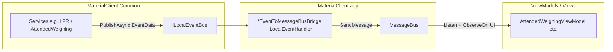

# ABP `ILocalEventBus` 与 ReactiveUI `MessageBus` 的分工与桥接

本文说明 `MaterialClient/Events/EventBusToMessageBusBridge.cs`（内含多个 `*EventToMessageBusBridge` 处理器）在 Avalonia + ABP 架构中的角色，并对比两种总线；与错误样例 [common-must-not-subscribe-messagebus.md](./error-cases/common-must-not-subscribe-messagebus.md) 中的迁移结论一致。

更泛化的「多种进程内消息库、.NET 事件基础设施与 UI/Common 统一方案」见：[architecture-dotnet-event-driven-messaging-landscape.md](./architecture-dotnet-event-driven-messaging-landscape.md)。

## 1. `EventBusToMessageBusBridge.cs` 是否多余？

**结论：在当前项目约定下不是多余的。**

该文件中的类型均为 `ILocalEventHandler<TEvent>` 实现，并在 `HandleEventAsync` 内调用 `MessageBus.Current.SendMessage(...)`，把 Common 层通过 **ABP `ILocalEventBus`** 发布的 `*EventData` 转成 ViewModel 已订阅的 `*Message`。

若没有这些桥接：

- `AttendedWeighingService`、`HikvisionLprService`、`VzvisionLprService`、`GateIoControlService` 等已改为只发布 `ILocalEventBus` 的事件数据；
- 而 `AttendedWeighingViewModel` 等仍通过 `MessageBus.Current.Listen<...>().ObserveOn(RxApp.MainThreadScheduler)` 更新 UI；
- 则 **UI 层将收不到** 对应业务通知（除非把每个 ViewModel 改为直接订阅 `ILocalEventBus`，见下文「能否完全取代」）。

因此该文件是 **有意的适配层**，不是重复实现。

## 2. Avalonia 里是否有「EventBus」？能否用 `ILocalEventBus` 取代？

- **Avalonia 本身**不提供与 ABP `ILocalEventBus` 对等的应用级事件总线；常见做法是在 UI 栈上叠 **ReactiveUI** 的 `MessageBus`，或自研/MVVM 工具包事件。
- 本仓库的 **ViewModel 间通信**约定使用 ReactiveUI **`MessageBus`**（见 `AGENTS.md`），而不是 Avalonia 控件级路由事件。
- **ABP `ILocalEventBus`** 用于 **基础设施 / 应用服务层**与后台组件之间的跨层异步通信（ETO / `*EventData`），与 UI 解耦。

因此：「用 ABP `ILocalEventBus` 取代 Avalonia 的 EventBus」在命名上容易混淆——实际取代的是 **Common 层里曾错误使用的 `MessageBus`**，而不是 Avalonia 框架自带对象；**UI 层仍保留 `MessageBus`**，并通过桥接消费来自 `ILocalEventBus` 的业务事件。

## 3. `ILocalEventBus` 与 `MessageBus` 的区别（对照表）

| 维度 | ABP `ILocalEventBus` | ReactiveUI `MessageBus.Current` |
|------|----------------------|----------------------------------|
| **归属** | Volo.Abp 应用内本地事件总线 | ReactiveUI 静态消息总线 |
| **典型用途（本项目）** | Common 服务、HTTP 处理器、后台逻辑之间发布 `*EventData` / ETO | ViewModel、部分 View code-behind 之间发布 `*Message` |
| **订阅模型** | 实现 `ILocalEventHandler<TEvent>`，由容器注册、ABP 派发 | `Listen<T>()` 返回 `IObservable<T>`，通常 `ObserveOn` 到 UI 线程后 `Subscribe`，`DisposeWith` 管理生命周期 |
| **与 DI** | 强：处理器可注入服务 | 弱：静态入口，不按作用域隔离 |
| **测试与并行** | 测试可用替换的 `ILocalEventBus`（如 `TestLocalEventBus`），隔离性好 | 全局单例，多实例并行测试易互相干扰（Common 层已禁止直接依赖的原因之一） |
| **线程** | 处理器在 ABP 调度上下文中异步执行；**非托管 SDK 回调中禁止再 `ObserveOn` UI 线程**（见 `AGENTS.md`） | `SendMessage` 线程安全；UI 更新侧在 ViewModel 中用 `ObserveOn(RxApp.MainThreadScheduler)` |
| **项目规则** | Common 层跨服务通知应走此通道 | ViewModel 间通信必须走此通道 |

## 4. 数据流（简化）

## 5. 能否让 ViewModel 只订阅 `ILocalEventBus`，从而删除桥接？

**理论上可以，但不建议作为默认方向**，原因包括：

1. **项目宪章**：`AGENTS.md` 规定 ViewModel 间通信用 `MessageBus`，ABP `ILocalEventHandler` 用于跨层（基础设施 ↔ 后台），职责边界清晰。
2. **UI 线程**：ViewModel  today 统一在 `Listen` 后 `ObserveOn(RxApp.MainThreadScheduler)`；若改为 `ILocalEventHandler`，每个处理器内仍需切回 UI 线程，且容易在错误层级误用 `ObserveOn`（尤其在关闭窗口时与 SDK 回调结合时有死锁风险）。
3. **生命周期**：Rx 订阅与 ViewModel 的 `CompositeDisposable` 模式成熟；在 VM 中直接注册多个 ABP 处理器需要额外设计，避免泄漏与重复注册。

若未来要删除桥接，需要 **成体系迁移**：所有对应 `*Message` 的消费者改为从 `ILocalEventBus` 消费，并重新定义线程与生命周期策略——属于架构变更，而非「删一个多余文件」。

## 6. 相关代码位置

- 桥接实现：`MaterialClient/Events/EventBusToMessageBusBridge.cs`（类名以 `*EventToMessageBusBridge` 结尾）。
- Common 层发布示例：`AttendedWeighingService`、`HikvisionLprService`、`VzvisionLprService`、`GateIoControlService`、`MaterialPlatformBearerTokenHandler` 等中的 `_localEventBus.PublishAsync(...)`。
- UI 订阅示例：`MaterialClient/ViewModels/AttendedWeighingViewModel.cs` 中 `Start*MessageBusSubscription` 方法。
- 规则与历史背景：`docs/error-cases/common-must-not-subscribe-messagebus.md`。

---

*文档用途：架构说明与 onboarding；与 OpenSpec 无强制绑定。*
