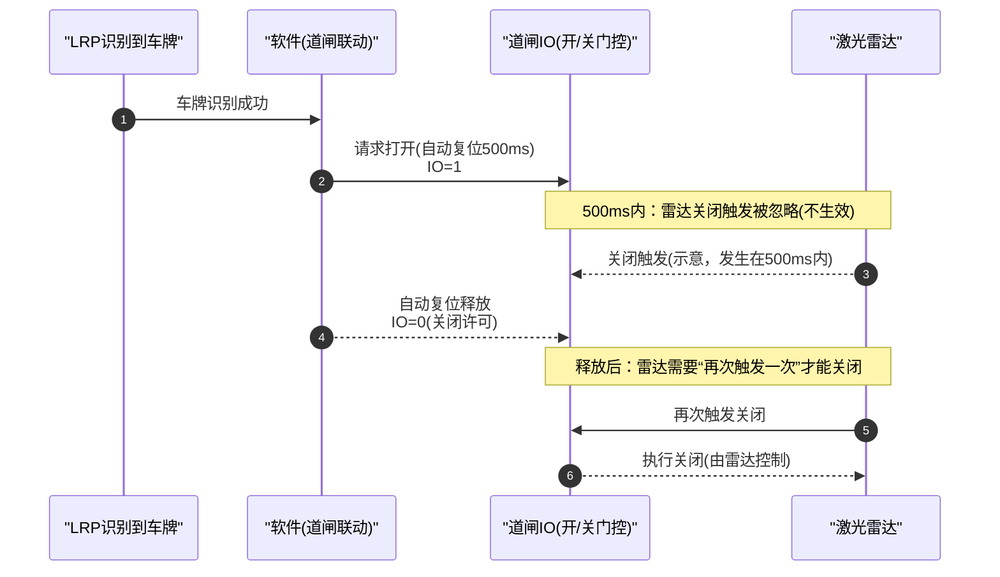

# 道闸功能评估报告（Vzvision LPR I/O 与称重状态门控）

> **文档性质**：评估报告，非实施说明。  
> **日期**：2026-03-25  

---

## 1. 背景与目标

本评估聚焦“道闸功能模式”（双道闸 A/B + 两路 LPR/LRP 触发）与现有系统称重状态机之间的协同，核心目标包括：

- 满足你给出的道闸时序与安全约束（见 §3）
- 尽量不影响原“无道闸模式”（即不启用道闸/联动时，现有业务流程不变）
- 明确是否需要在 `AttendedWeighingStatus` 扩展一个“待上磅/待上榜”状态，并评估代价与风险

---

## 2. 现状分析（当前代码如何工作）

### 2.1 称重状态机（`AttendedWeighingStatus`）

系统内置称重状态枚举：

- `OffScale`（称重已结束）
- `WaitingForStability`（等待稳定）
- `WeightStabilized`（重量已稳定）
- `WaitingForDeparture`（等待下磅）

状态转换由 `AttendedWeighingService.CreateStatusStream(...)` 基于：

- 重量是否超过最小阈值
- 稳定性窗口 `stability.IsStable`
- 称重记录创建标记（`_lastCreatedWeighingRecordIdSubject`）

完成，并在转换时触发副作用（抓拍、创建称重记录、状态通知等）。

系统还会通过 `MessageBus` 发送 `StatusChangedMessage(AttendedWeighingStatus)`，供其他模块订阅。

### 2.2 道闸 I/O 控制（`LprGateIoControlService`）

当前道闸 I/O 控制服务的行为可概括为：

- 订阅 `MessageBus` 的 `LicensePlateRecognizedMessage`
- 根据车牌识别设备配置 `LicensePlateRecognitionConfig` 判断：
  - `EnableGateIo == true` 才继续
  - `message.DeviceType == LprDeviceType.Vzvision` 才继续（非 Vzvision 记录仅日志后跳过）
- 调用 `IVzvisionLprService.SetIoOutputAutoRespAsync(config, ioChannel, 500)`

也就是说：**当前实现只“识别到车牌就开闸脉冲”，不读取 `AttendedWeighingStatus`，也不区分入口/出口阶段。**

---

## 3. 你的需求约束拆解（逐条映射）

### 3.1 道闸 I/O 定义

- `1`：请求/保持打开道闸（打开优先级持续到 `IO=1` 期间；在 `VzLPRClient_SetIOOutputAutoResp` 自动复位释放之前，雷达关闭信号会被忽略。雷达必须在 `durationMs` 这段时间结束后“再次触发一次”才允许关闭生效）
- `0`：关闭许可位（雷达在边沿/条件满足时执行关闭；关闭判定与 `AttendedWeighingStatus` 不关联）

同时你提到“车辆上磅后，由外部激光雷达自动关闭道闸”。

> 现状与风险点：当前 Vzvision 下发能力为 `VzLPRClient_SetIOOutputAutoResp(..., durationMs)`，会在 `durationMs` 到期后自动复位到另一个电平（通常意味着最终会回到 `0`）。
> 在你给出的约束下：
> - `durationMs` 期间雷达关闭触发会被忽略；若雷达要关闭道闸，必须在 `durationMs` 严格结束后“再次触发一次”
> - `0` 仅决定“允许雷达去执行关闭”（雷达边沿/条件满足才会关）
> - 打开优先级持续到 `IO=1`（直到自动复位释放）期间
> - `AttendedWeighingStatus` 只约束 LRP 的开闸时机；雷达关闭门控只由 `SetIOOutputAutoResp` 的释放/许可位语义决定
> 因此仍需在硬件侧确认：`durationMs` 的结束时间点与雷达关闭触发边沿/条件之间的相对时序是否满足上述“忽略窗口 + 释放后再次触发”的语义

#### 时序图（`durationMs=500ms`，雷达关闭在 `IO=1` 期间被忽略）

### 3.2 双道闸 A/B 与两路 LPR/LRP 触发

- 两个 LRP 分别对应道闸 I/O `A` 与 `B`
- A/B 两个方向都能通行
- 同一时间只能通过一辆车

这意味着软件需要“会话化”（session）：一辆车进入后，直到该车完成称重并放行，期间不应被另一方向/另一相机的车牌识别打断或重复开闸。

### 3.3 车辆进入/离开时序

- 当 LRP 接收到车牌：打开对应道闸 I/O，等待车辆上磅，并确认当前入口处
- 车辆上磅后：外部激光雷达自动关闭道闸
- 处于 `WaitingForStability`、`WeightStabilized` 时：**道闸不应该被 LRP 打开**
- 处于 `WaitingForDeparture` 时：打开出口道闸（即另一边的道闸）

### 3.4 核心诉求（以实现影响评估为导向）

1. **修改尽量不影响原来无道闸模式的功能。**
2. 道闸模式下是否要扩展 `AttendedWeighingStatus` 增加“待上磅/待上榜”状态？
   - 待上磅状态定义：打开识别到车牌那一侧道闸，出口道闸不会被 LRP 打开
3. `WaitingForStability`、`WeightStabilized` 阶段入口与出口道闸都不允许被 LRP 打开

---

## 4. 现状对照评估：关键缺口（Gap Analysis）

### 4.1 状态门控缺失（无法满足 §3.3 中的稳定/稳重禁开闸）

当前 `LprGateIoControlService` 不读取 `AttendedWeighingStatus`，因此：

- 在 `WaitingForStability` / `WeightStabilized` 阶段，只要再次收到车牌识别事件，仍会触发开闸脉冲
- 无法实现“入口/出口道闸都不允许被 LRP 打开”的约束

### 4.2 入口/出口侧选择缺失（无法保证“出口道闸不会被 LRP 打开”）

当前 `LicensePlateRecognitionConfig` 包含：

- `Direction`（In/Out）
- `EnableGateIo`
- `IoChannel`

但现有道闸控制只将“识别设备”映射到“`IoChannel` 脉冲下发”，没有“入口侧锁定 + 出口侧计算（另一侧）+ 出口只在 WaitingForDeparture 打开”的会话逻辑。

结果是：在同一称重周期内，哪个 LRP 再次识别到车牌，都可能触发其对应道闸 I/O，而这不符合“出口道闸不会被 LRP 打开”的定义。

### 4.3 同一时间只能通行一辆车：需要会话化/互斥机制

当前实现没有“车辆会话”概念，因此缺少互斥策略：

- 车牌识别事件可能在同一称重周期内重复出现（来自入口相机、出口相机或同一相机的多次识别）
- 当前会将每次识别都当作一次开闸触发，可能导致重复开闸/错误开闸

### 4.4 IO 电平语义与 SDK 自动复位机制潜在冲突

如 §3.1 所述，需要硬件/设备手册确认：SDK 自动复位后的电平（`0`）是否严格满足“允许外部激光雷达关闭”的语义（即：不会在 `1` 期间出现提前关闭，也不会导致激光雷达关闭能力失效）。
如 §3.1 所述，需要硬件/设备手册确认：在 `VzLPRClient_SetIOOutputAutoResp` 自动复位释放之前，雷达关闭触发是否会被忽略；且仅在 `durationMs` 严格结束后，雷达需要“再次触发一次”才允许关闭生效（关闭不依赖 `AttendedWeighingStatus`）。

---

## 5. 设计选项评估

### 方案 A：扩展 `AttendedWeighingStatus` 增加“待上磅/待上榜”（推荐用于可读性/可视化，但改动较大）

**目标**：把“开闸后、车辆尚未进入称重稳定窗口（或尚未满足进入 `WaitingForStability` 的重量阈值）”显式建模为新的状态。

一种可行状态序列：

- `OffScale`（称重未开始）
- `WaitingForTop`（待上磅：已由 LPR 打开入口道闸；出口不会被 LPR 打开）
- `WaitingForStability`
- `WeightStabilized`
- `WaitingForDeparture`（此时打开出口道闸）
- `OffScale`

**优点**

- 状态语义清晰：道闸控制、UI 展示、日志审计都能直接使用同一个状态源
- 可自然表达“出口道闸不会被 LRP 打开”的约束（在 `WaitingForTop` 阶段直接拒绝出口方向的触发）

**缺点 / 风险**

- 现有 `CreateStatusStream` 的状态转换几乎完全由“重量/稳定性”推导。加入“待上磅”意味着需要引入**外部事件驱动**（来自 `LprGateIoControlService` 或 LPR 触发）来改变状态流：
  - 需要解决与重量流并发组合时的竞态与一致性
  - 需要更新/增加大量状态机单元测试
- 若“待上磅”状态与重量阈值之间的边界不够明确，可能导致状态抖动或漏状态

### 方案 B：不改 `AttendedWeighingStatus`，在 `LprGateIoControlService` 内实现“道闸会话 session”（推荐用于低风险/最小改动）

**目标**：在道闸控制服务内维护“当前车辆会话”的进入侧与阶段，并从 `MessageBus` 订阅 `StatusChangedMessage`，完成：

- LRP 识别时：只在合适阶段打开入口道闸
- 稳定/稳重阶段：拒绝任何 LRP 触发开闸
- 等待下磅阶段：打开出口道闸（另一侧）

**推荐会话字段**

- `sessionActive`：当前是否已有车辆会话
- `entrySide`：入口道闸侧（A 或 B）
- `exitOpened`：出口道闸是否已在本会话打开（避免重复开闸）
- （可选）`sessionStartedAt`：用于故障/超时清理

**实现要点（抽象）**

1. `LprGateIoControlService` 订阅 `StatusChangedMessage`
2. 收到 `LicensePlateRecognizedMessage` 时：
   - 若当前状态为 `WaitingForStability` 或 `WeightStabilized`：直接拒绝（满足 §3.3 的禁开闸）
   - 若当前状态为 `WaitingForDeparture`：拒绝入口开闸（只允许出口开闸由状态触发）
   - 若当前状态为 `OffScale` 且 `sessionActive == false`：打开“识别到车牌那一侧”（入口侧锁定），并设置 `sessionActive = true`
   - 若 `sessionActive == true`：拒绝重复触发（保证同一时间只能通过一辆车、且出口道闸不会被 LRP 打开）
3. 当状态变为 `WaitingForDeparture`：
   - 若 `sessionActive == true` 且 `exitOpened == false`：打开出口道闸（另一侧 I/O），并标记 `exitOpened = true`
4. 当状态回到 `OffScale`：
   - 清理会话：`sessionActive=false`、`entrySide`/`exitOpened` 复位

**优点**

- 不改 `AttendedWeighingStatus`，最大限度降低状态机风险
- 进入“待上磅”的语义可以通过 `sessionActive && AttendedWeighingStatus==OffScale` 间接表达
- 修改范围主要集中在 `LprGateIoControlService`（以及可能的配置字段映射）

**缺点 / 风险**

- UI 若需要展示“待上磅”文字含义，需要额外映射逻辑（或后续再选择方案 A）
- 需要新增“入口/出口侧映射”机制（A/B 的确定来源）

---

## 6. 推荐方案

综合“尽量不影响无道闸模式”和“降低状态机改动风险”，本评估推荐：

- 采用 **方案 B**：在 `LprGateIoControlService` 内实现道闸会话 session，并通过 `StatusChangedMessage` 实现状态门控。
- 是否扩展 `AttendedWeighingStatus`（方案 A）建议作为下一阶段增强，仅在需要 UI/审计明确状态语义时再做。

---

## 7. 入口/出口侧（A/B）映射需要补齐

当前 `LicensePlateRecognitionConfig` 的 `Direction` 仅提供 `In/Out`，但你的需求是：

- 两个 LPR 对应两道闸 I/O `A` 与 `B`
- A/B 两个方向都能通行（即物理方向与“入口/出口含义”可能会随车辆行驶方向改变）

因此建议在配置层引入一个明确的映射字段，例如：

- `GateIoSide`：枚举 `A/B`（或 `Left/Right`）

并确保：

- 车牌识别设备（LPR）属于哪一侧 I/O（A 或 B）在配置中可确定
- 道闸会话中 `entrySide` 与 `exitSide` 的计算可靠（`exitSide = entrySide == A ? B : A`）

> 待确认：是否可以用当前 `Direction (In/Out)` 直接等价映射到 A/B？
> 若 In==A、Out==B，则可短期复用；但若 A/B 可双向通行且 In/Out 语义随时变化，则需要新增字段。

---

## 8. 兼容性（不影响“无道闸模式”）

当前“无道闸模式”在配置层可理解为：

- `EnableGateIo == false`：`LprGateIoControlService` 不会触发 I/O

因此：

- 不建议强行把新的“状态门控逻辑”应用到所有既有 `EnableGateIo` 语义上，除非你确认现有用户期望不会依赖“识别即开闸脉冲”的旧行为。
- 推荐增加一个开关（命名可在实现时统一），例如：
  - `EnableGateIoLogicV2`（默认 false，逐步切换）

这样可保证“旧方式仍可工作”，新方式满足你提出的精确时序约束。

---

## 9. 风险与待确认事项

1. **IO 复位电平语义冲突**  
   当前使用 `VzLPRClient_SetIOOutputAutoResp` 会在 `500ms` 之后自动复位到 `0`。
   在你给出的语义下：`0` 应仅代表“允许外部激光雷达关闭”，而关闭由外部雷达执行；同时“打开优先级大于雷达关闭”。
   因此仍需确认硬件侧以下行为是否成立：
   - 在雷达未触发关闭的情况下，`1 -> 0` 是否不会导致道闸提前关闭（关闭由雷达执行）
   - 若雷达在 `VzLPRClient_SetIOOutputAutoResp` 自动复位释放之前已经触发过一次关闭：释放前触发是否被忽略，且必须在释放结束后“再次触发一次”才生效
   - 关闭门控是否与 `AttendedWeighingStatus` 无关（即不需要依赖 `WaitingForStability` / `WeightStabilized` / `WaitingForDeparture`）
   - 打开优先级是否持续到 `IO=1`（直到自动复位释放）期间，并对“释放前关闭”形成有效阻断

2. **多次识别/抖动导致重复开闸**  
   道闸会话必须拒绝重复触发：当 `sessionActive==true` 时，无论入口/出口相机继续识别都不应影响道闸（直到状态回到 `OffScale`）。

3. **“待上磅”超时清理策略**  
   如果开闸后车辆未能真正上磅（重量始终未到阈值），会话如何结束？  
   若需要安全闭合，需明确“0 可以关闭”的软件闭合能力是否可靠（又回到 §9.1）。

4. **“入口确认”机制**  
   你要求“打开识别到车牌那一侧道闸，并确认当前入口处，车辆上磅后”。  
   在方案 B 下，入口侧可直接由“触发开闸的 LPR 侧”锁定，但仍需确认是否存在“同一车辆在不同相机/不同侧反复识别”的情况。

5. **同一时间只能通过一辆车的判定边界**  
   目前互斥可以基于 `AttendedWeighingStatus != OffScale` 或会话 `sessionActive`。  
   若需要更精确（比如 OffScale 但已开闸等待上磅），则建议由 `sessionActive` 控制。

---

## 10. 测试与验证建议

### 10.1 软件单元测试（基于 MessageBus / 订阅模拟）

- `OffScale + 入口相机识别车牌 -> 开启入口道闸 A/B 一次`
- `WaitingForStability/WeightStabilized 阶段 -> 任意相机识别均不触发道闸`
- `WaitingForDeparture -> 打开出口道闸（另一侧）一次，且 LRP 识别不重复开闸`
- `OffScale 重置会话 -> 新车可再次触发`
- `快速连续多次识别 -> 只触发一次开闸`

### 10.2 集成测试（真实状态机联动）

- 通过重量模拟达到各状态转换边界，观察道闸开关与外部激光雷达闭合时序是否一致

### 10.3 硬件验证（必须）

- 验证 `VzLPRClient_SetIOOutputAutoResp(..., 500)` 在“1/0 电平语义”下的真实行为：
  - 在“雷达未触发关闭”的情况下，`1 -> 0` 是否不会导致道闸提前关闭（关闭由雷达执行）
  - 在 `durationMs` 未结束时雷达触发关闭一次：该触发是否会被忽略，且必须在 `durationMs` 结束后“再次触发一次”才会关闭
  - 在自动复位释放结束后，`0` 关闭许可是否允许雷达关闭生效，且不依赖 `AttendedWeighingStatus`

---

## 11. 结论

当前实现无法满足你提出的稳定/稳重阶段禁开闸、以及 WaitingForDeparture 开出口道闸的精确时序要求。

在“尽量不影响无道闸模式”和“降低状态机改动风险”的前提下，本评估建议：

- 先用 `LprGateIoControlService` 的会话化 session + `StatusChangedMessage` 状态门控完成全部时序约束（方案 B）
- 是否扩展 `AttendedWeighingStatus` 增加“待上磅”状态作为可选增强项（方案 A），仅在需要 UI/审计明确语义时实施

