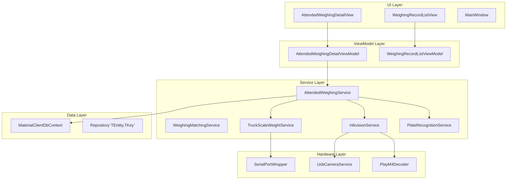
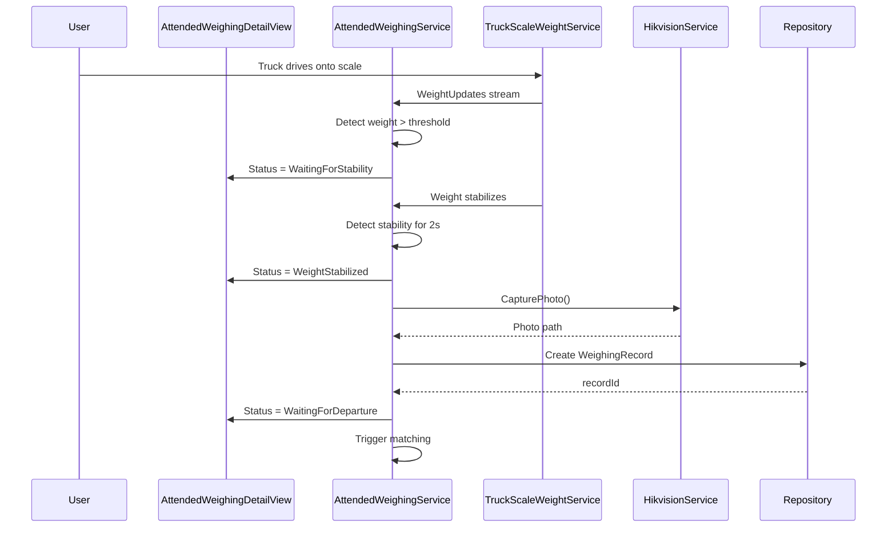
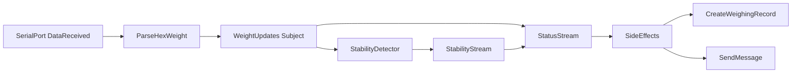
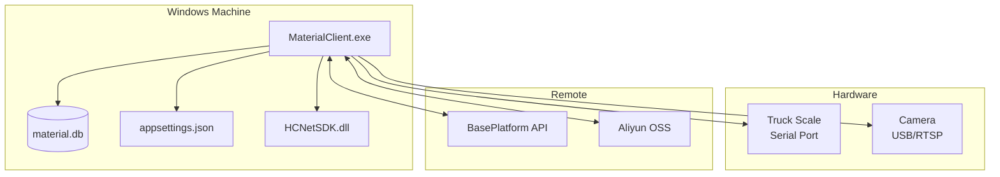

# SDD Gap Analysis Report

**Date**: 2026-01-15
**Purpose**: Identify missing design decisions and architecture views by comparing existing docs with actual implementation

---

## Executive Summary

| Category | Existing | Missing | Gap % |
|----------|----------|---------|-------|
| **Architecture Overview** | 0% | 100% | ❌ Critical |
| **Module Design** | 20% | 80% | ❌ Critical |
| **State Management** | 40% | 60% | ⚠️ High |
| **Data Model** | 90% | 10% | ✅ Good |
| **Architecture Diagrams** | 0% | 100% | ❌ Critical |
| **Technical Decisions** | 10% | 90% | ❌ Critical |
| **Development Guidelines** | 0% | 100% | ❌ Critical |
| **Constraints & Risks** | 5% | 95% | ❌ Critical |

**Overall Gap**: **67%** of essential SDD content is missing

---

## 1. Architecture Overview - 100% Missing ❌

### What's Missing

| Section | Missing Content | Impact |
|---------|-----------------|--------|
| **System Positioning** | No clear statement of what the system does | New developers struggle to understand purpose |
| **Technology Stack** | No centralized tech stack documentation | Version inconsistencies, dependency confusion |
| **Architecture Patterns** | No documented patterns (MVVM, RxState, Repository) | Inconsistent implementation patterns |
| **System Boundaries** | No documented boundaries | Scope creep, unclear responsibilities |

### What Exists (Fragmented)

**Fragmented sources** that need consolidation:
- `MaterialClient.Common.csproj` - Package versions scattered
- `MaterialClient.csproj` - UI dependencies separate
- Feature specs imply patterns but don't document them

### Required Content for SDD

```markdown
## Architecture Overview

### System Positioning
- Windows desktop application for truck weighing management
- Single-user application with hardware integration
- Remote platform synchronization via APIs

### Technology Stack
- **Language**: C# 13 / .NET 10.0
- **UI Framework**: Avalonia UI 11.3.9
- **State Management**: ReactiveUI + Rx.NET
- **Data Access**: Entity Framework Core 10.0.1
- **Database**: SQLite (encrypted)
- **Dependency Injection**: Volo.Abp 10.0.1 + Autofac
- **Architecture Patterns**: MVVM, RxState, Repository, DI

### Architecture Patterns
- **MVVM**: View-ViewModel separation with ReactiveUI
- **RxState**: Reactive state management with pure reducers
- **Repository**: ABP repository pattern for data access
- **Dependency Injection**: Constructor injection with ABP container

### System Boundaries
- **Single-user desktop app** - No multi-user concurrency
- **Windows-only** - x64 platform requirement
- **Hardware-dependent** - Serial ports, USB cameras, proprietary SDKs
- **Online-capable** - Optional remote platform sync
```

---

## 2. Module Design - 80% Missing ❌

### What's Documented (20%)

**From feature specs**:
- `AttendedWeighingService` - High-level description in spec
- `WeighingMatchingService` - Purpose described in spec
- Entity structures - Well documented in `data-model.md`

### What's Missing (80%)

| Service | Missing Documentation | Priority |
|---------|----------------------|----------|
| `AttendedWeighingService` | Public interface, state machine, Rx pipeline details | P0 |
| `WeighingMatchingService` | Matching algorithm, time window logic | P0 |
| `TruckScaleWeightService` | Serial protocol, data format, thread safety | P0 |
| `HikvisionService` | SDK integration, port pooling, decoder lifecycle | P0 |
| `LPRAllInOneService` | LPR protocol, result format | P1 |
| `PlateRecognitionService` | Recognition algorithm, confidence scoring | P1 |
| `AttachmentService` | File storage, OSS upload flow | P1 |
| `OssUploadService` | Aliyun OSS configuration, retry policy | P1 |
| `MaterialService` | CRUD operations, business rules | P1 |
| `SyncMaterialService` | Sync protocol, conflict resolution | P2 |
| `DeviceManagerService` | Device discovery, lifecycle management | P2 |
| `SettingsService` | Settings schema, persistence | P2 |

### Required Content for Each Service

For every service, the SDD should document:

1. **Responsibility Statement** - Single sentence description
2. **Public Interface** - Key methods and their purposes
3. **Dependencies** - What services/libraries it depends on
4. **State Management** - How it manages state (Rx subjects, properties)
5. **Key Business Logic** - Important algorithms or rules
6. **Threading Model** - Thread safety guarantees
7. **Error Handling** - How errors are handled

**Example for `AttendedWeighingService`**:

```csharp
/// <summary>
/// Manages attended weighing workflow including automatic weight stability detection,
/// photo capture, weighing record creation, and automatic matching with outgoing records.
/// </summary>
public interface IAttendedWeighingService
{
    // State access
    AttendedWeighingStatus GetCurrentStatus();
    DeliveryType CurrentDeliveryType { get; }

    // Commands
    Task StartAsync();
    Task StopAsync();
    void SetDeliveryType(DeliveryType deliveryType);

    // Events
    IObservable<AttendedWeighingStatus> StatusChanges { get; }
    IObservable<decimal> WeightChanges { get; }

    // Plate recognition
    void OnPlateNumberRecognized(string plateNumber);
    string? GetMostFrequentPlateNumber();
}
```

**Dependencies**:
- `ITruckScaleWeightService` - Weight updates stream
- `IHikvisionCameraService` - Photo capture
- `IPlateRecognitionService` - License plate recognition
- `IWeighingMatchingService` - Automatic record matching
- `IRepository<WeighingRecord>` - Data persistence
- `IRepository<WeighingRecordAttachment>` - Attachment persistence

**State Machine**:
```
[OffScale] → (weight > threshold) → [WaitingForStability]
[WaitingForStability] → (stable & no record) → [WeightStabilized]
[WeightStabilized] → (record created) → [WaitingForDeparture]
[WaitingForDeparture] → (weight < threshold) → [OffScale]
[WaitingForStability] → (weight < threshold) → [OffScale] (abnormal)
[WeightStabilized] → (weight < threshold) → [OffScale] (abnormal)
```

---

## 3. State Management Architecture - 60% Missing ⚠️

### What's Documented (40%)

**RxState optimization proposal** (`AttendedWeighingService-RxState-Optimization-Report.md`):
- ✅ Problem analysis (fragmented state)
- ✅ Proposed solution (unified state object)
- ✅ Code examples (State record, Action types, Reducers)

**But**:
- ❌ **Not implemented** - Only a proposal
- ❌ No Rx programming guidelines
- ❌ No memory leak prevention guidelines
- ❌ No subscription lifecycle management documentation

### What's Missing (60%)

| Topic | Missing Content | Impact |
|-------|-----------------|--------|
| **Rx Guidelines** | No coding standards for Rx | Inconsistent patterns, memory leaks |
| **Subscription Disposal** | No documented patterns | Memory leaks in long-running app |
| **Threading** | No thread调度 documentation | UI thread violations, crashes |
| **Error Handling** | No Rx error handling patterns | Unhandled exceptions |
| **Performance** | No Rx performance guidelines | Suboptimal operator usage |

### Current Implementation Patterns

**Pattern 1: Multiple BehaviorSubjects (Current - Fragile)**
```csharp
// AttendedWeighingService.cs:138-149
private readonly BehaviorSubject<AttendedWeighingStatus> _statusSubject = new(...);
private readonly BehaviorSubject<DeliveryType> _deliveryTypeSubject = new(...);
private readonly BehaviorSubject<long?> _lastCreatedWeighingRecordIdSubject = new(...);
```
**Problem**: State synchronization issues, complex `CombineLatest` logic

**Pattern 2: Single Unified State (Proposed - Not Implemented)**
```csharp
// Proposed in RxState report but NOT implemented
private readonly BehaviorSubject<WeighingServiceState> _stateSubject = new(...);
```

**Pattern 3: RefCount for Shared Streams**
```csharp
// TruckScaleWeightService uses Publish().RefCount()
var sharedStream = _weightUpdates.Publish().RefCount();
```
**Status**: Used in some services, but not documented

### Required SDD Content

**Rx Programming Guidelines** section should include:

1. **Subscription Lifecycle**
   - Always dispose subscriptions
   - Use `CompositeDisposable` for multiple subscriptions
   - Dispose in `Dispose()` method or cleanup callbacks

2. **Shared Streams**
   - Use `Publish().RefCount()` for streams with multiple subscribers
   - Avoid duplicate subscriptions to hot sources

3. **Threading**
   - Use `ObserveOn(RxApp.MainThreadScheduler)` for UI updates
   - Heavy work on `TaskPoolScheduler`

4. **Error Handling**
   - Use `Catch` for error recovery
   - Use `Retry` for transient failures
   - Log errors in `OnError` handler

5. **Performance**
   - Use `DistinctUntilChanged()` to suppress duplicates
   - Use `Throttle`/`Sample` for high-frequency events
   - Use `Buffer` with size limits

---

## 4. Data Model - 10% Missing ✅

### What's Documented (90%)

**Entity structure** is well documented:
- ✅ `001-entity-init/data-model.md` - 6 core entities with fields
- ✅ `001-attended-weighing/data-model.md` - Entity modifications
- ✅ Entity relationships documented with diagrams
- ✅ Enums documented with values
- ✅ Validation rules specified
- ✅ EF Core configuration examples

### What's Missing (10%)

| Missing Content | Impact |
|-----------------|--------|
| **Entity lifecycle documentation** | Unclear soft-delete behavior |
| **Index documentation** | Missing performance optimization info |
| **Migration history** | No record of schema changes |
| **Query patterns** | No examples of common queries |

### Required Additions

```markdown
## Data Model

### Entity Lifecycle
All entities inheriting from `FullAuditedEntity` support:
- **Soft delete**: Set `IsDeleted = true`, record preserved
- **Audit trails**: `CreationTime`, `LastModificationTime` tracked
- **Deletion tracking**: `DeletionTime`, `DeleterId` on soft delete

### Indexes
**WeighingRecord**:
- Index on `PlateNumber` (for matching queries)
- Index on `CreationTime` (for time-range queries)
- Composite index on `(PlateNumber, CreationTime)`

**Waybill**:
- Index on `OrderNo` (unique)
- Index on `ProviderId` (for supplier queries)
- Index on `CreationTime` (for time-range queries)

### Common Query Patterns

**Find unmatched weighing records for matching**:
```csharp
var unmatchedRecords = await _weighingRecordRepository
    .Where(r => r.RecordType == WeighingRecordType.Unmatch)
    .Where(r => r.CreationTime >= DateTime.Now.AddHours(-_matchWindowHours))
    .OrderByDescending(r => r.CreationTime)
    .ToListAsync();
```
```

---

## 5. Architecture Diagrams - 100% Missing ❌

### What's Missing

All 4 critical architecture diagrams are missing:

| Diagram | Purpose | Impact |
|---------|---------|--------|
| **Component Diagram** | Show layer relationships | No visual architecture understanding |
| **Sequence Diagram** | Show call flow for key scenarios | Hard to trace interactions |
| **Data Flow Diagram** | Show Rx pipeline flow | Difficult to debug Rx issues |
| **Deployment Diagram** | Show deployment structure | Unclear deployment dependencies |

### Required Diagrams

**1. Component Diagram** (Mermaid C4 style)



**2. Sequence Diagram** - Attended Weighing Flow



**3. Data Flow Diagram** - Rx Pipeline



**4. Deployment Diagram**



---

## 6. Technical Decisions - 90% Missing ❌

### What's Documented (10%)

**Partial documentation**:
- RxState proposal mentions Rx.NET benefits/drawbacks
- ReaderWriterLockSlim evaluation includes lock choice rationale

### What's Missing (90%)

**Key decisions not recorded**:

| Decision | Question | Answer Location |
|----------|----------|-----------------|
| **Rx.NET** | Why use Rx over events? | Not documented |
| **Avalonia** | Why Avalonia over WPF/WinUI? | Not documented |
| **SQLite** | Why SQLite over SQL Server? | Not documented |
| **ABP Framework** | Why ABP over raw DI? | Not documented |
| **ReactiveUI** | Why ReactiveUI over plain MVVM? | Not documented |
| **Hardware abstraction** | Why mock interfaces? | Not documented |
| **Memory leak strategy** | How to prevent Rx leaks? | Not documented |
| **Threading model** | Which threads for what work? | Not documented |

### Required ADR Format

Each technical decision should follow Architecture Decision Record (ADR) format:

```markdown
## ADR-001: Use Reactive Extensions (Rx.NET) for State Management

### Status
Accepted

### Context
- Need to manage complex async state (weight updates, stability detection)
- Multiple UI components need real-time updates
- Hardware events (serial port, cameras) are inherently event-driven

### Decision
Use System.Reactive (Rx.NET) for all reactive state management.

### Rationale
**Pros**:
- Unified async model for events and data streams
- Powerful operators (CombineLatest, Buffer, DistinctUntilChanged)
- Declarative style - easier to understand complex flows
- Built-in threading control (ObserveOn, SubscribeOn)
- Excellent integration with ReactiveUI

**Cons**:
- Steep learning curve
- Harder to debug than imperative code
- Memory leak risk if subscriptions not disposed

**Mitigations**:
- Create Rx programming guidelines
- Mandatory subscription disposal patterns
- Unit tests for critical Rx pipelines

### Consequences
- All state changes use Rx subjects/observables
- UI components subscribe to observables
- Services use `CompositeDisposable` for cleanup
- Training required for new developers

### Alternatives Considered
1. **C# events/delegates** - Rejected due to no composition, hard to coordinate
2. **async/await + Task** - Rejected for push scenarios, doesn't handle streams
3. **Manual INotifyPropertyChanged** - Rejected as too verbose for complex scenarios
```

---

## 7. Development Guidelines - 100% Missing ❌

### What's Missing

All development guidelines are completely missing:

| Guideline Area | Missing Content | Impact |
|----------------|-----------------|--------|
| **Code Style** | Naming conventions, formatting | Inconsistent code |
| **Rx Programming** | Operator usage, disposal patterns | Memory leaks |
| **Hardware Integration** | Error handling, resource cleanup | Resource leaks |
| **Testing** | Test strategy, coverage goals | Low test coverage |
| **Git Workflow** | Branching, commit messages | Chaotic history |
| **Code Review** | Review checklist | Quality issues |

### Required Guidelines

**Rx Programming Guidelines** (excerpt):

```markdown
## Rx Programming Guidelines

### Subscription Disposal (MANDATORY)

✅ **DO** - Always dispose subscriptions:
```csharp
private readonly CompositeDisposable _disposables = new();

public void Initialize()
{
    _service.StateChanges
        .Subscribe(state => UpdateUI(state))
        .DisposeWith(_disposables);
}

public void Dispose()
{
    _disposables.Dispose(); // Disposes all subscriptions
}
```

❌ **DON'T** - Never leave subscriptions undisposed:
```csharp
// BAD: Memory leak!
_service.StateChanges.Subscribe(state => UpdateUI(state));
```

### Shared Streams

✅ **DO** - Use Publish().RefCount() for multiple subscribers:
```csharp
IObservable<decimal> weightStream => _weightUpdates
    .Publish()
    .RefCount();
```

❌ **DON'T** - Don't subscribe multiple times to hot sources:
```csharp
// BAD: Multiple subscriptions = multiple executions
_weightUpdates.Subscribe(...);
_weightUpdates.Subscribe(...); // Second sub!
```

### Threading

✅ **DO** - Use ObserveOn for UI updates:
```csharp
_heavyComputation
    .ObserveOn(RxApp.MainThreadScheduler)
    .Subscribe(result => ui.Text = result);
```

❌ **DON'T** - Don't update UI on background thread:
```csharp
// BAD: UI update on wrong thread!
_heavyComputation.Subscribe(result => ui.Text = result);
```
```

---

## 8. Constraints & Risks - 95% Missing ❌

### What's Documented (5%)

**Fragmented mentions**:
- RxState report: "Memory leak risk" (no specific guidelines)
- Performance reports: "Thread safety issues" (no documented constraints)

### What's Missing (95%)

| Category | Missing Content |
|----------|-----------------|
| **Platform Constraints** | Windows-only requirement unclear |
| **Hardware Constraints** | Serial port exclusivity not documented |
| **Performance Constraints** | No SLA or latency requirements |
| **Technical Debt** | Not inventoried or prioritized |
| **Known Issues** | No central issue tracker |

### Required SDD Section

```markdown
## Constraints & Risks

### Platform Constraints
- **Operating System**: Windows x64 ONLY
  - No macOS/Linux support due to:
    - HCNetSDK.dll (Hikvision) is Windows-only
    - System.IO.Ports has limited Linux support
- **Runtime**: .NET 10.0 Runtime required
- **Deployment**: Single-user desktop application

### Hardware Constraints
- **Serial Port Exclusivity**:
  - Serial ports can only be opened by one process
  - Must gracefully handle port-in-use errors
  - Implement proper port disposal on app exit

- **Camera Bandwidth**:
  - USB cameras have limited simultaneous streams
  - RTSP cameras have decoder port limits
  - Hikvision PlayM4 decoder: Max 16 simultaneous ports

- **Network Dependency**:
  - License plate recognition requires network
  - Remote sync requires internet (optional feature)
  - Implement graceful offline degradation

### Performance Constraints
- **UI Responsiveness**: UI updates must complete in < 100ms
- **Weight Stream**: Handle > 100 weight updates/second
- **24/7 Operation**: Designed for continuous operation
- **Memory**: Target < 500MB working set

### Known Technical Debt

| Priority | Debt | Impact | Fix Effort |
|----------|------|--------|------------|
| P0 | Rx subscriptions not disposed | Memory leaks | 2 days |
| P0 | Write lock blocks reads in TruckScaleWeightService | UI freezes | 4 hours |
| P1 | No unified state management | Complex state sync | 2-3 days |
| P2 | Error handling incomplete | Crashes | 1 week |
| P3 | Low test coverage | Bugs | 2 weeks |
```

---

## Summary of Findings

### Critical Gaps (Must Fix)

1. ❌ **No SDD exists** - Zero architecture documentation at system level
2. ❌ **No architecture diagrams** - No visual representation of system design
3. ❌ **No technical decisions** - No ADRs for key technology choices
4. ❌ **No development guidelines** - No Rx, hardware, or testing guidelines

### High Priority Gaps

5. ⚠️ **Module design incomplete** - Service interfaces not documented
6. ⚠️ **State management not documented** - Rx usage lacks guidelines
7. ⚠️ **Constraints not documented** - Platform/hardware limits unclear

### Medium Priority Gaps

8. ⚠️ **Deployment undocumented** - No deployment guide
9. ⚠️ **Troubleshooting missing** - No operational runbooks

### What's Working Well

✅ **Data model documented** - Entity structure well documented
✅ **Feature specs detailed** - Requirements clearly specified
✅ **Performance analyzed** - Detailed performance reports exist

---

## Recommended SDD Structure

Based on gap analysis, the SDD should be organized as:

```markdown
# Software Design Document

1. Architecture Overview
   - System positioning
   - Technology stack
   - Architecture patterns
   - System boundaries

2. Module Design
   - Service catalog
   - Interface definitions
   - Dependencies
   - State machines

3. State Management Architecture
   - Rx patterns used
   - Rx programming guidelines
   - Memory leak prevention

4. Data Model
   - Entity catalog (already exists, consolidate)
   - Query patterns

5. Architecture Diagrams
   - Component diagram
   - Sequence diagrams
   - Data flow diagrams
   - Deployment diagram

6. Technical Decisions (ADRs)
   - ADR-001: Rx.NET
   - ADR-002: Avalonia UI
   - ADR-003: SQLite
   - ADR-004: ABP Framework
   - ADR-005: Hardware abstraction

7. Constraints & Risks
   - Platform constraints
   - Hardware constraints
   - Performance constraints
   - Known technical debt

8. Development Guidelines
   - Rx programming guidelines
   - Hardware integration best practices
   - Testing strategy
   - Code style guidelines

9. Deployment & Operations
   - Deployment guide
   - Configuration reference
   - Troubleshooting guide

10. Maintenance
    - Documentation maintenance process
    - Review schedule
    - Ownership
```

---

## Next Steps

1. ✅ **Complete Task 1.1** - Existing docs inventory (DONE)
2. ✅ **Complete Task 1.2** - Gap analysis (THIS DOCUMENT)
3. ⏭️ **Task 1.3** - Assess documentation quality
4. ⏭️ **Phase 2** - Begin SDD creation starting with architecture overview

---

**Analysis completed**: 2026-01-15
**Analyst**: Claude (AI Assistant)
**Status**: Ready for Task 1.3
