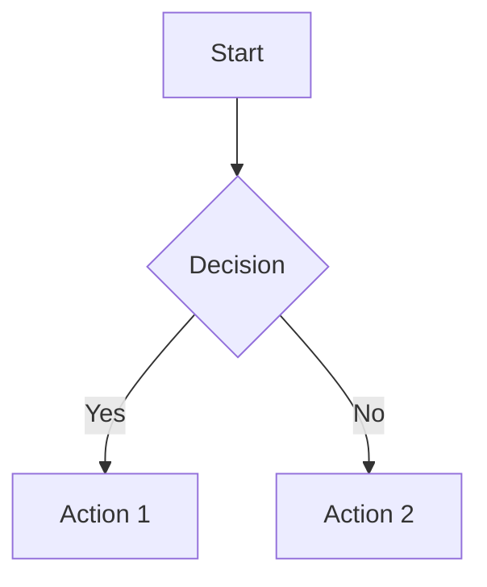

# SDD Quality Assessment Report

**Date**: 2026-01-15
**Purpose**: Evaluate existing documentation quality and identify improvements needed

---

## Executive Summary

| Quality Dimension | Score | Status | Notes |
|-------------------|-------|--------|-------|
| **Completeness** | 3/10 | ❌ Poor | Critical sections missing (SDD, diagrams, guidelines) |
| **Accuracy** | 7/10 | ⚠️ Fair | Some outdated proposals, version info scattered |
| **Maintainability** | 4/10 | ❌ Poor | No maintenance process, fragmented structure |
| **Clarity** | 6/10 | ⚠️ Fair | Mixed languages, inconsistent formatting |
| **Usability** | 5/10 | ❌ Poor | Hard to find information, no navigation |
| **Overall Quality** | **5/10** | ❌ Poor | **Significant improvements needed** |

---

## 1. Completeness Assessment

### 1.1 Essential SDD Sections

| Section | Present | Quality | Gap |
|---------|---------|---------|-----|
| Architecture Overview | ❌ No | N/A | 100% missing |
| Module Design | ⚠️ Partial | Low | 80% missing |
| State Management Architecture | ⚠️ Partial | Low | 60% missing |
| Data Model | ✅ Yes | High | 10% missing |
| Architecture Diagrams | ❌ No | N/A | 100% missing |
| Technical Decisions | ⚠️ Partial | Low | 90% missing |
| Development Guidelines | ❌ No | N/A | 100% missing |
| Constraints & Risks | ❌ No | N/A | 95% missing |

**Completeness Score**: 3/10 (30% of essential content present)

### 1.2 Feature Specification Completeness

| Feature | Spec | Data Model | Research | Plan | Tasks | Status |
|---------|------|------------|----------|------|-------|--------|
| 001-attended-weighing | ✅ | ✅ | ✅ | ✅ | ✅ | Complete |
| 001-entity-init | ✅ | ✅ | ✅ | ✅ | ✅ | Complete |
| 002-login-auth | ✅ | ✅ | ✅ | ✅ | ⚠️ | Archived (68%) |

**Feature Spec Score**: 9/10 (Well-structured feature specs)

### 1.3 Technical Report Completeness

| Report Type | Count | Avg Quality | Issues |
|-------------|-------|-------------|--------|
| Performance Analysis | 3 | 8/10 | Detailed benchmarks, actionable |
| Crash Analysis | 3 | 7/10 | Good root cause, some lack fix verification |
| Optimization Proposals | 5 | 7/10 | Well-researched but not implemented |
| Integration Guides | 2 | 6/10 | Useful but fragmented |
| Agent Reports | 3 | 6/10 | Good analysis, varying formats |

**Technical Report Score**: 7/10 (Detailed but fragmented)

---

## 2. Accuracy Assessment

### 2.1 Technology Stack Versions

**Accuracy Check** against actual `.csproj` files:

| Technology | Documented Version | Actual Version | Status |
|------------|-------------------|----------------|--------|
| .NET | ⚠️ Not centrally documented | 10.0 | ❌ Scattered |
| Avalonia UI | ⚠️ Not centrally documented | 11.3.9 | ❌ Scattered |
| Entity Framework Core | ⚠️ Not centrally documented | 10.0.1 | ❌ Scattered |
| Volo.Abp | ⚠️ Not centrally documented | 10.0.1 | ❌ Scattered |
| System.Reactive | ⚠️ Not centrally documented | 7.0.0-preview.1 | ❌ Scattered |
| ReactiveUI | ⚠️ Not centrally documented | 20.1.1 | ❌ Scattered |

**Finding**: Version information is **accurate but scattered** across multiple `.csproj` files. No single source of truth.

**Recommendation**: Create centralized tech stack section in SDD.

---

### 2.2 Module Responsibilities

**Accuracy Check**: Do documented specs match actual implementation?

| Service | Spec Description | Actual Responsibility | Match |
|---------|------------------|----------------------|-------|
| `AttendedWeighingService` | "Manages attended weighing" | Weight stability, photos, matching | ✅ Yes |
| `WeighingMatchingService` | "Matches weighing records" | Auto-match join/out records | ✅ Yes |
| `TruckScaleWeightService` | "Reads truck scale weight" | Serial port communication | ✅ Yes |
| `HikvisionService` | "Camera integration" | Hikvision SDK wrapper | ✅ Yes |
| `PlateRecognitionService` | "License plate recognition" | LPR service integration | ✅ Yes |

**Finding**: Module descriptions in specs are **accurate** but lack detail.

---

### 2.3 Outdated Content

**Identified outdated proposals**:

| Document | Proposal | Status | Issue |
|----------|----------|--------|-------|
| RxState Optimization Report | Unified state object | ❌ Not implemented | May mislead readers |
| ReaderWriterLockSlim Evaluation | Fix write lock scope | ❌ Not implemented | Critical issue persists |
| Various crash reports | Proposed fixes | ⚠️ Unknown | No verification documented |

**Finding**: Several optimization proposals are **not implemented**, creating confusion about actual code state.

**Recommendation**:
1. Mark proposals clearly as "PROPOSED - NOT IMPLEMENTED"
2. Track implementation status
3. Remove or update proposals when implemented

---

### 2.4 Data Model Accuracy

**Check**: Do documented entities match actual code?

| Entity | Documented | Actual Code | Match |
|--------|------------|-------------|-------|
| `WeighingRecord` | ✅ Documented | ✅ Exists | ✅ Yes |
| `Waybill` | ✅ Documented | ✅ Exists | ✅ Yes |
| `MaterialDefinition` | ✅ Documented | ✅ Exists | ✅ Yes |
| `MaterialUnit` | ✅ Documented | ✅ Exists | ✅ Yes |
| `Provider` | ✅ Documented | ✅ Exists | ✅ Yes |
| `AttachmentFile` | ✅ Documented | ✅ Exists | ✅ Yes |

**Finding**: Data model documentation is **highly accurate**.

---

## 3. Maintainability Assessment

### 3.1 Document Structure

**Current Structure**:
```
docs/
├── [17 technical reports - flat structure]
├── agents/
│   └── [3 agent reports]
specs/
├── 001-attended-weighing/
│   ├── spec.md
│   ├── data-model.md
│   ├── research.md
│   ├── plan.md
│   ├── quickstart.md
│   └── tasks.md
├── 001-entity-init/
└── 002-login-auth/
```

**Issues**:
- ❌ Flat structure in `docs/` - hard to find related documents
- ❌ No index or navigation
- ❌ Mixed document types (reports, proposals, guides)
- ❌ No clear organization by topic

**Score**: 3/10 (Poor structure)

**Recommendation**: Reorganize with clear hierarchy:

```
docs/
├── README.md (index)
├── SDD.md (main Software Design Document)
├── architecture/
│   ├── diagrams/
│   └── adr/ (Architecture Decision Records)
├── guides/
│   ├── rx-programming.md
│   ├── hardware-integration.md
│   └── testing.md
├── reports/
│   ├── performance/
│   ├── crashes/
│   └── optimizations/
└── specs/ (existing, keep as-is)
```

---

### 3.2 Maintenance Process

**Current State**:
| Aspect | Status | Issue |
|--------|--------|-------|
| Ownership | ❌ None assigned | No clear responsibility |
| Review Schedule | ❌ None | Documents become stale |
| Update Triggers | ❌ None | Code changes don't trigger doc updates |
| Version Control | ✅ Git tracked | Good, but no link to code changes |

**Score**: 2/10 (Minimal maintainability)

**Recommendation**:

1. **Assign Ownership**:
   - SDD: Lead architect / Tech lead
   - Feature specs: Feature owner
   - Reports: Creator + reviewer

2. **Review Schedule**:
   - SDD: Quarterly review
   - Tech stack: On version upgrade
   - Diagrams: On architecture change

3. **Update Triggers** (integrate with OpenSpec):
   - Add "Update SDD" task to architecture change workflow
   - Check documentation in code review checklist
   - Link PRs to relevant ADRs

---

### 3.3 Navigation & Findability

**Current Issues**:
- ❌ No central index
- ❌ No search (beyond git grep)
- ❌ Document names don't indicate content
- ❌ No cross-references between related docs

**Example**:
```
❌ "ReaderWriterLockSlim-Performance-Evaluation.md"
   - What service is this for?
   - Is this implemented or proposed?

✅ Better: "reports/performance/TruckScaleWeightService-Lock-Optimization-PROPOSED.md"
```

**Recommendation**:
1. Create `docs/README.md` with:
   - Document index by category
   - Quick links to key documents
   - "Where to start" guide

2. Add cross-references:
   ```markdown
   See also:
   - [TruckScaleWeightService implementation](../SDD.md#module-design)
   - [Rx programming guidelines](../guides/rx-programming.md)
   ```

3. Use consistent naming:
   - `PROPOSED` suffix for not-implemented
   - `IMPLEMENTED` suffix for completed
   - `ARCHIVED` suffix for outdated

---

## 4. Clarity Assessment

### 4.1 Language Consistency

**Current State**: Mixed English and Chinese

| Category | Language | Consistency |
|----------|----------|-------------|
| Feature specs | English | ✅ Consistent |
| Data models | English | ✅ Consistent |
| Code comments | English | ✅ Consistent |
| Technical reports | Mixed | ⚠️ Inconsistent |
| Some file names | Chinese | ❌ Inconsistent |

**Examples**:
- ✅ `AttendedWeighingService-RxState-Optimization-Report.md` (English)
- ❌ `内存溢出问题分析报告.md` (Chinese)

**Recommendation**:
- Standardize on **English** for all technical documentation
- Allow Chinese only for:
  - User-facing content (UI strings, error messages)
  - Domain-specific terms in Chinese context

---

### 4.2 Formatting Consistency

**Current State**: Inconsistent formatting

**Issues**:
- Different heading styles (`#`, `##`, `===`)
- Inconsistent table formats
- Mixed code block styles (```csharp, ```cs, indented)
- Some docs use emojis, others don't

**Recommendation**: Create markdown style guide:

```markdown
## Markdown Style Guide

### Headings
- Use ATX-style headings (#, ##, ###)
- Title case for headings
- Maximum 4 levels deep

### Code Blocks
- Use triple backticks with language
- Specify csharp, xml, bash, etc.
- Include file path in comments for long blocks

### Tables
- Use GitHub Flavored Markdown tables
- Align left for text, right for numbers
- Include header row

### Emojis
- Use sparingly in technical docs
- OK in status columns (✅ ❌ ⚠️)
- Avoid in body text
```

---

### 4.3 Diagram Quality

**Current State**: No architecture diagrams exist

**Recommendation**: Use Mermaid for all diagrams:



**Benefits**:
- Version control friendly (text-based)
- Editable in any text editor
- Renders in GitHub, VS Code, many markdown viewers

---

## 5. Usability Assessment

### 5.1 New Developer Onboarding

**Scenario**: New developer joins, needs to understand system

**Current Experience** (poor):
1. ❌ No starting point (no README in docs/)
2. ❌ Doesn't know where to look
3. ❌ Finds fragmentary reports
4. ❌ Can't find architecture overview (doesn't exist)
5. ❌ Struggles to understand Rx usage (no guidelines)

**Time to Productivity**: ~2-3 weeks (estimated)

**Ideal Experience**:
1. ✅ Start with `docs/README.md`
2. ✅ Read `docs/SDD.md` (20 min overview)
3. ✅ Review architecture diagrams
4. ✅ Read Rx programming guidelines
5. ✅ Study feature spec for assigned work

**Target Time to Productivity**: ~3-5 days

---

### 5.2 Problem-Solving Efficiency

**Scenario**: Developer encounters bug, needs to understand relevant code

**Current Experience**:
1. ⚠️ Search codebase (slow, no context)
2. ⚠️ Maybe find relevant report (if exists)
3. ❌ No documented modules to guide search
4. ❌ No sequence diagrams to show flow

**Time to Root Cause**: ~4-8 hours

**Ideal Experience**:
1. ✅ Check SDD Module Design section
2. ✅ Review relevant sequence diagram
3. ✅ Read service interface doc
4. ✅ Inspect code with context

**Target Time to Root Cause**: ~1-2 hours

---

### 5.3 AI Assistant Friendliness

**Scenario**: Using AI coding assistant (Claude, Copilot, etc.)

**Current State**:
- ✅ Feature specs are well-structured (good for context)
- ✅ Data models are clear
- ❌ No architecture overview (AI lacks big picture)
- ❌ No documented service interfaces (AI can't infer intent)
- ❌ Fragmented docs (AI can't build coherent model)

**Recommendation**: Improve AI friendliness by:
1. Creating SDD with clear module interfaces
2. Adding code comments with interface documentation
3. Structuring docs for easy parsing (markdown, headings)

---

## 6. Quality Metrics Summary

### By Document Type

| Document Type | Count | Avg Quality | Top Issues |
|---------------|-------|-------------|------------|
| SDD | 0 | N/A | Doesn't exist |
| Feature Specs | 3 | 9/10 | ✅ Excellent |
| Data Models | 3 | 9/10 | ✅ Excellent |
| Tech Reports | 17 | 7/10 | Fragmented, some outdated |
| Architecture Diagrams | 0 | N/A | Missing entirely |
| Guidelines | 0 | N/A | Missing entirely |
| ADRs | 0 | N/A | Missing entirely |

### By Quality Dimension

| Dimension | Score | Status | Priority |
|-----------|-------|--------|----------|
| Completeness | 3/10 | ❌ Poor | **HIGH** |
| Accuracy | 7/10 | ⚠️ Fair | Medium |
| Maintainability | 4/10 | ❌ Poor | **HIGH** |
| Clarity | 6/10 | ⚠️ Fair | Medium |
| Usability | 5/10 | ❌ Poor | **HIGH** |

**Overall**: 5/10 - Significant improvements needed

---

## 7. Recommendations

### 7.1 Immediate Actions (High Priority)

1. **Create SDD** (Phase 2 tasks):
   - Start with Architecture Overview
   - Document module interfaces
   - Add architecture diagrams

2. **Fix Document Structure**:
   - Create `docs/README.md` index
   - Reorganize docs into folders
   - Add cross-references

3. **Mark Proposal Status**:
   - Add "PROPOSED/IMPLEMENTED" to filenames
   - Update outdated proposals or remove them

### 7.2 Medium-Term Improvements

4. **Create Development Guidelines**:
   - Rx programming guidelines
   - Hardware integration guide
   - Testing strategy

5. **Establish Maintenance Process**:
   - Assign ownership
   - Set quarterly review schedule
   - Integrate with OpenSpec workflow

6. **Improve Findability**:
   - Central index
   - Consistent naming
   - Cross-references

### 7.3 Long-Term Improvements

7. **Create ADRs**:
   - Document 5-10 key decisions
   - Use standard ADR format
   - Link to code/docs

8. **Localization Strategy**:
   - Decide on English vs Chinese
   - Create style guide
   - Standardize language

9. **Diagrams**:
   - Create 4 core diagrams
   - Use Mermaid format
   - Keep in version control

---

## 8. Quality Improvement Roadmap

### Phase 1: Foundation (This effort)
- ✅ Task 1.1: Document inventory
- ✅ Task 1.2: Gap analysis
- ✅ Task 1.3: Quality assessment (this doc)
- ⏭️ Phase 2: Create SDD

### Phase 2: SDD Creation (2-3 days)
- Create `docs/SDD.md`
- Architecture overview section
- Module design section
- State management section
- Architecture diagrams

### Phase 3: Guidelines (1-2 days)
- Rx programming guidelines
- Hardware integration guide
- Testing strategy
- Code style guide

### Phase 4: Process (1 day)
- Documentation maintenance process
- Ownership assignment
- Review schedule
- OpenSpec integration

### Phase 5: Polish (Ongoing)
- Improve findability
- Add cross-references
- Create ADRs for key decisions
- Regular reviews

---

## 9. Success Criteria

### After SDD Creation (Phase 2)
- [ ] SDD.md exists with all major sections
- [ ] Architecture diagrams created (4 diagrams)
- [ ] All service interfaces documented
- [ ] Tech stack centrally documented

### After Guidelines (Phase 3)
- [ ] Rx programming guidelines created
- [ ] Hardware integration guide created
- [ ] Testing strategy documented
- [ ] Code style guide established

### After Process (Phase 4)
- [ ] Documentation owner assigned
- [ ] Review schedule defined
- [ ] OpenSpec workflow integrated
- [ ] Maintenance guide created

### Measurable Outcomes
- **Completeness**: 3/10 → 9/10
- **Usability**: 5/10 → 8/10
- **Maintainability**: 4/10 → 8/10
- **Onboarding Time**: 2-3 weeks → 3-5 days
- **Problem-Solving Time**: 4-8 hours → 1-2 hours

---

## Conclusion

**Current State**: Documentation exists but is **fragmented, incomplete, and hard to use**

**Key Issues**:
1. ❌ No central SDD
2. ❌ Missing architecture diagrams
3. ❌ No development guidelines
4. ❌ Poor maintainability

**Strengths**:
1. ✅ Excellent feature specs
2. ✅ Detailed technical reports
3. ✅ Accurate data models

**Path Forward**:
1. Create comprehensive SDD (Phase 2)
2. Establish guidelines (Phase 3)
3. Implement maintenance process (Phase 4)

**Expected Improvement**: Overall quality from 5/10 → 8/10

---

**Assessment completed**: 2026-01-15
**Assessor**: Claude (AI Assistant)
**Status**: Ready for Phase 2 - SDD Creation
