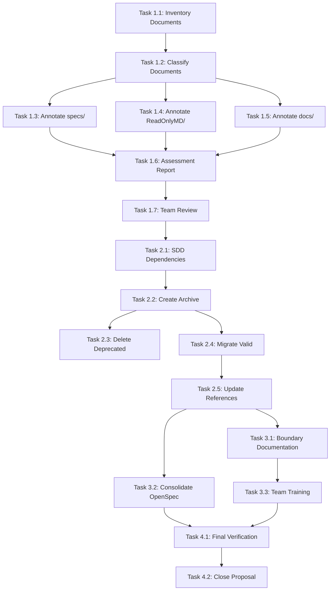

# Tasks: MD Milestone Document Organization

**Change ID:** `md-milestone-document-organization`
**Total Tasks**: 15
**Estimated Duration**: 3-4 days

---

## Task Overview

This task list implements the three-phase documentation reorganization plan for MaterialClient project.

---

## Phase 1: Document Validity Assessment (7 tasks)

### Task 1.1: Inventory Legacy Documents

**Status**: Pending
**Priority**: High
**Estimated**: 2-3 hours

**Description**:
Create comprehensive inventory of all Markdown documents in legacy directories.

**Steps**:
1. Scan `specs/` directory for all `.md` files
2. Scan `ReadOnlyMD/` directory for all `.md` files
3. Scan `docs/` directory for all `.md` files
4. For each file, record:
   - File path
   - File size
   - Creation timestamp
   - Last modified timestamp
   - Document type (spec, analysis, report, etc.)
5. Generate inventory report: `document-inventory-[timestamp].csv`

**Validation**:
- [ ] Inventory report created with all legacy documents listed
- [ ] File count matches: `find specs ReadOnlyMD docs -type f -name "*.md" | wc -l`

**Output**: `document-inventory-[timestamp].csv`

---

### Task 1.2: Classify Documents by Type

**Status**: Pending
**Priority**: High
**Estimated**: 1-2 hours

**Description**:
Analyze and categorize each document from inventory by type and purpose.

**Categories**:
- **Technical Analysis**: Architecture, design analysis, state machine documentation
- **Implementation Report**: Bug fixes, feature implementation reports
- **Agent Report**: AI-generated analysis and optimization reports
- **Specification**: Legacy functional specifications
- **Quick Start/Setup**: Installation and configuration guides
- **Research**: Investigation and proof-of-concept documents
- **Other**: Uncategorized documents

**Steps**:
1. Review each document from inventory
2. Assign primary and secondary categories
3. Update inventory with classification
4. Generate summary statistics by category

**Validation**:
- [ ] All documents classified
- [ ] Category distribution documented

**Output**: Updated inventory with category column

---

### Task 1.3: Annotate `specs/` Directory Documents

**Status**: Pending
**Priority**: Medium
**Estimated**: 2-3 hours

**Description**:
Add validity metadata annotations to all documents in `specs/` directory.

**Steps**:
1. For each `.md` file in `specs/`, add metadata header:
```markdown
<!--
DOCUMENT_STATUS: [VALID/DEPRECATED/SUPERSEDED/ARCHIVED]
LAST_REVIEWED: [YYYY-MM-DD]
REVIEWER: [Reviewer Name]
NOTES: [Brief status explanation]
-->
```
2. Assess document status based on:
   - Relevance to current codebase
   - Accuracy of technical content
   - Overlap with OpenSpec specifications
3. Prioritize commonly referenced specs (e.g., `001-attended-weighing`, `002-login-auth`)

**Status Guidelines**:
- Mark **SUPERSEDED** if OpenSpec has equivalent spec
- Mark **VALID** if contains unique historical context still relevant
- Mark **DEPRECATED** if technically inaccurate or obsolete
- Mark **ARCHIVED** if pure historical record

**Validation**:
- [ ] All `specs/` files annotated
- [ ] Status justification documented in NOTES field

**Output**: Annotated files in `specs/` directory

---

### Task 1.4: Annotate `ReadOnlyMD/` Directory Documents

**Status**: Pending
**Priority**: Medium
**Estimated**: 1-2 hours

**Description**:
Add validity metadata annotations to all documents in `ReadOnlyMD/` directory.

**Focus Areas**:
- State machine design documents (e.g., `AttendedWeighingStatus状态机设计补充报告.md`)
- Technical analysis reports (e.g., `Avalonia ComboBox绑定问题分析报告.md`)
- Implementation notes and workarounds

**Steps**:
1. Review each document for current relevance
2. Determine if issues are resolved or still applicable
3. Add metadata annotation with appropriate status
4. Cross-reference with OpenSpec changes for resolved issues

**Status Guidelines**:
- Mark **ARCHIVED** if describing resolved bugs or implemented features
- Mark **VALID** if documenting ongoing workarounds or pending issues
- Mark **SUPERSEDED** if newer analysis exists in OpenSpec

**Validation**:
- [ ] All `ReadOnlyMD/` files annotated
- [ ] Issue resolution status verified

**Output**: Annotated files in `ReadOnlyMD/` directory

---

### Task 1.5: Annotate `docs/` Directory Documents

**Status**: Pending
**Priority**: Medium
**Estimated**: 1-2 hours

**Description**:
Add validity metadata annotations to all documents in `docs/` directory.

**Focus Areas**:
- Agent-generated reports (e.g., `AttendedWeighingService-RxState-Optimization-Report.md`)
- Crash analysis reports (e.g., `HikvisionOpenStream-Crash-Analysis-Report.md`)
- Modern documentation and guides

**Steps**:
1. Assess each report's relevance to current codebase
2. Check if recommendations have been implemented
3. Verify crash issues are resolved
4. Add metadata annotation with status

**Status Guidelines**:
- Mark **ARCHIVED** if all recommendations implemented
- Mark **VALID** if pending action items or ongoing reference
- Mark **SUPERSEDED** if replaced by newer OpenSpec change proposal

**Validation**:
- [ ] All `docs/` files annotated
- [ ] Implementation status of recommendations verified

**Output**: Annotated files in `docs/` directory

---

### Task 1.6: Generate Validity Assessment Report

**Status**: Pending
**Priority**: High
**Estimated**: 1 hour

**Description**:
Create comprehensive report summarizing document validity assessment.

**Report Contents**:
1. **Executive Summary**:
   - Total documents reviewed
   - Distribution by status (VALID/DEPRECATED/SUPERSEDED/ARCHIVED)
   - Distribution by category
   - Storage space analysis

2. **Detailed Statistics**:
   - Documents by directory and status
   - File size by status category
   - Last modified date distribution

3. **Recommendations**:
   - Files recommended for deletion
   - Files recommended for archival
   - Files recommended for migration to OpenSpec

**Steps**:
1. Aggregate data from annotated documents
2. Calculate statistics and generate charts
3. Compile recommendations
4. Save report as `openspec/changes/md-milestone-document-organization/validity-assessment-report.md`

**Validation**:
- [ ] Report generated with all required sections
- [ ] Statistics match annotated document data
- [ ] Recommendations clearly articulated

**Output**: `validity-assessment-report.md`

---

### Task 1.7: Team Review and Status Finalization

**Status**: Pending
**Priority**: High
**Estimated**: 4-6 hours

**Description**:
Conduct team review to validate document status annotations.

**Steps**:
1. Share validity assessment report with team
2. Schedule review session with key stakeholders
3. Collect feedback on document statuses
4. Update annotations based on team consensus
5. Finalize status decisions

**Key Stakeholders**:
- Tech Lead: Validate technical accuracy
- Senior Developers: Confirm implementation status
- Product Owner: Validate business relevance

**Validation**:
- [ ] Team review session completed
- [ ] Feedback incorporated into annotations
- [ ] Status decisions finalized

**Output**: Finalized document status annotations

---

## Phase 2: Compression and Cleanup (5 tasks)

### Task 2.1: Analyze SDD Dependencies

**Status**: Pending
**Priority**: Critical
**Estimated**: 2-3 hours

**Description**:
Evaluate whether System Design Document (SDD) or current systems depend on legacy documents.

**Steps**:
1. Search codebase for document references:
   ```bash
   grep -r "specs/" --include="*.cs" --include="*.csproj" --include="*.md"
   grep -r "ReadOnlyMD/" --include="*.cs" --include="*.csproj" --include="*.md"
   grep -r "docs/" --include="*.cs" --include="*.csproj" --include="*.md"
   ```
2. Check build scripts and CI/CD pipelines for document dependencies
3. Review code comments referencing documentation paths
4. Interview team members about implicit dependencies

**Validation**:
- [ ] All explicit references documented
- [ ] Implicit dependencies identified
- [ ] Dependency analysis report created

**Output**: `dependency-analysis-report.md`

---

### Task 2.2: Create Archive Package

**Status**: Pending
**Priority**: High
**Estimated**: 1-2 hours

**Description**:
Package documents marked as ARCHIVED or DEPRECATED into timestamped archive.

**Archive Strategy**:
1. Create `archive/` directory at project root
2. Create archive package: `archive/legacy-docs-20260115.zip`
3. Include all documents marked:
   - **ARCHIVED**: Historical records
   - **DEPRECATED**: Outdated documents with no current value
4. Generate manifest file inside archive:
   ```markdown
   # Legacy Documents Archive Manifest
   **Archive Date**: 2026-01-15
   **Reason**: OpenSpec workflow transition
   **Contents**: List of all included files with original paths and status
   ```

**Steps**:
1. Create archive directory structure
2. Copy ARCHIVED and DEPRECATED documents preserving paths
3. Generate manifest
4. Create ZIP archive
5. Verify archive integrity

**Validation**:
- [ ] Archive created without errors
- [ ] All ARCHIVED/DEPRECATED files included
- [ ] Manifest accurate and complete
- [ ] Archive can be successfully extracted

**Output**: `archive/legacy-docs-20260115.zip`

---

### Task 2.3: Delete Deprecated Documents

**Status**: Pending
**Priority**: High
**Estimated**: 1 hour

**Description**:
Remove documents from source directories after archive creation.

**Prerequisites**:
- Task 2.1 completed (no dependencies found)
- Task 2.2 completed (archive created successfully)

**Steps**:
1. Verify archive integrity
2. Remove DEPRECATED documents from `specs/`, `ReadOnlyMD/`, `docs/`
3. Remove ARCHIVED documents from source directories
4. Verify no broken references remain

**Safety Precautions**:
- Create git commit before deletion for easy rollback
- Confirm archive is accessible and intact
- Document deleted files in git commit message

**Validation**:
- [ ] Archive verified before deletion
- [ ] Only DEPRECATED and ARCHIVED files deleted
- [ ] No broken file references in codebase
- [ ] Git commit created for traceability

**Output**: Cleaned source directories, git commit

---

### Task 2.4: Migrate Valid Documents to OpenSpec

**Status**: Pending
**Priority**: Medium
**Estimated**: 2-3 hours

**Description**:
Integrate documents marked VALID or SUPERSEDED into OpenSpec structure.

**Migration Strategy**:
1. **SUPERSEDED Documents**:
   - Move to `openspec/archive/legacy/`
   - Add reference to new OpenSpec document
   - Create redirect stub in original location

2. **VALID Documents**:
   - Evaluate if should become formal OpenSpec spec or change proposal
   - Convert to OpenSpec format if appropriate
   - Update references in codebase

**Steps**:
1. Identify documents requiring migration
2. For SUPERSEDED: create redirect stubs pointing to new OpenSpec docs
3. For VALID: determine appropriate OpenSpec location
4. Convert format if needed (add metadata, standardize structure)
5. Update any code references
6. Test that migrated documents are accessible

**Validation**:
- [ ] All VALID/SUPERSEDED documents migrated
- [ ] Redirect stubs created where needed
- [ References updated in code
- [ ] Documents accessible in new locations

**Output**: Migrated documents in OpenSpec structure

---

### Task 2.5: Update Documentation References

**Status**: Pending
**Priority**: Medium
**Estimated**: 1-2 hours

**Description**:
Update all references to legacy documentation paths throughout the codebase.

**Steps**:
1. Search for references to `specs/`, `ReadOnlyMD/`, `docs/` in:
   - README files
   - Code comments
   - Wiki/Confluence pages
   - Build scripts
   - Configuration files
2. Update references to new OpenSpec paths
3. Add deprecation notices for moved documents
4. Document reference changes in migration log

**Validation**:
- [ ] All references updated
- [ ] No broken documentation links remain
- [ ] Migration log created

**Output**: Updated documentation references, migration log

---

## Phase 3: Boundary Definition (3 tasks)

### Task 3.1: Create Boundary Documentation

**Status**: Pending
**Priority**: High
**Estimated**: 2 hours

**Description**:
Document clear "Past-Present" boundaries for team reference.

**Document Structure**:
```markdown
# Documentation Boundary Guidelines

## Temporal Boundary
- **Cutoff Date**: 2026-01-15
- **Definition**: OpenSpec workflow adoption date
- **Legacy**: All documents before this date
- **Current**: All OpenSpec documents after this date

## Process Boundary
- **Old Process**: [Description]
- **New Process**: [Description]

## Directory Boundary
- **Legacy Locations**: specs/, ReadOnlyMD/, docs/
- **Current Locations**: openspec/specs/, openspec/changes/, openspec/archive/

## Maintenance Boundary
- **Legacy**: Archive only, no updates
- **Current**: Active maintenance

## Decision Tree
[Flowchart for determining where to store new documentation]
```

**Steps**:
1. Draft boundary documentation
2. Include visual decision tree
3. Add examples of common scenarios
4. Review with tech lead
5. Publish to team wiki or openspec/docs/

**Validation**:
- [ ] Boundary documentation created
- [ ] All four boundary types clearly defined
- [ ] Decision tree included
- [ ] Examples provided
- [ ] Team approved

**Output**: `openspec/docs/documentation-boundary-guidelines.md`

---

### Task 3.2: Consolidate OpenSpec Directory Structure

**Status**: Pending
**Priority**: Medium
**Estimated**: 1-2 hours

**Description**:
Ensure OpenSpec directory structure is clean and consistent after migration.

**Target Structure**:
```
openspec/
├── specs/           # Current capability specifications
├── changes/         # Active and completed change proposals
│   ├── md-milestone-document-organization/
│   └── archive/     # Completed changes
├── archive/         # Archived legacy documents
│   └── legacy/      # Migrated valid legacy docs
├── docs/            # OpenSpec process documentation
│   └── documentation-boundary-guidelines.md
├── AGENTS.md        # Agent guidelines
├── project.md       # Project overview
└── PROPOSAL_DESIGN_GUIDELINES.md
```

**Steps**:
1. Verify all directories in target structure exist
2. Remove any empty directories from legacy locations
3. Ensure consistent naming conventions
4. Update `.gitignore` if needed
5. Create README in key directories explaining purpose

**Validation**:
- [ ] Target structure matches specification
- [ ] No empty legacy directories remain
- [ ] README files created where appropriate
- [ ] Git repository clean

**Output**: Consolidated OpenSpec directory structure

---

### Task 3.3: Team Training and Communication

**Status**: Pending
**Priority**: High
**Estimated**: 2-3 hours

**Description**:
Communicate changes to team and provide training on new documentation workflow.

**Communication Plan**:
1. **Announcement Email**:
   - Overview of documentation reorganization
   - Timeline and impact
   - Links to boundary guidelines

2. **Team Training Session** (30-45 minutes):
   - OpenSpec workflow refresher
   - New documentation boundaries
   - How to create new specs/proposals
   - Q&A session

3. **Quick Reference Card**:
   - One-page guide on where to store documents
   - Decision tree flowchart
   - Key contact person for questions

**Steps**:
1. Draft announcement email
2. Prepare training materials
3. Schedule training session
4. Create quick reference card
5. Send announcement
6. Conduct training
7. Collect feedback

**Validation**:
- [ ] Announcement email sent
- [ ] Training session completed
- [ ] Quick reference card distributed
- [ ] Team questions answered
- [ ] Feedback documented

**Output**: Trained team, communication materials

---

## Completion Tasks (2 tasks)

### Task 4.1: Final Verification

**Status**: Pending
**Priority**: Critical
**Estimated**: 1-2 hours

**Description**:
Comprehensive verification that all tasks completed successfully.

**Verification Checklist**:
1. **Document Inventory**:
   - [ ] All legacy documents accounted for
   - [ ] All documents annotated with status
   - [ ] Status decisions finalized

2. **Archive and Cleanup**:
   - [ ] Archive package created and verified
   - [ ] Deprecated documents removed
   - [ ] Valid documents migrated to OpenSpec
   - [ ] No broken references remain

3. **OpenSpec Structure**:
   - [ ] Directory structure clean and consistent
   - [ ] All migrated documents accessible
   - [ ] README files in place

4. **Documentation**:
   - [ ] Boundary guidelines published
   - [ ] Migration log complete
   - [ ] Team communication completed

**Steps**:
1. Run verification checklist
2. Fix any issues found
3. Generate final verification report
4. Obtain sign-off from tech lead

**Validation**:
- [ ] All checklist items pass
- [ ] Verification report created
- [ ] Tech lead sign-off obtained

**Output**: `final-verification-report.md`

---

### Task 4.2: Close Change Proposal

**Status**: Pending
**Priority**: High
**Estimated**: 1 hour

**Description**:
Finalize change proposal and archive to completed changes.

**Steps**:
1. Update proposal status to "Completed"
2. Add completion date and summary
3. Move to `openspec/changes/archive/`
4. Create index entry in `openspec/changes/ARCHIVED_CHANGES.md`
5. Celebrate milestone completion!

**Validation**:
- [ ] Proposal updated with completion status
- [ ] Moved to archive directory
- [ ] Index updated
- [ ] No loose ends remaining

**Output**: Archived change proposal, updated index

---

## Task Dependencies



---

## Progress Tracking

**Phase 1 Progress**: 0/7 tasks completed
**Phase 2 Progress**: 0/5 tasks completed
**Phase 3 Progress**: 0/3 tasks completed
**Completion Progress**: 0/2 tasks completed

**Overall Progress**: 0/15 tasks (0%)

---

## Notes

- Tasks can be executed in parallel within each phase where no dependency exists
- Team review (Task 1.7) is critical gate between Phase 1 and Phase 2
- Archive creation (Task 2.2) must be verified before any deletion (Task 2.3)
- Team training (Task 3.3) should occur after all technical work is complete
- Buffer time included in estimates for review and feedback iterations
