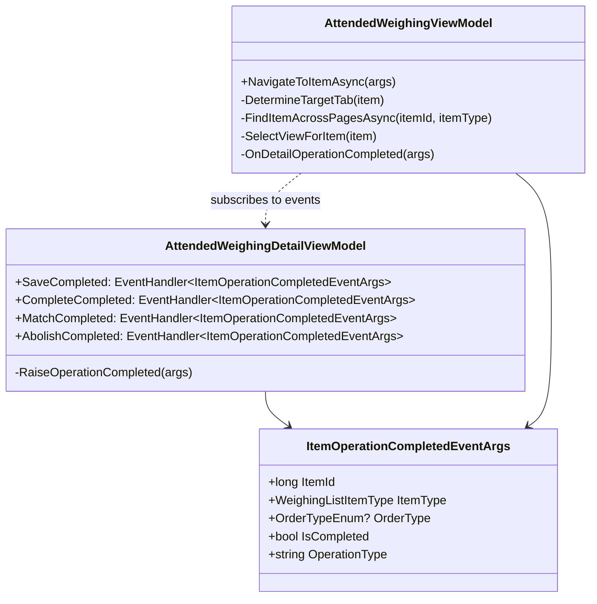
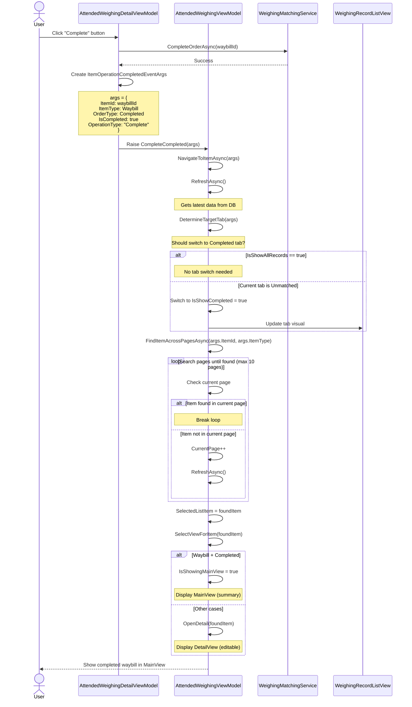
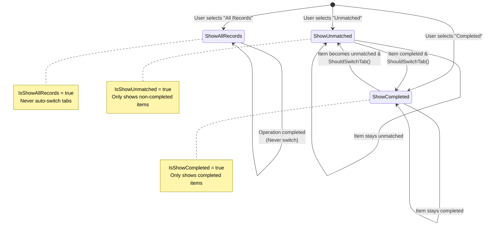

# Design: Refactor Weighing Item Navigation and Tracking

## Context

The attended weighing system (`AttendedWeighingWindow`) allows operators to manage weighing records and waybills through a three-column layout:
1. **Left**: `WeighingRecordListView` - Paginated list with tabs (All/Unmatched/Completed)
2. **Middle**: Dynamic view switching between `AttendedWeighingMainView` (summary) and `AttendedWeighingDetailView` (editing)
3. **Right**: Photo capture and camera preview

When operators perform actions (Save, Complete, Match, Abolish) in `AttendedWeighingDetailView`, the system needs to:
- Track the resulting item (which may have changed ID or type)
- Navigate to the correct tab if the item moved between states
- Find the item even if it's on a different page
- Display the appropriate view (MainView for completed waybills, DetailView for editable items)

**Current problem**: Event handlers lack context and navigation logic is scattered across multiple methods with inconsistent behavior.

## Goals / Non-Goals

### Goals
- Unified navigation logic for all post-operation scenarios
- Reliable item tracking across tabs and pagination
- Intelligent tab switching that respects user context (IsShowAllRecords)
- Automatic view selection based on item state
- Maintain existing event-driven architecture

### Non-Goals
- Change the UI layout or visual design
- Modify the underlying data model (WeighingListItemDto)
- Add new features beyond navigation improvements
- Change the pagination mechanism itself

## Decisions

### Decision 1: Enhanced Event Arguments

**Choice**: Create rich event argument class with complete operation context

**Rationale**:
- Current `EventArgs.Empty` provides no context about what happened
- Event handlers need to know: which item, what operation, what's the new state
- Allows single unified navigation method instead of operation-specific logic

**Alternatives considered**:
- Keep separate event types per operation → Rejected: Would duplicate navigation logic
- Pass only ItemId → Rejected: Handler would need to re-query for type/state

**Implementation**:
```csharp
public class ItemOperationCompletedEventArgs : EventArgs
{
    public long ItemId { get; init; }
    public WeighingListItemType ItemType { get; init; }
    public OrderTypeEnum? OrderType { get; init; }
    public bool IsCompleted { get; init; }
    public string OperationType { get; init; } // "Save", "Complete", "Match", "Abolish"
}
```

### Decision 2: Unified Navigation Method

**Choice**: Centralize all post-operation navigation in `NavigateToItemAsync`

**Rationale**:
- Current scattered logic leads to inconsistent behavior
- Single method ensures all operations follow same rules
- Easier to test and maintain
- Enables consistent tab switching and pagination behavior

**Flow**:
```
NavigateToItemAsync(args)
  ↓
RefreshAsync() - Get latest data
  ↓
DetermineTargetTab(item) - Should we switch tabs?
  ↓
Switch tab if needed
  ↓
FindItemAcrossPagesAsync() - Navigate to correct page
  ↓
SelectItem() - Update SelectedListItem
  ↓
SelectView() - Show MainView or DetailView
```

**Alternatives considered**:
- Keep operation-specific methods → Rejected: Duplication and inconsistency
- Use navigation service → Rejected: Overkill for this scope, adds complexity

### Decision 3: Tab Switching Rules

**Choice**: Respect `IsShowAllRecords` flag, switch only when necessary

**Rules**:
1. If `IsShowAllRecords == true`: **Never switch tabs** (all items visible)
2. If item moves to completed state and `IsShowUnmatched == true`: Switch to `IsShowCompleted`
3. If item moves to unmatched state and `IsShowCompleted == true`: Switch to `IsShowUnmatched`
4. Otherwise: Stay on current tab

**Rationale**:
- User's tab selection indicates their working context
- "All Records" explicitly means "show me everything" - don't interrupt
- Only switch when current tab cannot show the target item
- Minimizes unexpected navigation that disorients users

**Implementation**:
```csharp
private bool ShouldSwitchTab(WeighingListItemDto targetItem)
{
    if (IsShowAllRecords) return false;
    
    bool itemIsCompleted = targetItem.OrderType == OrderTypeEnum.Completed;
    bool currentTabCanShowItem = 
        (IsShowCompleted && itemIsCompleted) ||
        (IsShowUnmatched && !itemIsCompleted);
        
    return !currentTabCanShowItem;
}
```

### Decision 4: Pagination Navigation Strategy

**Choice**: "Refresh and Search" approach with progressive page scanning

**Rationale**:
- Simple and reliable: refresh gets latest data, then search
- Works with existing pagination infrastructure
- Handles edge cases (item deleted, moved to different tab)

**Algorithm**:
1. Refresh current data
2. Search in current page first (fast path)
3. If not found, check if we need to switch tabs
4. After tab switch, search across pages (start from page 1, limit to ±10 pages)
5. If still not found, fall back to "select first item" behavior

**Alternatives considered**:
- Calculate page number from timestamp → Rejected: Unreliable with filtering/sorting
- Load all pages into memory → Rejected: Performance issue with many records
- Server-side search → Rejected: Would require backend changes (out of scope)

**Performance**: O(1) for same-page, O(n) for cross-page (acceptable with page limit)

### Decision 5: View Selection Logic

**Choice**: Use ItemType + OrderType to determine MainView vs DetailView

**Rules**:
- `Waybill` + `OrderType.Completed` → **MainView** (read-only summary)
- Everything else → **DetailView** (editable form)

**Rationale**:
- Completed waybills are read-only, MainView is optimized for viewing
- Unmatched records and first-weight waybills need editing, use DetailView
- Matches existing UI design intent (MainView shows large photo grid)

**User requirement alignment**:
- After CompleteAsync: Item becomes Waybill+Completed → MainView ✓
- After Save/Match: Item remains editable → DetailView ✓
- After Abolish: Next item selected → DetailView (most items) ✓

## Technical Design

### Class Diagram



### Sequence Diagram: CompleteAsync Flow



### State Machine: Tab Navigation



## Risks / Trade-offs

### Risk 1: Pagination search performance
**Risk**: Searching across many pages could be slow
**Likelihood**: Low (typical use has <100 records)
**Mitigation**: 
- Limit search to ±10 pages from current page
- Start from page 1 for predictable behavior
- Fall back gracefully if not found

### Risk 2: Race conditions in async navigation
**Risk**: Multiple operations triggered quickly could interfere
**Likelihood**: Medium (user clicking buttons rapidly)
**Mitigation**:
- Use proper async/await patterns
- Ensure RefreshAsync completes before searching
- Event handlers are sequential (ReactiveUI MessageBus guarantees)

### Risk 3: Breaking existing workflows
**Risk**: Users accustomed to current (buggy) behavior
**Likelihood**: Low (current behavior is clearly broken)
**Mitigation**:
- Comprehensive testing of all operation paths
- Verify all event handlers still work
- User acceptance testing before deployment

### Trade-off: Automatic vs Manual Navigation
**Choice**: Automatic navigation to target item
**Pro**: Better UX, less manual searching
**Con**: Could surprise users who want to stay on different item
**Justification**: Current behavior is random (stays on wrong item), automatic is more predictable

## Migration Plan

No migration needed. This is a code refactoring that improves behavior without changing data models or APIs.

### Deployment
1. Deploy updated ViewModels and event classes
2. No database changes required
3. No configuration changes required
4. Users see improved behavior immediately

### Rollback
Simply revert the code changes. No data corruption risk since this only affects UI navigation.

## Open Questions

None - user requirements were clarified through interactive questions.
