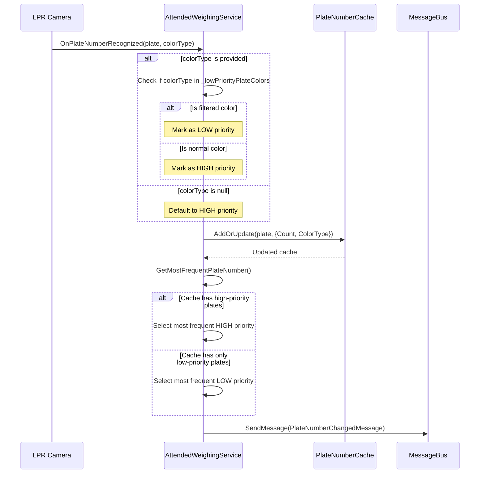

# Design: Plate Color Priority System

## Context

The current implementation filters out certain plate colors entirely, which means they cannot be used even when they are the only plates detected. This causes operational issues when vehicles with filtered-color plates (e.g., yellow plates for trucks) need to be weighed but no other plates are available.

## Goals / Non-Goals

**Goals:**
- Allow low-priority color plates to be used as fallback when no other plates are available
- Prevent low-priority plates from overriding normal plates
- Rename variables and configuration to reflect priority-based semantics
- Preserve existing caching and frequency-counting behavior

**Non-Goals:**
- Changing the configuration format (still use array of color type values)
- Implementing complex priority levels (only two priorities: normal and low)
- Modifying the plate number recommendation system
- Maintaining backward compatibility with old configuration key name

## Decisions

### Decision 1: Two-Tier Priority System

**Decision:** Implement exactly two priority tiers (high and low) rather than a flexible priority system.

**Rationale:**
- Current requirement only needs "normal" vs "filtered" distinction
- Simple boolean logic is easier to understand and maintain
- Performance-efficient (no complex sorting or priority comparisons)

**Alternatives considered:**
- Multi-level priority system (0-10 scale): Adds unnecessary complexity for current needs
- Weighted scoring system: Over-engineering for binary decision

### Decision 2: Rename Variables to Reflect Priority Semantics

**Decision:** Rename `_filteredPlateColors` to `_lowPriorityPlateColors` and `FilteredPlateColors` (config) to `LowPriorityPlateColors`.

**Rationale:**
- "Filtered" implies rejection, but new behavior is priority-based
- "LowPriority" accurately describes the new semantics
- Improves code readability and maintainability
- Makes intent clear to future developers

**Alternatives considered:**
- Keep `FilteredPlateColors` name: Misleading, suggests rejection not priority
- Use `FallbackPlateColors`: Less clear than "LowPriority"
- Use `SecondaryPlateColors`: Ambiguous hierarchy

**Breaking Change:**
- This is a **BREAKING** configuration change
- Existing deployments must update configuration files
- No automatic migration (rename required)

### Decision 3: Store Color Information in Cache

**Decision:** Add `ColorType` property to `PlateNumberCacheRecord` to store the color of each cached plate.

**Rationale:**
- Enables priority determination without external lookups
- Minimal memory overhead (1 nullable enum per cache entry)
- Color information is already available at caching time
- Allows future features (e.g., color-based analytics)

**Alternatives considered:**
- Store priority boolean only: Loses color information, harder to debug
- Lookup color from external service: Performance overhead, unreliable
- Separate dictionary for colors: Memory overhead, cache coherence issues

### Decision 4: Priority Selection Algorithm

**Decision:** When selecting most frequent plate, partition cache into high-priority and low-priority sets, then select from high-priority only if non-empty.

**Algorithm:**
```csharp
var highPriorityPlates = _plateNumberCache
    .Where(kvp => !kvp.Value.IsLowPriority)
    .ToList();

if (highPriorityPlates.Any())
{
    return highPriorityPlates
        .OrderByDescending(kvp => kvp.Value.Count)
        .First().Key;
}
else
{
    return _plateNumberCache
        .OrderByDescending(kvp => kvp.Value.Count)
        .First().Key;
}
```

**Rationale:**
- Clear separation of priorities
- Most frequent high-priority always wins, regardless of low-priority counts
- Low-priority can have 100 recognitions, but 1 high-priority recognition takes precedence

**Alternatives considered:**
- Weighted scoring: High-priority count × 10, low-priority × 1 → More complex, harder to reason about
- Minimum threshold before considering low-priority → Adds configuration complexity

### Decision 5: No Backward Compatibility for Configuration

**Decision:** Do NOT support old `FilteredPlateColors` configuration key - require migration to `LowPriorityPlateColors`.

**Rationale:**
- Clean break from old semantics (rejection → priority)
- Simpler code without compatibility layer
- Forces explicit acknowledgment of behavior change
- Configuration changes are rare (deployment-time only)

**Migration:**
- Deployments must update configuration files manually
- Add migration note to release documentation
- Consider adding startup warning if old key is detected (but not used)

**Alternative considered:**
- Support both keys with fallback: Added complexity, delays migration, confusing semantics

## Technical Design

### Data Structure Changes

**Before:**
```csharp
public record PlateNumberCacheRecord
{
    public int Count { get; init; }
    public DateTime LastUpdateTime { get; init; }
}
```

**After:**
```csharp
public record PlateNumberCacheRecord
{
    public int Count { get; init; }
    public DateTime LastUpdateTime { get; init; }
    public LprAllInOneColorType? ColorType { get; init; }
    
    public bool IsLowPriority => ColorType.HasValue && 
        /* check against _filteredPlateColors */;
}
```

**Issue:** `IsLowPriority` cannot be a simple property because it needs access to `_lowPriorityPlateColors`.

**Solution:** Keep `ColorType` as stored property, compute priority at selection time in `GetMostFrequentPlateNumber()`.

### Caching Flow Changes



### Edge Cases

1. **Mixed cache (high + low priority):**
   - Behavior: Always select from high-priority set
   - Example: Cache has ["京A12345" (high, count=1), "京B99999" (low, count=10)]
   - Result: Returns "京A12345" (high-priority wins despite lower count)

2. **All plates are low priority:**
   - Behavior: Select most frequent low-priority plate
   - Example: Cache has only yellow plates (all low-priority)
   - Result: Returns most frequent yellow plate

3. **Color information missing:**
   - Behavior: Treat as high-priority (conservative default)
   - Example: Old code calls `OnPlateNumberRecognized("京A12345", null)`
   - Result: "京A12345" is treated as high-priority

4. **Low-priority plate arrives first, then high-priority:**
   - Behavior: High-priority immediately takes precedence
   - Example: ["京B99999" (low, count=5)] then "京A12345" (high, count=1) arrives
   - Result: Switches to "京A12345" immediately

5. **Cache cleared during operation:**
   - Behavior: Existing behavior unchanged (cache clears on status transition)
   - Priority logic only affects selection, not clearing

## Risks / Trade-offs

### Risk: Performance Impact
- **Risk:** Filtering cache twice (high-priority then low-priority) may slow down selection
- **Mitigation:** Cache size is typically < 10 entries, LINQ operations are negligible
- **Measurement:** Add benchmark test for 100-entry cache (worst case)

### Risk: Breaking Configuration Change
- **Risk:** Renaming configuration key breaks existing deployments
- **Mitigation:** 
  - Document migration clearly in release notes
  - Consider adding startup warning if old key is detected
  - Configuration changes are rare (deployment-time only)
- **Acceptance:** Breaking change is justified for semantic clarity

### Trade-off: Complexity vs Flexibility
- **Trade-off:** Two-tier system is simple but inflexible for future needs
- **Acceptance:** Current requirements only need binary priority, can refactor if needed

### Trade-off: Memory Overhead
- **Trade-off:** Adding `ColorType` to each cache record increases memory by ~4 bytes per entry
- **Acceptance:** Typical cache has 1-5 entries, total overhead < 50 bytes

## Migration Plan

**Configuration Migration Required:**

**Step 1: Update Configuration Files**
```json
// OLD (before migration)
{
  "FilteredPlateColors": [2, 3]  // Yellow, Green
}

// NEW (after migration)
{
  "LowPriorityPlateColors": [2, 3]  // Yellow, Green
}
```

**Step 2: Deployment Sequence**
1. Update configuration files (rename `FilteredPlateColors` → `LowPriorityPlateColors`)
2. Deploy code update
3. Restart application (long-running service)
4. Monitor logs for "low-priority plate selected" messages

**Step 3: Verification**
- Check startup logs confirm configuration loaded correctly
- Test with low-priority plate colors to verify fallback behavior
- Verify high-priority plates take precedence

**Rollback:**
- Revert code changes
- Revert configuration files (rename back to `FilteredPlateColors`)
- Restart application
- No data cleanup needed (cache is in-memory)

**Important:** Configuration MUST be updated before deploying new code, otherwise the setting will not be loaded.

## Open Questions

None - requirements are clear from user request.
