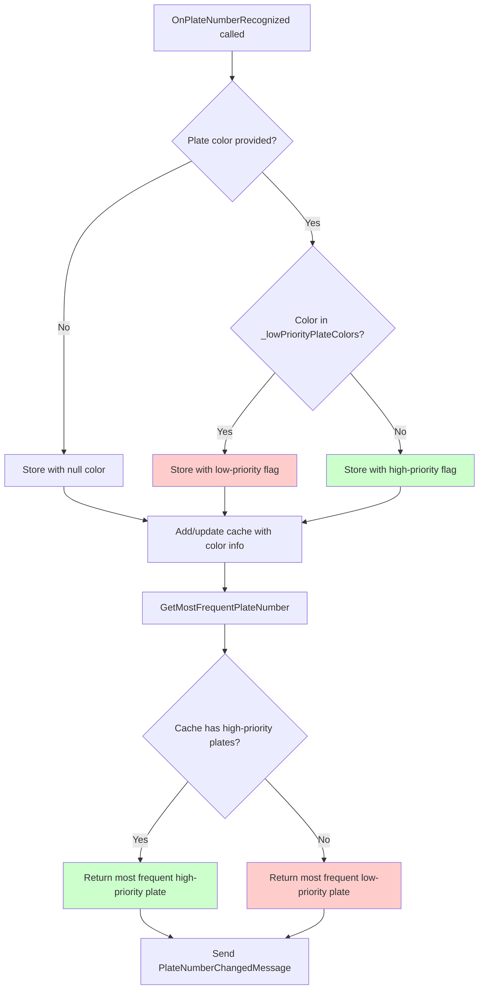

# Change: Update Plate Color Filtering to Priority-Based Matching

## Why

The current plate color filtering implementation immediately rejects plates with certain colors (configured in `_filteredPlateColors`), preventing them from being used entirely. However, in practice, these filtered plates should still be usable as a "fallback" when no higher-priority plates are available. This causes legitimate weighing operations to fail when only filtered-color plates are detected.

## What Changes

- Change plate color filtering from **rejection-based** (immediate discard) to **priority-based** (lowest priority)
- **Rename variables** to better reflect priority-based semantics:
  - `_filteredPlateColors` → `_lowPriorityPlateColors`
  - Configuration key `FilteredPlateColors` → `LowPriorityPlateColors`
- Add color information to `PlateNumberCacheRecord` to track the color of each cached plate
- Modify `GetMostFrequentPlateNumber()` logic to implement priority-based selection:
  - Plates NOT in `_lowPriorityPlateColors` are **high-priority**
  - Plates in `_lowPriorityPlateColors` are **low-priority** (can only be selected when cache contains no high-priority plates)
  - Low-priority plates cannot override existing high-priority plates
- Update `OnPlateNumberRecognized()` to store color information alongside plate numbers

## Code Flow Changes

**Priority Selection Logic:**
1. **High-Priority Plates** (green path): Plates whose color is NOT in `_lowPriorityPlateColors`
2. **Low-Priority Plates** (red path): Plates whose color IS in `_lowPriorityPlateColors`
3. Selection algorithm:
   - If cache contains any high-priority plates → select most frequent high-priority plate
   - If cache contains ONLY low-priority plates → select most frequent low-priority plate
   - Low-priority plates cannot "replace" high-priority plates once cached

## Impact

- **Affected specs**: `attended-weighing`
- **Affected code**: 
  - `MaterialClient.Common/Services/AttendedWeighingService.cs` (lines 29-40, 164, 198-212, 396-447, 452-461)
  - `PlateNumberCacheRecord` structure (add `ColorType` property)
  - `MaterialClient.Common/Configuration/PlateColorFilterConfig.cs` (rename property)
  - Configuration files using `FilteredPlateColors` key (appsettings.json)
- **Breaking changes**: **BREAKING** - Configuration key renamed from `FilteredPlateColors` to `LowPriorityPlateColors`
- **Migration required**: Update configuration files to use new key name
- **Tests to update**: Plate number caching tests in `AttendedWeighingServiceTests.cs`
