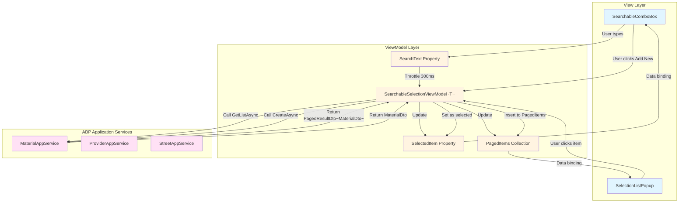

# Design: SearchableSelectionBox Refactor

## Context

The MaterialClient application uses a custom selection pattern combining `SearchableSelectionBox` (trigger) and `GenericSelectionPopup` (popup) to provide searchable, paginated, single-selection with optional "create new" functionality. This pattern is currently used in:

1. **SolidWasteModeFormView**: Provider selection, Material selection, Street selection (3 instances)
2. **StandardModeFormView**: Material selection (1 instance)

### Current Architecture

```
SearchableSelectionBox (UserControl)
  ├── Properties: IsPopupOpen, PlaceholderText
  ├── Visual: Border with DisplayTextBlock (closed) or SearchTextBox (open)
  └── Behavior: Opens popup on click/focus

GenericSelectionPopup (UserControl)
  ├── DataGrid: Shows paginated results
  ├── SearchBox: Internal search TextBox (duplicate with trigger)
  ├── Pagination: Ursa Pagination control
  └── Add Button: Shown when no results + search text

GenericSelectionPopupViewModel<T>
  ├── SearchText: Search input (bound to both trigger and popup search box)
  ├── PagedItems: Filtered/paginated results
  ├── SelectedItem: Current selection
  ├── Pagination state: CurrentPage, PageSize, TotalCount
  └── Commands: SelectItemCommand, AddNewItemCommand, PageChangeCommand
```

### Problems with Current Design

1. **Dual search boxes**: Search box exists in both `SearchableSelectionBox` (when popup open) and `GenericSelectionPopup` (internal row), creating confusion
2. **Complex state management**: `IsPopupOpen` must be synchronized between parent ViewModel and component
3. **Unclear responsibilities**: Which component owns which piece of functionality?
4. **Tight coupling**: Components are tightly coupled to specific ViewModel interfaces (`IGenericSelectionPopupBindings`)
5. **Non-standard patterns**: Deviates from typical ComboBox/AutoCompleteBox UX patterns

## Goals / Non-Goals

### Goals

1. **Unified component**: Single control that acts as both selection display and search input (AutoCompleteBox-style)
2. **Simplified API**: Reduce required parameters and configuration complexity
3. **Clear separation**: Distinct responsibilities between trigger (search/select) and popup (list only)
4. **ReactiveUI patterns**: Leverage ReactiveUI features for state management and reduce boilerplate
5. **Memory safety**: Ensure all Rx subscriptions are properly disposed
6. **Backward compatibility**: Allow gradual migration without breaking existing functionality

### Non-Goals

1. **Multi-selection**: Keep single-selection only (current behavior)
2. **Virtualization**: Do not implement UI virtualization (current DataGrid approach is sufficient)
3. **Custom styling**: Do not introduce new theming system (use existing styles)
4. **Breaking changes**: Do not break existing usage sites during transition period
5. **Third-party controls**: Do not introduce new external dependencies (use Avalonia + Ursa)
6. **ABP abstraction layer**: Do NOT create abstraction over ABP framework types - embrace `PagedResultDto<T>` and work directly with ABP application services

## Decisions

### Decision 1: Component Architecture - Unified Trigger + Simplified Popup

**Choice**: Create a new `SearchableComboBox` component that combines display and search, paired with a simplified `SelectionListPopup` that contains only the list and pagination.

**Rationale**:
- Aligns with standard UX patterns (AutoCompleteBox, ComboBox with search)
- Removes duplicate search box confusion
- Clearer mental model: "type here to search and select"
- Simplifies popup by removing internal search row

**Alternatives considered**:
1. **Keep Button trigger + enhance popup search**: Rejected - doesn't solve the "two places to search" confusion
2. **Merge everything into one mega-control**: Rejected - violates single responsibility, harder to test and maintain
3. **Use Avalonia's built-in AutoCompleteBox**: Rejected - limited async paging support, harder to customize

### Decision 2: State Management - ReactiveUI with SourceGenerators

**Choice**: Use `ReactiveUI.SourceGenerators` (`[Reactive]` attributes) for property generation and `WhenAnyValue()` for reactive chains.

**Rationale**:
- Consistent with project architecture (see `project.md`)
- Reduces boilerplate code (no manual `RaiseAndSetIfChanged`)
- Type-safe reactive chains
- Better performance with compiled source generators

**Alternatives considered**:
1. **Manual property change notification**: Rejected - too much boilerplate, error-prone
2. **Plain INotifyPropertyChanged**: Rejected - loses ReactiveUI benefits (commands, observable chains)
3. **RxState pattern**: Rejected - overkill for simple component state (better for complex services like `AttendedWeighingService`)

### Decision 3: Paging Mode - Keep ClientSide and ServerSide

**Choice**: Maintain both `ClientSide` and `ServerSide` paging modes in the refactored ViewModel.

**Rationale**:
- `ClientSide`: Suitable for small datasets (< 1000 items), loads all data once, fast filtering
- `ServerSide`: Necessary for large datasets, queries page-by-page from backend API
- Current usage has both scenarios (Materials = server-side, Streets = client-side)
- No breaking change to existing data loading patterns

**Alternatives considered**:
1. **Server-side only**: Rejected - would require backend changes for client-side datasets, unnecessary network calls
2. **Client-side only**: Rejected - doesn't scale for large material catalogs

### Decision 4: "Createable" Pattern - Insert-Then-Select

**Choice**: Keep the existing "Createable" pattern where new items are inserted at the top of the list and immediately selected.

**Rationale**:
- Matches existing user mental model (see `evaluation-generic-selection-popup-merge-search-and-trigger.md`)
- Provides immediate feedback that creation succeeded
- Avoids full list refresh after creation
- Consistent with react-select behavior (reference design)

**Flow**:
1. User types search text, no results found
2. "Add New" button appears
3. User clicks button → `CreateNewItemFunc` is called
4. New item is inserted at index 0 in `PagedItems`
5. `SelectedItem` is set to new item (triggers display update)
6. Popup closes (optional, based on configuration)

**Alternatives considered**:
1. **Refresh list after creation**: Rejected - loses scroll position, slower UX
2. **Add to bottom of list**: Rejected - user might not see the new item
3. **Don't auto-select**: Rejected - user has to manually find and select the new item

### Decision 5: Memory Management - DisposeWith Pattern

**Choice**: Use composite `Disposable` with `DisposeWith()` pattern for all Rx subscriptions.

**Rationale**:
- Project has strict memory leak requirements (24/7 operation)
- Prevents subscription leaks when components are destroyed
- Follows project patterns from `AttendedWeighingService`

**Implementation**:
```csharp
private readonly CompositeDisposable _disposables = new();

// In constructor or WhenActivated
this.WhenAnyValue(x => x.SearchText)
    .Throttle(TimeSpan.FromMilliseconds(300))
    .Subscribe(_ => RefreshAsync())
    .DisposeWith(_disposables);

// In destructor/dispose
public void Dispose()
{
    _disposables.Dispose();
}
```

**Alternatives considered**:
1. **Manual disposal in each subscription**: Rejected - error-prone, boilerplate
2. **WeakReferences**: Rejected - complex, doesn't guarantee timely cleanup
3. **Finalizers only**: Rejected - non-deterministic, too late for long-running app

### Decision 6: ABP Integration - Embrace, Don't Abstract

**Choice**: Design the component to work directly with ABP framework types (`PagedResultDto<T>`, entity DTOs) without creating abstraction layers.

**Rationale**:
- The MaterialClient application uses ABP as its backend framework - this is a fixed technical constraint
- Creating abstraction over ABP types would add unnecessary complexity without real benefit
- Component reusability is achieved through generics (`SearchableComboBox<T>`) not abstraction
- All selection scenarios in the application use ABP application services that return `PagedResultDto<T>`
- Reduces mapping/conversion overhead between ABP DTOs and abstract types

**Design implications**:
- ViewModel accepts `Func<string?, int, int, IReadOnlyList<int>?, Task<PagedResultDto<T>>>` for server-side paging
- Component works directly with ABP DTOs (e.g., `MaterialDto`, `ProviderDto`, `StreetDto`)
- No need for custom paging abstractions - leverage ABP's built-in `PagedResultDto`
- ID-based selection restoration uses ABP entity IDs directly

**Reusability within the application**:
The component is reusable across any ABP entity type because:
1. It's generic: `SearchableComboBox<T>` works with any type `T`
2. All ABP entities share common patterns (ID, display text property)
3. Factory methods and configuration make it easy to set up for new entity types

**Example usage**:
```csharp
// For Materials
var materialsVm = new SearchableSelectionViewModel<MaterialDto>(
    displayTextSelector: m => m.Name,
    loadPageFunc: (search, page, size, ids) =>
        _materialAppService.GetListAsync(new GetMaterialsInput
        {
            Filter = search,
            SkipCount = (page - 1) * size,
            MaxResultCount = size,
            // ABP handles the filtering and paging
        })
);

// For Streets (client-side)
var streetsVm = new SearchableSelectionViewModel<StreetDto>(
    displayTextSelector: s => s.StreetName,
    loadAllFunc: () => _streetAppService.GetListAsync(),
    pagingMode: GenericSelectionPagingMode.ClientSide
);
```

**Alternatives considered**:
1. **Create abstraction over ABP types**: Rejected - adds complexity, no benefit since ABP is fixed
2. **Support non-ABP scenarios**: Rejected - out of scope; all application data comes from ABP backend
3. **Generic paging interface**: Rejected - ABP's `PagedResultDto` already provides the needed abstraction

## UI/UX Design

### Component Visual States

**State 1: Closed (no selection)**
```
┌─────────────────────────────────┐
│ 请选择                    [▼]   │  ← Placeholder text
└─────────────────────────────────┘
```

**State 2: Closed (with selection)**
```
┌─────────────────────────────────┐
│ 某某材料名称              [▼]   │  ← Selected display text
└─────────────────────────────────┘
```

**State 3: Open (focused)**
```
┌─────────────────────────────────┐
│ [Search input...]          [▼]   │  ← Text cursor, search mode
└─────────────────────────────────┘
┌─────────────────────────────────┐
│ SelectionListPopup              │
│ ┌─────────────────────────────┐ │
│ │ DataGrid (paginated)        │ │
│ │ ...                         │ │
│ └─────────────────────────────┘ │
│ ◀ 1 / 5 共50条 ▶               │
└─────────────────────────────────┘
```

**State 4: No results (with search text)**
```
┌─────────────────────────────────┐
│ [xyz...]                   [▼]   │  ← Search text with no matches
└─────────────────────────────────┘
┌─────────────────────────────────┐
│ SelectionListPopup              │
│                                 │
│         未找到匹配结果           │
│                                 │
│         [+ 新增]                │  ← Add new button
│                                 │
└─────────────────────────────────┘
```

### Interaction Specifications

| User Action | System Response | State Changes |
|-------------|-----------------|---------------|
| Click trigger (closed) | Open popup, focus search input | `IsPopupOpen = true`, focus SearchTextBox |
| Focus trigger (keyboard tab) | Open popup, focus search input | `IsPopupOpen = true`, focus SearchTextBox |
| Type in search input | Filter list after 300ms debounce | `SearchText` update → `LoadDataAsync()` |
| Click item in list | Select item, update display, close popup | `SelectedItem = item`, `IsPopupOpen = false` |
| Press Escape (popup open) | Close popup, keep selection | `IsPopupOpen = false` |
| Press Enter (popup open) | Select focused item, close popup | `SelectedItem = focusedItem`, `IsPopupOpen = false` |
| Click outside popup | Close popup, keep selection | `IsPopupOpen = false` |
| Click "Add New" button | Create item, insert at top, select it | `NewItem` created, `SelectedItem = newItem`, `IsPopupOpen = false` |

### Keyboard Navigation

- **Tab**: Focus next control, close popup
- **Shift+Tab**: Focus previous control, close popup
- **ArrowDown/Up**: Navigate list items (when popup open)
- **Enter**: Select focused item (when popup open)
- **Escape**: Close popup without selection
- **Type any key**: Open popup and focus search input

## Technical Design

### Component Hierarchy

```mermaid
classDiagram
    class SearchableComboBox {
        +styledProperty IsPopupOpen: bool
        +styledProperty PlaceholderText: string?
        +styledProperty SelectedItem: T?
        -visual DisplayBorder
        -visual SearchTextBox
        -visual DropdownArrow
        +OnGotFocus()
        +OnLostFocus()
    }

    class SelectionListPopup {
        +property ItemsSource: IObservable~IEnumerable~
        +property SelectedItem: T?
        +property CurrentPage: int
        +property PageSize: int
        +property TotalCount: int
        +event SelectionConfirmed
        -visual DataGrid
        -visual PaginationControl
        -visual AddNewButton
    }

    class SearchableSelectionViewModel~T~ {
        +[Reactive] SearchText: string
        +[Reactive] SelectedItem: T?
        +[Reactive] PagedItems: ObservableCollection~Item~
        +[Reactive] CurrentPage: int
        +[Reactive] TotalCount: int
        +property ShowAddNewButton: bool
        +command SelectItemCommand
        +command AddNewItemCommand
        +command PageChangeCommand
        -LoadDataAsync()
        -FilterClientSide()
        -InitializeFiltering()
    }

    class ISearchableSelectionConfig~T~ {
        +Func~T, string~ DisplayTextSelector
        +Func~T, int?~ GetIdSelector
        +Func~string?, int, int, IReadOnlyList~int~?, Task~PagedResultDto~T~~ LoadPageFunc
        +Func~Task~IReadOnlyList~T~~ LoadAllFunc
        +Func~string, Task~T?~ CreateNewItemFunc
        +bool AllowAddNew
        +int PageSize
    }

    SearchableComboBox --> SearchableSelectionViewModel: binds to
    SelectionListPopup --> SearchableSelectionViewModel: binds to
    SearchableSelectionViewModel --> ISearchableSelectionConfig: initialized with
    SearchableSelectionViewModel -.->|uses| PagedResultDto: "ABP type"
```

### Data Flow



**Key point**: The ViewModel calls ABP application services directly, receiving `PagedResultDto<T>` responses. No mapping or abstraction layer is needed.

### Reactive Observable Chains

**Search Filtering Chain**:
```csharp
this.WhenAnyValue(x => x.SearchText)
    .Throttle(TimeSpan.FromMilliseconds(300))        // Debounce rapid typing
    .DistinctUntilChanged()                            // Ignore duplicates
    .ObserveOn(RxApp.TaskpoolScheduler)                // Background thread
    .SelectMany(text => LoadDataAsync(text))           // Async data loading
    .ObserveOn(RxApp.MainThreadScheduler)              // Back to UI thread
    .Subscribe(items =>
    {
        PagedItems.Clear();
        foreach (var item in items) PagedItems.Add(item);
    })
    .DisposeWith(_disposables);
```

**Selection Display Update Chain**:
```csharp
this.WhenAnyValue(x => x.SelectedItem)
    .Subscribe(item =>
    {
        this.RaisePropertyChanged(nameof(SelectedDisplayText));
        // Optional: Close popup after selection
        if (item != null && CloseOnSelect)
        {
            IsPopupOpen = false;
        }
    })
    .DisposeWith(_disposables);
```

**Popup State Management**:
```csharp
this.WhenAnyValue(x => x.IsPopupOpen)
    .Subscribe(isOpen =>
    {
        if (isOpen)
        {
            // Focus search input when popup opens
            Dispatcher.UIThread.Post(
                () => SearchTextBox?.Focus(),
                DispatcherPriority.Loaded);
        }
        else
        {
            // Clear search text when popup closes (optional)
            // SearchText = string.Empty;
        }
    })
    .DisposeWith(_disposables);
```

### Memory Safety Patterns

**1. Subscription Disposal**:
```csharp
public sealed class SearchableSelectionViewModel<T> : ViewModelBase, IDisposable
{
    private readonly CompositeDisposable _disposables = new();

    public SearchableSelectionViewModel(...)
    {
        // All subscriptions disposed with _disposables
        this.WhenAnyValue(x => x.SearchText)
            .Throttle(TimeSpan.FromMilliseconds(300))
            .Subscribe(_ => LoadDataAsync())
            .DisposeWith(_disposables);
    }

    public void Dispose()
    {
        _disposables.Dispose();
    }
}
```

**2. Hot Observable RefCount** (if sharing observables between components):
```csharp
private readonly IObservable<bool> _isPopupOpenObservable;

public SearchableComboBox()
{
    _isPopupOpenObservable = this.GetObservable(IsPopupOpenProperty)
        .Replay(1)                    // Cache latest value
        .RefCount();                  // Auto-dispose when no subscribers
}
```

**3. Weak Event Patterns** (for cross-component communication):
```csharp
// Avoid strong references from static/global sources
WeakEventManager.Register<Event, EventHandler>(handler);
```

## Risks / Trade-offs

### Risk 1: Memory Leaks from Rx Subscriptions

**Impact**: High - application runs 24/7, memory leaks accumulate over time

**Mitigation**:
- Enforce `DisposeWith()` pattern for all subscriptions
- Add memory leak tests simulating 1-hour operation
- Use dotMemory or similar profiler to validate
- Document subscription disposal patterns in code comments

### Risk 2: UI/UX Regression

**Impact**: Medium - users accustomed to current behavior may be confused

**Mitigation**:
- Side-by-side testing of old and new components
- User acceptance testing with actual operators
- Gradual rollout (migrate one field at a time)
- Keep old components available during transition

### Risk 3: Performance Degradation

**Impact**: Medium - slow search/filtering affects user experience

**Mitigation**:
- Keep 300ms debounce (proven effective in current implementation)
- Offload filtering to background thread with `ObserveOn(RxApp.TaskpoolScheduler)`
- Use virtualization for large lists (if needed in future)
- Performance test with 1000+ items

### Risk 4: Increased Complexity

**Impact**: Low - new architecture may be harder to understand for new developers

**Mitigation**:
- Clear API documentation with examples
- XML comments on all public members
- Usage examples for common scenarios
- Decision record (this document) for future reference

### Trade-off: API Simplicity vs Flexibility

**Decision**: Prioritize common use cases, provide advanced configuration for edge cases

**Rationale**:
- 80% of usage is simple selection from server-side paginated list
- Complex configuration available via `ISearchableSelectionConfig<T>` interface
- Factory methods for common scenarios reduce boilerplate

**Example**:
```csharp
// Simple case (factory method for ABP app service)
var vm = SearchableSelectionViewModel<MaterialDto>.CreateForAbpService(
    displayTextSelector: m => m.Name,
    getApplicationService: () => _materialAppService,
    getSelectedId: m => m.Id,
    createNewItemFunc: name => _materialAppService.CreateAsync(new CreateMaterialDto { Name = name })
);

// Advanced case (full configuration)
var vm = new SearchableSelectionViewModel<MaterialDto>(config:
    new SearchableSelectionConfig<MaterialDto>
    {
        DisplayTextSelector = m => m.Name,
        GetIdSelector = m => m.Id,
        LoadPageFunc = (search, page, size, ids) =>
            _materialAppService.GetListAsync(new GetMaterialsInput
            {
                Filter = search,
                SkipCount = (page - 1) * size,
                MaxResultCount = size
            }),
        CreateNewItemFunc = name => _materialAppService.CreateAsync(new CreateMaterialDto { Name = name }),
        AllowAddNew = true,
        PageSize = 20
    });
```

### Trade-off: ABP Framework Coupling

**Decision**: Accept tight coupling to ABP framework types (`PagedResultDto<T>`, entity DTOs).

**Rationale**:
- **Project constraint**: MaterialClient uses ABP as its backend - this won't change
- **No benefit to abstraction**: Creating interfaces over ABP types adds complexity without enabling any new scenario
- **Reusability via generics**: The component is reusable across any ABP entity type through `SearchableComboBox<T>`
- **Performance**: Direct ABP integration avoids mapping/conversion overhead
- **Simplicity**: Fewer types to understand and maintain

**What this means**:
- Component ViewModels work with `PagedResultDto<T>` directly from ABP application services
- Factory methods and configuration patterns make it easy to set up for any ABP entity
- Documentation and examples focus on ABP integration patterns
- The component is NOT designed to work with non-ABP data sources (this is intentional)

**Reusability within the project**:
The component can be used for any ABP-backed selection:
- Materials (MaterialDto)
- Providers (ProviderDto)
- Streets (StreetDto)
- Any future ABP entities (e.g., Vehicles, Customers, etc.)

All that's needed is:
1. The entity DTO type
2. A display text selector (e.g., `m => m.Name`)
3. An ID selector (e.g., `m => m.Id`)
4. The ABP application service reference

## Migration Plan

### Phase 1: Foundation (Week 1-2)

1. Create new components alongside existing ones (no breaking changes)
2. Implement core `SearchableComboBox` and `SelectionListPopup`
3. Implement `SearchableSelectionViewModel<T>` with ReactiveUI patterns
4. Write unit tests for ViewModel

**Validation**: Unit tests pass, components compile

### Phase 2: Proof of Concept (Week 2-3)

1. Migrate one usage site (Provider selection in `SolidWasteModeFormView`)
2. Manual testing of full user flow
3. Performance and memory profiling
4. Adjust design based on feedback

**Validation**: Manual testing passes, memory leak tests pass

### Phase 3: Full Migration (Week 3-4)

1. Migrate remaining usage sites (Material, Street selections)
2. Remove old popup state management code
3. Update all ViewModels
4. Integration testing

**Validation**: All selection flows work correctly, no regressions

### Phase 4: Deprecation (Week 4-5)

1. Mark old components `[Obsolete]` with migration guide
2. Update documentation and examples
3. Announce deprecation to team
4. Plan removal in future version (e.g., v2.5)

**Validation**: No new code uses obsolete components

### Phase 5: Cleanup (Future Version)

1. Remove obsolete components (after 1-2 versions)
2. Remove related obsolete code
3. Final documentation update

**Rollback Plan**:
- Keep old components in codebase until Phase 5
- Git history allows reverting to previous state if needed
- Feature flags can control which component is used (optional)

## Open Questions

### Summary of Pending Decisions

Total: **5 unconfirmed questions** requiring resolution before or during implementation.

| # | Question | Priority | Phase Needed | Status |
|---|----------|----------|--------------|--------|
| 1 | Avalonia AutoCompleteBox evaluation | Medium | Phase 1 | Pending investigation |
| 2 | Popup close-on-select behavior | High | Phase 1 | Decision needed |
| 3 | Custom item templates support | Low | Future | Out of scope |
| 4 | Error state handling UI | Medium | Phase 2 | Design needed |
| 5 | Keyboard shortcuts for "Create New" | Low | Phase 2 | Optional enhancement |

### Detailed Questions

1. **Should we use Avalonia's built-in `AutoCompleteBox` as a base?**
   - **Status**: Pending investigation
   - **Decision needed**: Evaluate if built-in control supports async paging and custom popup content
   - **Timeline**: Phase 1
   - **Action item**: Research Avalonia UI documentation and source code to determine if AutoCompleteBox can support our requirements (async server-side paging, custom DataGrid popup, "Add New" button)

2. **Should the popup close immediately after selection?**
   - **Status**: Design decision needed
   - **Options**: (A) Always close, (B) Keep open for rapid selection, (C) Configurable
   - **Recommendation**: Configurable via `CloseOnSelect` property (default: true)
   - **Timeline**: Phase 1
   - **Action item**: Confirm with product owner if "close on select" should be the default behavior

3. **Should we support custom templates for list items?**
   - **Status**: Out of scope for current refactor
   - **Rationale**: Current usage only needs single-column display
   - **Future**: Add `ItemTemplate` property if needed
   - **Timeline**: Future enhancement (not in current scope)

4. **How should we handle error states (e.g., network failure in server-side paging)?**
   - **Status**: Design needed
   - **Options**: (A) Show error message in popup, (B) Show toast notification, (C) Retry automatically
   - **Recommendation**: Show error message in DataGrid area with retry button
   - **Timeline**: Phase 2
   - **Action item**: Design error UI component and error handling flow

5. **Should we add keyboard shortcut support for "Create New" (e.g., Ctrl+N)?**
   - **Status**: Nice-to-have feature
   - **Recommendation**: Add if time permits in Phase 2, otherwise defer to future enhancement
   - **Timeline**: Phase 2 (if time permits)

### Next Steps for Question Resolution

**Before Phase 1 starts**:
- [ ] Q1: Investigate Avalonia AutoCompleteBox capabilities
- [ ] Q2: Confirm close-on-select behavior with product owner

**During Phase 2**:
- [ ] Q4: Design and implement error state handling
- [ ] Q5: Implement keyboard shortcuts if time permits

**Future considerations**:
- Q3: Evaluate need for custom templates based on future usage patterns
