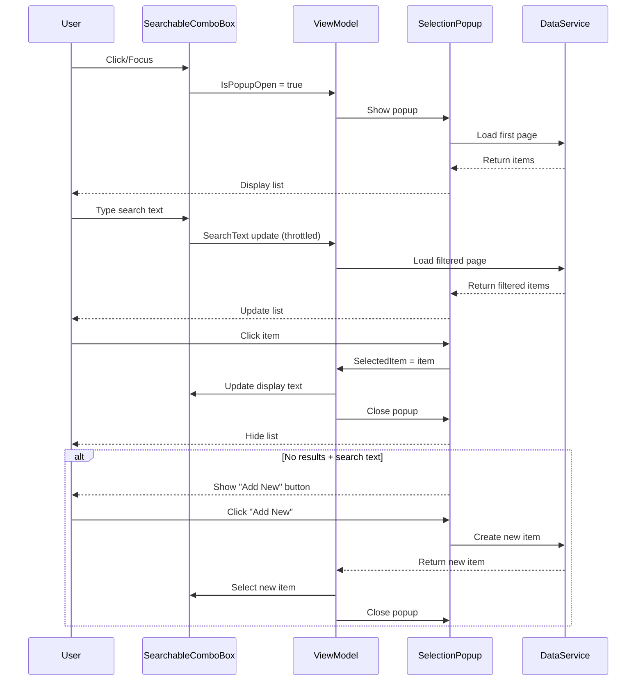

# Change: Refactor SearchableSelectionBox Component Architecture

## Why

The current `SearchableSelectionBox` and `GenericSelectionPopup` component architecture has several usability and maintainability issues:

1. **High coupling**: Two components must be used together, requiring developers to understand their interaction patterns
2. **Complex API**: Component responsibilities are unclear, and configuration parameters are scattered across multiple components
3. **Limited reusability**: Components are tightly coupled to specific data sources (e.g., `PageList`), making adaptation to other scenarios difficult
4. **Non-idiomatic patterns**: The current implementation does not fully leverage Avalonia UI + ReactiveUI best practices

**Note on ABP Integration**: The refactored component will maintain tight integration with ABP framework's `PagedResultDto` and related types. This is intentional as the project uses ABP as the backend framework, and forcing abstraction would add unnecessary complexity. The component will be reusable across any ABP-based entity type within the MaterialClient application.

## What Changes

### Core Changes

1. **Unified Component Interface**
   - Merge or redefine component boundaries to provide a single entry point
   - Simplify configuration API, reducing required parameters
   - Follow MVVM pattern with proper ViewModel design using ReactiveUI

2. **Improved Encapsulation Strategy**
   - Abstract Selectable, Searchable, and Createable behaviors into reusable patterns
   - Use ReactiveUI's reactive features for state management (search, selection, creation)
   - Provide clear dependency injection interfaces
   - **Embrace ABP integration**: Component accepts `PagedResultDto<T>` and works seamlessly with ABP application services

3. **Maintain Backward Compatibility**
   - Ensure existing functionality remains intact during refactoring
   - Provide a gradual migration path
   - Keep old components as过渡 (marked `Obsolete`) for deprecation in future versions

### Technical Approach

- Follow project's MVVM + ReactiveUI architecture patterns
- Leverage `ReactiveUI.SourceGenerators` to reduce boilerplate code
- Ensure memory safety, avoiding Rx subscription leaks (reference project memory leak management guidelines)
- Use `AutoConstructor` to simplify dependency injection

### Breaking Changes

None - this is an internal refactoring that maintains existing public contracts. Old components will be marked `Obsolete` but remain functional during the transition period.

## UI Design Changes

### Current State
```
┌─────────────────────────────────────┐
│ Form View (SolidWasteModeFormView)  │
├─────────────────────────────────────┤
│ Label: [SearchableSelectionBox]     │  ← Shows selected value
│         └─> IsPopupOpen binding     │
│                                     │
│ [Popup]                             │  ← Opens on click
│  ┌─ GenericSelectionPopup ─────────┐│
│  │ SearchBox (internal)            ││
│  │ DataGrid + Pagination           ││
│  └─────────────────────────────────┘│
└─────────────────────────────────────┘
```

### Target State (Refactored)
```
┌─────────────────────────────────────┐
│ Form View (SolidWasteModeFormView)  │
├─────────────────────────────────────┤
│ Label: [SearchableComboBox]         │  ← Single unified component
│         └─> Shows selected value     │
│         └─> Becomes search on focus │
│         └─> Opens popup automatically│
│                                     │
│ [Popup] (Auto-managed)              │
│  ┌─ SelectionList ─────────────────┐│
│  │ DataGrid + Pagination           ││  ← No separate search box
│  │ (search in trigger)             ││
│  └─────────────────────────────────┘│
└─────────────────────────────────────┘
```

### User Interaction Flow



## Impact

### Affected Specs

- **New spec to be created**: `searchable-selection-component` - Defines the unified searchable selection component capability

### Affected Code

**Primary files**:
- `MaterialClient/Views/SearchableSelectionBox.axaml` - Will be refactored/replaced
- `MaterialClient/Views/SearchableSelectionBox.axaml.cs` - Will be refactored/replaced
- `MaterialClient/Views/GenericSelectionPopup.axaml` - Will be refactored
- `MaterialClient/Views/GenericSelectionPopup.axaml.cs` - Will be refactored
- `MaterialClient/ViewModels/GenericSelectionPopupViewModel.cs` - Will be refactored

**Usage sites** (will be migrated):
- `MaterialClient/Views/AttendedWeighing/SolidWasteModeView.axaml` - Uses 3 instances (Provider, Material, Street)
- `MaterialClient/Views/AttendedWeighing/StandardModeFormView.axaml` - Uses 1 instance (Material)
- `MaterialClient/ViewModels/AttendedWeighingDetailViewModel.cs` - Manages popup state

**Tests to be added**:
- Unit tests for new component ViewModels
- UI integration tests for component interaction
- Memory leak tests for Rx subscription cleanup

### Dependencies

**Current dependencies to maintain**:
- Avalonia UI 11.3.9
- ReactiveUI 20.1.1
- System.Reactive 7.0.0-preview.1
- Ursa (Pagination component)

**No new external dependencies required**

### Migration Strategy

1. **Phase 1**: Create new unified component alongside existing ones
2. **Phase 2**: Migrate one usage site (e.g., Provider selection) as proof of concept
3. **Phase 3**: Validate and refine based on Phase 2 feedback
4. **Phase 4**: Migrate remaining usage sites
5. **Phase 5**: Mark old components `Obsolete` (keep for 1-2 versions)
6. **Phase 6**: Remove old components in future version

### Risks and Mitigations

| Risk | Impact | Mitigation |
|------|--------|------------|
| Breaking existing functionality | High | Comprehensive testing; gradual migration; keep old components during transition |
| Memory leaks from Rx subscriptions | High | Follow project memory leak guidelines; explicit disposal tests; use `DisposeWith()` patterns |
| UI/UX regression | Medium | User validation; side-by-side comparison; retain ability to revert |
| Increased complexity | Medium | Simplify API; clear documentation; examples for common use cases |

### Success Criteria

1. **Functionality**: All existing Selectable + Searchable + Createable behaviors work correctly
2. **API Simplicity**: Reduced parameter count and clearer component boundaries
3. **ABP Integration**: Seamless integration with `PagedResultDto<T>` and ABP application services
4. **Code Quality**: Follows project MVVM + ReactiveUI patterns; proper memory management
5. **Testing**: Unit tests and UI integration tests pass; memory leak tests pass
6. **Documentation**: Clear API documentation and usage examples for ABP-based scenarios
7. **Developer Experience**: Reduced learning curve; easier to use for any ABP entity type within the application
