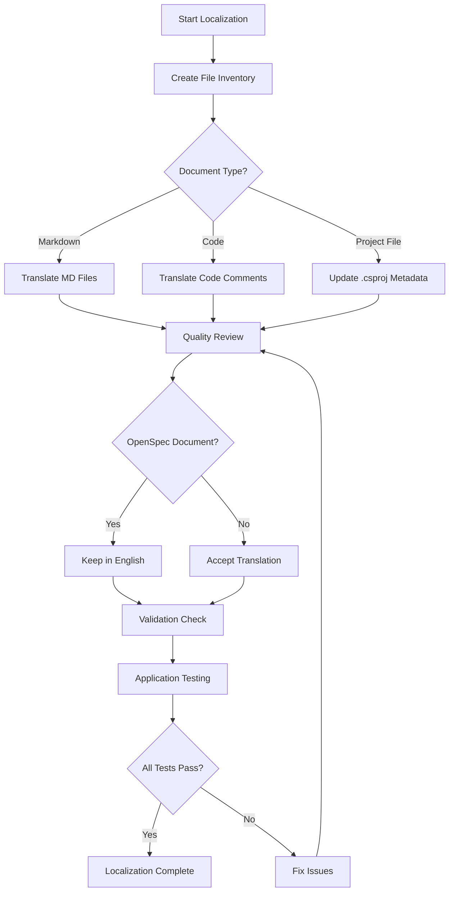
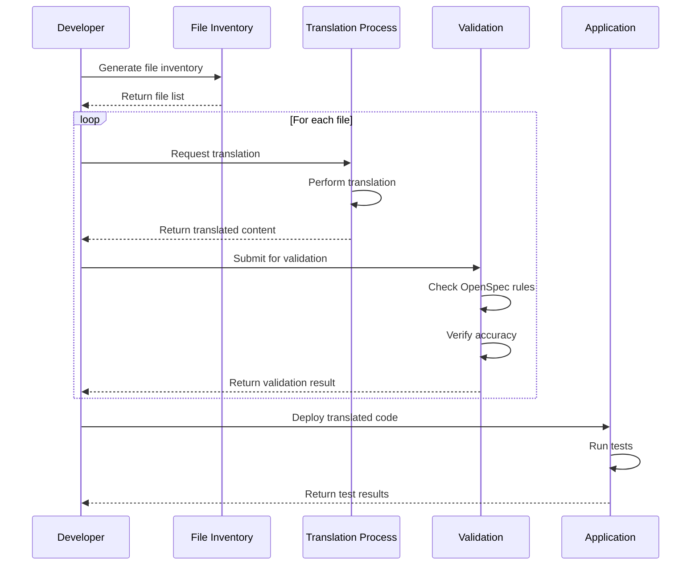

## Context

### Background

MaterialClient 是一个 Windows 桌面应用程序，用于卡车称重管理和物料跟踪。当前项目的语言设置不统一：
- 代码注释混合使用中英文
- Markdown 文档主要使用英文
- 项目描述使用英文
- 用户界面和文档存在语言不一致

### Current State

**Language Distribution Analysis**:
- **Code Comments**: 部分使用中文（如 `Program.cs`, `WeighingRecord.cs`），部分使用英文
- **Documentation**: `docs/` 和 `openspec/docs/` 目录主要使用英文
- **Project Metadata**: .csproj 文件中的描述使用英文
- **Runtime**: 程序已设置中文文化环境（`zh-CN`）

### Constraints

1. **OpenSpec Language Requirement**: `openspec/specs/**/spec.md`, `openspec/changes/**/proposal.md`, `tasks.md`, `design.md` 必须保持英文
2. **Code Integrity**: 代码内容本身（变量名、方法名、类名）必须保持英文
3. **Technical Terminology**: 技术性和专业术语保留英文备注（如 API、HTTP、REST、JSON、XML 等技术术语）
4. **Backward Compatibility**: 翻译不应影响现有功能
5. **Accuracy**: 翻译必须准确，不能改变原意

### Stakeholders

- **Chinese Users**: 主要用户群体，期望中文界面和文档
- **Development Team**: 需要理解翻译范围和方法
- **OpenSpec System**: 维持英文规范文档的完整性

---

## Goals / Non-Goals

**Goals:**
- 统一项目非代码内容为中文，提高中文用户的可读性
- 翻译所有 Markdown 文档（OpenSpec 规范文档除外）
- 翻译所有代码注释为中文
- 更新项目描述为中文
- 降低维护成本，消除双语维护需求

**Non-Goals:**
- 修改 OpenSpec 规范文档的语言要求
- 更改代码内容本身（变量名、方法名、类名保持英文）
- 修改程序功能行为
- 翻译第三方库或依赖项的文档

---

## Decisions

### Decision 1: Translation Scope - Selective vs. Comprehensive

**Choice**: Selective translation with clear exclusion criteria

**Rationale**:
- **Comprehensive translation** would translate everything including OpenSpec specs, but this violates the OpenSpec system's non-negotiable English requirement
- **Selective translation** focuses on user-facing and developer-facing content while respecting system constraints

**Alternatives Considered**:
- **Alternative 1 - Comprehensive translation**: Translate everything including OpenSpec docs
  - *Pros*: Complete language unification
  - *Cons*: Violates OpenSpec system requirements, breaks OpenSpec validation
- **Alternative 2 - Bilingual maintenance**: Keep both Chinese and English versions
  - *Pros*: No loss of information
  - *Cons*: High maintenance cost, potential inconsistency between versions

**Decision**: Use selective translation with clear exclusion criteria for OpenSpec documents

---

### Decision 2: Translation Approach - Manual vs. Automated

**Choice**: Manual translation with quality control

**Rationale**:
- **Automated translation** is faster but may produce inaccurate technical translations
- **Manual translation** ensures accuracy and context-appropriate terminology

**Alternatives Considered**:
- **Alternative 1 - Fully automated**: Use AI translation tools for all content
  - *Pros*: Fast, cost-effective
  - *Cons*: May produce inaccurate technical translations, loss of nuance
- **Alternative 2 - Hybrid approach**: Automated first pass, manual review
  - *Pros*: Balances speed and quality
  - *Cons*: Still requires significant manual review effort

**Decision**: Manual translation for accuracy, especially for technical documentation and code comments

---

### Decision 3: Project Description Update - .csproj vs. Separate Metadata File

**Choice**: Update .csproj files directly

**Rationale**:
- **.csproj update** is the standard location for project metadata in .NET
- **Separate metadata file** would add complexity without clear benefit

**Alternatives Considered**:
- **Alternative 1 - Separate metadata file**: Store project descriptions in a separate configuration file
  - *Pros*: Centralized management, easier to update
  - *Cons*: Non-standard approach, requires additional build configuration
- **Alternative 2 - Runtime metadata**: Load descriptions from external source
  - *Pros*: Dynamic updates without recompilation
  - *Cons*: Adds runtime complexity, external dependency

**Decision**: Update .csproj files directly using standard .NET project metadata

---

### Decision 4: Code Comment Translation - Inline vs. External Documentation

**Choice**: Inline translation in code files

**Rationale**:
- **Inline comments** are immediately visible to developers working on the code
- **External documentation** would require developers to reference multiple sources

**Alternatives Considered**:
- **Alternative 1 - External documentation**: Move all comments to separate documentation files
  - *Pros*: Centralized, easier to maintain
  - *Cons*: Developers lose context when reading code
- **Alternative 2 - Bilingual comments**: Keep both English and Chinese comments
  - *Pros*: No information loss
  - *Cons*: Increases file size, potential confusion

**Decision**: Translate inline comments directly in code files

---

## Risks / Trade-offs

### Risk 1: Translation Quality Inconsistency

**Risk**: Different translators or translation tools may produce inconsistent terminology and style.

**Mitigation**:
- Create a translation glossary for common technical terms
- Establish style guidelines for technical documentation
- Review translations for consistency across documents

---

### Risk 2: Loss of Context in Code Comments

**Risk**: Translated comments may lose some technical nuance or context.

**Mitigation**:
- Preserve technical accuracy over literal translation
- Review code comments in context of surrounding code
- Use technical terminology appropriate for the domain

---

### Risk 3: Breaking OpenSpec Validation

**Risk**: Accidentally translating OpenSpec specification documents could break validation.

**Mitigation**:
- Clear documentation of exclusion criteria
- Automated validation step to check OpenSpec documents remain in English
- Manual review before commit

---

### Risk 4: Incomplete Translation

**Risk**: Some documents or comments may be missed during translation effort.

**Mitigation**:
- Systematic inventory of all files requiring translation
- Checklist-based translation process
- Automated detection of English comments in critical files

---

### Trade-off: Translation Time vs. Quality

**Trade-off**: Faster translation may reduce quality; thorough quality assurance takes more time.

**Mitigation**:
- Prioritize critical documentation and frequently accessed code
- Use phased approach for translation (high priority first)
- Accept that translation is an ongoing process, not one-time effort

---

## Migration Plan

### Phase 1: Preparation
1. Create inventory of all files requiring translation
2. Establish translation glossary and style guidelines
3. Set up validation rules for OpenSpec documents

### Phase 2: Documentation Translation
1. Translate `docs/` directory Markdown files
2. Translate root-level Markdown files (excluding OpenSpec instructions)
3. Review and validate translations

### Phase 3: Code Comment Translation
1. Translate code comments in MaterialClient project
2. Translate code comments in MaterialClient.Common project
3. Translate code comments in MaterialClient.Toolkit project
4. Validate that code functionality remains unchanged

### Phase 4: Project Metadata Update
1. Update MaterialClient.csproj description
2. Update MaterialClient.Common.csproj description
3. Update MaterialClient.Toolkit.csproj description

### Phase 5: Validation and Review
1. Validate OpenSpec documents remain in English
2. Verify translations are accurate
3. Test application functionality
4. Review for any missed translations

### Rollback Strategy

If translation causes issues:
1. Revert changes file by file to identify problematic translations
2. Use git to selectively revert specific commits
3. Keep translation inventory to track progress

---

## Open Questions

1. **Should we create a translation glossary?** - Consider creating a standardized glossary for common technical terms used in translations

2. **How do we handle mixed-language comments?** - Some files may have both English and Chinese comments; need strategy for consistent handling

3. **Should we translate test code comments?** - Test files often have technical comments; determine if these need translation priority

4. **How do we validate translation quality?** - Need process for ensuring translations are accurate and maintain technical integrity

---

## Detailed Code Change Inventory

| File Path | Change Type | Change Description | Affected Module | Priority |
|-----------|-------------|-------------------|-----------------|-----------|
| `docs/SDD.md` | Translate content | Translate Software Design Document to Chinese | Documentation | High |
| `docs/existing-docs-inventory.md` | Translate content | Translate documentation inventory to Chinese | Documentation | Medium |
| `docs/sdd-*.md` | Translate content | Translate SDD-related documents to Chinese | Documentation | High |
| `MaterialClient/**/*.cs` | Update comments | Translate English comments to Chinese | MaterialClient | High |
| `MaterialClient.Common/**/*.cs` | Update comments | Translate English comments to Chinese | MaterialClient.Common | High |
| `MaterialClient.Toolkit/**/*.cs` | Update comments | Translate English comments to Chinese | MaterialClient.Toolkit | Medium |
| `MaterialClient/MaterialClient.csproj` | Update metadata | Change project description to Chinese | Project Metadata | High |
| `MaterialClient.Common/MaterialClient.Common.csproj` | Update metadata | Change project description to Chinese | Project Metadata | High |
| `MaterialClient.Toolkit/MaterialClient.Toolkit.csproj` | Update metadata | Change project description to Chinese | Project Metadata | High |

---

## Component Architecture

```
Localization Workflow
├── Preparation Phase
│   ├── File Inventory
│   ├── Glossary Creation
│   └── Validation Rules Setup
│
├── Documentation Phase
│   ├── docs/ Directory Translation
│   ├── Root MD Files Translation
│   └── Quality Review
│
├── Code Phase
│   ├── MaterialClient Comments
│   ├── MaterialClient.Common Comments
│   └── MaterialClient.Toolkit Comments
│
├── Metadata Phase
│   ├── .csproj File Updates
│   └── Project Description Changes
│
└── Validation Phase
    ├── OpenSpec Document Validation
    ├── Translation Quality Review
    ├── Functionality Testing
    └── Final Review
```

---

## Data Flow Diagram



---

## API Call Sequence Diagram


