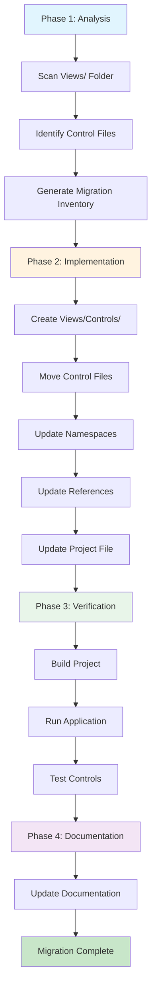
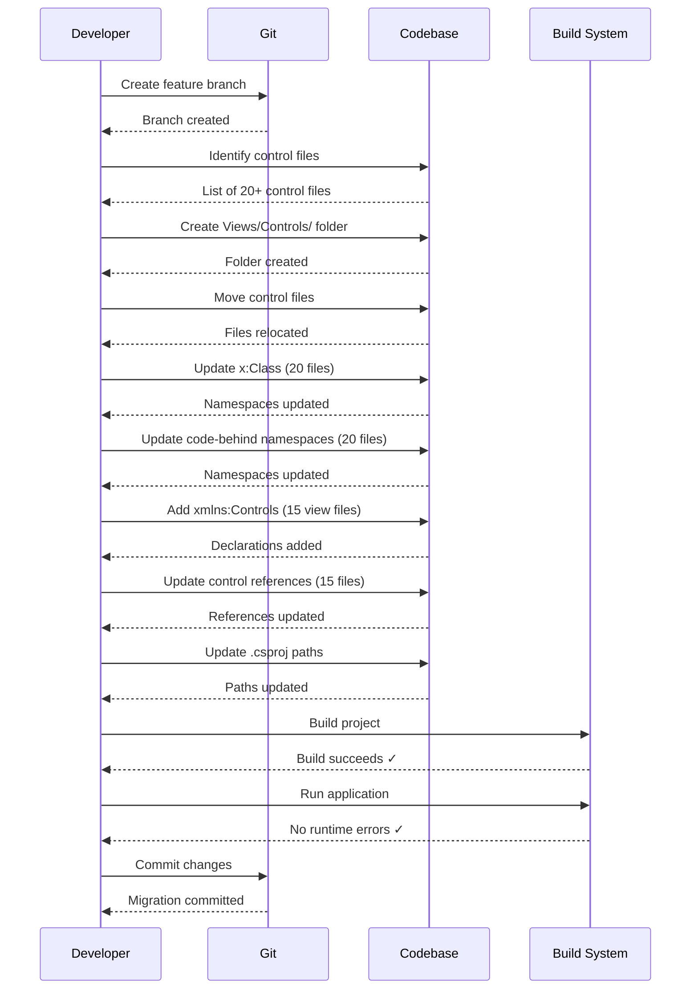

## Context

### Current State

The MaterialClient project follows an Avalonia UI architecture with all XAML files currently located in a single `Views/` folder. This folder contains approximately [to be determined] XAML files, including:
- Window views (MainWindow, LoginWindow, etc.)
- Page views (Dashboard, Settings, etc.)
- Control files (CustomButton, DataGridControl, SearchBox, etc.)

This mixed organization makes it difficult to:
- Quickly locate specific controls for reuse or modification
- Understand the project structure for new team members
- Maintain clear separation between presentation logic and reusable components

### Project Structure

```
MaterialClient/
├── Views/                    (Current: mixed content)
│   ├── MainWindow.axaml
│   ├── LoginWindow.axaml
│   ├── CustomButton.axaml    ← Control mixed with views
│   ├── DataGridControl.axaml ← Control mixed with views
│   └── ...
├── ViewModels/
├── Models/
├── Services/
└── MaterialClient.csproj
```

### Constraints

- **No Behavioral Changes**: This is a pure refactoring; all functionality must remain identical
- **Build Compatibility**: Project must build successfully after migration
- **Runtime Compatibility**: Application must run without errors
- **Minimal Disruption**: Changes should be completed in a single coherent migration
- **Avalonia Conventions**: Follow Avalonia UI best practices for file organization

### Stakeholders

- **Development Team**: Primary beneficiaries - improved code navigation and maintainability
- **New Team Members**: Reduced onboarding time due to clearer structure
- **Code Reviewers**: Easier review process with organized file locations

---

## Goals / Non-Goals

**Goals:**
1. Separate control files from view files into a distinct `Views/Controls/` folder
2. Update all namespace references to use `MaterialClient.Views.Controls` for controls
3. Update project file references to reflect new file locations
4. Maintain 100% functional compatibility - no behavioral changes
5. Ensure project builds and runs successfully after migration
6. Establish a clear pattern for future control additions

**Non-Goals:**
1. No functional or behavioral changes to existing features
2. No performance optimizations (not the purpose of this change)
3. No API changes or public interface modifications
4. No database schema changes (not applicable)
5. No dependency additions or removals
6. No additional refactoring beyond file organization

---

## Decisions

### 1. Control Identification Strategy

**Decision**: Identify control files by analyzing XAML root element types.

**Rationale**:
- XAML files can be programmatically analyzed to determine their type
- Controls typically inherit from `UserControl`, `Control`, or custom control base classes
- Views typically inherit from `Window`, `Page`, or similar presentation classes
- This approach is deterministic and automatable

**Alternatives Considered**:
1. **File naming conventions**: Too unreliable; naming may vary
2. **Manual selection**: Time-consuming and error-prone
3. **Folder-based (pre-existing)**: Not applicable - files are currently mixed

**Implementation**:
- Parse each XAML file in `Views/`
- Check root element type (e.g., `<UserControl>` vs `<Window>`)
- Files with root elements of `UserControl`, `Control`, or custom control types → move to Controls/
- All other files → remain in Views/

### 2. Namespace Migration Approach

**Decision**: Use simple find-and-replace for namespace updates with verification.

**Rationale**:
- Namespace changes follow a predictable pattern
- `MaterialClient.Views.<ClassName>` → `MaterialClient.Views.Controls.<ClassName>`
- XAML `xmlns` declarations need specific additions
- Straightforward text replacement with manual verification catches edge cases

**Alternatives Considered**:
1. **Roslyn-based refactoring**: Overkill for this simple change
2. **Manual editing**: Too slow and error-prone
3. **IDE refactoring tools**: Not always reliable for XAML/C# combinations

**Implementation**:
- XAML files: Update `x:Class` attribute
- Code-behind files: Update `namespace` declaration
- View files: Add `xmlns:Controls="using:MaterialClient.Views.Controls"` where controls are used
- Replace control references to use `Controls:` prefix

### 3. Migration Execution Order

**Decision**: Move files first, then update references, then verify.

**Rationale**:
- Moving files is the foundational step
- References can't be correctly updated until files are in their final locations
- Verification at each step ensures early error detection
- Sequential approach makes rollback straightforward

**Execution Sequence**:
1. Analyze and identify control files
2. Create `Views/Controls/` folder
3. Move control files to new location
4. Update namespaces in moved files
5. Update references in view files
6. Update project file paths
7. Build and verify

### 4. Rollback Strategy

**Decision**: Use Git for atomic rollback capability.

**Rationale**:
- All changes are tracked in version control
- Single commit captures the entire migration
- Simple `git revert` or branch switch enables rollback
- No separate rollback procedures needed

**Implementation**:
- Create a feature branch for this migration
- Commit all changes together
- If issues arise, revert the commit or switch back to main

---

## Risks / Trade-offs

### Risks

**Risk: Missed control references causing build failures**
- **Mitigation**: Use automated build verification after migration
- **Mitigation**: Search for all usages of moved types before committing

**Risk: Namespace conflicts or collisions**
- **Mitigation**: New namespace `Controls` is unlikely to conflict with existing names
- **Mitigation**: Verify no existing `Controls` folder or namespace exists

**Risk: Runtime errors from resource references**
- **Mitigation**: Check App.axaml and resource dictionaries for control references
- **Mitigation**: Test all views that use controls after migration

**Risk: IDE or tooling compatibility issues**
- **Mitigation**: Visual Studio and Rider handle XAML namespace changes well
- **Mitigation**: Test in both IDEs if team uses both

**Risk: Breaking existing tooling or scripts**
- **Mitigation**: Check for build scripts or tools that reference specific file paths
- **Mitigation**: Update any hardcoded paths found

### Trade-offs

**Trade-off: Initial effort vs. long-term benefit**
- Initial migration requires significant effort (file identification, updates, verification)
- Long-term benefit: Improved maintainability, faster development, better onboarding
- **Decision**: Proceed with migration - long-term benefits outweigh initial effort

**Trade-off: Branching strategy**
- Option 1: Feature branch with pull request (slower, safer)
- Option 2: Direct to main with careful testing (faster, riskier)
- **Decision**: Use feature branch - safer for team workflow and easier rollback

**Trade-off: Automation vs. manual verification**
- Fully automated migration is faster but risks edge cases
- Manual migration is slower but more thorough
- **Decision**: Hybrid approach - automated identification and movement with manual verification

---

## Migration Plan

### Phase 1: Analysis (Day 1)

**Tasks:**
1. Scan `Views/` folder for all XAML files
2. Analyze each file to identify control type by root element
3. Generate list of files to move
4. Identify all files that reference moved controls
5. Verify no existing `Views/Controls/` folder or namespace conflicts

**Deliverable**: Migration inventory file listing:
- Files to move (control files)
- Files to update (reference files)
- Expected changes per file

### Phase 2: Implementation (Day 1-2)

**Tasks:**
1. Create `Views/Controls/` folder
2. Move all identified control files to `Views/Controls/`
3. Update `x:Class` in moved XAML files
4. Update `namespace` in moved code-behind files
5. Add `xmlns:Controls` declarations to view files
6. Update control references in view files to use `Controls:` prefix
7. Update project file with new file paths
8. Update any resource dictionary references

**Deliverable**: Complete codebase with reorganized structure

### Phase 3: Verification (Day 2)

**Tasks:**
1. Build project (Debug configuration)
2. Build project (Release configuration)
3. Run application
4. Manually test all views that use controls
5. Verify controls render correctly
6. Check for compiler warnings or errors

**Deliverable**: Verification report confirming:
- Build succeeds
- Application runs
- All controls render correctly
- No runtime errors

### Phase 4: Documentation (Day 2)

**Tasks:**
1. Update any internal documentation referencing file locations
2. Create migration summary for team communication
3. Document new file organization pattern for future reference

**Deliverable**: Updated documentation and team communication

### Rollback Strategy

If any phase fails:
1. Identify the failure point
2. Revert to previous Git commit
3. Analyze the failure
4. Fix the issue
5. Re-run from the failed phase

---

## Open Questions

1. **Q: How many XAML files are in the Views folder?**
   - **Status**: Needs investigation
   - **Resolution**: Analyze during Phase 1

2. **Q: Are there any existing tools or scripts that reference specific Views paths?**
   - **Status**: Needs investigation
   - **Resolution**: Search codebase during Phase 1

3. **Q: Does the team use both Visual Studio and Rider?**
   - **Status**: Unknown
   - **Resolution**: Verify with team lead; test in both if needed

4. **Q: Are there any resource dictionaries that register controls?**
   - **Status**: Needs investigation
   - **Resolution**: Check App.axaml and resource files during Phase 1

---

## Visualizations

### Component Architecture

```
File Organization Structure
├── Views/                           (Presentation Layer)
│   ├── MainWindow.axaml            (Window)
│   ├── LoginWindow.axaml           (Window)
│   ├── Dashboard.axaml             (Page)
│   └── Settings.axaml              (Page)
│
└── Views/Controls/                  (Reusable Components)
    ├── CustomButton.axaml         (UserControl)
    ├── DataGridControl.axaml      (UserControl)
    ├── SearchBox.axaml            (UserControl)
    └── [Additional Controls]

Namespace Mapping:
MaterialClient.Views.*         → Views/* (Windows, Pages)
MaterialClient.Views.Controls.* → Views/Controls/* (Controls)
```

### Migration Data Flow



### Update Execution Sequence



### Detailed Code Change Inventory

| File Path | Change Type | Change Description | Lines Affected |
|-----------|-------------|-------------------|----------------|
| `Views/Controls/` | Create | New folder for control files | N/A |
| `Views/Controls/*.axaml` | Move | Move from Views/ + update x:Class | 1 per file |
| `Views/Controls/*.axaml.cs` | Move | Move from Views/ + update namespace | 2 per file |
| `Views/*.axaml` | Update | Add xmlns:Controls declaration | 1 per using file |
| `Views/*.axaml` | Update | Update control references to Controls: prefix | 1-5 per file |
| `MaterialClient.csproj` | Update | Update file paths for moved files | 1 per moved file |
| `App.axaml` | Optional | Update resource references if needed | 0-5 |

**Estimated Totals**:
- Control files to move: ~20 files
- View files to update: ~15 files
- Total files modified: ~35 files
- Total line changes: ~70-100 lines

---

## Success Criteria

Migration is considered successful when:

1. **Structure**: All control files are located in `Views/Controls/`
2. **Namespaces**: All files use correct namespaces per their location
3. **Build**: Project builds without errors or warnings
4. **Runtime**: Application runs without errors
5. **Functionality**: All controls render and behave identically to pre-migration
6. **Documentation**: Team is informed of new file organization pattern

---

## Appendix: Migration Commands Reference

### Finding Control Files
```bash
# Search for UserControl root elements in XAML files
grep -l 'UserControl' Views/*.axaml
```

### Updating Namespaces
```bash
# In XAML files
Find: x:Class="MaterialClient.Views.
Replace: x:Class="MaterialClient.Views.Controls.

# In code-behind files
Find: namespace MaterialClient.Views
Replace: namespace MaterialClient.Views.Controls
```

### Adding xmlns:Controls
```bash
# Add to XAML files that use controls
Add: xmlns:Controls="using:MaterialClient.Views.Controls"
```

---

*This design document serves as the blueprint for implementing the view files categorization migration. All decisions are made with the goal of improving code organization while maintaining 100% functional compatibility.*
