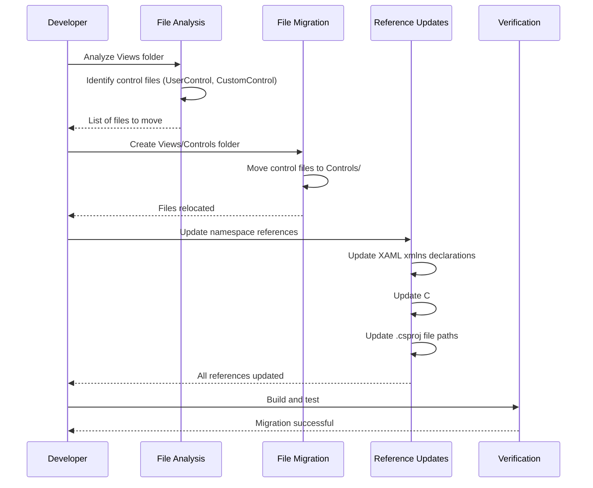

## Why

The Views folder contains mixed XAML files (controls and views) without clear categorization, making it difficult to maintain and navigate. This lack of organization increases cognitive load for developers, slows down file location, and hinders onboarding of new team members.

## What Changes

- Create `Views/Controls` folder structure to separate control files from view files
- Move all control-related XAML files (custom controls, user controls, control templates) from `Views/` to `Views/Controls/`
- Update namespace references in all affected XAML files to use the new `Controls` namespace
- Update file path references in the project file (.csproj) to reflect new locations
- Maintain existing functionality - this is a refactoring, not a behavioral change

## Capabilities

### New Capabilities
- `file-organization-controls`: Organize control-related XAML files in a separate `Views/Controls` folder with proper namespace isolation

### Modified Capabilities
- None (this is a pure refactoring change with no requirement modifications)

## Impact

**Affected Code**:
- All XAML files in `Views/` that reference moved controls (namespace updates)
- All C# code-behind files for moved controls (namespace updates)
- Project file (.csproj) - file path references
- App.axaml or any resource dictionaries that reference moved controls

**No Impact On**:
- API endpoints (none in this project type)
- External dependencies
- Database schemas
- Runtime behavior (functionally equivalent)

**Development Impact**:
- Improves code discoverability and maintainability
- Aligns with Avalonia project best practices
- Facilitates future modularization and component reuse
---

## Visualizations

### Current File Structure
```
Views/
├── MainWindow.axaml              (Window view)
├── LoginWindow.axaml             (Window view)
├── Dashboard.axaml               (Page view)
├── CustomButton.axaml           (Control - mixed with views)
├── DataGridControl.axaml        (Control - mixed with views)
├── SearchBox.axaml              (Control - mixed with views)
└── [many more mixed files...]
```

### Target File Structure
```
Views/
├── MainWindow.axaml              (Window view)
├── LoginWindow.axaml             (Window view)
├── Dashboard.axaml               (Page view)
└── Controls/                     (NEW: Controls folder)
    ├── CustomButton.axaml       (Control)
    ├── DataGridControl.axaml    (Control)
    ├── SearchBox.axaml          (Control)
    └── [all other controls...]
```

### Migration Flow


### Code Change Inventory

| File Path | Change Type | Change Description | Impact Scope |
|-----------|-------------|-------------------|--------------|
| `Views/*.axaml` | Namespace Update | Add `xmlns:Controls="using:MaterialClient.Views.Controls"` | All view files |
| `Views/Controls/*.axaml` | Move + Namespace Update | Move from Views/ and update x:Class namespace | Control files |
| `Views/Controls/*.axaml.cs` | Namespace Update | Update namespace from `MaterialClient.Views` to `MaterialClient.Views.Controls` | Control code-behind |
| `MaterialClient.csproj` | Path Update | Update file paths for moved XAML files | Project file |
| `App.axaml` | Optional: Resource Update | Update resource dictionary references if needed | Application resources |
