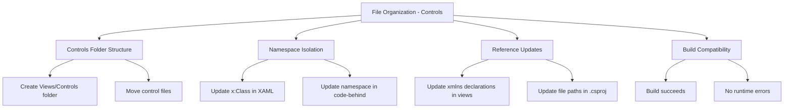

# Spec: File Organization - Controls

## Overview

This spec defines the requirements for organizing control-related XAML files in a separate `Views/Controls` folder with proper namespace isolation, improving code maintainability and project structure.

## ADDED Requirements

### Requirement: Controls folder structure exists
The project SHALL maintain a `Views/Controls` folder structure for organizing control-related XAML files separate from view files.

#### Scenario: Folder exists after migration
- **WHEN** developer navigates to the Views folder
- **THEN** a Controls subfolder SHALL exist containing all control-related XAML files

#### Scenario: Controls folder contains only controls
- **WHEN** developer lists files in Views/Controls
- **THEN** all files SHALL be control-related (UserControl, CustomControl, or control templates)

### Requirement: Control files use correct namespace
All control-related XAML files and their code-behind files SHALL use the `MaterialClient.Views.Controls` namespace.

#### Scenario: Control XAML file has correct x:Class
- **WHEN** developer opens a control XAML file in Views/Controls
- **THEN** the x:Class attribute SHALL use `MaterialClient.Views.Controls.<ControlName>`

#### Scenario: Control code-behind uses correct namespace
- **WHEN** developer opens a control code-behind file (.axaml.cs)
- **THEN** the namespace SHALL be `MaterialClient.Views.Controls`

### Requirement: View files reference controls with proper namespace
View files that use controls SHALL reference them using the `Controls` namespace prefix.

#### Scenario: View file declares Controls namespace
- **WHEN** developer opens a view XAML file that uses controls
- **THEN** the file SHALL include `xmlns:Controls="using:MaterialClient.Views.Controls"`

#### Scenario: View file uses Controls prefix
- **WHEN** developer references a control in a view XAML file
- **THEN** the control SHALL be referenced using the `Controls:` prefix (e.g., `<Controls:DataGridControl />`)

### Requirement: Project file reflects correct file paths
The project file (.csproj) SHALL reference all moved XAML files with their new relative paths under Views/Controls.

#### Scenario: Project file lists controls with new paths
- **WHEN** developer opens the .csproj file
- **THEN** control file entries SHALL reference Views/Controls/<filename>.axaml

#### Scenario: Project builds successfully
- **WHEN** developer builds the project
- **THEN** the build SHALL succeed without file-not-found errors

### Requirement: No behavioral changes introduced
The migration SHALL preserve all existing functionality and behavior without introducing breaking changes to the application.

#### Scenario: Application runs successfully
- **WHEN** developer runs the application
- **THEN** the application SHALL launch without errors related to file location or namespaces

#### Scenario: Controls render correctly
- **WHEN** user views a page containing controls
- **THEN** all controls SHALL render identically to pre-migration behavior

---

## Capability Model

## Requirements Summary

| Requirement ID | Description | Priority |
|---------------|-------------|----------|
| FR-FOC-01 | Controls folder structure exists | High |
| FR-FOC-02 | Control files use correct namespace | High |
| FR-FOC-03 | View files reference controls with proper namespace | High |
| FR-FOC-04 | Project file reflects correct file paths | High |
| FR-FOC-05 | No behavioral changes introduced | Critical |

## Testing Considerations

- **Build Test**: Ensure project builds without errors after migration
- **Runtime Test**: Verify application launches and all controls render correctly
- **Reference Test**: Verify all XAML files that use controls reference them correctly
- **Namespace Test**: Verify all moved files use the correct namespace
