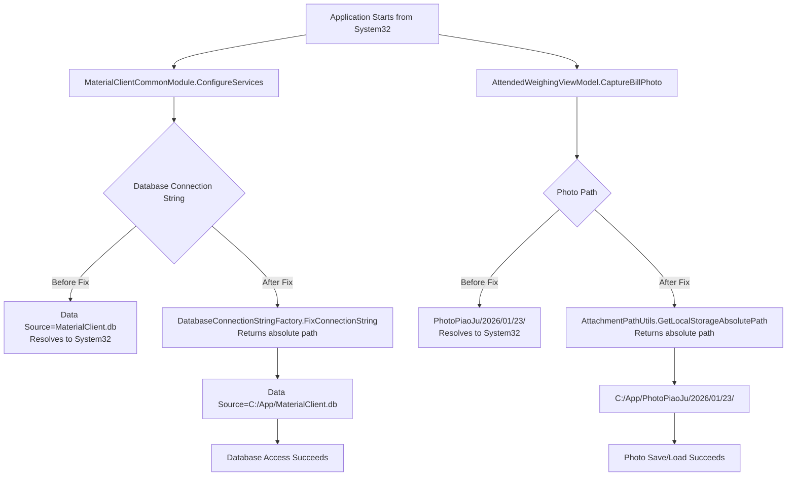
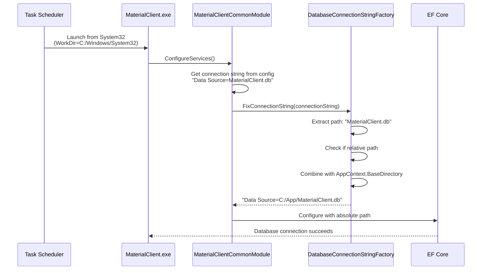
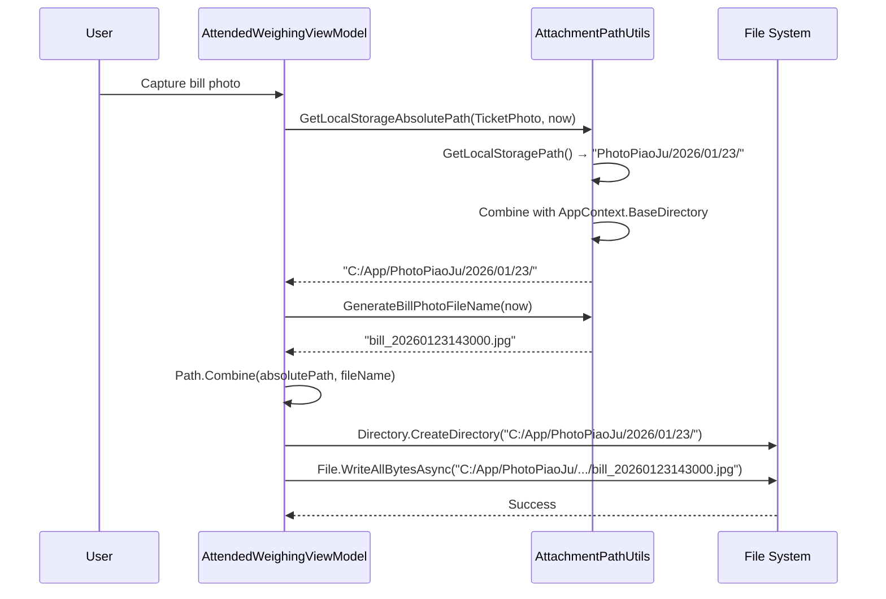

# Design: Fix Path Resolution from System32

## Context

MaterialClient uses relative paths for:
1. SQLite database: `"Data Source=MaterialClient.db"`
2. Attachment storage: `"PhotoPiaoJu/{year}/{MM}/{dd}/"` and `"PhotoJianKong/{year}/{MM}/{dd}/"`

When Windows Task Scheduler or Registry auto-start launches the application, the process starts with `C:\Windows\System32` as the working directory. This causes relative paths to resolve incorrectly:
- `MaterialClient.db` → `C:\Windows\System32\MaterialClient.db`
- `PhotoPiaoJu/...` → `C:\Windows\System32\PhotoPiaoJu/...`

**Project Convention**: Per `openspec/project.md`, configuration-unrelated logic (path resolution, resource creation) MUST be implemented in factory methods in `MaterialClient.Common/Utils/` (static) or `MaterialClient.Common/Providers/` (DI), NOT in business code or configuration initialization code.

## Goals / Non-Goals

**Goals:**
- Fix database and attachment paths when started from any working directory
- Use absolute paths based on application executable location (`AppContext.BaseDirectory`)
- Maintain existing factory method pattern (use `DatabaseConnectionStringFactory`, extend `AttachmentPathUtils`)
- Zero code changes required in business logic or ViewModels

**Non-Goals:**
- Changing global working directory (avoids side effects)
- Modifying attachment storage structure or naming conventions
- Changing database file location
- Supporting custom base directories (always use `AppContext.BaseDirectory`)

## Decisions

### Decision 1: Use Existing Factory Method Pattern

**Choice**: Use existing `DatabaseConnectionStringFactory.FixConnectionString()` for database, extend `AttachmentPathUtils` for attachments.

**Rationale**:
- Follows established project convention (static factory methods in `Utils/`)
- `DatabaseConnectionStringFactory` already implements the exact pattern we need
- Centralized path resolution logic in utility classes
- No changes needed in business code or ViewModels

**Alternatives considered**:
1. ❌ Modify `Environment.CurrentDirectory` globally → Side effects on other code
2. ❌ Change all callers to pass absolute paths → Violates factory method pattern
3. ❌ Store paths in configuration → Not appropriate for deployment-agnostic path resolution

### Decision 2: Attachment Path Resolution Strategy

**Choice**: Add `GetLocalStorageAbsolutePath()` method that internally calls `GetLocalStoragePath()` and prepends `AppContext.BaseDirectory`.

**Rationale**:
- Minimal changes to `AttachmentPathUtils` (add one method)
- Preserves existing relative path methods for OSS usage
- Clear separation: relative paths for OSS, absolute paths for local file system
- Follows same pattern as `DatabaseConnectionStringFactory.FixConnectionString()`

**Implementation**:
```csharp
public static string GetLocalStorageAbsolutePath(AttachType attachType, DateTime? date = null)
{
    var relativePath = GetLocalStoragePath(attachType, date);
    var appDirectory = AppContext.BaseDirectory;
    return Path.Combine(appDirectory, relativePath);
}
```

### Decision 3: Database Connection String Fix Location

**Choice**: Call `DatabaseConnectionStringFactory.FixConnectionString()` in `MaterialClientCommonModule.ConfigureServices()` before passing to EF Core.

**Rationale**:
- Single point of configuration initialization
- Happens before any database access
- Factory method exists but is not currently used in configuration initialization
- Minimal code change (one line)

**Implementation**:
```csharp
// In MaterialClientCommonModule.ConfigureServices()
var connectionString = configuration.GetConnectionString("Default") 
                       ?? "Data Source=MaterialClient.db";
// FIX: Convert relative path to absolute path
connectionString = DatabaseConnectionStringFactory.FixConnectionString(connectionString);

services.Configure<AbpDbContextOptions>(options => { ... });
```

### Decision 4: Ticket Printing Service Path Resolution

**Choice**: Add path resolution at service entry points (`PrintToPdf`, `PrintImageToPdf`, `RenderTicketToImage`) to convert relative paths to absolute paths.

**Rationale**:
- Service receives paths from callers (ViewModels, other services)
- Cannot control what callers provide (may be relative or absolute)
- Must handle both cases defensively
- Entry point is the right place to normalize paths (single responsibility)

**Implementation**:
```csharp
// In TicketPrintingService.PrintToPdf()
public string PrintToPdf(WeighingTicketDto dto, string outputPdfPath)
{
    // FIX: Convert relative path to absolute path at entry point
    if (!Path.IsPathRooted(outputPdfPath))
    {
        outputPdfPath = Path.Combine(AppContext.BaseDirectory, outputPdfPath);
    }
    
    // Ensure output directory exists
    var outputDir = Path.GetDirectoryName(outputPdfPath);
    if (!string.IsNullOrEmpty(outputDir) && !Directory.Exists(outputDir))
    {
        Directory.CreateDirectory(outputDir);
    }
    // ... rest of implementation
}

// Same pattern for PrintImageToPdf() and RenderTicketToImage()
```

**Why at entry point**:
1. Callers don't need to change (backward compatible)
2. Single place to handle path normalization per method
3. Service maintains defensive programming (accepts both relative and absolute paths)
4. Clear separation of concerns (path resolution in service, not caller)

## Technical Design

### Code Flow Changes



### Sequence Diagram: Startup Path Resolution



### Sequence Diagram: Photo Capture Path Resolution



## Risks / Trade-offs

### Risk 1: Existing Database Files with Absolute Paths
**Impact**: If users manually configured absolute paths in `appsettings.json`, `FixConnectionString()` will preserve them (no-op for absolute paths).
**Mitigation**: Factory method already handles this case correctly (checks `Path.IsPathRooted()`).

### Risk 2: Code Already Using AttachmentPathUtils
**Impact**: Existing code calls `GetLocalStoragePath()` which returns relative paths.
**Mitigation**: 
- Keep `GetLocalStoragePath()` unchanged (used for OSS paths)
- New code should use `GetLocalStorageAbsolutePath()` for local file system
- Update `GetBillPhotoFullPath()` and `GetMonitoringPhotoFullPath()` to use absolute paths internally
- This way, all existing callers automatically get fixed paths

### Risk 3: Test Environment Differences
**Impact**: Tests might run with different working directories.
**Mitigation**: Absolute paths based on `AppContext.BaseDirectory` work consistently in all environments.

## Migration Plan

### Deployment Steps
1. Update `MaterialClientCommonModule.cs` to fix database connection string
2. Update `AttachmentPathUtils.cs` to return absolute paths
3. Deploy updated application
4. Restart application (automatic fix applies on next start)

### Rollback
If issues occur:
1. Revert to previous version
2. Application will continue working from its own directory
3. No data migration needed (file locations unchanged)

### Verification
- Monitor logs for `SQLite Error 14` (should disappear)
- Verify database migrations complete successfully
- Verify photo capture and loading works
- Test Task Scheduler auto-start scenario

## Components Indirectly Fixed

The following components will automatically benefit from the path resolution fix without requiring any code changes:

### 1. HikvisionService Camera Capture

**Current Implementation** (`MaterialClient.Common/Services/Hikvision/HikvisionService.cs:66-73`):
```csharp
public bool CaptureJpeg(HikvisionDeviceConfig config, int channel, string saveFullPath, int quality = 90)
{
    // ...
    Directory.CreateDirectory(Path.GetDirectoryName(Path.GetFullPath(saveFullPath))!);
    // ...
}
```

**Why it's fixed**:
- `HikvisionService.CaptureJpeg()` receives `saveFullPath` parameter from callers
- Callers use `AttachmentPathUtils.GetMonitoringPhotoFullPath()` to generate paths
- After fix: `GetMonitoringPhotoFullPath()` internally uses `GetLocalStorageAbsolutePath()` → returns absolute path
- `Path.GetFullPath(absolutePath)` is a no-op (returns the path unchanged)
- Result: Photo saves to correct application directory, not System32

**Call chain**:
```
AttendedWeighingService
  → AttachmentPathUtils.GetMonitoringPhotoFullPath()
    → GetLocalStorageAbsolutePath() [NEW: returns absolute path]
  → HikvisionService.CaptureJpeg(absolutePath)
    → Path.GetFullPath(absolutePath) [no-op]
    → Directory.CreateDirectory(appDir/PhotoJianKong/...)
```

### 2. AttendedWeighingService Photo Attachment Creation

**Current Implementation** (`MaterialClient.Common/Services/AttendedWeighingService.cs:1395`):
```csharp
var attachmentFile = new AttachmentFile(fileName, photoPath, AttachType.UnmatchedEntryPhoto);
```

**Why it's fixed**:
- `photoPath` comes from camera services, which use `AttachmentPathUtils`
- After fix: All paths are absolute
- Database stores absolute paths
- Photo loading will work correctly from any working directory

### 3. AttendedWeighingViewModel Bill Photo Capture

**Current Implementation** (`MaterialClient/ViewModels/AttendedWeighingViewModel.cs:1668-1674`):
```csharp
var photosDir = AttachmentPathUtils.GetLocalStoragePath(AttachType.TicketPhoto, now);
var fileName = AttachmentPathUtils.GenerateBillPhotoFileName(now);
if (!Directory.Exists(photosDir)) Directory.CreateDirectory(photosDir);
var filePath = Path.Combine(photosDir, fileName);
await File.WriteAllBytesAsync(filePath, frameData);
```

**Why it's fixed**:
- Change `GetLocalStoragePath()` → `GetLocalStorageAbsolutePath()` in implementation
- All directory creation and file writes will use absolute paths
- Photos save to application directory, not System32

### 4. OssUploadService File Upload

**Current Implementation** (`MaterialClient.Common/Services/OssUploadService.cs:56-60`):
```csharp
if (!File.Exists(localPath))
{
    _logger?.LogWarning("本地文件不存在: {LocalPath}", localPath);
    return null;
}
```

**Why it's fixed**:
- `localPath` is read from database `AttachmentFile.LocalPath`
- After fix: Database contains absolute paths
- `File.Exists()` will find files regardless of working directory

### 5. Photo Display in ViewModels

**Components**:
- `AttendedWeighingViewModel` - Displays vehicle photos and bill photos
- `ManualMatchEditWindowViewModel` - Displays entry/exit photos
- `PhotoGridViewModel` - Displays photo grid
- `ImageViewerViewModel` - Full-screen photo viewer

**Why they're fixed**:
- All read `AttachmentFile.LocalPath` from database
- After fix: Database contains absolute paths
- Image loading (Avalonia's `Bitmap.DecodeToWidth()`) works with absolute paths regardless of working directory

### 6. TicketPrintingService PDF/Image Output

**Current Implementation** (`MaterialClient.Common/Services/Hardware/TicketPrintingService.cs:142-149`):
```csharp
public string PrintToPdf(WeighingTicketDto dto, string outputPdfPath)
{
    // Ensure output directory exists
    var outputDir = Path.GetDirectoryName(outputPdfPath);
    if (!string.IsNullOrEmpty(outputDir) && !Directory.Exists(outputDir))
    {
        Directory.CreateDirectory(outputDir);  // ⚠️ Relative paths create in System32
    }
    // ...
}
```

**Why it needs fixing**:
- Service accepts paths from callers (may be relative)
- If caller provides `"Tickets/ticket_001.pdf"`, it creates in System32
- Current code doesn't normalize paths

**How it's fixed**:
- Add path resolution at method entry: check if path is rooted
- If relative, convert to absolute using `AppContext.BaseDirectory`
- Applies to: `PrintToPdf()`, `PrintImageToPdf()`, `RenderTicketToImage()`

**Implementation**:
```csharp
public string PrintToPdf(WeighingTicketDto dto, string outputPdfPath)
{
    // NEW: Normalize path at entry point
    if (!Path.IsPathRooted(outputPdfPath))
    {
        outputPdfPath = Path.Combine(AppContext.BaseDirectory, outputPdfPath);
    }
    
    // Existing code continues with absolute path
    var outputDir = Path.GetDirectoryName(outputPdfPath);
    if (!string.IsNullOrEmpty(outputDir) && !Directory.Exists(outputDir))
    {
        Directory.CreateDirectory(outputDir);  // ✅ Creates in application directory
    }
    // ...
}
```

**Code changes required**: ✅ Direct fix (3 methods, ~10 lines total)

## Summary of Fix Impact

| Component | Issue Before Fix | How It's Fixed | Code Changes Required |
|-----------|------------------|----------------|----------------------|
| Database access | Relative path → System32 | `DatabaseConnectionStringFactory.FixConnectionString()` | 1 line in `MaterialClientCommonModule.cs` |
| AttachmentPathUtils | Returns relative paths | Add `GetLocalStorageAbsolutePath()` method | New method + update existing methods |
| **TicketPrintingService** | **Accepts relative paths** | **Normalize paths at entry points** | **✅ 3 methods (~10 lines)** |
| HikvisionService | Receives relative paths | Receives absolute paths from callers | ✅ None (indirect fix) |
| AttendedWeighingService | Stores relative paths | Uses absolute paths from `AttachmentPathUtils` | ✅ None (indirect fix) |
| ViewModels photo capture | Creates relative paths | Uses `AttachmentPathUtils` absolute paths | ✅ None (indirect fix) |
| OssUploadService | File.Exists() fails | Reads absolute paths from database | ✅ None (indirect fix) |
| Photo display ViewModels | Image loading fails | Reads absolute paths from database | ✅ None (indirect fix) |

**Total direct code changes**: 3 files modified, ~30 lines of code added
**Total components fixed**: 8+ components (including indirect fixes)

## Out of Scope

The following components have similar path issues but are intentionally **NOT** fixed in this change:

### MaterialClientToolkit
**Location**: `MaterialClientToolkit/Program.cs`

**Issue**:
```csharp
var configuration = new ConfigurationBuilder()
    .SetBasePath(Directory.GetCurrentDirectory())  // Uses working directory
    .AddJsonFile("appsettings.json", optional: true)
    .Build();
```

**Reason for exclusion**:
- MaterialClientToolkit is a standalone command-line tool for data migration
- Typically run manually from its own directory, not via Task Scheduler
- Users explicitly navigate to the tool directory before running it
- Low priority: Not part of the auto-start scenario that triggers this bug

**If needed in the future**: Apply same pattern using `AppContext.BaseDirectory`

## Open Questions

None - solution is straightforward and follows existing patterns.
