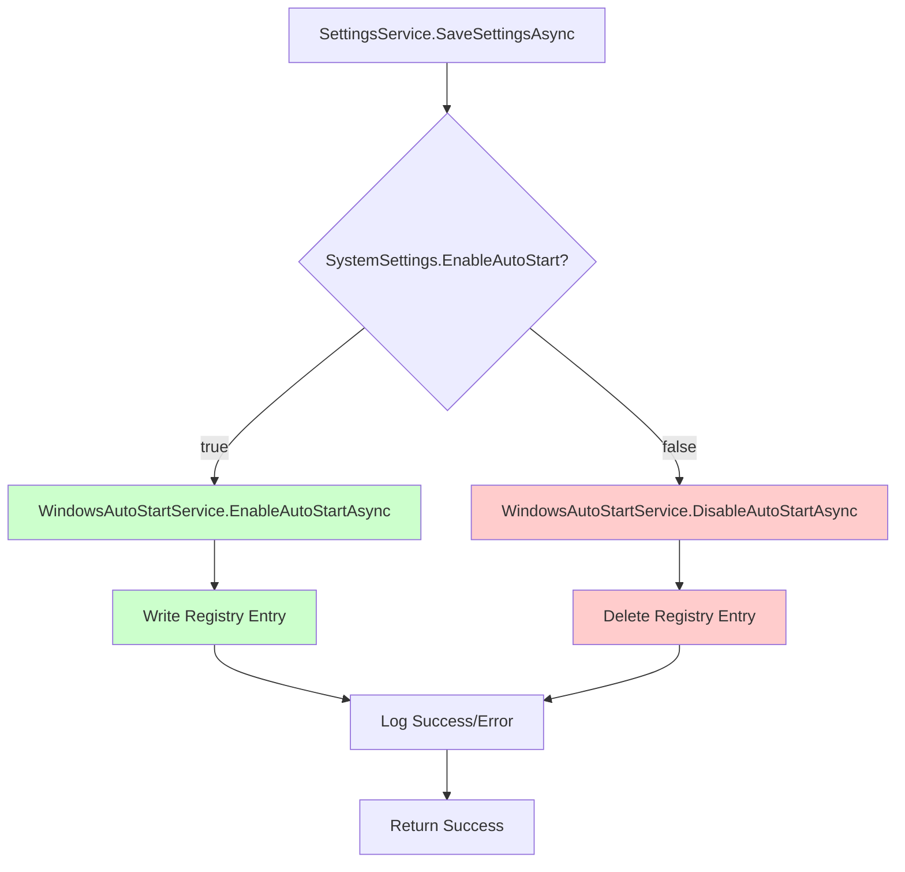
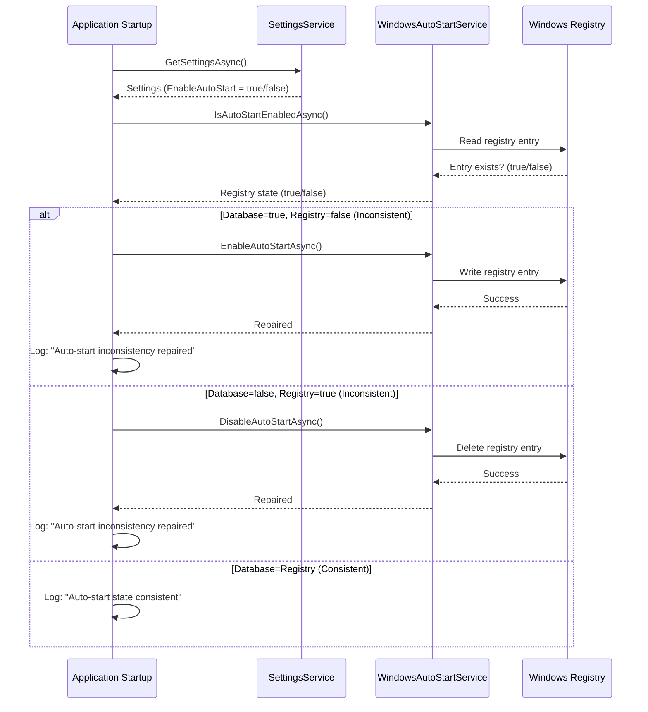
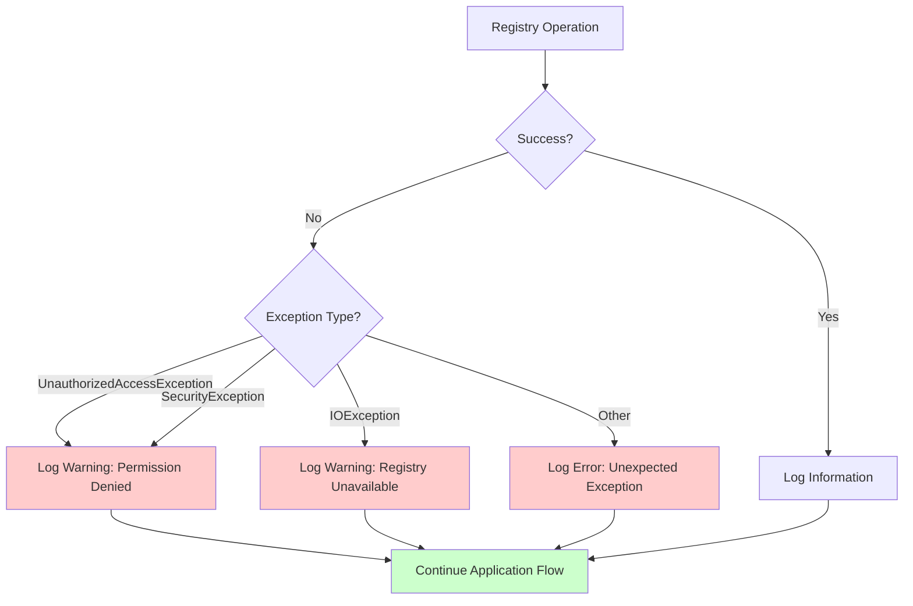

# Design: Windows Auto-Start Implementation

## Context

The application has a UI checkbox for auto-start functionality, and the setting is persisted to the database. However, the actual Windows registry operations to enable/disable auto-start are not implemented. This creates a gap between user expectations and actual behavior.

Windows auto-start is typically managed via the registry key:
- `HKEY_CURRENT_USER\Software\Microsoft\Windows\CurrentVersion\Run` (user-level)
- Or `HKEY_LOCAL_MACHINE\Software\Microsoft\Windows\CurrentVersion\Run` (system-level, requires admin)

Since this is a desktop application that may not always run with admin privileges, we use the user-level registry key.

## Goals / Non-Goals

**Goals:**
- Implement complete auto-start functionality that actually controls Windows behavior
- Ensure database setting and Windows registry stay synchronized
- Automatically repair inconsistencies on application startup
- Handle registry permission errors gracefully
- Maintain backward compatibility (no breaking changes)

**Non-Goals:**
- Supporting system-level auto-start (requires admin, not needed)
- Supporting task scheduler as alternative (registry is simpler and sufficient)
- Supporting startup folder method (registry is more reliable)
- Cross-platform support (Windows-only application per project constraints)
- Auto-start for other users (only current user)

## Decisions

### Decision 1: Registry Location

**Decision:** Use `HKEY_CURRENT_USER\Software\Microsoft\Windows\CurrentVersion\Run` for auto-start entries.

**Rationale:**
- No admin privileges required
- User-specific (each user controls their own auto-start)
- Standard Windows location for user-level auto-start
- Works reliably across Windows versions

**Alternatives considered:**
- `HKEY_LOCAL_MACHINE`: Requires admin privileges, affects all users
- Task Scheduler: More complex, requires COM interop
- Startup folder: Less reliable, can be disabled by group policy

### Decision 2: Registry Value Name

**Decision:** Use application executable name (e.g., "MaterialClient") as registry value name.

**Rationale:**
- Simple and descriptive
- Easy to identify in registry editor
- Unique per application
- Matches common Windows convention

**Alternatives considered:**
- GUID: Too cryptic, hard to identify
- Full path: Too long, unnecessary
- Custom name: Less standard

### Decision 3: Registry Value Data

**Decision:** Store full path to executable (e.g., `C:\Program Files\MaterialClient\MaterialClient.exe`).

**Rationale:**
- Windows requires full path for auto-start entries
- Works regardless of current working directory
- Standard practice for registry auto-start entries

**Implementation:**
```csharp
var executablePath = System.Reflection.Assembly.GetExecutingAssembly().Location;
// Or: Environment.ProcessPath (available in .NET 6+)
```

### Decision 4: Dual Synchronization Mechanism

**Decision:** Implement two synchronization points:
1. **Primary**: When settings are saved (immediate sync)
2. **Fallback**: On application startup (repair inconsistencies)

**Rationale:**
- Primary sync ensures immediate consistency when user changes setting
- Fallback sync repairs any inconsistencies that may occur (manual registry edits, migration, etc.)
- Provides resilience against external changes
- Minimal performance impact (startup check is fast)

**Alternatives considered:**
- Only sync on save: Leaves inconsistencies if registry is manually modified
- Only sync on startup: Delayed consistency, user doesn't see immediate effect
- Sync on both: Best of both worlds, minimal overhead

### Decision 5: Error Handling Strategy

**Decision:** Catch registry exceptions, log warnings, but don't block application flow.

**Rationale:**
- Registry operations can fail due to permissions, corruption, etc.
- Application should continue to function even if auto-start sync fails
- Logging provides troubleshooting information
- User can still use application normally

**Implementation:**
```csharp
try
{
    // Registry operation
}
catch (UnauthorizedAccessException ex)
{
    _logger.LogWarning(ex, "Registry permission denied for auto-start operation");
    // Continue without failing
}
catch (Exception ex)
{
    _logger.LogError(ex, "Unexpected error during auto-start operation");
    // Continue without failing
}
```

**Alternatives considered:**
- Fail fast: Too disruptive, breaks user experience
- Silent failure: No visibility for troubleshooting
- Retry mechanism: Over-engineering for rare failures

### Decision 6: Service Interface Design

**Decision:** Create `IWindowsAutoStartService` with async methods:
- `Task EnableAutoStartAsync()`
- `Task DisableAutoStartAsync()`
- `Task<bool> IsAutoStartEnabledAsync()`

**Rationale:**
- Async pattern matches rest of codebase
- Clear separation of concerns
- Easy to mock for testing
- Follows dependency injection pattern

**Alternatives considered:**
- Synchronous methods: Doesn't match codebase patterns
- Single method with boolean parameter: Less clear intent
- Event-based: Over-complicated for simple operations

## Technical Design

### Service Implementation

```csharp
public interface IWindowsAutoStartService
{
    Task EnableAutoStartAsync();
    Task DisableAutoStartAsync();
    Task<bool> IsAutoStartEnabledAsync();
}

public class WindowsAutoStartService : IWindowsAutoStartService
{
    private const string RegistryKeyPath = @"Software\Microsoft\Windows\CurrentVersion\Run";
    private readonly string _registryValueName;
    private readonly string _executablePath;
    private readonly ILogger<WindowsAutoStartService> _logger;

    public WindowsAutoStartService(ILogger<WindowsAutoStartService> logger)
    {
        _logger = logger;
        _registryValueName = "MaterialClient"; // Or from configuration
        _executablePath = Environment.ProcessPath ?? 
            System.Reflection.Assembly.GetExecutingAssembly().Location;
    }

    public async Task EnableAutoStartAsync()
    {
        await Task.Run(() =>
        {
            try
            {
                using var key = Registry.CurrentUser.OpenSubKey(RegistryKeyPath, true);
                key?.SetValue(_registryValueName, _executablePath);
                _logger.LogInformation("Auto-start enabled in registry");
            }
            catch (Exception ex)
            {
                _logger.LogWarning(ex, "Failed to enable auto-start in registry");
                // Don't throw - allow application to continue
            }
        });
    }

    public async Task DisableAutoStartAsync()
    {
        await Task.Run(() =>
        {
            try
            {
                using var key = Registry.CurrentUser.OpenSubKey(RegistryKeyPath, true);
                key?.DeleteValue(_registryValueName, throwOnMissingValue: false);
                _logger.LogInformation("Auto-start disabled in registry");
            }
            catch (Exception ex)
            {
                _logger.LogWarning(ex, "Failed to disable auto-start in registry");
                // Don't throw - allow application to continue
            }
        });
    }

    public async Task<bool> IsAutoStartEnabledAsync()
    {
        return await Task.Run(() =>
        {
            try
            {
                using var key = Registry.CurrentUser.OpenSubKey(RegistryKeyPath, false);
                var value = key?.GetValue(_registryValueName);
                return value != null && value.ToString() == _executablePath;
            }
            catch (Exception ex)
            {
                _logger.LogWarning(ex, "Failed to check auto-start status in registry");
                return false; // Conservative default
            }
        });
    }
}
```

### Integration with SettingsService



### Startup Synchronization Flow



### Error Handling Flow



## Risks / Trade-offs

### Risk: Registry Permission Errors

**Risk:** User may not have write permissions to registry (rare but possible).

**Mitigation:**
- Use `HKEY_CURRENT_USER` (user-level, typically has write access)
- Catch `UnauthorizedAccessException` and log warning
- Don't block application startup or settings save
- Document troubleshooting steps

**Acceptance:** Low probability, graceful degradation acceptable.

### Risk: Registry Corruption

**Risk:** Windows registry could be corrupted or unavailable.

**Mitigation:**
- Catch all exceptions from registry operations
- Log errors for troubleshooting
- Application continues to function normally
- User can manually fix registry if needed

**Acceptance:** Very rare, graceful handling sufficient.

### Trade-off: Performance vs Consistency

**Trade-off:** Startup sync adds small delay (<10ms) but ensures consistency.

**Acceptance:** Minimal performance impact, significant consistency benefit.

### Trade-off: Complexity vs Resilience

**Trade-off:** Dual sync mechanism adds code complexity but provides resilience.

**Acceptance:** Complexity is minimal, resilience is valuable.

## Migration Plan

**No migration required** - this is a new feature addition, not a change to existing functionality.

**Deployment:**
1. Deploy code with new `WindowsAutoStartService`
2. Register service in DI container
3. Existing database settings will be respected on first startup
4. Registry entries will be created/removed based on database state

**Rollback:**
- Revert code changes
- No data cleanup needed (registry entries can remain, won't cause issues)
- Database settings remain unchanged

## Open Questions

None - requirements are clear from user request and codebase analysis.