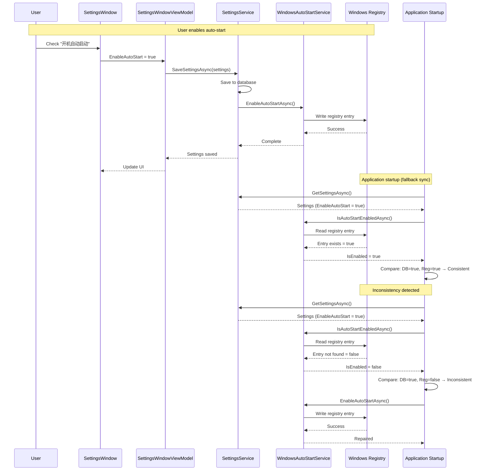

# Change: Implement Windows Auto-Start Functionality

**Change ID**: `implement-windows-auto-start`
**Status**: Draft
**Created**: 2026-01-23
**Type**: Feature

---

## Why

### Background

The application currently has a UI checkbox for "开机自动启动" (Auto-start on boot) in the settings window, and the `EnableAutoStart` setting is persisted to the database. However, the actual Windows auto-start functionality is not implemented. When users enable this setting, nothing happens at the system level - the application is not added to Windows startup registry entries.

### Problems

1. **Incomplete Feature**: The UI and data model exist, but the core functionality is missing. Users can toggle the setting, but it has no effect on system behavior.

2. **Data Inconsistency Risk**: If the database setting is enabled but the Windows registry entry doesn't exist (or vice versa), the application state becomes inconsistent. This can happen if:
   - Users manually delete registry entries
   - Settings are migrated from another machine
   - Registry permissions prevent writes
   - Application is uninstalled/reinstalled

3. **User Expectation Gap**: Users expect the checkbox to actually control auto-start behavior, but currently it only saves a preference that is never applied.

---

## What Changes

### Overview

Implement complete Windows auto-start functionality with dual synchronization mechanism:
1. **Primary sync**: Apply registry changes when settings are saved
2. **Fallback sync**: Check and repair inconsistencies on application startup

### Detailed Changes

1. **Create `WindowsAutoStartService`**:
   - Service to manage Windows registry entries for auto-start
   - Methods: `EnableAutoStartAsync()`, `DisableAutoStartAsync()`, `IsAutoStartEnabledAsync()`
   - Registry location: `HKEY_CURRENT_USER\Software\Microsoft\Windows\CurrentVersion\Run`
   - Registry value name: Application name (e.g., "MaterialClient")

2. **Integrate with `SettingsService`**:
   - After saving settings, call `WindowsAutoStartService` to sync registry state
   - Ensure database setting and Windows registry are always in sync

3. **Add startup synchronization**:
   - On application startup, check if database setting matches registry state
   - If inconsistent, repair by applying database setting to registry
   - Log inconsistencies for troubleshooting

4. **Error handling**:
   - Handle registry permission errors gracefully
   - Log warnings when registry operations fail
   - Do not block application startup if registry sync fails

---

## Code Flow Changes

---

## Impact

### Expected Benefits

- **Complete Feature**: Auto-start functionality works as users expect
- **Data Consistency**: Database and Windows registry stay synchronized
- **Resilience**: Automatic repair of inconsistencies on startup
- **User Trust**: Settings actually control system behavior

### Risks and Mitigations

| Risk | Impact | Mitigation |
|------|--------|------------|
| Registry permission errors | High | Catch exceptions, log warnings, don't block startup |
| Registry corruption | Medium | Validate registry operations, handle gracefully |
| Inconsistent state on startup | Medium | Automatic repair mechanism on startup |
| Performance impact | Low | Registry operations are fast (<10ms) |
| Cross-platform compatibility | N/A | Windows-only application (per project constraints) |

### Affected Specs

- **New capability**: `system-configuration` - System configuration management including auto-start

### Affected Code

- **New service**: `MaterialClient.Common/Services/WindowsAutoStartService.cs`
- **Modified**: `MaterialClient.Common/Services/SettingsService.cs` (add registry sync after save)
- **Modified**: `MaterialClient/App.axaml.cs` or `MaterialClient/Services/StartupService.cs` (add startup sync check)
- **Dependencies**: `Microsoft.Win32.Registry` (built-in .NET library)

### Breaking Changes

None - this is a new feature addition.

---

## Success Criteria

- [ ] `WindowsAutoStartService` can enable/disable auto-start in Windows registry
- [ ] Settings save operation synchronizes registry state
- [ ] Application startup detects and repairs inconsistencies
- [ ] Registry permission errors are handled gracefully
- [ ] Unit tests cover registry operations (with mocking)
- [ ] Integration test verifies end-to-end flow
- [ ] UI checkbox correctly reflects actual system state

---

## Next Steps

1. Review and approve this proposal
2. Implement `WindowsAutoStartService`
3. Integrate with `SettingsService`
4. Add startup synchronization
5. Write tests
6. Validate on Windows system

---

## References

- `MaterialClient/Views/SettingsWindow.axaml` (lines 397-398) - UI checkbox
- `MaterialClient.Common/Configuration/SystemSettings.cs` - EnableAutoStart property
- `MaterialClient.Common/Services/SettingsService.cs` - Settings persistence
- `MaterialClient/App.axaml.cs` - Application startup flow