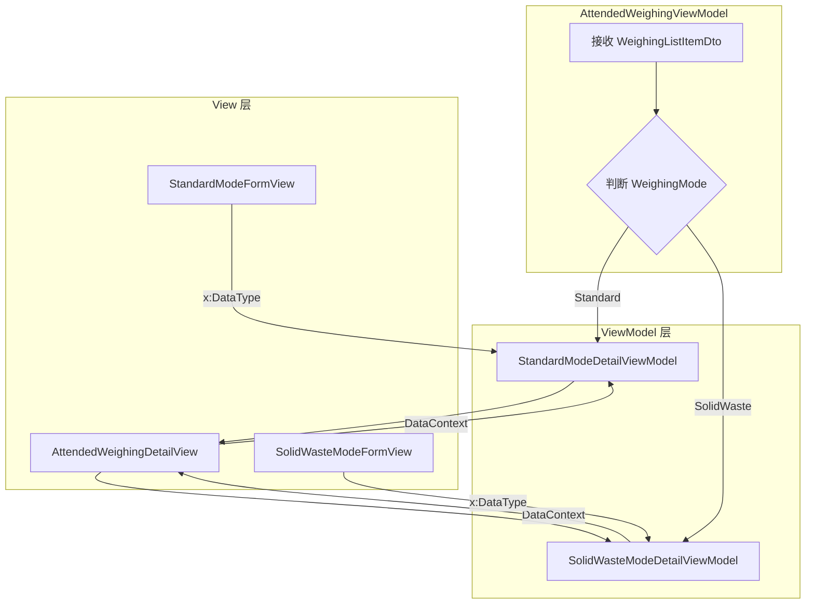
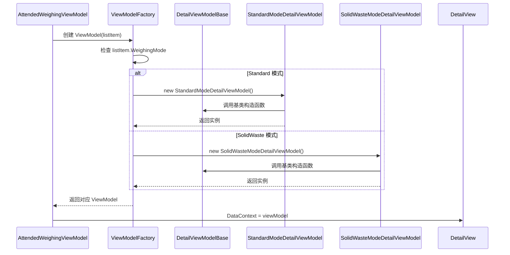

# 分离固废模式和标准模式的 ViewModel

## Why

当前 `AttendedWeighingDetailViewModel.cs`（约 1555 行）同时处理"固废模式"和"标准模式"两种业务场景，导致职责不清、代码难以维护。View 层已分离为 `StandardModeFormView` 和 `SolidWasteModeFormView`，但 ViewModel 层仍耦合在一起，限制了后续功能扩展和独立测试。

## What Changes

### **BREAKING** 架构重构

- 将 `AttendedWeighingDetailViewModel` 拆分为基类 + 两个派生类
- 提取共享逻辑到 `AttendedWeighingDetailViewModelBase` 抽象基类
- 创建 `StandardModeDetailViewModel` 处理标准称重流程
- 创建 `SolidWasteModeDetailViewModel` 处理固废称重流程
- 更新 `AttendedWeighingDetailView` 根据模式动态选择 ViewModel
- 更新 `StandardModeFormView` 和 `SolidWasteModeFormView` 的绑定

### 代码变更清单

| 文件路径 | 变更类型 | 变更原因 | 影响范围 |
|---------|---------|---------|---------|
| `ViewModels/AttendedWeighingDetailViewModelBase.cs` | 新增 | 提取共享逻辑 | 基类 |
| `ViewModels/StandardModeDetailViewModel.cs` | 新增 | 标准模式专用 | 派生类 |
| `ViewModels/SolidWasteModeDetailViewModel.cs` | 新增 | 固废模式专用 | 派生类 |
| `ViewModels/AttendedWeighingDetailViewModel.cs` | 删除 | 已拆分 | - |
| `Views/Controls/AttendedWeighingDetailView.axaml.cs` | 修改 | 动态选择 ViewModel | View |
| `Views/Controls/StandardModeFormView.axaml` | 修改 | 更新绑定类型 | View |
| `Views/Controls/SolidWasteModeFormView.axaml` | 修改 | 更新绑定类型 | View |
| `ViewModels/AttendedWeighingViewModel.cs` | 修改 | 更新 ViewModel 创建逻辑 | 父级 ViewModel |

## Capabilities

### New Capabilities

- `weighing-mode-viewmodels`: 定义称重模式 ViewModel 的架构规范，包括基类接口、模式切换机制、数据绑定约定

### Modified Capabilities

- `attended-weighing`: 更新视图与 ViewModel 的绑定关系，明确模式特定的 ViewModel 选择规则

## Impact

### 代码影响

```
ViewModels/
├── AttendedWeighingDetailViewModelBase.cs  (新增，约 400 行)
│   └── 共享属性：Weight、PlateNumber、Remark、DeliveryType 等
│   └── 共享命令：Close、Abolish、Match
│   └── 抽象方法：SaveCoreAsync()、CompleteCoreAsync()
│
├── StandardModeDetailViewModel.cs  (新增，约 500 行)
│   └── Providers、Materials、MaterialItems
│   └── MaterialsSelectionPopupViewModel
│   └── SaveCoreAsync → UpdateListItemAsync()
│
└── SolidWasteModeDetailViewModel.cs  (新增，约 600 行)
    └── SolidWasteOrderNumber、Streets、SolidWasteTypes
    └── 三个增强型选择弹窗
    └── SaveCoreAsync → UpdateSolidWasteModeAsync()
```

### 数据流



### API 调用时序



### 风险评估

| 风险 | 影响 | 缓解措施 |
|-----|-----|---------|
| 绑定路径变更 | 高 | 保持属性名称不变，仅改变类型层次 |
| 事件订阅丢失 | 中 | 在基类中保留所有事件定义 |
| DI 注册变更 | 低 | 注册两个派生类，使用接口区分 |

### 向后兼容性

- **不考虑向后兼容**：本次变更为纯重构，可一次性替换
- 数据库无变更
- API 无变更
- 用户界面无变更
