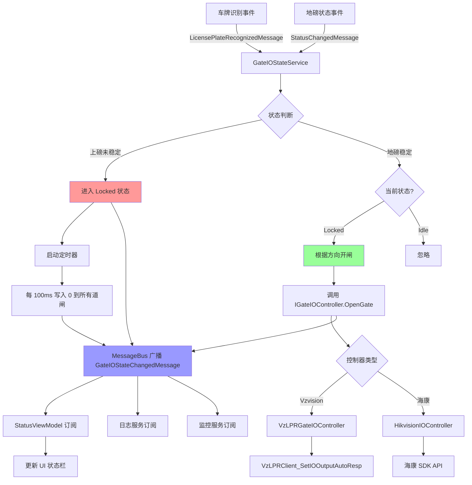
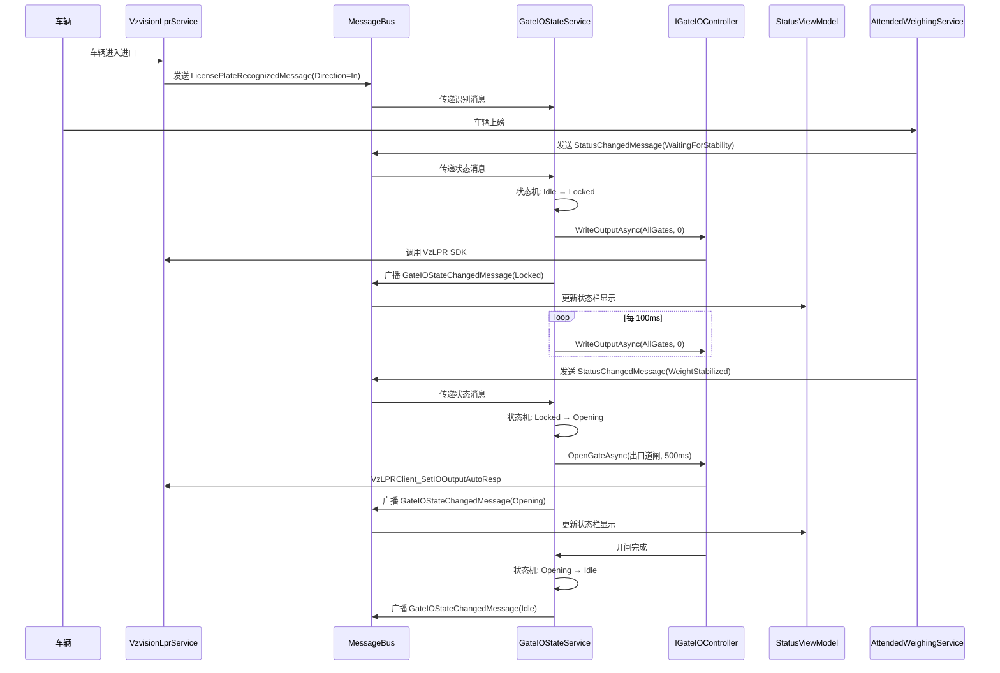
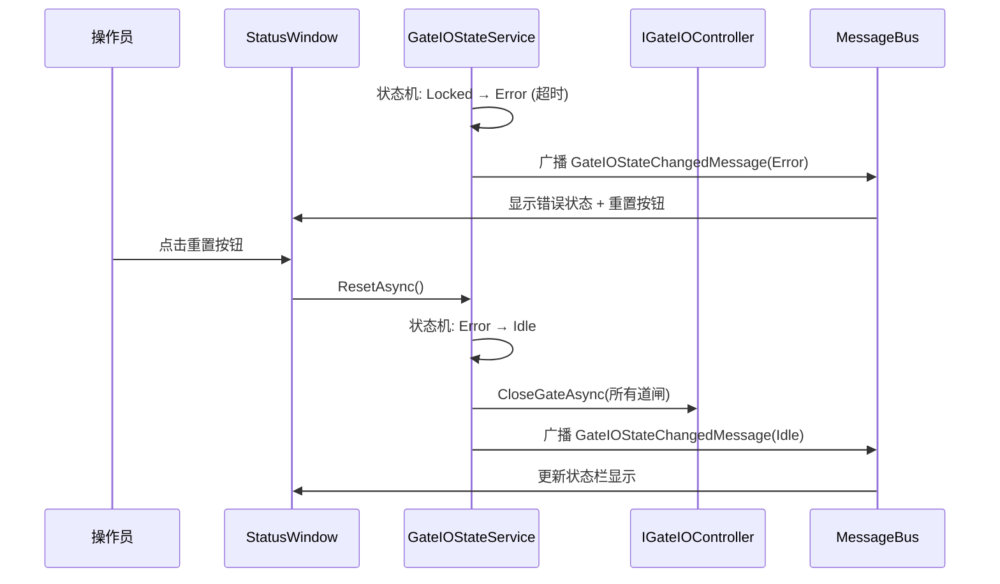

# 道闸 IO 控制系统重构 - 技术设计

## Context

### 当前状态

现有道闸 IO 控制功能通过 `LprGateIoControlService` 实现，采用简单的"识别即开闸"模式：

```
车牌识别 → MessageBus → LprGateIoControlService → VzLPRClient_SetIOOutputAutoResp(500ms)
```

**当前架构缺陷**：
- **无状态感知**：不订阅地磅状态事件，无法判断车辆是否在磅上
- **无锁定机制**：车辆上磅未稳定时无法锁定道闸
- **高耦合度**：IO 控制逻辑直接依赖 Vzvision SDK，难以扩展其他 IO 控制器
- **无异常处理**：缺乏状态查询和人工干预接口
- **配置无验证**：启动时不检查进出口道闸配置完整性

### 现有技术栈

项目已使用 **ReactiveUI + System.Reactive** 作为响应式框架：
- `MessageBus.Current.SendMessage()` - 事件广播
- `BehaviorSubject<T>` - 状态流管理
- `IObservable<T>` - 事件订阅

**地磅状态管理**（`AttendedWeighingService`）：
```csharp
private readonly BehaviorSubject<AttendedWeighingStatus> _statusSubject;
// 状态枚举: OffScale, WaitingForStability, WeightStabilized, WaitingForDeparture
MessageBus.Current.SendMessage(new StatusChangedMessage(newStatus));
```

### 约束条件

- **领域分离**：道闸 IO 是独立的业务领域，使用专门的 `GateIODirection` 枚举而非复用 LPR 的 `LicensePlateDirection`
- **向后兼容**：必须兼容现有 `LicensePlateRecognitionConfig` 配置结构
- **最小依赖**：不引入新的第三方库（复用现有 ReactiveUI）
- **渐进式部署**：支持功能开关，未启用道闸 IO 的设备不受影响
- **性能要求**：状态管理开销 < 10ms，道闸控制延迟 < 100ms

### 枚举设计：道闸进出口方向

**新增枚举**：`GateIODirection`
```csharp
public enum GateIODirection
{
    Entry,  // 进口道闸
    Exit    // 出口道闸
}
```

**设计理由**：
- **语义独立**：道闸的进出口概念与 LPR 的进出口概念虽然相似，但属于不同业务领域
- **避免耦合**：如果 LPR 的方向定义变化（如增加"双向"），不会影响道闸 IO 控制
- **清晰明确**：`GateIODirection.Entry/Exit` 比 `LicensePlateDirection.In/Out` 语义更清晰
- **映射关系**：在配置验证时，从 `LicensePlateRecognitionConfig` 读取 `Direction` 并映射到 `GateIODirection`

## Goals / Non-Goals

### Goals

1. **实现稳定状态控制逻辑**
   - 车辆上磅（`WaitingForStability`）→ 锁定所有道闸 + 持续写入 0
   - 地磅稳定（`WeightStabilized`）→ 解锁 + 根据进入方向开对应出口

2. **引入响应式状态管理**
   - 使用 `BehaviorSubject<GateIOState>` 管理道闸状态
   - 通过 MessageBus 广播 `GateIOStateChangedMessage`
   - 支持多订阅者（UI、日志、监控）

3. **增强状态展示接口**
   - `GetStateAsync()` - 查询当前状态
   - `ResetAsync()` - 重置异常状态
   - `ForceUnlockAsync()` - 人工强制解锁

4. **解耦 IO 控制与 LPR**
   - 定义 `IGateIOController` 接口
   - 实现 `VzLPRGateIOController`
   - 使用工厂模式创建控制器实例

5. **配置验证与状态显示**
   - 启动前验证进出口成对配置
   - 配置无效时记录错误并跳过初始化
   - 状态栏显示运行状态

### Non-Goals

- **配置存储重构**：保持配置在 `LicensePlateRecognitionConfig` 中，不创建独立配置表
- **多设备并发控制**：进出口各仅一个 LPR，不处理多设备场景
- **硬件故障检测**：不检测道闸硬件故障（依赖 Vzvision SDK 自身机制）
- **远程控制 API**：不提供 HTTP/WebSocket 接口（仅内部服务调用）

## Decisions

### 决策 1：状态机架构模式

**选择**：使用 **状态机模式 + BehaviorSubject** 管理道闸 IO 状态

**理由**：
- 地磅状态是明确的有限状态集合（Idle/Locked/Opening/Error）
- 状态转换需要严格的规则（如：Locked 只能转换为 Opening 或 Error）
- `BehaviorSubject` 自动处理状态流订阅和广播

**状态定义**：
```csharp
public enum GateIOState
{
    Idle,           // 空闲，无车辆
    Locked,         // 锁定（上磅未稳定），持续写入 0
    Opening,        // 开闸中（地磅稳定后）
    Error           // 异常状态，需要人工干预
}
```

**状态转换规则**：
```
Idle → (收到识别) → Locked
Locked → (地磅稳定 + 进口识别) → Opening
Locked → (地磅稳定 + 出口识别) → Opening
Opening → (开闸完成) → Idle
Locked → (超时/异常) → Error
Error → (人工重置) → Idle
```

**替代方案**：
- **方案 B**：使用布尔标志（`IsLocked`, `IsOpening`）
  - ❌ 状态不清晰，容易出现非法状态组合
- **方案 C**：使用状态表模式
  - ❌ 过度设计，状态转换规则简单

---

### 决策 2：IO 控制器接口设计

**选择**：定义 `IGateIOController` 接口，当前实现 `VzLPRGateIOController`

**接口定义**：
```csharp
public interface IGateIOController
{
    Task<bool> ValidateConfigurationAsync(GateIOConfig config);
    Task OpenGateAsync(GateIODirection direction, int durationMs);
    Task CloseGateAsync(GateIODirection direction);
    Task WriteOutputAsync(GateIODirection direction, bool value);
}
```

**理由**：
- **依赖倒置**：高层模块（`GateIOStateService`）依赖接口而非具体实现
- **开闭原则**：未来新增 IO 控制器（如海康 IO 模块）无需修改现有代码
- **可测试性**：可以 Mock 接口进行单元测试
- **领域分离**：使用专门的 `GateIODirection` 枚举而非复用 LPR 的 `LicensePlateDirection`

**工厂模式实现**：
```csharp
public static class GateIOControllerFactory
{
    public static IGateIOController Create(LprDeviceType deviceType)
    {
        return deviceType switch
        {
            LprDeviceType.Vzvision => new VzLPRGateIOController(),
            _ => throw new NotSupportedException($"Device type {deviceType} not supported")
        };
    }
}
```

**替代方案**：
- **方案 B**：直接在 `LprGateIoControlService` 中调用 Vzvision SDK
  - ❌ 高耦合，难以扩展其他 IO 控制器

---

### 决策 3：事件订阅架构

**选择**：`GateIOStateService` 同时订阅两个事件流
- `LicensePlateRecognizedMessage`（识别事件）
- `StatusChangedMessage`（地磅状态事件）

**理由**：
- 地磅状态和车牌识别是独立事件流，需要协调处理
- 使用 `Observable.Merge()` 或独立订阅均可

**实现方案**：
```csharp
// 订阅识别事件
_messageBus.Current.Listen<LicensePlateRecognizedMessage>()
    .Subscribe(async msg => await HandlePlateRecognizedAsync(msg));

// 订阅地磅状态事件
_messageBus.Current.Listen<StatusChangedMessage>()
    .Subscribe(async msg => await HandleStatusChangedAsync(msg));
```

**协调逻辑**：
```
识别事件 → 记录进入方向 → 如果在 WaitingForStability → Locked
地磅稳定 → 如果当前 Locked → 根据记录的方向开对应出口
```

**替代方案**：
- **方案 B**：仅订阅地磅状态，在状态处理中查询最近识别记录
  - ❌ 引入数据库查询，增加延迟
  - ❌ 状态与数据耦合

---

### 决策 4：配置验证时机

**选择**：在应用启动时（`App.OnInitialized()`）进行一次性验证

**验证规则**：
```csharp
public async Task<ValidationResult> ValidateAsync()
{
    var configs = await _lprConfigRepository.GetListAsync();
    var gateIoConfigs = configs.Where(c => c.EnableGateIo).ToList();

    // 将 LPR Direction 映射到 GateIO Direction
    var gateIODirections = gateIoConfigs
        .Select(c => MapLprDirectionToGateIODirection(c.Direction))
        .ToList();

    // 规则 1：进出口必须成对配置
    var hasEntry = gateIODirections.Any(d => d == GateIODirection.Entry);
    var hasExit = gateIODirections.Any(d => d == GateIODirection.Exit);
    if (!hasEntry || !hasExit)
        return ValidationResult.Failed("进出口道闸必须成对配置");

    // 规则 2：每个方向最多一个
    if (gateIODirections.Count(d => d == GateIODirection.Entry) > 1)
        return ValidationResult.Failed("进口道闸只能配置一个");

    if (gateIODirections.Count(d => d == GateIODirection.Exit) > 1)
        return ValidationResult.Failed("出口道闸只能配置一个");

    // 规则 3：IoChannel 必须有效
    if (gateIoConfigs.Any(c => string.IsNullOrEmpty(c.IoChannel)))
        return ValidationResult.Failed("IoChannel 不能为空");

    return ValidationResult.Success();
}

private GateIODirection MapLprDirectionToGateIODirection(LicensePlateDirection lprDirection)
{
    return lprDirection switch
    {
        LicensePlateDirection.In => GateIODirection.Entry,
        LicensePlateDirection.Out => GateIODirection.Exit,
        _ => throw new ArgumentException($"不支持的方向: {lprDirection}")
    };
}
```

**替代方案**：
- **方案 B**：在每次开闸前验证
  - ❌ 运行时验证开销大
  - ❌ 错误发现过晚

---

### 决策 5：持续写入 0 的实现

**选择**：在 `Locked` 状态下，使用定时器每 100ms 写入一次 0 信号

**理由**：
- Vzvision SDK 的 IO 输出可能需要保持信号
- 定时器确保即使在硬件干扰下也能维持 0 信号

**实现方案**：
```csharp
private IDisposable? _lockTimer;

private async Task EnterLockedStateAsync()
{
    _stateSubject.OnNext(GateIOState.Locked);
    _lockTimer = Observable.Interval(TimeSpan.FromMilliseconds(100))
        .Subscribe(async _ => await WriteZeroToAllGatesAsync());
}

private async Task ExitLockedStateAsync()
{
    _lockTimer?.Dispose();
    _lockTimer = null;
}
```

**替代方案**：
- **方案 B**：仅在进入锁定时写入一次 0
  - ❌ 硬件可能自动复位，导致锁失效

---

## 组件架构

```
组件层次结构
├── MaterialClient.Common/Services/GateIO/
│   ├── IGateIOController (接口)
│   │   ├── VzLPRGateIOController (Vzvision 实现)
│   │   └── [Future] HikvisionIOController (预留)
│   ├── GateIOControllerFactory (工厂)
│   ├── GateIOStateService (状态管理服务)
│   │   ├── 状态机逻辑
│   │   ├── 事件订阅
│   │   └── IO 控制器调用
│   └── GateIOConfigurationValidator (配置验证器)
├── MaterialClient.Common/Entities/Enums/
│   ├── GateIOState (状态枚举: Idle/Locked/Opening/Error)
│   └── GateIODirection (方向枚举: Entry/Exit)
├── MaterialClient.Common/Events/
│   ├── GateIOStateChangedMessage (状态变更消息)
│   └── GateIOConfigurationValidationResult (验证结果)
└── MaterialClient/ViewModels/
    └── StatusViewModel (UI 状态显示)
```

## 数据流



## API 调用时序图

### 正常流程：车辆上磅 → 稳定 → 开闸



### 异常流程：人工重置



## 详细代码变更清单

| 文件路径 | 变更类型 | 变更说明 | 影响模块 |
|---------|---------|---------|---------|
| **新增文件** |
| `MaterialClient.Common/Entities/Enums/GateIOState.cs` | NEW | 道闸状态枚举（Idle/Locked/Opening/Error） | 状态管理 |
| `MaterialClient.Common/Entities/Enums/GateIODirection.cs` | NEW | 道闸方向枚举（Entry/Exit）- 独立于 LPR 的 Direction | 领域模型 |
| `MaterialClient.Common/Services/GateIO/IGateIOController.cs` | NEW | IO 控制器接口定义（使用 GateIODirection） | IO 控制 |
| `MaterialClient.Common/Services/GateIO/VzLPRGateIOController.cs` | NEW | Vzvision IO 控制器实现（包含方向映射逻辑） | IO 控制 |
| `MaterialClient.Common/Services/GateIO/GateIOControllerFactory.cs` | NEW | 工厂类，根据设备类型创建控制器 | IO 控制 |
| `MaterialClient.Common/Services/GateIO/GateIOStateService.cs` | NEW | 状态管理服务，核心状态机逻辑 | 状态管理 |
| `MaterialClient.Common/Services/GateIO/GateIOConfigurationValidator.cs` | NEW | 配置验证器（包含 LPR→GateIO 方向映射） | 配置验证 |
| `MaterialClient.Common/Events/GateIOStateChangedMessage.cs` | NEW | 状态变更消息（用于 MessageBus） | 事件系统 |
| `MaterialClient.Common/Events/GateIOConfigurationValidationResult.cs` | NEW | 配置验证结果 | 配置验证 |
| `MaterialClient.Common.Tests/Services/GateIO/GateIOStateServiceTests.cs` | NEW | 状态服务单元测试 | 测试 |
| `MaterialClient.Common.Tests/Services/GateIO/GateIOConfigurationValidatorTests.cs` | NEW | 配置验证器单元测试 | 测试 |
| **修改文件** |
| `MaterialClient.Common/Services/LprGateIoControlService.cs` | REFACTOR | 重构为使用 GateIOStateService，保留向后兼容 | IO 控制 |
| `MaterialClient.Common/Configuration/LicensePlateRecognitionConfig.cs` | MODIFY | 添加配置验证属性（可选） | 配置 |
| `MaterialClient/ViewModels/StatusViewModel.cs` | MODIFY | 添加道闸 IO 状态属性和重置命令 | UI |
| `MaterialClient/Views/StatusWindow.axaml` | MODIFY | 添加状态栏 UI 和重置按钮 | UI |
| `MaterialClient/App.axaml.cs` | MODIFY | 启动时调用配置验证器 | 应用启动 |
| **删除文件** |
| (无) | - | 向后兼容，无删除 | - |

## Risks / Trade-offs

### 风险 1：状态机逻辑错误导致道闸控制异常
- **风险描述**：状态转换逻辑错误可能导致道闸在错误时机开启/关闭
- **影响**：高（可能导致安全事故）
- **缓解措施**：
  - 充分的单元测试覆盖所有状态转换路径
  - 集成测试模拟真实场景
  - 代码审查重点检查状态机逻辑
  - 发布前在测试环境充分验证

### 风险 2：配置验证阻止现有配置启动
- **风险描述**：现有用户配置可能不符合新验证规则（如未成对配置）
- **影响**：中（影响现有用户）
- **缓解措施**：
  - 提供配置验证失败日志，明确告知用户问题
  - 提供"降级模式"选项，允许跳过验证（记录警告）
  - 在发布前提供配置迁移指南

### 风险 3：定时器持续写入 0 影响性能
- **风险描述**：每 100ms 写入一次可能增加 CPU 和 SDK 调用开销
- **影响**：低（单次写入开销小）
- **缓解措施**：
  - 性能测试测量实际开销
  - 如果开销显著，可考虑延长间隔到 200-500ms
  - 仅在 Locked 状态下启动定时器

### 风险 4：ReactiveUI MessageBus 订阅泄漏
- **风险描述**：订阅未正确释放可能导致内存泄漏
- **影响**：中（长期运行可能累积）
- **缓解措施**：
  - 使用 `IDisposable` 管理订阅生命周期
  - 在服务停止时释放所有订阅
  - 使用内存分析工具检测泄漏

### 权衡 1：配置存储位置
- **选择**：保持配置在 `LicensePlateRecognitionConfig` 中
- **权衡**：
  - ✅ 优点：向后兼容，无需数据库迁移
  - ❌ 缺点：配置仍与 LPR 耦合
- **未来**：可考虑在后续版本中分离为独立 `GateIOConfig`

### 权衡 2：UI 实现范围
- **选择**：仅实现状态栏显示和重置按钮
- **权衡**：
  - ✅ 优点：最小化 UI 变更，降低风险
  - ❌ 缺点：缺乏详细的状态历史和诊断信息
- **未来**：可考虑添加独立的道闸 IO 管理界面

## Migration Plan

### 部署步骤

1. **阶段 1：代码部署（无功能启用）**
   - 部署新代码，但功能开关默认关闭
   - 现有用户不受影响
   - 验证配置验证器不会误报

2. **阶段 2：测试环境验证**
   - 在测试环境启用道闸 IO 功能
   - 执行完整测试场景：
     - 车辆上磅未稳定时锁定
     - 地磅稳定后开闸
     - 异常状态重置
     - 配置验证
   - 收集性能指标

3. **阶段 3：灰度发布**
   - 选择 1-2 个生产环境用户启用功能
   - 监控运行状态和错误日志
   - 收集用户反馈

4. **阶段 4：全量发布**
   - 向所有用户发布
   - 提供配置迁移指南
   - 监控系统指标

### 回滚策略

- **配置回滚**：通过功能开关关闭新功能，恢复旧逻辑
- **代码回滚**：保留 `LprGateIoControlService` 旧实现，新实现作为独立服务
- **数据回滚**：无数据库变更，无需数据回滚

## 架构扩展性：LPR 与独立 IO 控制器的协同

### 当前设计场景（Vzvision LPR 自带 IO）

```
┌─────────────────────────────────────────────────────────┐
│              当前架构：LPR 设备自带 IO 功能                │
└─────────────────────────────────────────────────────────┘

[车辆] → [Vzvision LPR 摄像头]
           ↓ (识别车牌)
        VzvisionLprService
           ↓ (MessageBus)
        LicensePlateRecognizedMessage
           ↓
        GateIOStateService
           ↓ (根据 LPR 设备类型)
        VzLPRGateIOController
           ↓ (通过同一 Vzvision SDK)
        VzLPRClient_SetIOOutputAutoResp()
           ↓
        [道闸开启] ← 与 LPR 使用同一硬件/SDK
```

**当前配置模型**：
```csharp
// LPR 配置中包含 IO 配置
public class LicensePlateRecognitionConfig
{
    public LprDeviceType DeviceType { get; set; }  // Vzvision
    public LicensePlateDirection Direction { get; set; }  // In/Out
    public bool EnableGateIo { get; set; }  // 是否启用 IO
    public string? IoChannel { get; set; }  // IO 通道号
}
```

**工厂模式**：
```csharp
// 当前：IO 控制器通过 LPR 设备类型创建
IGateIOController controller = GateIOControllerFactory.Create(
    lprConfig.DeviceType  // LprDeviceType.Vzvision
);
```

### 未来设计场景（独立 IO 控制器）

```
┌─────────────────────────────────────────────────────────┐
│           未来架构：LPR 与 IO 控制器分离                   │
└─────────────────────────────────────────────────────────┘

[车辆] → [任意 LPR 摄像头]          [独立 IO 控制器]
           ↓                            ↓
        任意 LprService              海康/第三方 IO 模块
           ↓                            ↓
    LicensePlateRecognizedMessage    ← 如何关联？→
           ↓                            ↓
        GateIOStateService ────────────┘
           ↓
        独立 IO 控制器（如 HikvisionIOController）
           ↓
        [道闸开启]
```

**挑战**：
1. **LPR 设备类型 ≠ IO 控制器类型**：LPR 可能是海康摄像头，但 IO 控制器是 Vzvision IO 模块
2. **配置分离**：LPR 配置和 IO 配置应该独立存储
3. **关联机制**：如何确定哪个 LPR 设备对应哪个 IO 控制器？

### 未来架构设计方案

#### 方案 A：LPR 配置中引用 IO 控制器（推荐）

**配置结构**：
```csharp
// LPR 配置引用独立的 IO 控制器
public class LicensePlateRecognitionConfig
{
    public string Name { get; set; }
    public LprDeviceType DeviceType { get; set; }  // 海康/大华等
    public LicensePlateDirection Direction { get; set; }
    // 新增：引用独立的 IO 控制器
    public string? GateIOControllerId { get; set; }  // 关联到 GateIOConfig.Id
}

// 新增：独立的 IO 控制器配置
public class GateIOConfig
{
    public string Id { get; set; }  // 唯一标识
    public string Name { get; set; }
    public GateIOControllerType ControllerType { get; set; }  // Vzvision/Hikvision/Custom
    public GateIODirection Direction { get; set; }  // Entry/Exit
    public string IoChannel { get; set; }
    public string ConnectionString { get; set; }  // 独立连接信息
}
```

**关联逻辑**：
```csharp
// 在 GateIOStateService 中
public async Task HandlePlateRecognizedAsync(LicensePlateRecognizedMessage message)
{
    // 1. 根据 LPR 设备名称查找对应的 IO 控制器
    var lprConfig = await GetLprConfig(message.DeviceName);
    var gateIOConfig = await GetGateIOConfig(lprConfig.GateIOControllerId);

    // 2. 使用工厂创建 IO 控制器（基于 GateIOControllerType）
    var controller = GateIOControllerFactory.Create(
        gateIOConfig.ControllerType  // 独立于 LPR 设备类型
    );

    // 3. 执行 IO 控制
    await controller.OpenGateAsync(gateIOConfig.Direction, 500);
}
```

#### 方案 B：进出口全局配置（简化版）

**配置结构**：
```csharp
// 全局进出口 IO 配置
public class GlobalGateIOConfig
{
    public GateIOConfig EntryGate { get; set; }  // 进口道闸 IO
    public GateIOConfig ExitGate { get; set; }   // 出口道闸 IO
}

// LPR 配置仅标记方向
public class LicensePlateRecognitionConfig
{
    public LicensePlateDirection Direction { get; set; }  // In/Out
    // 无需引用 IO 控制器，通过方向自动关联
}
```

**关联逻辑**：
```csharp
// 在 GateIOStateService 中
public async Task HandlePlateRecognizedAsync(LicensePlateRecognizedMessage message)
{
    // 1. 从识别消息获取方向
    var direction = MapToGateIODirection(message.Direction);

    // 2. 从全局配置获取对应方向的 IO 控制器
    var gateIOConfig = direction == GateIODirection.Entry
        ? _globalConfig.EntryGate
        : _globalConfig.ExitGate;

    // 3. 创建并使用 IO 控制器
    var controller = GateIOControllerFactory.Create(gateIOConfig.ControllerType);
    await controller.OpenGateAsync(direction, 500);
}
```

### 当前设计的适配路径

**Phase 1**（当前实现）：Vzvision LPR 自带 IO
- 配置在 `LicensePlateRecognitionConfig` 中
- 工厂通过 `LprDeviceType` 创建 `VzLPRGateIOController`
- LPR 设备与 IO 控制器 1:1 绑定

**Phase 2**（未来扩展）：支持独立 IO 控制器
1. 引入 `GateIOConfig` 配置类（独立存储）
2. 在 `LicensePlateRecognitionConfig` 中添加可选的 `GateIOControllerId` 字段
3. 修改工厂方法签名：`Create(GateIOControllerType)` 而非 `Create(LprDeviceType)`
4. 在 `GateIOStateService` 中支持查找和关联逻辑
5. 向后兼容：如果 `GateIOControllerId` 为空，使用旧的 LPR DeviceType 逻辑

### 关键设计决策

| 方面 | 当前设计（Phase 1） | 未来设计（Phase 2） |
|------|-------------------|-------------------|
| **配置存储** | LPR 配置中包含 IO 配置 | 独立的 `GateIOConfig` |
| **工厂创建** | 基于 `LprDeviceType` | 基于 `GateIOControllerType` |
| **关联机制** | 隐式（1:1 绑定） | 显式（通过 ID 或方向） |
| **LPR 与 IO** | 同一厂商/SDK | 可独立选择 |

## Open Questions

1. **Q1**: 地磅稳定后，如何确定车辆进入方向？
   - **选项 A**：从最近一次 `LicensePlateRecognizedMessage` 读取方向
   - **选项 B**：在 `Locked` 状态下记录识别方向
   - **建议**：选项 B（更可靠，不依赖消息时序）

2. **Q2**: 如果车辆在地磅稳定前离开（如倒车），如何处理？
   - **选项 A**：等待 `OffScale` 状态自动解锁
   - **选项 B**：添加超时机制，超过 30 秒自动解锁
   - **建议**：选项 A + 选项 B 组合（超时作为安全机制）

3. **Q3**: 如果配置验证失败时，是否允许部分启用（如仅进口有效）？
   - **选项 A**：严格验证，任何失败都不启用
   - **选项 B**：允许部分启用，记录警告
   - **建议**：选项 A（安全性优先）

4. **Q4**: UI 重置按钮是否需要权限控制？
   - **选项 A**：所有操作员都可重置
   - **选项 B**：仅管理员可重置
   - **建议**：选项 A（简化实现，后续可添加权限）

5. **Q5**: 定时器间隔 100ms 是否合适？
   - **需要测试**：在实际硬件上测试性能和可靠性
   - **调整范围**：50ms - 500ms

6. **Q6（新增）**: 未来使用独立 IO 控制器时，如何与 LPR 识别事件关联？
   - **背景**：当前设计中，IO 控制器通过 LPR 设备类型（`LprDeviceType`）创建，适用于 LPR 设备自带 IO 的场景
   - **问题**：如果使用独立 IO 控制器（如海康 IO 模块），LPR 设备类型与 IO 控制器类型不匹配
   - **选项 A**：在 LPR 配置中添加 `GateIOControllerId` 字段引用独立 IO 配置（推荐）
   - **选项 B**：使用全局进出口配置，通过方向自动关联（简化版）
   - **建议**：当前实现采用 Phase 1（LPR 自带 IO），未来扩展时采用选项 A
   - **参考**：详见"架构扩展性：LPR 与独立 IO 控制器的协同"章节

