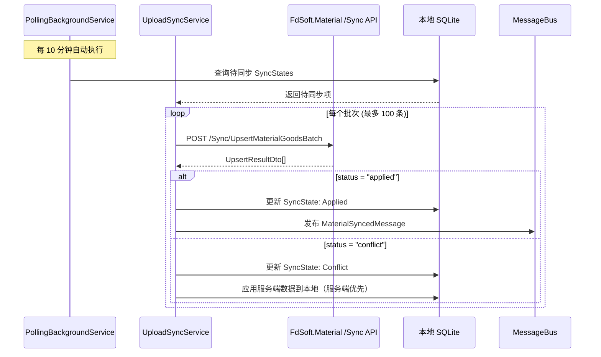

## Why

MaterialClient 目前仅支持**下载方向同步**（从平台拉取物料和供应商）。后端已有完整的**上行同步 API**（`SyncController`），支持幂等性、乐观锁和变更日志追踪，但客户端无法将本地物料/供应商变更推送到服务端。这限制了现场操作人员在本地创建或编辑物料和供应商后同步回中央平台的业务场景。

## What Changes

- 为新的 `Sync/*` 端点添加 Refit API 客户端方法（`UpsertMaterialGood`、`UpsertMaterialProvider`、批量变体及 `Changes`）
- 在 MaterialClient.Common 中创建对应的 DTO（`UpsertMaterialGoodDto`、`UpsertMaterialProviderDto`、`UpsertBatchRequestDto`、`UpsertResultDto`、`SyncChangeItemDto`、`SyncChangesQueryDto`）
- 实现上行同步服务（`IUploadSyncService`），支持将本地物料/供应商变更推送到服务端，包含重试、幂等性和冲突处理
- 通过新的 `SyncState` 实体按实体追踪同步状态（本地版本 vs 服务端版本、待同步状态）
- 将上行同步集成到 `PollingBackgroundService` 中，与现有下载同步并列运行
- 同步成功后通过 `MessageBus` 发布 `MaterialSyncedMessage` / `ProviderSyncedMessage`，以便 ViewModel 刷新缓存数据
- ~~新增"数据管理"对话框窗口~~ **[已移除]** — 用户不需要关心同步状态，同步在后台自动完成

## Capabilities

### New Capabilities

- `upload-sync`：物料和供应商从客户端到服务端的上行同步，包括单条/批量 upsert、幂等键管理、乐观并发冲突检测和重试逻辑
- `sync-state-tracking`：按实体本地追踪同步状态（待同步、已同步、冲突），实现客户端与服务端之间的版本对齐

### Modified Capabilities

_（无现有 spec 层面的需求变更。现有下载同步、推荐缓存和轮询行为保持不变。）_

## Impact

### Code Changes

| File Path | Change Type | Reason | Scope |
|-----------|-------------|--------|-------|
| `MaterialClient.Common/Api/IMaterialPlatformApi.cs` | Modify | 添加 Sync 端点的 Refit 方法 | API 层 |
| `MaterialClient.Common/Api/Dtos/Sync*.cs` | Create | 同步 DTO（Upsert、Result、ChangeLog） | DTO 层 |
| `MaterialClient.Common/Services/UploadSyncService.cs` | Create | 上行同步服务实现 | Service 层 |
| `MaterialClient.Common/Entities/SyncState.cs` | Create | 按实体追踪同步状态的实体 | Domain 层 |
| `MaterialClient.Common/Events/MaterialSyncedMessage.cs` | Create | 物料同步事件的 MessageBus 消息 | Events |
| `MaterialClient.Common/Events/ProviderSyncedMessage.cs` | Create | 供应商同步事件的 MessageBus 消息 | Events |
| `MaterialClient/Backgrounds/PollingBackgroundService.cs` | Modify | 在轮询周期中添加上行同步步骤 | Background workers |
| `MaterialClient.EFCore/MaterialClientDbContext.cs` | Modify | 添加 `DbSet<SyncState>` 和实体配置 | Data access |
| `MaterialClient/EFCore/EntityConfigurations/SyncStateConfiguration.cs` | Create | SyncState 的 EF Core 实体配置 | Data access |

### External Dependencies

- FdSoft.Material：同步 API 端点已部署（`SyncController`），无需后端变更

### Systems

- 现有下载同步流程不受影响
- RecommendationCache 继续正常工作；同步事件通过 MessageBus 触发缓存失效
- 需要为新的 `SyncState` 表进行数据库迁移

## User Interaction Flow

同步在后台自动进行，无需用户干预。

