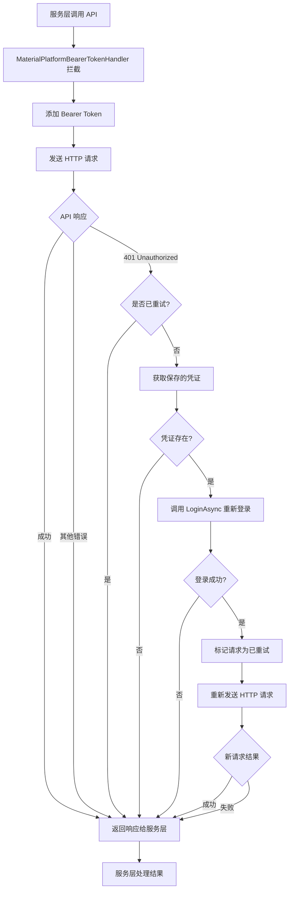
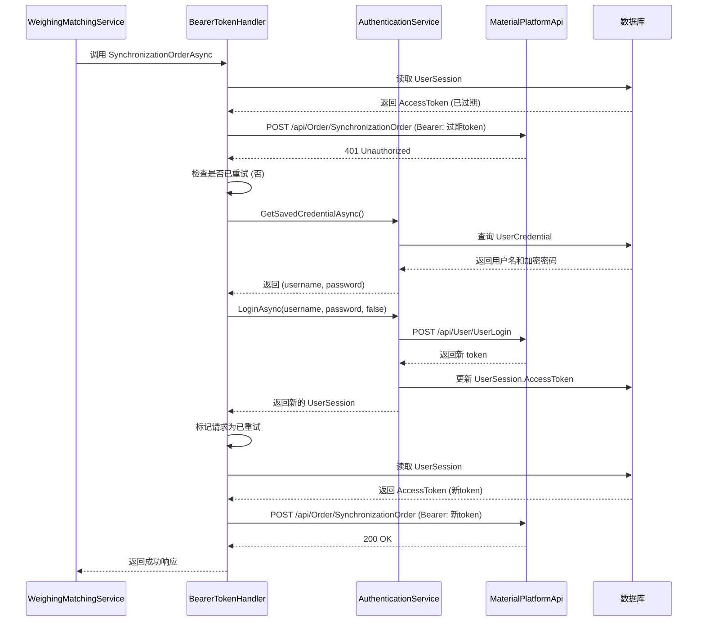

## Context

### 当前状态

材料客户端使用 Bearer Token 认证方式调用材料平台 API。认证流程如下：

1. 用户登录时，`AuthenticationService.LoginAsync` 调用平台 API 获取 token，并保存到 `UserSession` 实体
2. 每次调用材料平台 API 时，`MaterialPlatformBearerTokenHandler`（DelegatingHandler）从数据库读取 `UserSession.AccessToken` 并添加到请求头
3. 当 token 超时或失效时，API 返回 401 Unauthorized，但当前代码没有处理机制

### 现有架构

```
WeighingMatchingService
  └── SyncNewWaybillAsync()
      └── IMaterialPlatformApi.SynchronizationOrderAsync()
          ├── MaterialPlatformBearerTokenHandler (添加 Bearer Token)
          └── HttpClient → 材料平台 API

认证服务
  ├── IAuthenticationService.LoginAsync() - 重新登录
  ├── IAuthenticationService.GetSavedCredentialAsync() - 获取保存的凭证
  └── IRepository<UserSession> - 会话存储
```

### 约束条件

- 遵循 AGENTS.md 中的项目约定，使用 ABP 集成式服务注册
- 遵循编码规范：使用现代 C# 语法、主构造函数、nullable 引用类型
- 不能修改 `MaterialPlatformBearerTokenHandler` 的职责边界（它只负责添加 token）
- 必须防止无限重试循环

## Goals / Non-Goals

**Goals:**

1. 在 `MaterialPlatformBearerTokenHandler` 中实现 401 错误捕获和自动 token 刷新
2. 使用新的 token 重试原始请求，最多重试 1 次
3. 更新 `UserSession` 实体以确保持久化新 token
4. 提供详细的错误日志以便排查问题
5. 对所有使用 `IMaterialPlatformApi` 的调用自动生效（无需修改服务层代码）

**Non-Goals:**

1. 修改服务层代码（`WeighingMatchingService` 等）
2. 实现后台 token 预刷新机制
3. 修改用户界面或添加通知

## Decisions

### 决策 1：在 DelegatingHandler 中实现 token 刷新

**选择：** 在 `MaterialPlatformBearerTokenHandler` 中捕获 401 响应并自动刷新 token

**为什么在 Handler 中实现？**

`MaterialPlatformBearerTokenHandler` 是处理所有 `IMaterialPlatformApi` 请求的理想位置，原因如下：

1. **集中管理**：所有材料平台 API 调用都经过此 Handler，统一的 401 处理逻辑
2. **透明重试**：服务层代码无需知道 token 刷新的存在，自动处理
3. **职责扩展合理**：Handler 负责"认证"，token 刷新是认证失效的恢复机制
4. **已有的依赖注入能力**：Handler 已经通过构造函数注入了 `IRepository` 和 `ILogger`，可以轻松注入 `IAuthenticationService`
5. **重试状态简单**：使用 `HttpRequestMessage.Options` 跟踪重试状态

**实现方案：**

```csharp
// 1. 定义请求选项键
public static class HttpRequestMessageKeys
{
    public static readonly string TokenRefreshRetried = "TokenRefreshRetried";
}

// 2. 修改 MaterialPlatformBearerTokenHandler
public class MaterialPlatformBearerTokenHandler : DelegatingHandler
{
    private readonly IAuthenticationService _authenticationService;
    private readonly ILogger<MaterialPlatformBearerTokenHandler> _logger;
    private readonly IRepository<UserSession, Guid> _sessionRepository;
    private readonly IUnitOfWorkManager _unitOfWorkManager;

    public MaterialPlatformBearerTokenHandler(
        IAuthenticationService authenticationService,
        IRepository<UserSession, Guid> sessionRepository,
        IUnitOfWorkManager unitOfWorkManager,
        ILogger<MaterialPlatformBearerTokenHandler> logger)
    {
        _authenticationService = authenticationService;
        _sessionRepository = sessionRepository;
        _unitOfWorkManager = unitOfWorkManager;
        _logger = logger;
    }

    protected override async Task<HttpResponseMessage> SendAsync(
        HttpRequestMessage request,
        CancellationToken cancellationToken)
    {
        // 添加 Bearer Token
        await AddBearerTokenAsync(request, cancellationToken);

        // 发送请求
        var response = await base.SendAsync(request, cancellationToken);

        // 处理 401 Unauthorized
        if (response.StatusCode == HttpStatusCode.Unauthorized &&
            !IsTokenRefreshRetried(request))
        {
            return await HandleTokenRefreshAndRetryAsync(request, cancellationToken);
        }

        return response;
    }

    private async Task<HttpResponseMessage> HandleTokenRefreshAndRetryAsync(
        HttpRequestMessage originalRequest,
        CancellationToken cancellationToken)
    {
        _logger.LogWarning("收到 401 Unauthorized，尝试刷新 token");

        // 标记为已重试，防止无限循环
        MarkTokenRefreshRetried(originalRequest);

        try
        {
            // 重新登录
            var credential = await _authenticationService.GetSavedCredentialAsync();
            if (!credential.HasValue)
            {
                _logger.LogWarning("无法自动刷新 token：未保存的用户凭证");
                return originalRequest.CreateResponse(HttpStatusCode.Unauthorized);
            }

            await _authenticationService.LoginAsync(
                credential.Value.username,
                credential.Value.password,
                rememberMe: false);

            _logger.LogInformation("Token 刷新成功，重试原始请求");

            // 重试原始请求（重新创建请求消息以获取新 token）
            var retryRequest = await CloneHttpRequestMessageAsync(originalRequest);
            return await SendAsync(retryRequest, cancellationToken);
        }
        catch (Exception ex)
        {
            _logger.LogError(ex, "Token 刷新失败");
            return originalRequest.CreateResponse(HttpStatusCode.Unauthorized);
        }
    }
}
```

**方案对比：**

```
┌─────────────────────────────────┬──────────────────────────┬──────────────────────────┐
│ 方面                            │ Handler 方案（新选择）    │ 服务层方案（原方案）       │
├─────────────────────────────────┼──────────────────────────┼──────────────────────────┤
│ 服务层代码侵入性                │ ✅ 无需修改业务代码       │ ❌ 每个方法需要 try-catch  │
│ 全局一致性                      │ ✅ 所有 API 自动受益      │ ❌ 需要在每个方法中实现   │
│ 职责分离                        │ ✅ Handler 管理认证       │ ❌ 服务层耦合认证逻辑     │
│ 代码复用                        │ ✅ 一次实现，处处使用      │ ❌ 需要重复实现           │
│ 测试复杂度                      │ ⚠️  需要 Mock Handler     │ ✅ 可直接测试服务逻辑     │
│ 重试状态管理                    │ ✅ 使用 Options 简单明了   │ ✅ 使用布尔参数简单       │
│ 错误上下文                      │ ⚠️  缺少业务上下文         │ ✅ 包含运单等信息         │
├─────────────────────────────────┼──────────────────────────┼──────────────────────────┤
│ 总体评估                        │ ✅ 推荐方案               │ ⚠️  备选方案              │
└─────────────────────────────────┴──────────────────────────┴──────────────────────────┘
```

**选择 Handler 方案的关键理由：**

1. **零代码侵入**：`WeighingMatchingService` 等服务无需任何修改
2. **全局生效**：所有使用 `IMaterialPlatformApi` 的地方自动获得 token 刷新能力
3. **符合关注点分离**：认证相关问题（token 失效、刷新）在认证层（Handler）处理
4. **未来扩展性**：如果其他服务也需要调用材料平台 API，无需考虑 token 处理

**权衡：**

- **业务上下文缺失**：Handler 不知道是哪个运单在同步，日志中缺少运单 ID。但可以通过 `request.RequestUri` 判断端点类型
- **测试复杂度**：需要集成测试或 Mock Handler，但收益大于成本

**替代方案被拒绝的原因：**

- **在服务层实现**：需要在每个同步方法中添加 try-catch，代码重复，容易遗漏
- **使用 Polly 全局策略**：配置复杂，需要处理 token 更新通信问题

### 决策 2：直接调用认证服务 vs. 事件驱动架构

**选择：** 在服务层直接调用 `IAuthenticationService.LoginAsync` 进行 token 刷新

**为什么考虑事件驱动方案？**

使用 `ILocalEventBus` 发送 `TokenRefreshRequestedEvent` 是一个有效的替代方案，符合 AGENTS.md 中提到的架构模式：

```
事件驱动方案
WeighingMatchingService
  └── 捕获 401 错误
      └── MessageBus.Current.SendAsync(new TokenRefreshRequestedEvent())
          └── TokenRefreshEventHandler
              └── IAuthenticationService.LoginAsync()
                  └── TokenRefreshCompletedEvent
```

**方案对比：**

```
┌─────────────────────────────────┬──────────────────────────┬──────────────────────────┐
│ 方面                            │ 事件驱动方案             │ 直接调用方案（当前选择）   │
├─────────────────────────────────┼──────────────────────────┼──────────────────────────┤
│ 解耦性                          │ ✅ 服务层不依赖认证服务   │ ❌ 服务层依赖认证服务     │
│ 可扩展性                        │ ✅ 多个监听者可响应事件   │ ❌ 仅限于单一调用         │
│ 复杂性                          │ ❌ 需要创建事件类和处理器 │ ✅ 简单直接               │
│ 同步等待                        │ ❌ 需要手动同步机制       │ ✅ 天然同步等待           │
│ 错误处理                        │ ❌ 事件处理失败难以传播   │ ✅ 异常直接抛出           │
│ 重试逻辑                        │ ❌ 需要协调事件和重试     │ ✅ 递归调用简单明了       │
│ 测试难度                        │ ❌ 需要模拟事件总线       │ ✅ 易于单元测试           │
│ 符合项目约定                    │ ✅ 使用 MessageBus        │ ⚠️  服务间直接调用        │
└─────────────────────────────────┴──────────────────────────┴──────────────────────────┘
```

**当前选择直接调用的原因：**

1. **同步重试需求**：我们需要在 401 错误后立即刷新 token 并重试同一请求。事件驱动本质上是异步的，需要额外的同步机制（如 `TaskCompletionSource`）来等待事件处理完成。

2. **错误处理简单性**：直接调用时，任何异常（网络错误、登录失败等）直接抛出到调用栈，可以通过标准 try-catch 处理。事件驱动中，事件处理器的错误需要通过其他机制传播。

3. **单一消费者场景**：目前只有运单同步需要 token 刷新，没有多个监听者的需求。如果未来需要扩展到其他场景，可以重构为事件驱动。

4. **实现简单性**：直接调用只需几行代码，事件驱动需要创建事件类、事件处理器、配置监听器等。

**未来可能的演进：**

如果以下场景出现，可以考虑重构为事件驱动架构：

- 多个不同的服务需要响应 token 失效事件（如显示通知、记录审计日志等）
- 需要在 UI 层响应 token 刷新事件（如显示"正在重新登录..."提示）
- 需要实现全局的 token 失效处理策略

**设计保留扩展性：**

虽然当前选择直接调用，但可以将 token 刷新逻辑封装为私有方法 `RefreshTokenAndRetryAsync()`，方便未来重构为事件驱动：

```csharp
// 当前实现
private async Task<bool> SyncNewWaybillAsync(..., bool retried = false)
{
    try
    {
        // API 调用
    }
    catch (ApiException ex) when (ex.StatusCode == HttpStatusCode.Unauthorized && !retried)
    {
        await RefreshTokenAsync();  // 可独立提取
        return await SyncNewWaybillAsync(..., retried: true);
    }
}

// 未来可重构为事件驱动
private async Task<bool> SyncNewWaybillAsync(..., bool retried = false)
{
    try
    {
        // API 调用
    }
    catch (ApiException ex) when (ex.StatusCode == HttpStatusCode.Unauthorized && !retried)
    {
        await _eventBus.PublishAsync(new TokenRefreshRequestedEvent());
        // 等待 TokenRefreshCompletedEvent
        return await SyncNewWaybillAsync(..., retried: true);
    }
}
```

### 决策 3：使用 Refit.ApiException 捕获 401 错误

**选择：** 捕获 `Refit.ApiException` 并检查 `StatusCode` 属性

**理由：**

- Refit 在 HTTP 错误时抛出 `ApiException`
- `StatusCode` 属性包含 HTTP 状态码
- 类型安全且易于测试

**代码模式：**
```csharp
try
{
    result = await _materialPlatformApi.SynchronizationOrderAsync(dto, cancellationToken);
}
catch (ApiException ex) when (ex.StatusCode == System.Net.HttpStatusCode.Unauthorized)
{
    // Token 刷新逻辑
}
```

### 决策 4：使用布尔标志防止重试循环

**选择：** 在方法签名中添加可选的 `bool retried = false` 参数

**理由：**

- 简单直接，无需额外状态管理
- 不修改方法签名（可选参数）
- 清晰表达重试状态

**代码模式：**
```csharp
private async Task<bool> SyncNewWaybillAsync(
    Waybill waybill,
    List<WaybillMaterial>? waybillMaterials,
    string proId,
    CancellationToken cancellationToken,
    bool retried = false)  // 新增参数
{
    try
    {
        // API 调用
    }
    catch (ApiException ex) when (ex.StatusCode == HttpStatusCode.Unauthorized && !retried)
    {
        // Token 刷新并重试
        await RefreshTokenAsync();
        return await SyncNewWaybillAsync(..., retried: true);
    }
}
```

### 决策 5：AuthenticationService.LoginAsync 自动更新 UserSession

**选择：** 直接调用 `AuthenticationService.LoginAsync`，它会更新数据库中的 `UserSession`

**理由：**

- `LoginAsync` 已经实现了完整的登录流程：调用 API、创建新的 `UserSession`、保存到数据库
- 无需手动操作 `IRepository<UserSession>`
- 利用现有代码，减少重复

**代码流程：**
```csharp
var credential = await _authenticationService.GetSavedCredentialAsync();
if (credential.HasValue)
{
    await _authenticationService.LoginAsync(
        credential.Value.username,
        credential.Value.password,
        rememberMe: false);  // 不更新凭证状态
}
```

## 组件架构

```
修改后的架构
MaterialPlatformBearerTokenHandler [修改]
  ├── IAuthenticationService (新增依赖)
  │   ├── LoginAsync() - 重新登录
  │   └── GetSavedCredentialAsync() - 获取保存的凭证
  │
  └── SendAsync() [增强]
      ├── 添加 Bearer Token (原有功能)
      ├── 检查响应状态码
      ├── 如果 401 且未重试
      │   ├── 标记请求为已重试
      │   ├── GetSavedCredentialAsync()
      │   ├── LoginAsync() → 更新 UserSession
      │   └── 重新发送请求
      └── 返回响应

WeighingMatchingService [无变更]
  └── SyncNewWaybillAsync()
      └── 调用 API (自动处理 token 刷新)
```

## 数据流



## API 调用时序图



## 详细代码变更清单

| 文件路径 | 变更类型 | 变更说明 | 影响模块 |
|---------|---------|---------|---------|
| `MaterialClient.Common/Api/MaterialPlatformBearerTokenHandler.cs` | 修改 | 1. 添加 `IAuthenticationService` 依赖注入<br>2. 添加 `HttpRequestMessage` 扩展方法（标记重试状态）<br>3. 修改 `SendAsync` 方法：检查 401 响应并执行 token 刷新<br>4. 添加 `HandleTokenRefreshAndRetryAsync` 私有方法 | 认证处理器 |
| `MaterialClient.Common/Services/WeighingMatchingService.cs` | 无变更 | 无需修改任何代码，自动受益于 Handler 的 token 刷新功能 | 运单同步服务 |
| `MaterialClient.Common/Services/Authentication/AuthenticationService.cs` | 无变更 | 使用现有的 `LoginAsync` 和 `GetSavedCredentialAsync` 方法 | 认证服务 |
| `MaterialClient.Common/Entities/UserSession.cs` | 无变更 | 使用现有的 `UpdateAccessToken` 方法（由 LoginAsync 调用） | 会话实体 |

**新增辅助类/方法：**

```csharp
// MaterialPlatformBearerTokenHandler.cs 中的新增内容
public static class HttpRequestMessageExtensions
{
    private static readonly string TokenRefreshRetriedKey = "TokenRefreshRetried";

    public static void MarkTokenRefreshRetried(this HttpRequestMessage request)
    {
        request.Options.Set(new HttpRequestOptionsKey<bool>(TokenRefreshRetriedKey), true);
    }

    public static bool IsTokenRefreshRetried(this HttpRequestMessage request)
    {
        return request.Options.TryGetValue(new HttpRequestOptionsKey<bool>(TokenRefreshRetriedKey), out var value) && value;
    }
}
```
| `MaterialClient.Common/Services/Authentication/AuthenticationService.cs` | 无变更 | 使用现有的 `LoginAsync` 和 `GetSavedCredentialAsync` 方法 | 认证服务 |
| `MaterialClient.Common/Entities/UserSession.cs` | 无变更 | 使用现有的 `UpdateAccessToken` 方法（由 LoginAsync 调用） | 会话实体 |

## 错误处理策略

### 场景 1：Token 刷新成功，重试成功
```
401 错误 → 获取凭证 → LoginAsync 成功 → 重试成功 → 返回 true
```

### 场景 2：Token 刷新成功，重试失败（非 401）
```
401 错误 → 获取凭证 → LoginAsync 成功 → 重试失败（其他错误）→ 记录警告 → 返回 false
```

### 场景 3：Token 刷新失败（无保存凭证）
```
401 错误 → GetSavedCredentialAsync 返回 null → 记录警告 → 返回 false
```

### 场景 4：Token 刷新失败（登录 API 失败）
```
401 错误 → 获取凭证 → LoginAsync 抛出异常 → 记录错误 → 返回 false
```

### 场景 5：重试后仍然 401（防止无限循环）
```
401 错误 → 获取凭证 → LoginAsync 成功 → 重试仍然 401 → 记录警告 → 返回 false（retried=true 阻止再次重试）
```

## Risks / Trade-offs

### 风险 1：并发同步操作可能导致多次 token 刷新

**描述：** 如果多个运单同步同时遇到 401 错误，可能触发多次 `LoginAsync` 调用

**缓解措施：**
- `LoginAsync` 已经是幂等操作（删除旧会话并创建新会话）
- 数据库事务确保并发安全
- 日志中记录并发刷新情况，后续可优化

### 风险 2：保存的密码已变更

**描述：** 用户修改了密码但本地保存的是旧密码

**缓解措施：**
- `LoginAsync` 会返回错误，不会更新 token
- 记录详细错误日志
- 用户需要手动重新登录
- 在未来的版本中可考虑清除无效凭证

### 风险 3：网络延迟导致同步时间增加

**描述：** Token 刷新需要额外的 API 调用，增加同步时间

**影响评估：**
- Token 刷新仅在 token 失效时发生（罕见情况）
- 正常情况下无影响
- 额外时间：~1-2 秒（登录 API 调用时间）

## Migration Plan

### 部署步骤

1. **代码审查**：确保代码符合 AGENTS.md 规范
2. **单元测试**：编写测试覆盖以下场景：
   - 401 错误触发 token 刷新
   - 无保存凭证时的行为
   - 登录失败时的行为
   - 重试成功和失败的场景
3. **集成测试**：在测试环境验证完整的 token 刷新流程
4. **部署到生产**：通过标准部署流程发布

### 回滚策略

- 变更仅限于 `WeighingMatchingService` 内部
- 不涉及数据库架构变更
- 如果出现问题，可快速回滚到之前的版本
- 回滚后系统行为恢复到原始状态（401 错误直接失败）

## Open Questions

无。所有设计决策已明确，可以开始实现。
