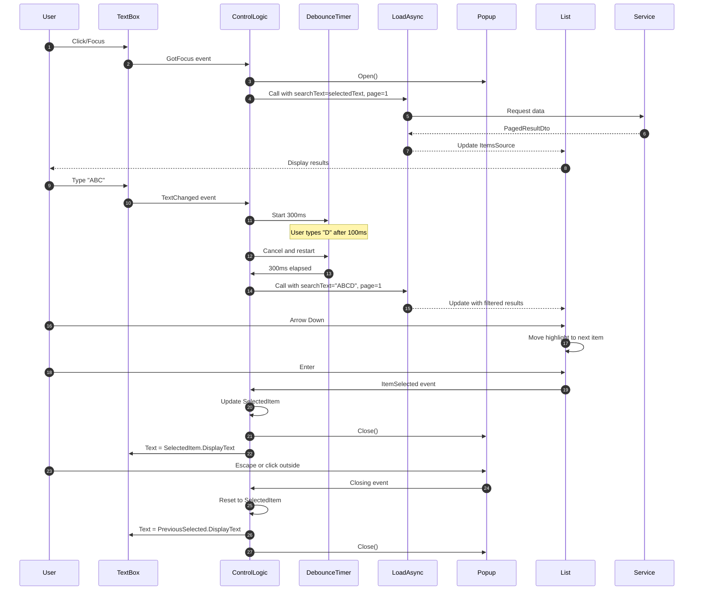
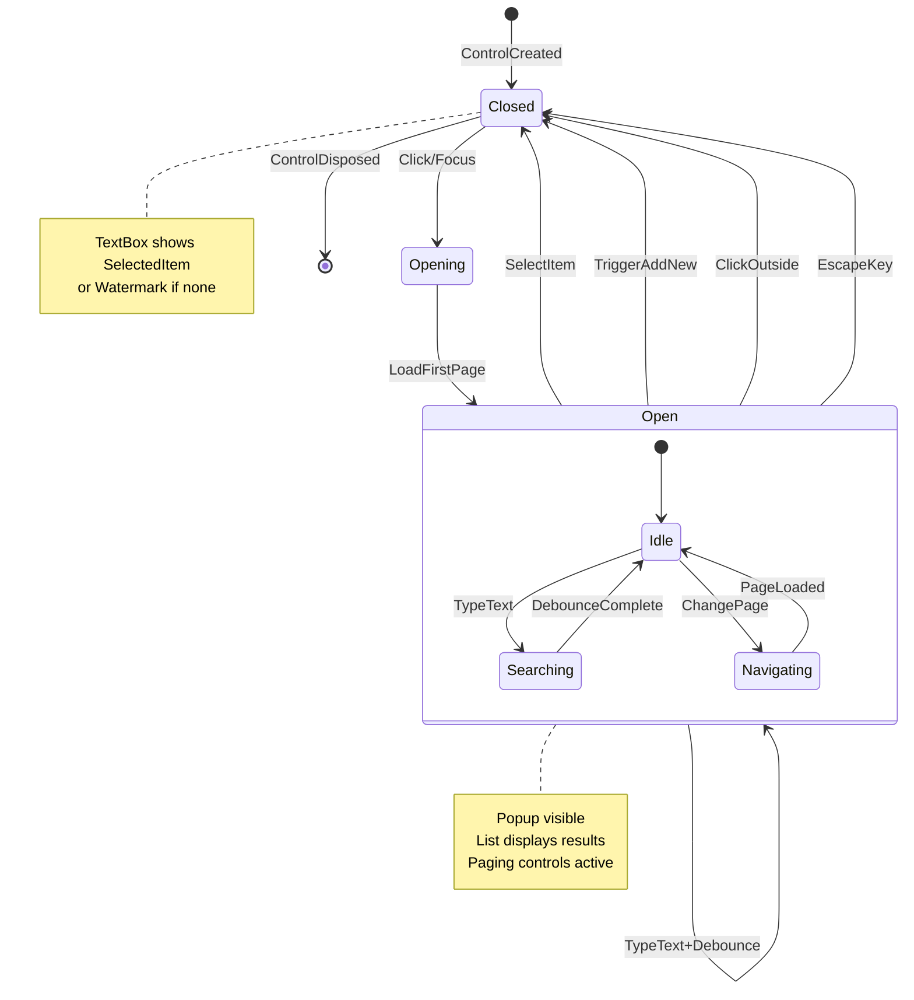
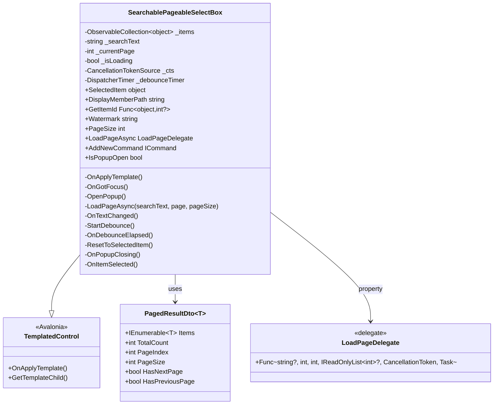
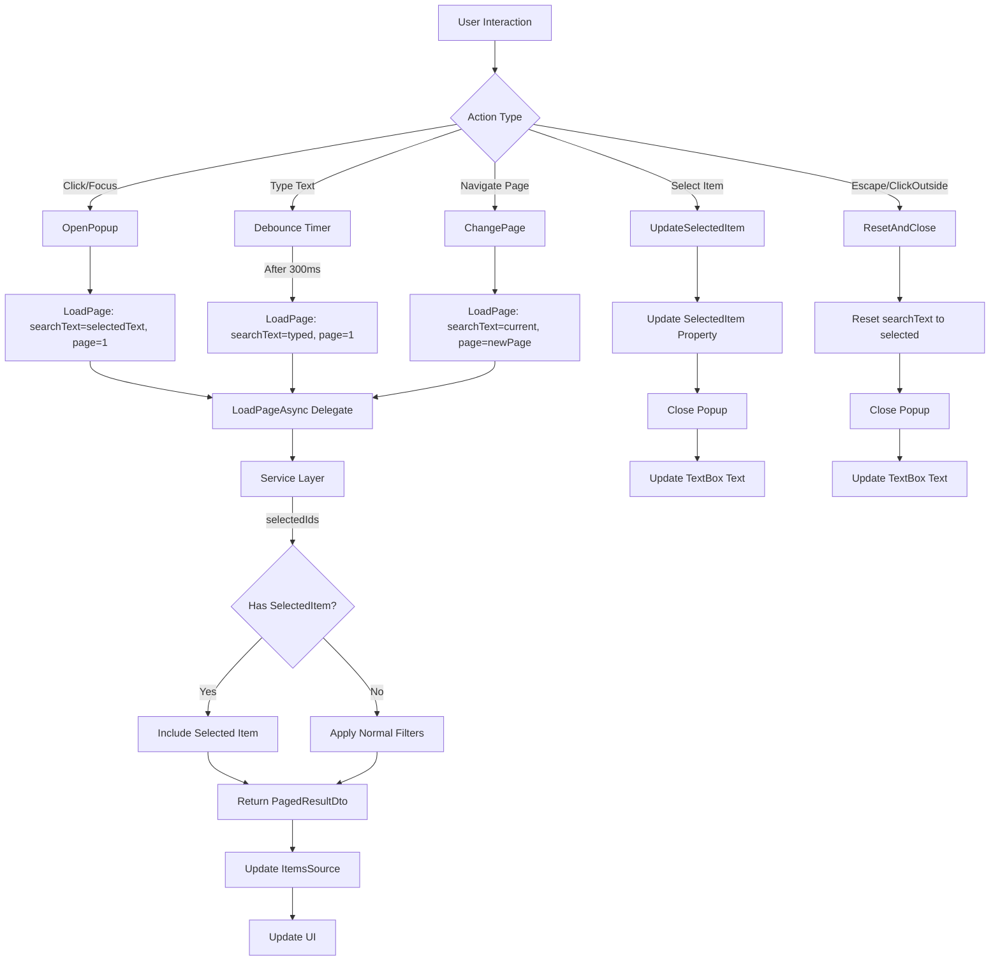
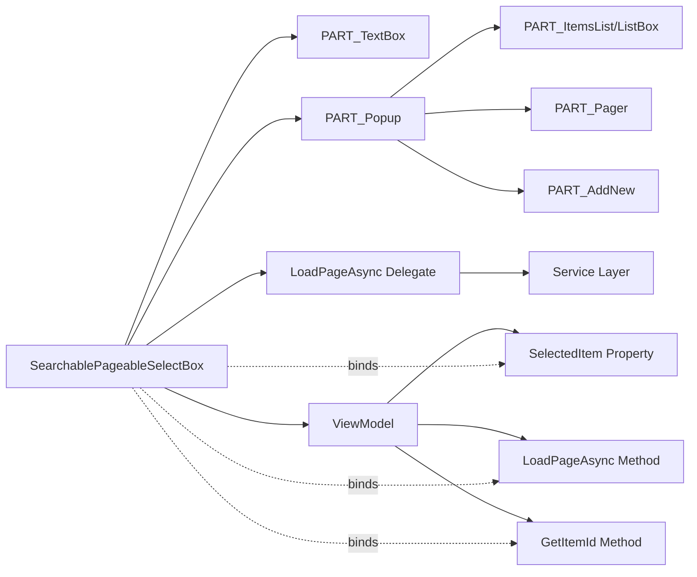
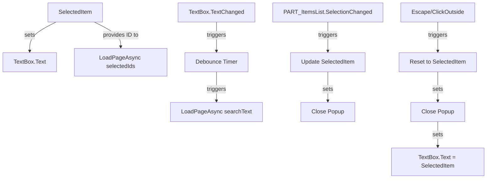

## Context

This design document outlines the technical implementation of the `SearchablePageableSelectBox` control, which consolidates search, pagination, and optional "add new" functionality into a single self-contained Avalonia TemplatedControl.

### Background

The current implementation uses three separate components:
1. `SearchableSelectionBox` - text input for search
2. Parent view's `Popup` - popup container with placement configuration
3. `GenericSelectionPopup` - popup content with list, pagination, and add new functionality

This fragmentation leads to code duplication, complex state management, and increased maintenance burden across multiple views.

### Constraints

- Must not reference the existing `PageableAutoCompleteBox` implementation (being rolled back)
- Must use Avalonia UI framework
- Must follow existing project patterns and conventions
- Must integrate with existing service layer
- Must not break existing functionality during migration
- Manual testing only (no automated UI tests per proposal)

### Stakeholders

- Frontend developers implementing the control
- Backend developers updating service layer methods
- QA performing manual testing
- Product owners validating UX improvements

---

## Goals / Non-Goals

### Goals

- Single self-contained control that replaces three-part assembly
- Simplified parent views with no popup state management
- Clean separation between control logic and data loading
- Keyboard accessibility with full navigation support
- Consistent user experience across all selection scenarios
- Easy migration path for existing views

### Non-Goals

- Automated UI testing (manual testing only)
- Support for multi-select (single selection only)
- Custom templating of internal popup elements (control is self-contained)
- Server-side configuration of control behavior
- Complex filtering beyond text search + selected item guarantee

---

## Decisions

### Decision 1: Use TemplatedControl Architecture

**What**: Implement the control as a TemplatedControl with named PARTs.

**Why**:
- Follows Avalonia best practices
- Allows control to be restyled while maintaining behavior
- Clear contract between template and code-behind
- Enables PART discovery pattern for event handler attachment
- Consistent with existing controls in the project

**Alternatives considered**:
1. **UserControl** - Too rigid, harder to reuse with different templates
2. **Custom Control without PARTs** - Harder to maintain, unclear template contract

### Decision 2: Single TextBox for Display and Input

**What**: Use one TextBox that serves as both display surface for selected item and input surface for search.

**Why**:
- Eliminates jarring transitions between TextBlock (closed) and TextBox (open)
- Natural user experience - input box is always editable
- Simpler template structure
- Consistent with common autocomplete controls (combobox, autocompletebox)

**Alternatives considered**:
1. **Separate TextBlock and TextBox** - More complex, worse UX when switching states
2. **ReadOnly TextBox that becomes editable** - Unnecessary complexity

### Decision 3: Debounce Timer Using Rx or System.Timers

**What**: Use a 300ms debounce timer for search input, implemented using reactive extensions or System.Timers.

**Why**:
- Prevents excessive API calls during typing
- Standard approach for search inputs
- Configurable debounce duration if needed
- Cancels previous search on new input

**Alternatives considered**:
1. **No debounce** - Would cause excessive server load
2. **Wait for user to press Enter** - Poor UX, users expect instant search

### Decision 4: LoadPageAsync Delegate for Data Loading

**What**: Use a Func delegate for data loading: `(searchText, page, pageSize, selectedIds, cancellationToken) => Task<PagedResultDto<object>>`.

**Why**:
- Allows control to be data-agnostic (works with any data type)
- Caller can implement loading logic appropriate to their context
- Supports cancellation for race conditions
- Follows async/await patterns throughout the codebase
- Matches existing service layer patterns

**Alternatives considered**:
1. **Direct service reference** - Too tight coupling, not reusable
2. **Event-based loading** - More complex, harder to follow
3. **Interface-based approach** - Overkill for this use case

### Decision 5: selectedIds Guarantee in Service Layer

**What**: Pass `IReadOnlyList<int>? selectedIds` to service layer, which ignores filter when searchText exactly matches selected item's display name.

**Why**:
- Ensures selected item always appears in results
- Critical for user experience - user shouldn't lose their selection
- Simple, explicit contract
- Service layer is the right place for this logic (data source responsibility)

**Alternatives considered**:
1. **Manually inject selected item in control** - Violates data source abstraction
2. **Duplicate results in UI** - Confusing, duplicates logic
3. **Client-side filtering merge** - Complex, error-prone

### Decision 6: Reset on Escape/Click Outside

**What**: When popup closes via Escape or click outside, reset TextBox to selected item's display text, discarding user input.

**Why**:
- Prevents accidental data loss from partial input
- Matches standard autocomplete/combobox behavior
- Clear separation between "editing" and "saved state"
- Prevents confusion from leaving unsanctioned input in the control

**Alternatives considered**:
1. **Keep user input** - Confusing, unclear if changes are saved
2. **Auto-select first matching result** - Surprising, could cause accidental changes

### Decision 7: Keyboard Navigation via ListBox

**What**: Use ListBox (or ListBox-based control) for the items list with built-in keyboard navigation.

**Why**:
- ListBox has built-in Arrow Up/Down, Enter, Space navigation
- Reduces custom keyboard handling code
- Accessibility support is better with native controls
- Consistent with standard Avalonia patterns

**Alternatives considered**:
1. **DataGrid** - Overkill for single-column list
2. **ItemsControl with custom keyboard handling** - Too complex, less accessible

---

## UI/UX Design

### Control Template

```
+----------------------------------+
| SearchablePageableSelectBox      |
| +------------------------------+ |
| | PART_TextBox                 | |
| | [Selected Item or Watermark] | |
| +------------------------------+ |
| +------------------------------+ |
| | PART_Popup                   | |
| | +--------------------------+ | |
| | | PART_ItemsList            | | |
| | | - Result 1               | | |
| | | - Result 2 (highlighted) | | |
| | | - Result 3               | | | |
| | +--------------------------+ | |
| | +--------------------------+ | |
| | | PART_Pager                | | |
| | | [ < ] Page 2 / 5 [ > ]  | | | |
| | +--------------------------+ | |
| | +--------------------------+ | |
| | | PART_AddNew (optional)   | | |
| | | [ + Add New ]           | | | |
| | +--------------------------+ | |
| +------------------------------+ |
+----------------------------------+
```

### User Interaction Flow



### State Transitions



### Error Handling UI

```
+----------------------------------+
| PART_Popup                       |
|                                  |
| +------------------------------+ |
| | PART_ItemsList                | |
| | [ No results found ]         | |
| +------------------------------+ |
|                                  |
| +------------------------------+ |
| | PART_AddNew                   | |
| | [ + Add New Provider ]      | |
| +------------------------------+ |
+----------------------------------+
```

```
+----------------------------------+
| PART_Popup                       |
|                                  |
| +------------------------------+ |
| | PART_ItemsList                | |
| | [ Error: Failed to load ]   | |
| | [ Please try again ]         | |
| +------------------------------+ |
+----------------------------------+
```

---

## Technical Design

### Class Architecture



### Data Flow Diagram



### Component Relationships



### Property Dependencies



---

## Implementation Details

### Control Template Structure (AXAML)

```xml
<ControlTemplate x:Key="SearchablePageableSelectBoxTemplate"
                 TargetType="controls:SearchablePageableSelectBox">
    <StackPanel>
        <TextBox x:Name="PART_TextBox"
                 Watermark="{TemplateBinding Watermark}"
                 Text="{Binding SearchText, Mode=TwoWay, RelativeSource={RelativeSource TemplatedParent}}" />

        <Popup x:Name="PART_Popup"
               IsOpen="{TemplateBinding IsPopupOpen}"
               PlacementTarget="{Binding RelativeSource={RelativeSource TemplatedParent}}">
            <Border Background="White"
                    BorderBrush="Gray"
                    BorderThickness="1"
                    CornerRadius="4"
                    MaxHeight="300"
                    MinWidth="{Binding Bounds.Width, RelativeSource={RelativeSource TemplatedParent}}">
                <StackPanel>
                    <!-- Loading Overlay -->
                    <Border x:Name="PART_LoadingOverlay"
                            Background="White"
                            IsVisible="{Binding IsLoading, RelativeSource={RelativeSource TemplatedParent}}"
                            Padding="20"
                            HorizontalAlignment="Stretch">
                        <StackPanel Orientation="Horizontal" Spacing="10" HorizontalAlignment="Center">
                            <ProgressBar IsIndeterminate="True" Width="20" Height="20" />
                            <TextBlock Text="加载中..." VerticalAlignment="Center" />
                        </StackPanel>
                    </Border>

                    <!-- Items List (hidden during loading) -->
                    <ListBox x:Name="PART_ItemsList"
                             IsVisible="{Binding !IsLoading, RelativeSource={RelativeSource TemplatedParent}}"
                             ItemsSource="{Binding Items, RelativeSource={RelativeSource TemplatedParent}}"
                             DisplayMemberPath="{Binding DisplayMemberPath, RelativeSource={RelativeSource TemplatedParent}}" />

                    <ContentControl x:Name="PART_Pager"
                                   IsVisible="{Binding !IsLoading, RelativeSource={RelativeSource TemplatedParent}}"
                                   Content="{Binding Pager, RelativeSource={RelativeSource TemplatedParent}}" />

                    <Button x:Name="PART_AddNew"
                            IsVisible="{Binding ShowAddNew, RelativeSource={RelativeSource TemplatedParent}}"
                            Content="Add New"
                            Command="{Binding AddNewCommand, RelativeSource={RelativeSource TemplatedParent}}" />
                </StackPanel>
            </Border>
        </Popup>
    </StackPanel>
</ControlTemplate>
```

### Code-Behind Key Methods

```csharp
public class SearchablePageableSelectBox : TemplatedControl
{
    // PARTs
    private TextBox? _textBox;
    private Popup? _popup;
    private ListBox? _itemsList;
    private Control? _pager;
    private Button? _addNewButton;

    // State
    private ObservableCollection<object> _items = new();
    private string _searchText = string.Empty;
    private int _currentPage = 1;
    private bool _isLoading;
    private CancellationTokenSource? _cts;
    private DispatcherTimer? _debounceTimer;

    // Dependency property for IsLoading (read-only, public)
    public static readonly DirectProperty<SearchablePageableSelectBox, bool> IsLoadingProperty =
        AvaloniaProperty.RegisterDirect<SearchablePageableSelectBox, bool>(
            nameof(IsLoading),
            owner => owner._isLoading,
            (owner, value) => owner.SetAndRaise(IsLoadingProperty, ref owner._isLoading, value));

    public bool IsLoading
    {
        get => GetValue(IsLoadingProperty);
        private set => SetValue(IsLoadingProperty, value);
    }

    public override void OnApplyTemplate()
    {
        base.OnApplyTemplate();
        // Discover and attach to PARTs
        _textBox = GetTemplateChild<TextBox>(nameof(PART_TextBox));
        _popup = GetTemplateChild<Popup>(nameof(PART_Popup));
        _itemsList = GetTemplateChild<ListBox>(nameof(PART_ItemsList));
        _pager = GetTemplateChild<Control>(nameof(PART_Pager));
        _addNewButton = GetTemplateChild<Button>(nameof(PART_AddNew));

        if (_textBox != null)
        {
            _textBox.GotFocus += OnGotFocus;
            _textBox.TextChanged += OnTextChanged;
            _textBox.KeyDown += OnKeyDown;
        }

        if (_itemsList != null)
        {
            _itemsList.SelectionChanged += OnItemSelected;
        }

        if (_popup != null)
        {
            _popup.Opened += OnPopupOpened;
            _popup.Closed += OnPopupClosed;
        }
    }

    private void OnGotFocus(object? sender, RoutedEventArgs e)
    {
        if (_popup != null && !_popup.IsOpen)
        {
            OpenPopup();
        }
    }

    private void OpenPopup()
    {
        IsPopupOpen = true;
        _searchText = GetDisplayText(SelectedItem);
        _currentPage = 1;
        LoadPageAsync().FireAndForget();
    }

    private void OnTextChanged(object? sender, TextChangedEventArgs e)
    {
        if (_textBox != null)
        {
            _searchText = _textBox.Text;
            StartDebounce();
        }
    }

    private void StartDebounce()
    {
        _debounceTimer?.Stop();
        _debounceTimer = new DispatcherTimer
        {
            Interval = TimeSpan.FromMilliseconds(300)
        };
        _debounceTimer.Tick += OnDebounceElapsed;
        _debounceTimer.Start();
    }

    private void OnDebounceElapsed(object? sender, EventArgs e)
    {
        _debounceTimer?.Stop();
        _debounceTimer = null;

        _currentPage = 1;
        LoadPageAsync().FireAndForget();

        if (_popup != null && !_popup.IsOpen)
        {
            IsPopupOpen = true;
        }
    }

    private async Task LoadPageAsync()
    {
        if (LoadPageAsyncDelegate == null) return;

        _cts?.Cancel();
        _cts = new CancellationTokenSource();

        var selectedIds = SelectedItem != null && GetItemId != null
            ? new[] { GetItemId(SelectedItem) }.Where(id => id.HasValue).Select(id => id.Value).ToList()
            : null;

        try
        {
            IsLoading = true;  // Show loading indicator
            var result = await LoadPageAsyncDelegate(_searchText, _currentPage, PageSize, selectedIds, _cts.Token);
            _items.Clear();
            foreach (var item in result.Items)
            {
                _items.Add(item);
            }
        }
        catch (OperationCanceledException)
        {
            // Ignore cancellation
        }
        finally
        {
            IsLoading = false;  // Hide loading indicator
        }
    }

    private void OnKeyDown(object? sender, KeyEventArgs e)
    {
        switch (e.Key)
        {
            case Key.Escape:
                ResetAndClose();
                e.Handled = true;
                break;
            case Key.Enter:
                if (_itemsList?.SelectedItem != null)
                {
                    SelectedItem = _itemsList.SelectedItem;
                    ClosePopup();
                    e.Handled = true;
                }
                break;
            case Key.Up:
            case Key.Down:
                // Let ListBox handle navigation
                break;
        }
    }

    private void OnPopupClosed(object? sender, EventArgs e)
    {
        ResetToSelectedItem();
    }

    private void ResetToSelectedItem()
    {
        _searchText = GetDisplayText(SelectedItem);
        if (_textBox != null)
        {
            _textBox.Text = _searchText;
        }
    }

    private void ClosePopup()
    {
        IsPopupOpen = false;
        _textBox?.Focus();
    }

    private void OnItemSelected(object? sender, SelectionChangedEventArgs e)
    {
        if (_itemsList?.SelectedItem != null)
        {
            SelectedItem = _itemsList.SelectedItem;
            ClosePopup();
        }
    }

    private string GetDisplayText(object? item)
    {
        if (item == null) return string.Empty;
        if (string.IsNullOrEmpty(DisplayMemberPath)) return item.ToString() ?? string.Empty;

        var property = item.GetType().GetProperty(DisplayMemberPath);
        return property?.GetValue(item)?.ToString() ?? string.Empty;
    }

    protected override void OnPropertyChanged(AvaloniaPropertyChangedEventArgs change)
    {
        base.OnPropertyChanged(change);

        if (change.Property == SelectedItemProperty)
        {
            UpdateTextBoxText();
        }
    }

    private void UpdateTextBoxText()
    {
        if (_textBox != null)
        {
            _textBox.Text = GetDisplayText(SelectedItem);
        }
    }
}
```

### Service Layer Updates

```csharp
// Before
public async Task<PagedResultDto<ProviderDto>> GetPagedProvidersAsync(
    string? searchText,
    int page,
    int pageSize,
    CancellationToken ct)
{
    var query = _context.Providers.AsQueryable();

    if (!string.IsNullOrWhiteSpace(searchText))
    {
        query = query.Where(p => p.ProviderName.Contains(searchText));
    }

    // ... pagination logic
}

// After
public async Task<PagedResultDto<ProviderDto>> GetPagedProvidersAsync(
    string? searchText,
    int page,
    int pageSize,
    IReadOnlyList<int>? selectedIds,
    CancellationToken ct)
{
    var query = _context.Providers.AsQueryable();

    // Check if we should ignore filter due to selected item guarantee
    bool ignoreFilter = false;
    if (selectedIds != null && selectedIds.Count > 0 && !string.IsNullOrWhiteSpace(searchText))
    {
        foreach (var selectedId in selectedIds)
        {
            var selectedItem = await _context.Providers.FindAsync(new object[] { selectedId }, ct);
            if (selectedItem != null && selectedItem.ProviderName.Equals(searchText, StringComparison.OrdinalIgnoreCase))
            {
                ignoreFilter = true;
                break;
            }
        }
    }

    if (!string.IsNullOrWhiteSpace(searchText) && !ignoreFilter)
    {
        query = query.Where(p => p.ProviderName.Contains(searchText));
    }

    // Ensure selected items are always included
    if (selectedIds != null && selectedIds.Count > 0)
    {
        var selectedItems = _context.Providers.Where(p => selectedIds.Contains(p.Id));
        query = selectedItems.Union(query);
    }

    // ... pagination logic
}
```

---

## Risks / Trade-offs

### Risks

| Risk | Impact | Mitigation |
|------|--------|------------|
| **Keyboard navigation complexity** | High | Use ListBox with built-in navigation, thorough manual testing |
| **Popup positioning issues** | Medium | Use Avalonia's default placement, test on different screen sizes |
| **Debounce timing too long/short** | Medium | Use standard 300ms, make configurable via property |
| **Race conditions with async loading** | Medium | Use CancellationToken properly, cancel previous requests |
| **Service layer contract breaking** | Medium | Coordinate with backend team, add optional parameter first |
| **Accessibility issues** | Low | Use native controls (ListBox), test with screen readers |

### Trade-offs

1. **Manual testing only** vs **Automated UI tests**
   - Trade-off: Less automated safety, faster implementation
   - Reasoning: UI controls are inherently visual, automated tests are fragile
   - Mitigation: Thorough manual testing checklist, gradual rollout

2. **Single TextBox** vs **Separate TextBlock/TextBox**
   - Trade-off: Simpler code, but users can edit selected item's name
   - Reasoning: UX is better with single editable surface
   - Mitigation: Clear visual feedback when selection is saved

3. **selectedIds in service layer** vs **Client-side injection**
   - Trade-off: More coupling to service, but cleaner separation
   - Reasoning: Service layer owns the data, should handle this logic
   - Mitigation: Clear documentation of the contract

4. **Generic control** vs **Provider-specific control**
   - Trade-off: More flexible, but potentially more complex
   - Reasoning: Reusability across all selection scenarios
   - Mitigation: Use delegate pattern for data loading

---

## Migration Plan

### Phase 1: Control Development

1. Create control files
2. Implement basic functionality
3. Test locally with a simple view

### Phase 2: Service Layer Updates

1. Add `selectedIds` parameter to service methods (make optional initially)
2. Implement selected item guarantee logic
3. Update service tests

### Phase 3: Initial Integration

1. Replace provider selection in `SolidWasteModeFormView`
2. Update `AttendedWeighingDetailViewModel`
3. Perform manual testing
4. Fix issues found

### Phase 4: Gradual Rollout

1. Replace material selection in same view
2. Replace other selections in the same view
3. Replace selections in other views
4. Monitor for issues

### Phase 5: Cleanup

1. Remove old components (SearchableSelectionBox, GenericSelectionPopup)
2. Update documentation
3. Update training materials

### Rollback Plan

1. Keep old components in codebase during migration
2. Use feature flags to toggle between old and new implementations
3. If issues found, revert to old implementation immediately
4. Document issues for next iteration

---

## Decisions

### Decision 8: Loading Indicator in Popup

**What**: Add `IsLoading` property and optional loading overlay in popup to provide visual feedback during data loading.

**Why**:
- Users need clear feedback when data is being fetched
- Improves perceived performance and responsiveness
- Standard pattern for async data loading
- Prevents user confusion about whether search is working

**Implementation**:
- Add `IsLoading` property (bool, read-only) to control
- Show loading overlay in popup when `IsLoading` is true
- Hide items list during loading or show as disabled
- Display loading spinner or progress indicator

---

## Out of Scope

The following features have been explicitly excluded from this implementation:

1. **Configurable debounce duration**: Fixed at 300ms for simplicity
2. **Clear selection button**: Users can change selection by picking another item
3. **Empty results suggestions**: Keep simple with "No results" + "Add New" (if configured)
4. **Virtual scrolling**: Use standard pagination for better predictability
