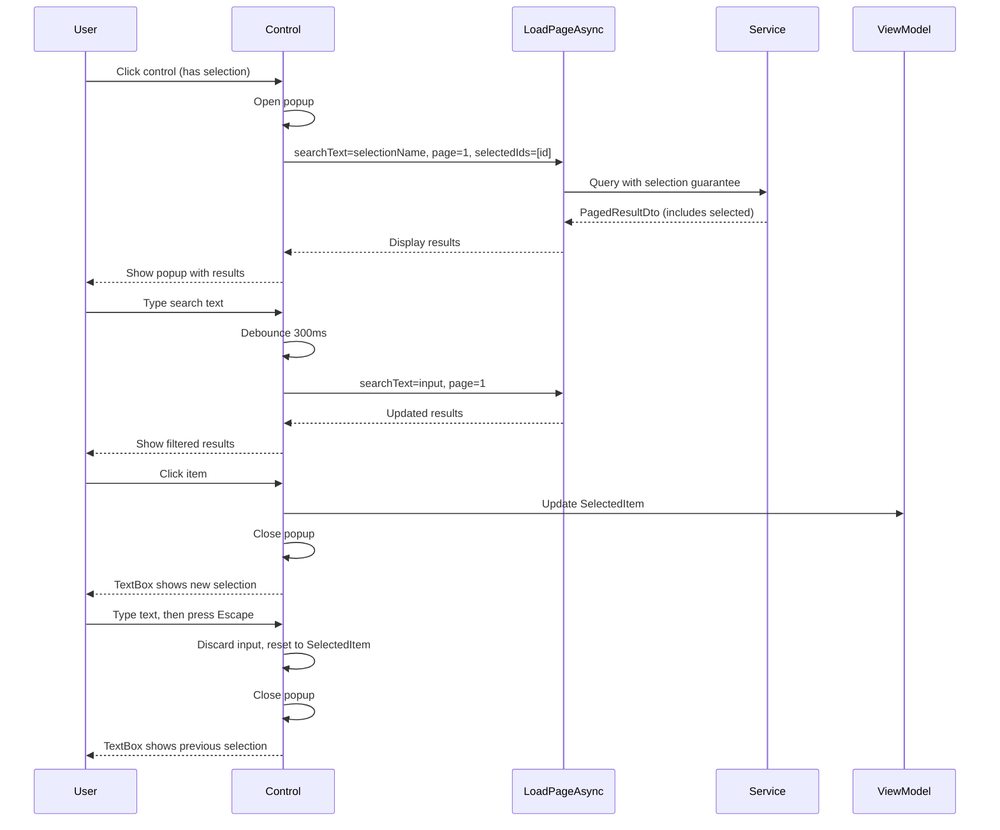
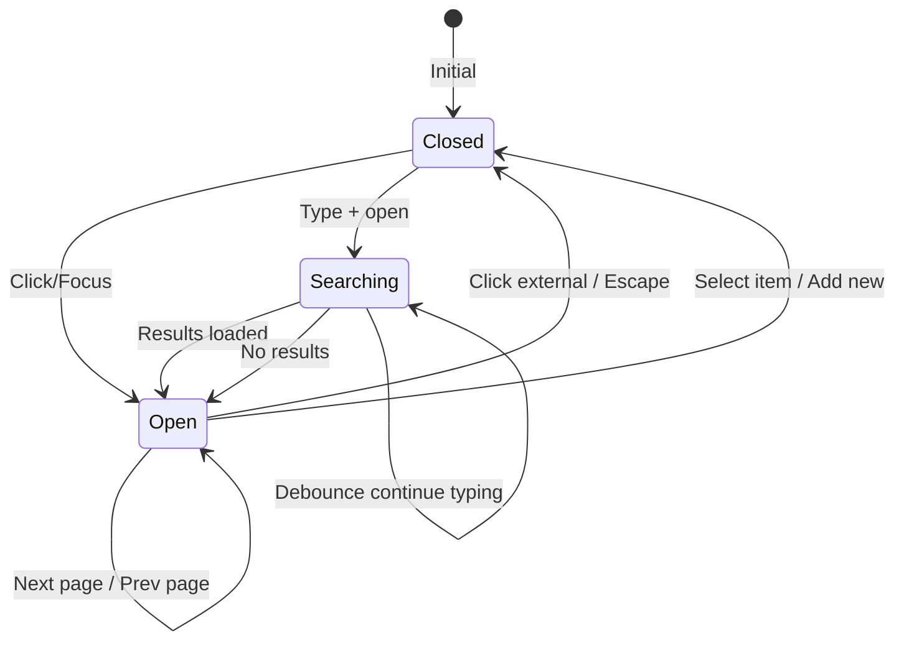
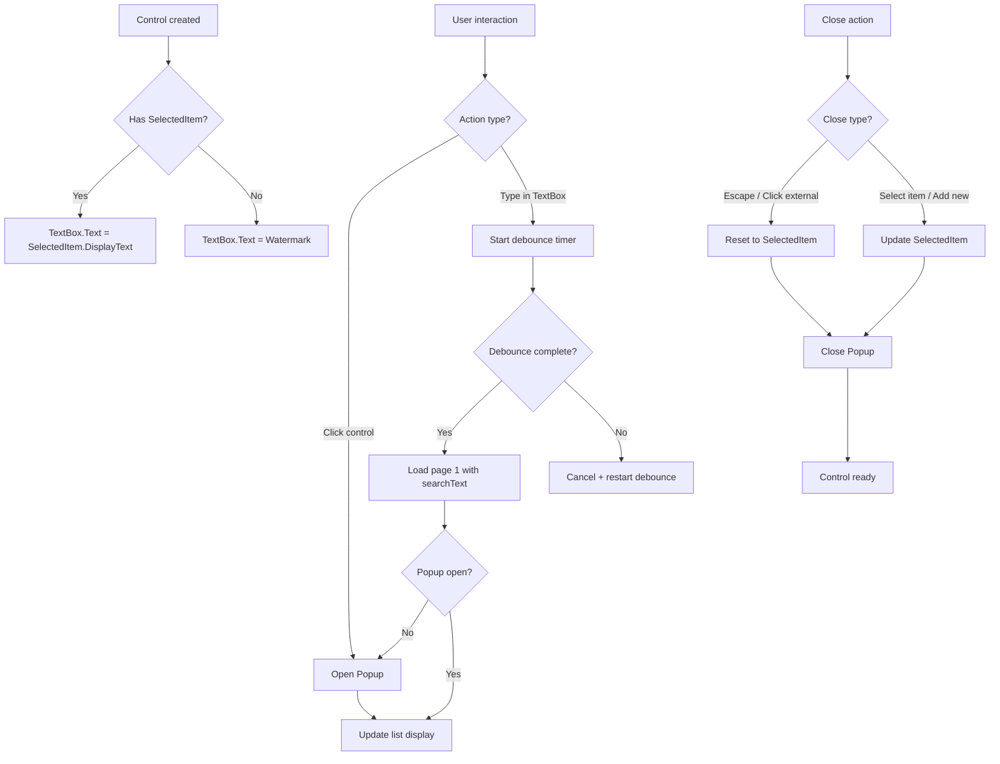

# Change: Implement Creatable, Pageable, and Searchable Selection Component

**Change ID**: `implement-creatable-pageable-searchable-selection`
**Status**: Draft
**Created**: 2026-02-28
**Type**: Feature

---

## Why

### Background

The current application uses a fragmented approach to selection components:

1. `SearchableSelectionBox` - basic search functionality
2. Parent view's `Popup` - popup management
3. `GenericSelectionPopup` - popup content with pagination and "add new" functionality

This three-part assembly requires:
- Maintaining popup state (`IsProvidersPopupOpen`) in parent viewmodels
- Manually declaring Popup elements with placement configuration in parent views
- Complex DataContext bindings
- Increased maintenance burden across multiple views

Additionally, a previous attempt at `PageableAutoCompleteBox` is being rolled back, so this proposal starts fresh from requirements rather than referencing that implementation.

### Problems

The current implementation has several issues:

1. **Code duplication**: Similar popup assembly patterns repeated across multiple views
2. **High coupling**: Parent views must manage popup lifecycle and state
3. **Poor reusability**: Three separate components must be manually coordinated
4. **Maintenance complexity**: Changes require updates in multiple places
5. **State management burden**: Viewmodels must track popup open/close state

---

## What Changes

### Overview

Create a single, self-contained `TemplatedControl` that integrates search, pagination, and optional "add new" capabilities in one component.

### Detailed Changes

1. **New Control**: Create a TemplatedControl (e.g., `SearchablePageableSelectBox`) with:
   - Single TextBox for both display and input (no separate TextBlock/TextBox)
   - Built-in Popup with automatic placement and sizing
   - Integrated list (ListBox/DataGrid) for results
   - Built-in pagination controls
   - Optional "add new" command interface

2. **Key Features**:
   - **Searchable**: Debounced text input (300ms) triggers async data loading
   - **Pageable**: Server/client pagination with configurable page size
   - **Creatable**: "Add new" entry when no results found (optional)
   - **Keyboard navigation**: Arrow Up/Down, Enter, Escape support
   - **Smart reset**: Escape/click-outside resets to selected item, discarding user input

3. **Data Loading Contract**:
   - `LoadPageAsync` delegate: `(searchText, page, pageSize, selectedIds, cancellationToken) => Task<PagedResultDto<T>>`
   - `selectedIds` ensures already-selected items appear in results
   - Service layer ignores `searchText` filter when it exactly matches selected item's display name

4. **API Properties**:
   - `SelectedItem` (TwoWay) - currently selected item
   - `DisplayMemberPath` - property path for display text
   - `GetItemId` - delegate to extract ID from item
   - `Watermark` - placeholder text when nothing selected
   - `PageSize` - items per page (default 10)
   - `LoadPageAsync` - data loading delegate
   - `AddNewCommand` - optional command for creating new items
   - `IsPopupOpen` - optional external control of popup state

### UI Design Changes

#### Single Control Usage (After)

```xml
<!-- Before: Three-part assembly -->
<Grid ColumnDefinitions="72,*">
    <Label Content="{Binding ProviderLabelText}" ... />
    <views:SearchableSelectionBox x:Name="ProvidersSelectionBox"
                                 DataContext="{Binding ProvidersPopupViewModel}"
                                 IsPopupOpen="{Binding IsProvidersPopupOpen, Mode=TwoWay}"
                                 PlaceholderText="请选择供应商" />
</Grid>

<Popup Name="ProvidersSelectionPopup" Placement="Bottom" ...>
    <views:GenericSelectionPopup DataContext="{Binding ProvidersPopupViewModel}" />
</Popup>

<!-- After: Single self-contained control -->
<Grid ColumnDefinitions="72,*">
    <Label Content="{Binding ProviderLabelText}" ... />
    <views:SearchablePageableSelectBox SelectedItem="{Binding SelectedProvider}"
                                      DisplayMemberPath="ProviderName"
                                      LoadPageAsync="{Binding LoadPagedProvidersAsync}"
                                      GetItemId="{Binding GetProviderId}"
                                      Watermark="请选择供应商"
                                      PageSize="10" />
</Grid>
```

#### Control Template Structure

```
[SearchablePageableSelectBox] (TemplatedControl)
├── PART_TextBox (TextBox)          // Single input/display surface
└── PART_Popup (Popup)
    └── Border (width aligned with control, MaxHeight limited)
        ├── PART_ItemsList (ListBox)   // Current page results
        ├── PART_Pager (Pager)         // Pagination controls
        └── PART_AddNew (Button)       // Optional "Add New" entry
```

#### User Interaction Flow



#### State Transition Diagram



### Code Flow Changes

#### Data Loading Flow

```mermaid
flowchart TD
    A[User interaction] --> B{Action type?}
    B -->|Click open| C[Load page 1<br/>searchText=selectedDisplayText<br/>selectedIds=[selectedId]]
    B -->|Type search| D[Debounce 300ms]
    D --> E[Load page 1<br/>searchText=typedText<br/>selectedIds=[selectedId]]
    B -->|Change page| F[Load page N<br/>searchText=currentSearchText<br/>selectedIds=[selectedId]]

    C --> G[LoadPageAsync delegate]
    E --> G
    F --> G

    G --> H{Has selected item?}
    H -->|Yes| I[Include selected in results<br/>even if filtered]
    H -->|No| J[Apply normal filters]

    I --> K[Return PagedResultDto]
    J --> K

    K --> L{Results count}
    L -->|Zero| M[Show empty + Add New button]
    L -->|One or more| N[Display list]
```

#### Popup Lifecycle Flow



---

## Impact

### Expected Benefits

- **Simplified parent views**: Remove popup declaration and state management
- **Reduced boilerplate**: Single control vs three-part assembly
- **Better encapsulation**: All selection logic in one place
- **Easier maintenance**: Changes only affect the control, not parent views
- **Reusability**: Drop-in replacement for existing selection patterns
- **Cleaner viewmodels**: No need to track `IsPopupOpen` state

### Risks and Mitigations

| Risk | Impact | Mitigation |
|------|--------|------------|
| Keyboard navigation complexity | High | Thorough manual testing of all keyboard paths |
| Popup positioning issues | Medium | Use Avalonia's default popup placement, test across screens |
| Service layer contract changes | Medium | Coordinate with backend team, add `selectedIds` parameter gradually |
| Breaking existing views | Low | Migration path with parallel testing, phased rollout |
| Debounce timing issues | Low | Use standard 300ms, configurable via property |

### Affected Specs

- New capability: `ui-selection` (to be created)
- Existing specs may need updates for migration patterns

### Affected Code

- **New files**:
  - `Views/Controls/SearchablePageableSelectBox.axaml`
  - `Views/Controls/SearchablePageableSelectBox.axaml.cs`

- **Modified files** (initially for testing):
  - `Views/SolidWasteModeFormView.axaml` - replace provider selection
  - `ViewModels/AttendedWeighingDetailViewModel.cs` - add `LoadPagedProvidersAsync`, remove `IsProvidersPopupOpen`

- **Service layer modifications**:
  - Service methods like `GetPagedProvidersAsync`, `GetPagedMaterialsAsync` need `selectedIds` parameter

---

## Success Criteria

- [ ] Control compiles and renders correctly
- [ ] Click opens popup with selected item highlighted
- [ ] Typing triggers debounced search
- [ ] Pagination works correctly
- [ ] Escape/click-outside resets to selected item
- [ ] Keyboard navigation (arrows, enter, escape) works
- [ ] "Add new" functionality works when no results (if implemented)
- [ ] Replaced provider selection in SolidWasteModeFormView works correctly
- [ ] Service layer accepts and uses `selectedIds` parameter correctly
- [ ] Manual testing passes all scenarios in section 6.2 of original proposal

---

## Next Steps

1. Implement the control class and template
2. Implement data loading logic with debouncing
3. Implement keyboard navigation and popup lifecycle
4. Update service layer to accept `selectedIds` parameter
5. Integrate in SolidWasteModeFormView for provider selection
6. Perform comprehensive manual testing
7. Document migration path for other views

---

## References

- Original proposal: `docs/proposal-creatable-pageable-searchable-selection.md`
- Target file for migration: `Views/SolidWasteModeFormView.axaml:39-53 + 175-185`
- Related control being rolled back: `PageableAutoCompleteBox` (do not reference)
