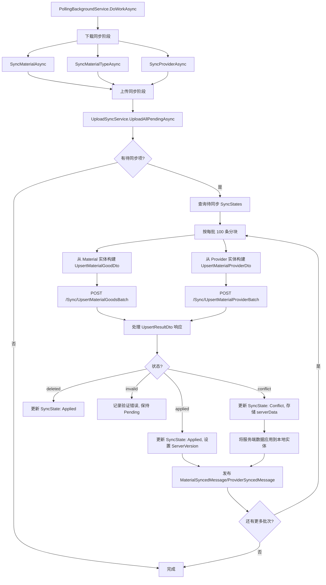
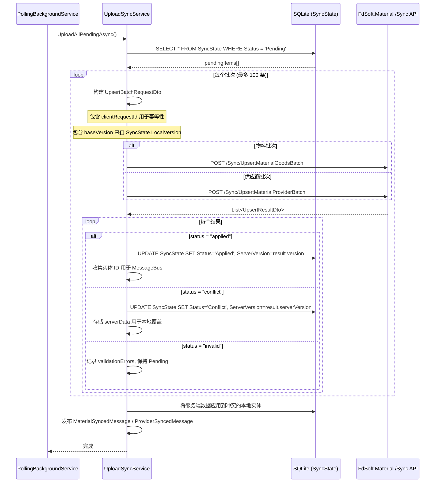

## Context

MaterialClient 是一个用于现场称重操作的 Avalonia 桌面应用。它目前通过基于时间戳的增量下载（`SyncMaterialService`）从中央平台同步物料、供应商和运单。后端（`FdSoft.Material`）近期新增了完整的上行同步 API（`SyncController`），支持：

- `MaterialGoods` 和 `MaterialProvider` 的单条和批量 upsert
- 幂等键（`clientRequestId`）用于去重
- 乐观锁（`baseVersion` / `version`）用于冲突检测
- 基于游标的变更日志分页查询（`/Sync/Changes`）

客户端需要对接这些端点以支持双向数据流。

### Current Architecture

```
MaterialClient (Avalonia)
├── MaterialClient.Common (Business Logic)
│   ├── Api/ (Refit clients, DTOs)
│   ├── Entities/ (Domain models, EF Core)
│   ├── Services/ (Domain services)
│   └── Events/ (MessageBus messages)
├── MaterialClient.EFCore (DB config, migrations)
├── MaterialClient (UI layer)
│   ├── Backgrounds/ (PollingBackgroundService)
│   ├── ViewModels/ (ReactiveUI ViewModels)
│   └── Views/ (Avalonia AXAML views)
```

### Constraints

- .NET 10, ReactiveUI for MVVM, ABP framework for DI and UoW
- Refit for HTTP clients with Polly retry policies
- SQLite local database via EF Core
- MessageBus for cross-ViewModel communication
- `[AutoConstructor]` for DI, no manual service registration
- File-scoped namespaces, record types for DTOs, primary constructors

## Goals / Non-Goals

**Goals:**
- Enable MaterialClient to push local material and supplier changes to the platform via the existing Sync API
- Track sync state per entity (pending, applied, conflict) with version alignment
- Integrate upload sync into the existing polling cycle
- Provide a UI for monitoring sync status and manual trigger
- Notify ViewModels of sync completion via MessageBus

**Non-Goals:**
- 本地 CRUD UI（不在范围内 — 物料通过其他流程创建并从平台同步；上行同步用于推送已有的本地变更）
- 完整的离线优先架构和复杂合并策略
- 实时推送（WebSocket）— 仅基于轮询
- 物料类型、运单或附件的上行同步（仅物料和供应商）
- 修改 FdSoft.Material 后端 — 同步 API 已完成

## Decisions

### Decision 1: 同步状态存储 — 独立的 `SyncState` 实体

**Choice**: 在 SQLite 中使用独立的 `SyncState` 表存储同步状态。

**Problem**: 现有下载同步（`SyncMaterialService`）使用 `WorkSettingsEntity` 记录各维度的同步时间戳（如 `MaterialUpdatedTime`）来实现增量拉取。然而，当前没有机制回答这个问题：*"哪些本地实体需要上传到服务端？"* 如果不追踪这个信息，上行同步服务将不得不在每个轮询周期重新扫描所有本地 `Material`/`Provider` 行并与服务端比对 — 代价高、脆弱，且无法检测冲突或重试。`SyncState` 通过维护按实体的上传队列和版本对齐来解决这个问题。

**Alternatives considered**:
- 在 `Material` 和 `Provider` 实体上直接添加同步字段 — 被否决，因为混合了领域关注点（业务数据）和基础设施关注点（同步追踪），且需要修改现有实体映射和迁移
- 仅内存存储 — 被否决，因为同步状态必须在应用重启后保留；崩溃的应用会丢失所有待上传追踪信息
- 每个周期全表扫描 — 被否决，因为不可扩展（必须比较每条本地记录与服务端），无法追踪重试状态，且无法向 UI 报告同步进度

**Rationale**: 独立的 `SyncState` 实体使同步追踪与领域模型正交。每行为一个实体回答三个问题：
1. **需要上传吗？** → `Status = Pending`
2. **已同步了吗？** → `LocalVersion == ServerVersion` 且 `Status = Applied`
3. **重试情况如何？** → `RetryCount`、`LastAttemptAt`、`ClientRequestId`（幂等键）

这使高效批量上传（仅查询待同步行）、冲突检测（比较版本）和 UI 状态显示（按实体显示待同步/已同步/冲突）成为可能。

### Decision 2: 上传触发 — 集成到 PollingBackgroundService

**Choice**: 在 `PollingBackgroundService` 中添加上行同步步骤，在下载同步完成后运行。

**Alternatives considered**:
- 独立的后台工作器 — 被否决，因为会增加复杂度而无收益；同步顺序很重要（先下载，后上传）
- 事件驱动（本地变更后立即同步）— 被否决，因为在当前范围内物料/供应商不在本地编辑

**Rationale**: 现有轮询周期已处理认证验证、下载同步和上传。在此添加上行同步遵循既定模式并确保顺序（下载 → 上传）。

### Decision 3: 自动分块的批量上传

**Choice**: 以每批最多 100 条（API 限制）的方式分批上传待同步项，每个轮询周期处理所有待同步项。

**Alternatives considered**:
- 单条上传 — 被否决，因为 N+1 HTTP 开销
- 无限制批量 — 被否决，因为 API 强制 100 条上限

**Rationale**: 批量上传在遵守 API 约束的同时最小化 HTTP 往返次数。项由服务自动分块。

### Decision 4: 冲突策略 — 服务端优先并通知用户

**Choice**: 版本冲突时，将服务端当前数据保存到本地（覆盖本地）并标记为"冲突已解决"。通过 MessageBus 通知用户。

**Alternatives considered**:
- 客户端优先 — 被否决，因为服务端是物料/供应商的权威数据源
- 三方合并 — 被否决，因为复杂度高；实体结构不支持有意义的字段级合并
- 阻塞并提示用户 — 被否决，因为后台同步不应在轮询期间要求 UI 交互

**Rationale**: 平台是物料和供应商的系统记录。客户端数据应向服务端状态收敛。数据管理 UI 显示冲突历史以供审计。

### Decision 5: 幂等键 — 每条 SyncState 条目一个 GUID

**Choice**: 创建 `SyncState` 条目时生成 `clientRequestId` GUID。重试时复用同一 GUID。

**Rationale**: 确保网络重试不会在服务端创建重复条目。GUID 存储在 `SyncState.ClientRequestId` 中，并在每次上传尝试时发送。

## Risks / Trade-offs

| Risk | Impact | Mitigation |
|------|--------|------------|
| 下载同步覆盖已推送的本地数据 | 推送尝试之间平台更新到达时客户端变更丢失 | 上传在轮询周期中下载之后运行；版本检查可捕获此情况 |
| 大量待同步项导致超时 | 同步步骤超过轮询间隔 | 分为 100 条一批；Polly 重试策略处理瞬态错误 |
| SyncState 表无限增长 | 随时间推移的存储/性能问题 | 自动清理：删除超过 30 天的"已同步"条目 |
| 离线期间产生大量待同步项 | 重连后首次同步较慢 | 批量处理并记录进度；不阻塞 UI |

## Component Architecture

```
Upload Sync Components
├── UploadSyncService (Domain Service)
│   ├── UploadPendingMaterialsAsync()
│   ├── UploadPendingProvidersAsync()
│   ├── UploadAllPendingAsync()
│   └── ResolveConflictAsync()
├── SyncState (Entity)
│   ├── EntityType (Material/Provider)
│   ├── EntityId (int)
│   ├── LocalVersion (long)
│   ├── ServerVersion (long?)
│   ├── Status (Pending/Applied/Conflict)
│   ├── ClientRequestId (Guid)
│   └── LastAttemptAt (DateTime?)
├── UploadSyncDto (DTOs)
│   ├── UpsertMaterialGoodDto (record)
│   ├── UpsertMaterialProviderDto (record)
│   ├── UpsertBatchRequestDto<T> (record)
│   └── UpsertResultDto (record)
├── Sync Messages (Events)
│   ├── MaterialSyncedMessage
│   └── ProviderSyncedMessage
├── DataManagementViewModel (ViewModel)
│   ├── SyncStates (ObservableCollection)
│   ├── SyncAllCommand
│   └── RefreshCommand
└── DataManagementWindow (View)
    ├── Material sync status DataGrid
    ├── Provider sync status DataGrid
    └── Sync All / Refresh buttons
```

## Data Flow



## API Call Sequence



## Detailed Code Changes

| File Path | Change Type | Description | Module |
|-----------|-------------|-------------|--------|
| `MaterialClient.Common/Api/IMaterialPlatformApi.cs` | Modify | 添加 5 个 Refit 方法: UpsertMaterialGood, UpsertMaterialProvider, UpsertMaterialGoodsBatch, UpsertMaterialProviderBatch, GetSyncChanges | API |
| `MaterialClient.Common/Api/Dtos/SyncDtos.cs` | Create | 所有同步 DTO（record 类型）: UpsertMaterialGoodDto, UpsertMaterialProviderDto, UpsertBatchRequestDto\<T\>, UpsertResultDto, SyncChangeItemDto, SyncChangesQueryDto | DTO |
| `MaterialClient.Common/Entities/SyncState.cs` | Create | SyncState 实体，含 EntityType 枚举、版本追踪、状态、幂等键 | Domain |
| `MaterialClient.Common/Services/UploadSyncService.cs` | Create | IUploadSyncService + UploadSyncService: 批量上传、冲突处理、状态管理 | Service |
| `MaterialClient.Common/Events/MaterialSyncedMessage.cs` | Create | MessageBus 消息类，含已同步实体 ID | Events |
| `MaterialClient.Common/Events/ProviderSyncedMessage.cs` | Create | MessageBus 消息类，含已同步实体 ID | Events |
| `MaterialClient/Backgrounds/PollingBackgroundService.cs` | Modify | 在下载同步后添加 UploadAllPendingAsync 步骤 | Background |
| `MaterialClient.EFCore/EntityConfigurations/SyncStateConfiguration.cs` | Create | EF Core 配置: 表名、索引、必填字段 | EF Core |
| `MaterialClient.EFCore/MaterialClientDbContext.cs` | Modify | 添加 DbSet\<SyncState\> | EF Core |
| `MaterialClient/ViewModels/DataManagementViewModel.cs` | Create | ViewModel: 加载同步状态, SyncAll/Refresh 命令 | ViewModel |
| `MaterialClient/Views/DataManagementWindow.axaml` | Create | 基于 DataGrid 的同步状态对话框 | UI |
| `MaterialClient/Views/DataManagementWindow.axaml.cs` | Create | 含 MessageBus 清理的 code-behind | UI |
| `MaterialClient/Migrations/` | Create | SyncState 表的 EF Core 迁移 | Migration |
