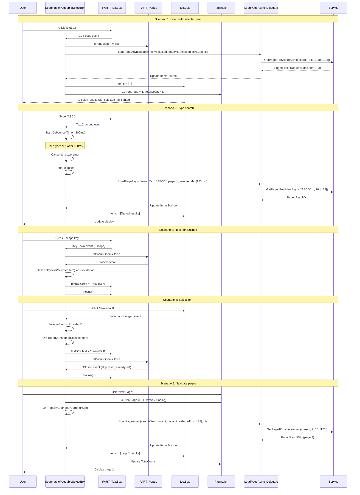

## Context

The `SearchablePageableSelectBox` control was implemented as part of the `implement-creatable-pageable-searchable-selection` change to replace the fragmented three-part selection pattern. However, the implementation has critical gaps that prevent it from meeting the requirements defined in the `ui-selection` spec.

### Current State Issues

1. **LoadPageAsync signature mismatch**: The control expects `Func<string, int, int, Task<>>` but the ui-selection spec requires passing `selectedIds` and `CancellationToken`
2. **Missing reset behavior**: When user types partial input and closes popup (Escape or click outside), TextBox retains the input instead of resetting to SelectedItem's display text
3. **No SelectedItem synchronization**: TextBox doesn't update when SelectedItem changes externally
4. **CurrentPage not synced**: Internal `_currentPage` state doesn't track changes from Ursa Pagination component
5. **SearchText not bindable**: Private field prevents template binding
6. **SelectedIds not passed**: Service layer is not receiving the selected item ID for the guarantee mechanism

### Constraints

- Must not break existing API usage patterns in ViewModels
- Service layer already supports `selectedIds` parameter (no service changes needed)
- Must align with ui-selection spec requirements
- Avalonia TemplatedControl pattern must be maintained
- ReactiveUI patterns already in use in the codebase

### Stakeholders

- Frontend developers maintaining the control
- QA testing the selection functionality
- Product owners expecting reliable selection behavior

---

## Goals / Non-Goals

**Goals:**

1. Fix LoadPageAsync delegate signature to accept `selectedIds` and `CancellationToken`
2. Implement TextBox reset behavior when popup closes via Escape or click outside
3. Add SelectedItem → TextBox synchronization via OnPropertyChanged
4. Fix CurrentPage tracking to sync with pagination component
5. Convert SearchText to a styled property for template binding
6. Pass selectedIds to LoadPageAsync call

**Non-Goals:**

- Changing the UI/UX design (already defined in ui-selection spec)
- Modifying service layer (already supports required signature)
- Adding new features beyond the refactor scope
- Automated UI testing (manual testing only per proposal)

---

## Decisions

### Decision 1: Update LoadPageAsync Signature to Match Spec

**What**: Change delegate from `Func<string, int, int, Task<PagedResultDto<object>>>` to `Func<string?, int, int, IReadOnlyList<int>?, CancellationToken, Task<PagedResultDto<object>>>`.

**Why**:
- The ui-selection spec requires passing `selectedIds` to ensure selected item appears in results
- CancellationToken is needed for proper async operation cancellation
- Service layer already supports this signature
- ViewModel is already preparing selectedIds (just needs to be passed through)

**Alternatives considered**:
1. **Keep current signature, wrap in ViewModel** - Would violate spec requirements, cause confusion
2. **Add overloads** - Unnecessary complexity, single signature is sufficient

### Decision 2: Reset TextBox on Popup Close via OnPopupClosed Event

**What**: Handle the Popup's Closed event to reset TextBox.Text to SelectedItem's display text, discarding any partial user input.

**Why**:
- Spec requirement: "The control SHALL reset the TextBox to the selected item's display text when closed via Escape or clicking outside"
- Prevents user confusion from unsanctioned input persisting
- Matches standard autocomplete/combobox behavior
- The current implementation sets `IsPopupOpen = false` but doesn't reset the TextBox

**Implementation approach**:
```csharp
private void OnPopupClosed(object? sender, EventArgs e)
{
    // Reset to selected item's display, discarding user input
    _searchText = GetDisplayText(SelectedItem);
    if (_textBox != null)
    {
        _textBox.Text = _searchText;
    }
}
```

**Alternatives considered**:
1. **Keep user input** - Confusing, unclear if changes are saved
2. **Auto-select matching result** - Surprising behavior, could cause accidental changes

### Decision 3: SelectedItem Change Handler in OnPropertyChanged

**What**: Add override for `OnPropertyChanged` to detect SelectedItem changes and update TextBox accordingly.

**Why**:
- When ViewModel sets SelectedItem externally, TextBox should reflect the change
- This two-way binding ensures consistency
- Required by spec: "changes to SelectedProvider SHALL update control"
- Current implementation doesn't have this handler

**Implementation approach**:
```csharp
protected override void OnPropertyChanged(AvaloniaPropertyChangedEventArgs change)
{
    base.OnPropertyChanged(change);

    if (change.Property == SelectedItemProperty)
    {
        UpdateTextBoxText();
    }
}

private void UpdateTextBoxText()
{
    if (_textBox != null)
    {
        _textBox.Text = GetDisplayText(SelectedItem);
    }
}
```

**Alternatives considered**:
1. **Reactive binding in template** - More complex, code-behind is simpler
2. **ViewModel handles TextBox** - Breaks control encapsulation

### Decision 4: Convert SearchText to StyledProperty

**What**: Change from private `string _searchText` field to `StyledProperty<string?> SearchTextProperty` with read/write wrapper.

**Why**:
- Template needs to bind to SearchText (see SearchablePageableSelectBox.axaml line ~20)
- StyledProperty enables XAML binding and template access
- Follows Avalonia patterns for control properties
- Allows external access if needed for debugging

**Implementation approach**:
```csharp
public static readonly StyledProperty<string?> SearchTextProperty =
    AvaloniaProperty.Register<SearchablePageableSelectBox, string?>(nameof(SearchText));

public string? SearchText
{
    get => GetValue(SearchTextProperty);
    set => SetValue(SearchTextProperty, value);
}

// Internal usage updates the property instead of field
private void OnTextBoxTextChanged(object? sender, TextChangedEventArgs e)
{
    _debounceTimer.Stop();
    _debounceTimer.Start();
}

private void OnDebounceElapsed(object? sender, EventArgs e)
{
    _debounceTimer.Stop();
    if (_textBox != null)
    {
        SearchText = _textBox.Text ?? string.Empty;  // Update property
    }
    _currentPage = 1;
    _ = LoadPageAsyncInternal();
}
```

**Alternatives considered**:
1. **Keep as field, expose via read-only method** - Prevents template binding
2. **DirectProperty** - Overkill, StyledProperty is standard for user-configurable properties

### Decision 5: Pass selectedIds to LoadPageAsync

**What**: Extract selected item ID using `GetItemId` delegate and pass to LoadPageAsync call.

**Why**:
- Spec requirement: "system SHALL include selected item's ID in selectedIds parameter"
- Service layer ensures selected item appears in results even if filtered
- The delegate now accepts this parameter
- Current implementation doesn't extract or pass selectedIds

**Implementation approach**:
```csharp
private async Task LoadPageAsyncInternal()
{
    var loadFunc = LoadPageAsync;
    if (loadFunc == null)
    {
        return;
    }

    _cts?.Cancel();
    _cts = new CancellationTokenSource();

    // Extract selected ID for guarantee
    var selectedIds = SelectedItem != null && GetItemId != null
        ? new[] { GetItemId(SelectedItem) }.Where(id => id.HasValue).Select(id => id.Value).ToArray()
        : null;

    try
    {
        IsLoading = true;
        var result = await loadFunc(SearchText, _currentPage, PageSize, selectedIds, _cts.Token);

        _items.Clear();
        foreach (var item in result.Items ?? [])
        {
            _items.Add(item);
        }

        TotalCount = (int)result.TotalCount;
    }
    catch (TaskCanceledException)
    {
        // Ignore cancellation
    }
    catch (Exception)
    {
        _items.Clear();
        TotalCount = 0;
    }
    finally
    {
        IsLoading = false;
    }
}
```

**Alternatives considered**:
1. **Don't pass selectedIds** - Violates spec, selected item may disappear from results
2. **ViewModel handles extraction** - Breaks control's data-agnostic design

### Decision 6: Sync CurrentPage with Ursa Pagination

**What**: Update `_currentPage` when Ursa Pagination component changes, ensure bidirectional sync.

**Why**:
- Template binds `PageIndex="{Binding CurrentPage, Mode=TwoWay}"` to Ursa's Pagination
- When user clicks next/prev, Pagination updates CurrentPage
- Current implementation only updates `_currentPage` internally, doesn't receive pagination changes
- Could cause page tracking desynchronization

**Implementation approach**:
The template already has TwoWay binding: `PageIndex="{Binding CurrentPage, Mode=TwoWay}"`. We need to ensure:
1. `CurrentPage` is a styled property (not private field)
2. OnPropertyChanged handler updates state when CurrentPage changes

```csharp
// Convert from private _currentPage to property
public static readonly StyledProperty<int> CurrentPageProperty =
    AvaloniaProperty.Register<SearchablePageableSelectBox, int>(nameof(CurrentPage), defaultValue: 1);

public int CurrentPage
{
    get => GetValue(CurrentPageProperty);
    set => SetValue(CurrentPageProperty, value);
}

protected override void OnPropertyChanged(AvaloniaPropertyChangedEventArgs change)
{
    base.OnPropertyChanged(change);

    if (change.Property == CurrentPageProperty)
    {
        // Page changed from pagination component, reload data
        _ = LoadPageAsyncInternal();
    }
}
```

**Alternatives considered**:
1. **Remove TwoWay binding, use command** - Loses automatic sync, more code
2. **Keep one-way, ignore pagination changes** - Doesn't reload correct page

---

## Component Architecture

```
SearchablePageableSelectBox (TemplatedControl)
├── PART_TextBox (TextBox)
│   ├── GotFocus event → OpenPopup
│   ├── TextChanged event → StartDebounce
│   └── KeyDown event → Handle Escape/Enter
├── PART_Popup (Popup)
│   ├── Opened event → InitialLoad
│   └── Closed event → ResetToSelectedItem
├── PART_ItemsList (ListBox)
│   └── SelectionChanged event → UpdateSelectedItem
├── PART_Pager (Ursa Pagination)
│   └── PageIndex binding (TwoWay) → CurrentPage property
└── PART_AddNew (Button)
    └── Command → AddNewCommand

Properties (StyledProperty):
├── SelectedItem (TwoWay binding)
├── DisplayMemberPath
├── GetItemId (Func<object?, int>?)
├── Watermark
├── PageSize
├── LoadPageAsync (Func<string?, int, int, IReadOnlyList<int>?, CancellationToken, Task<>>)
├── AddNewCommand (IReactiveCommand?)
├── IsPopupOpen
├── SearchText (NEW - read/write for binding)
└── CurrentPage (NEW - property for pagination sync)

Read-only Properties:
├── IsLoading (DirectProperty<bool>)
├── IsNotLoading (computed)
├── Items (ObservableCollection<object>)
├── TotalCount
├── ShowAddNew (computed)
└── PageChangeCommand (ReactiveCommand)

Internal State:
├── _items (ObservableCollection)
├── _searchText (removed, now SearchTextProperty)
├── _currentPage (removed, now CurrentPageProperty)
├── _isLoading (backing for IsLoading)
├── _cts (CancellationTokenSource)
└── _debounceTimer (DispatcherTimer)
```

---

## Data Flow

```mermaid
flowchart TD
    Start[User Interaction] --> Action{Action Type?}

    Action -->|Click/Focus TextBox| OpenPopup[Open Popup]
    Action -->|Type in TextBox| Debounce[Start 300ms Timer]
    Action -->|Click Next/Prev Page| PageNav[Update CurrentPage]

    OpenPopup --> Load1[LoadPageAsync]
    Load1 --> Load1Call[LoadPageAsync<br/>searchText=selectedText<br/>page=1<br/>selectedIds=[selectedId]]

    Debounce -->|Timer Elapsed| Load2[LoadPageAsync]
    Load2 --> Load2Call[LoadPageAsync<br/>searchText=typed<br/>page=1<br/>selectedIds=[selectedId]]

    PageNav --> Load3[LoadPageAsync]
    Load3 --> Load3Call[LoadPageAsync<br/>searchText=current<br/>page=newPage<br/>selectedIds=[selectedId]]

    Load1Call --> Extract[Extract selectedId<br/>via GetItemId]
    Load2Call --> Extract
    Load3Call --> Extract

    Extract --> Service[Service Layer]
    Service --> Result{Result?}

    Result -->|Success| UpdateItems[Update ItemsSource]
    Result -->|Cancelled| Ignore[Ignore cancellation]
    Result -->|Error| ClearItems[Clear & show error]

    UpdateItems --> UpdateUI[Update ListBox & Pagination]
    ClearItems --> UpdateUI

    UpdateUI --> CheckClose{Popup Closing?}

    CheckClose -->|Escape / Click Outside| Reset[Reset TextBox<br/>to SelectedItem display]
    CheckClose -->|Select Item| UpdateSel[Set SelectedItem]
    CheckClose -->|Add New| AddNew[Execute AddNewCommand]

    Reset --> ClosePopup[Close Popup]
    UpdateSel --> ClosePopup
    AddNew --> ClosePopup

    ClosePopup --> End[Control Ready]
```

---

## API Call Sequence



---

## Risks / Trade-offs

| Risk | Impact | Mitigation |
|------|--------|------------|
| **LoadPageAsync signature break** | High - Existing ViewModels using old signature won't compile | Provide clear migration instructions; compile errors will identify all affected code |
| **TextBox reset timing** | Medium - Could flicker or cause visual glitch | Test on slow machines; consider adding delay if needed |
| **CurrentPage sync race conditions** | Medium - Pagination changes and programmatic page updates could conflict | Use PropertyChanged to detect source; throttle reloads if needed |
| **CancellationToken not handled properly** | Medium - Could cause memory leaks or orphaned tasks | Ensure proper disposal pattern; test with rapid user input |
| **SearchText property binding overhead** | Low - More property change notifications than needed | Negligible performance impact; standard Avalonia pattern |

### Trade-offs

1. **StyledProperty vs DirectProperty for SearchText/CurrentPage**
   - Trade-off: More overhead from property notifications vs. better XAML support
   - Reasoning: Template requires binding, notifications are acceptable
   - Mitigation: Use default values to minimize unnecessary changes

2. **Reset on all popup close events**
   - Trade-off: Simpler code vs. conditional reset only when input differs
   - Reasoning: Always reset ensures consistency
   - Mitigation: Could optimize to check if text differs before reset

3. **Pass selectedIds even when null**
   - Trade-off: More explicit vs. rely on service to handle null
   - Reasoning: Makes intent clear
   - Mitigation: Service already handles null correctly

---

## Detailed Code Change Inventory

| File Path | Change Type | Change Description | Lines Affected |
|-----------|-------------|-------------------|----------------|
| **MaterialClient/Views/SearchablePageableSelectBox.axaml.cs** | Update | Change LoadPageAsyncProperty signature | 38-39 |
| MaterialClient/Views/SearchablePageableSelectBox.axaml.cs | Update | Add SearchTextProperty | New (~30 lines) |
| MaterialClient/Views/SearchablePageableSelectBox.axaml.cs | Update | Convert _searchText to SearchTextProperty usage | Multiple |
| MaterialClient/Views/SearchablePageableSelectBox.axaml.cs | Update | Add OnPropertyChanged override | New (~10 lines) |
| MaterialClient/Views/SearchablePageableSelectBox.axaml.cs | Update | Add UpdateTextBoxText helper | New (~10 lines) |
| MaterialClient/Views/SearchablePageableSelectBox.axaml.cs | Update | Modify OnPopupClosed to reset TextBox | Modify lines 224-227 |
| MaterialClient/Views/SearchablePageableSelectBox.axaml.cs | Update | Add selectedIds extraction in LoadPageAsyncInternal | Modify lines 229-266 |
| MaterialClient/Views/SearchablePageableSelectBox.axaml.cs | Update | Convert _currentPage to CurrentPageProperty | New (~10 lines) |
| MaterialClient/Views/SearchablePageableSelectBox.axaml.cs | Update | Add CurrentPage PropertyChanged handler | Modify existing override |
| MaterialClient/Views/SearchablePageableSelectBox.axaml | Update | Change SearchText binding to use new property | Line ~20 |
| MaterialClient/Views/SearchablePageableSelectBox.axaml | Update | Ensure CurrentPage TwoWay binding | Line ~50 |
| **MaterialClient/ViewModels/AttendedWeighingDetailViewModel.cs** | Update | Update LoadPagedProvidersAsync signature | 1501-1504 |
| MaterialClient/ViewModels/AttendedWeighingDetailViewModel.cs | Update | Remove manual selectedIds extraction | 1506 |
| MaterialClient/ViewModels/AttendedWeighingDetailViewModel.cs | Update | Update LoadPagedMaterialsAsync signature | 1525-1528 |
| MaterialClient/ViewModels/AttendedWeighingDetailViewModel.cs | Update | Remove manual selectedIds extraction | 1532 |

---

## Migration Plan

### Phase 1: Control Implementation

1. Update LoadPageAsyncProperty signature
2. Add SearchTextProperty and update all internal references
3. Add CurrentPageProperty and update all internal references
4. Add OnPropertyChanged override for SelectedItem sync
5. Add UpdateTextBoxText helper method
6. Update OnPopupClosed to reset TextBox
7. Update LoadPageAsyncInternal to extract and pass selectedIds

### Phase 2: ViewModel Updates

1. Update LoadPagedProvidersAsync to accept new delegate signature
2. Remove manual selectedIds extraction (control now handles it)
3. Update LoadPagedMaterialsAsync similarly
4. Compile and fix any errors

### Phase 3: Testing

1. Test provider selection: open, select, verify TextBox updates
2. Test search: type, verify results, verify reset on Escape
3. Test pagination: navigate pages, verify correct data
4. Test add new: verify command executes and popup closes
5. Test keyboard: arrows, Enter, Escape work correctly
6. Test external SelectedItem changes: verify TextBox syncs

### Rollback Plan

1. Keep git history for easy revert
2. If issues found, revert to commit before refactor
3. Document issues found for next iteration
4. Consider feature flag to toggle between old and new implementations (if needed)

---

## Open Questions

None at this time. The refactor scope is well-defined by the ui-selection spec requirements and the known implementation gaps.
