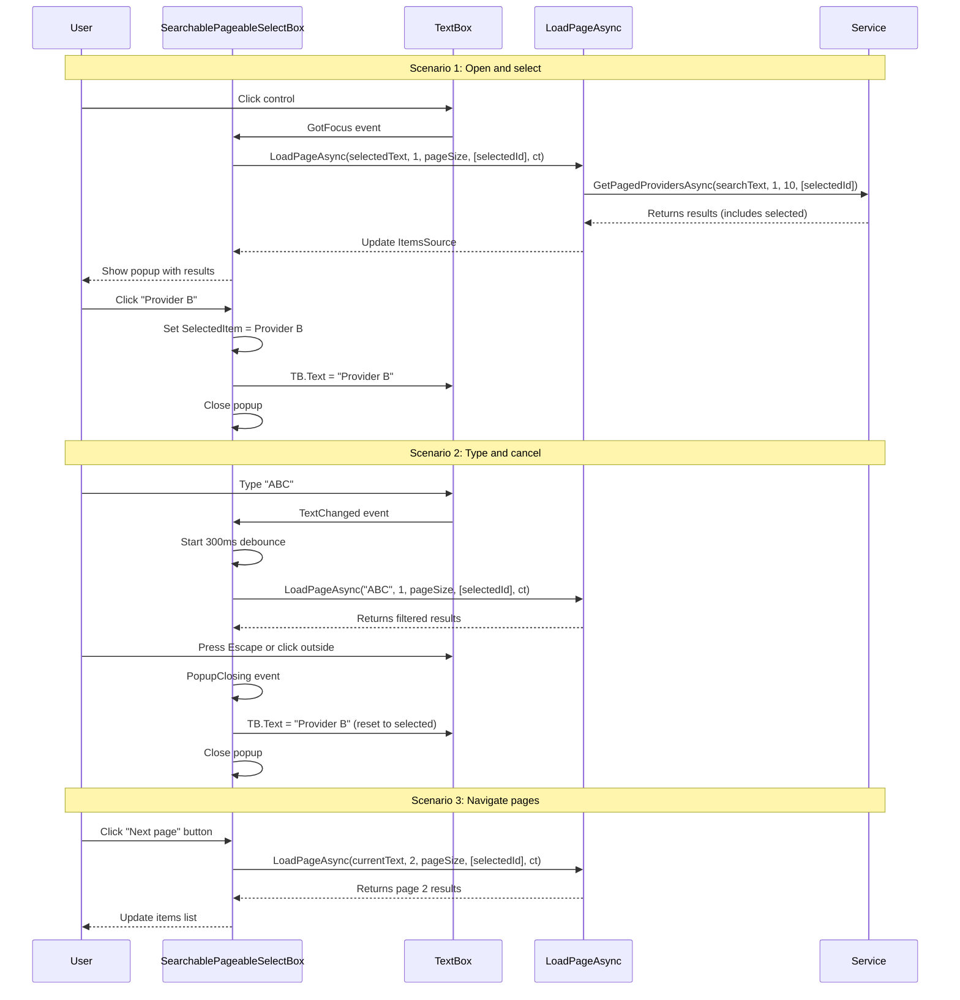

## Why

The SearchablePageableSelectBox control was implemented to replace the fragmented three-part selection pattern (SearchableSelectionBox + Popup + GenericSelectionPopup), but it has critical implementation gaps that prevent it from working correctly. The control cannot properly reset user input, synchronize with SelectedItem changes, or pass selectedIds to the service layer, causing user confusion and broken selection behavior.

## What Changes

- **BREAKING**: Update `LoadPageAsync` delegate signature from `Func<string, int, int, Task<PagedResultDto<object>>>` to `Func<string?, int, int, IReadOnlyList<int>?, CancellationToken, Task<PagedResultDto<object>>>`
- Add TextBox reset behavior on popup close (Escape or click outside) to discard partial input and restore SelectedItem display
- Implement SelectedItem → TextBox synchronization via OnPropertyChanged handler
- Fix CurrentPage tracking to sync with Ursa Pagination component
- Convert SearchText from private field to styled property for template binding
- Pass selectedIds to LoadPageAsync call to ensure selected item appears in results
- Update ViewModel method signatures to match new LoadPageAsync delegate (if needed)

## Capabilities

This change aligns the implementation with the existing `ui-selection` capability defined in the `implement-creatable-pageable-searchable-selection` change. No new capabilities are introduced; this is an implementation fix to meet existing requirements.

### New Capabilities
None (refactoring to meet existing `ui-selection` spec requirements)

### Modified Capabilities
None (requirements unchanged - fixing implementation only)

## Impact

- **SearchablePageableSelectBox.axaml.cs**: Core control implementation - signature updates, state synchronization, reset logic
- **SearchablePageableSelectBox.axaml**: Template may need binding updates for SearchText property
- **AttendedWeighingDetailViewModel.cs**: LoadPagedProvidersAsync method signature may need adjustment

---

## User Interface

```
┌─────────────────────────────────────────────┐
│  SearchablePageableSelectBox               │
│  ┌───────────────────────────────────────┐ │
│  │ [Provider Name or Watermark]         │ │
│  └───────────────────────────────────────┘ │
│  ┌───────────────────────────────────────┐ │
│  │ PART_Popup (when open)            │ │
│  │ ┌─────────────────────────────────┐ │ │
│  │ │ Loading... [spinner]           │ │ │
│  └─────────────────────────────────┘ │ │
│  │ ┌─────────────────────────────────┐ │ │
│  │ │ Provider A                   │ │ │
│  │ │ Provider B (selected)          │ │ │
│  │ │ Provider C                   │ │ │
│  └─────────────────────────────────┘ │ │
│  │ [<] Page 1/5 [>] [+ Add New]   │ │
│  └───────────────────────────────────────┘ │
└─────────────────────────────────────────────┘
```

## User Interaction Flow



## Code Change Inventory

| File Path | Change Type | Change Description | Impact Scope |
|-----------|-------------|-------------------|--------------|
| MaterialClient/Views/SearchablePageableSelectBox.axaml.cs | Update | Fix LoadPageAsync signature, add reset logic, sync SelectedItem, add SearchText property | High |
| MaterialClient/Views/SearchablePageableSelectBox.axaml | Update | Update SearchText binding if needed | Low |
| MaterialClient/ViewModels/AttendedWeighingDetailViewModel.cs | Update | Update LoadPagedProvidersAsync signature to match new delegate | Medium |
