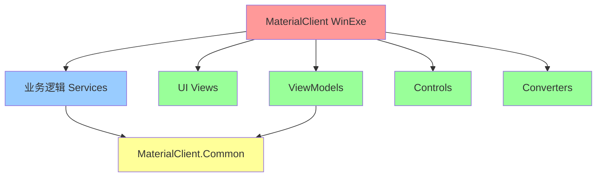
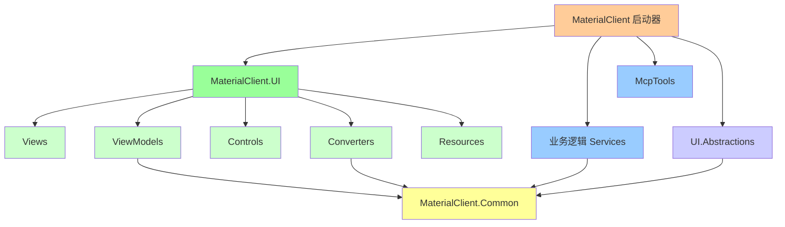
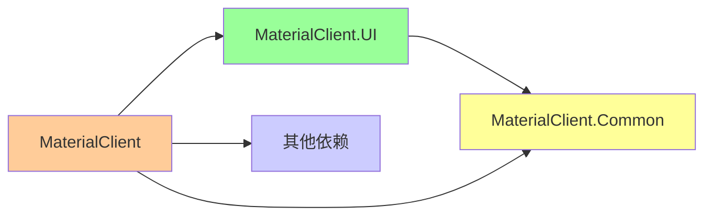
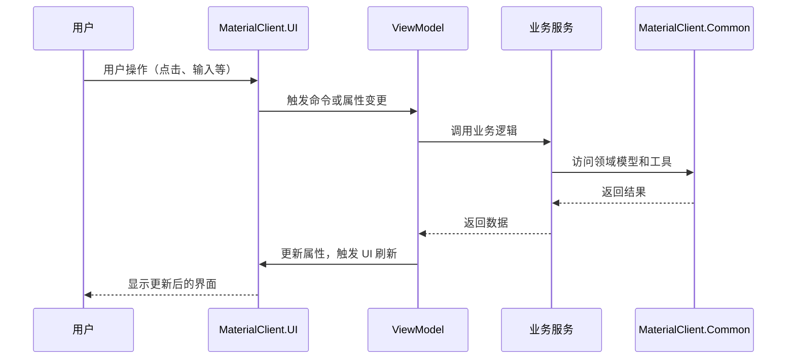
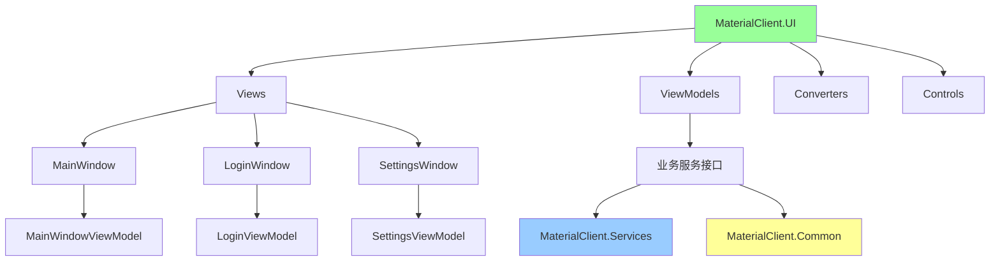

# 设计文档：UI 项目分离架构

## 概述

本文档详细说明了将 MaterialClient 项目的 UI 层分离到独立 MaterialClient.UI 项目的架构设计和实现方案。

## 背景

当前 MaterialClient 项目采用单体架构，将业务逻辑、服务层和 UI 层混合在同一个项目中。这种架构存在以下问题：

1. **职责不清**：单个项目承担过多职责
2. **耦合度高**：UI 和业务逻辑紧密耦合
3. **测试困难**：UI 组件难以独立测试
4. **协作效率低**：不同开发人员难以并行工作
5. **可维护性差**：代码规模增大后难以维护

## 目标

### 主要目标

1. **职责分离**：将 UI 层独立为单独的项目
2. **降低耦合**：UI 层通过接口和依赖注入与业务层交互
3. **提高可测试性**：UI 组件可以独立进行单元测试
4. **改善可维护性**：清晰的项目结构便于维护和扩展
5. **支持团队协作**：不同团队可以并行开发 UI 和业务逻辑

### 非目标

1. 不改变现有的业务逻辑和服务实现
2. 不改变用户界面外观和行为
3. 不影响现有功能的性能

## 架构设计

### 当前架构



### 目标架构



### 项目依赖关系



## 技术决策

### 决策 1：创建独立的 UI 项目

**选择**：创建 MaterialClient.UI 作为独立的 Avalonia 项目

**原因**：
- 遵循 Avalonia 官方推荐的最佳实践
- 便于 UI 组件的独立测试和维护
- 支持未来可能的 UI 项目复用

**替代方案**：
- 将 UI 内容移动到 MaterialClient.Common（否决：增加 Common 项目复杂性）
- 保持现状（否决：不符合分离目标）

### 决策 2：项目命名空间调整

**选择**：使用 `MaterialClient.UI` 作为根命名空间

**原因**：
- 明确标识这是 UI 层项目
- 与项目名称保持一致
- 便于命名空间管理

**影响**：
- 原有命名空间 `MaterialClient.Views` → `MaterialClient.UI.Views`
- 原有命名空间 `MaterialClient.ViewModels` → `MaterialClient.UI.ViewModels`

### 决策 3：MaterialClient 作为启动器

**选择**：MaterialClient 项目改为应用程序启动器，不再包含 UI 内容

**原因**：
- 保持应用程序入口点的清晰性
- MaterialClient 项目可以专注于业务逻辑和依赖注入配置
- 符合分层架构的最佳实践

**保留在 MaterialClient 的内容**：
- Program.cs（应用程序启动）
- MaterialClientModule.cs（依赖注入配置）
- Services（业务逻辑服务）
- McpTools（MCP 工具）
- UI.Abstractions（UI 抽象接口）

## UI/UX 设计

### 用户界面无变化

本次重构不改变任何用户界面的外观和行为，因此不需要 UI mockup。

### 迁移对用户体验的影响

- **无感知**：用户不会察觉到项目结构的变化
- **功能一致**：所有现有功能保持不变
- **性能影响**：理论上可能略微提升（更好的模块化），但用户不应感知到明显差异

## 技术设计

### 项目文件结构

#### MaterialClient.UI 项目结构

```
MaterialClient.UI/
├── MaterialClient.UI.csproj
├── App.axaml
├── App.axaml.cs
├── Assets/
│   └── [资源文件]
├── Backgrounds/
│   └── [背景文件]
├── Converters/
│   ├── CarNullOrEmptyImageConverter.cs
│   └── NullOrEmptyImageConverter.cs
├── Controls/
│   ├── [自定义控件]
│   └── ...
├── Views/
│   ├── MainWindow.axaml
│   ├── LoginWindow.axaml
│   ├── SettingsWindow.axaml
│   ├── AttendedWeighing/
│   │   └── AttendedWeighingWindow.axaml
│   ├── Dialogs/
│   │   ├── AddCameraDialog.axaml
│   │   └── AddLprDialog.axaml
│   └── Controls/
│       ├── AnimatedDeliveryTypeRadioButton.axaml
│       └── ...
└── ViewModels/
    ├── MainWindowViewModel.cs
    ├── LoginViewModel.cs
    └── ...
```

#### MaterialClient 项目结构（重构后）

```
MaterialClient/
├── MaterialClient.csproj
├── Program.cs
├── app.manifest
├── appsettings.json
├── appsettings.secret.json
├── MaterialClientModule.cs
├── McpTools/
│   └── [MCP 工具]
├── Services/
│   └── [业务逻辑服务]
└── UI.Abstractions/
    └── [UI 抽象接口]
```

### 项目文件配置

#### MaterialClient.UI.csproj

```xml
<Project Sdk="Microsoft.NET.Sdk">
    <PropertyGroup>
        <RootNamespace>MaterialClient.UI</RootNamespace>
        <OutputType>Library</OutputType>
        <TargetFramework>net8.0</TargetFramework>
        <Nullable>enable</Nullable>
        <BuiltInComInteropSupport>true</BuiltInComInteropSupport>
        <ApplicationManifest>app.manifest</ApplicationManifest>
        <AvaloniaUseCompiledBindingsByDefault>true</AvaloniaUseCompiledBindingsByDefault>
    </PropertyGroup>

    <ItemGroup>
        <AvaloniaResource Include="Assets\**" />
        <AvaloniaResource Include="Backgrounds\**" />
    </ItemGroup>

    <ItemGroup>
        <PackageReference Include="Avalonia" />
        <PackageReference Include="Avalonia.ReactiveUI" />
        <PackageReference Include="Avalonia.Themes.Fluent" />
        <PackageReference Include="Avalonia.Fonts.Inter" />
        <PackageReference Include="Avalonia.Controls.DataGrid" />
        <PackageReference Include="AvaloniaUI.DiagnosticsSupport" />
        <PackageReference Include="Irihi.Avalonia.Shared" />
        <PackageReference Include="Irihi.Ursa" />
        <PackageReference Include="Irihi.Ursa.Themes.Semi" />
        <PackageReference Include="MessageBox.Avalonia" />
        <PackageReference Include="ReactiveUI.SourceGenerators">
            <PrivateAssets>all</PrivateAssets>
            <IncludeAssets>runtime; build; native; contentfiles; analyzers; buildtransitive</IncludeAssets>
        </PackageReference>
        <PackageReference Include="Semi.Avalonia" />
    </ItemGroup>

    <ItemGroup>
        <ProjectReference Include="..\MaterialClient.Common\MaterialClient.Common.csproj" />
    </ItemGroup>
</Project>
```

### 数据流设计

### 用户交互流程



### 组件交互图



## 代码变更清单

### 新增文件

| 文件路径 | 说明 |
|---------|-----|
| `MaterialClient.UI/MaterialClient.UI.csproj` | UI 项目文件 |
| `MaterialClient.UI/Views/` | 所有 View 文件 |
| `MaterialClient.UI/ViewModels/` | 所有 ViewModel 文件 |
| `MaterialClient.UI/Controls/` | 所有自定义控件 |
| `MaterialClient.UI/Converters/` | 所有值转换器 |
| `MaterialClient.UI/App.axaml` | 应用程序 XAML |
| `MaterialClient.UI/App.axaml.cs` | 应用程序代码隐藏 |
| `MaterialClient.UI/Assets/` | 资源文件 |
| `MaterialClient.UI/Backgrounds/` | 背景文件 |

### 修改文件

| 文件路径 | 变更类型 | 变更说明 | 影响模块 |
|---------|---------|---------|---------|
| `MaterialClient.sln` | 修改 | 添加 MaterialClient.UI 项目引用 | 解决方案 |
| `MaterialClient/MaterialClient.csproj` | 修改 | 移除 UI 包引用，添加 MaterialClient.UI 项目引用 | 主项目 |
| `MaterialClient/Program.cs` | 修改 | 更新启动逻辑以使用 MaterialClient.UI | 启动器 |
| `MaterialClient/MaterialClientModule.cs` | 修改 | 更新依赖注入配置 | 依赖注入 |

### 删除文件

| 文件路径 | 原因 |
|---------|-----|
| `MaterialClient/Views/` | 已迁移到 MaterialClient.UI |
| `MaterialClient/ViewModels/` | 已迁移到 MaterialClient.UI |
| `MaterialClient/Controls/` | 已迁移到 MaterialClient.UI |
| `MaterialClient/Converters/` | 已迁移到 MaterialClient.UI |
| `MaterialClient/Assets/` | 已迁移到 MaterialClient.UI |
| `MaterialClient/Backgrounds/` | 已迁移到 MaterialClient.UI |
| `MaterialClient/App.axaml` | 已迁移到 MaterialClient.UI |
| `MaterialClient/App.axaml.cs` | 已迁移到 MaterialClient.UI |

## 命名空间迁移

### 命名空间映射表

| 旧命名空间 | 新命名空间 |
|-----------|-----------|
| `MaterialClient.Views` | `MaterialClient.UI.Views` |
| `MaterialClient.ViewModels` | `MaterialClient.UI.ViewModels` |
| `MaterialClient.Controls` | `MaterialClient.UI.Controls` |
| `MaterialClient.Converters` | `MaterialClient.UI.Converters` |

### XAML 命名空间更新示例

```xml
<!-- 修改前 -->
<UserControl xmlns="https://github.com/avaloniaui"
             xmlns:x="http://schemas.microsoft.com/winfx/2006/xaml"
             xmlns:mc="http://schemas.openxmlformats.org/markup-compatibility/2006"
             xmlns:local="clr-namespace:MaterialClient.Controls"
             mc:Ignorable="d">
</UserControl>

<!-- 修改后 -->
<UserControl xmlns="https://github.com/avaloniaui"
             xmlns:x="http://schemas.microsoft.com/winfx/2006/xaml"
             xmlns:mc="http://schemas.openxmlformats.org/markup-compatibility/2006"
             xmlns:local="clr-namespace:MaterialClient.UI.Controls"
             mc:Ignorable="d">
</UserControl>
```

## 风险和权衡

### 风险

1. **大规模代码迁移**：需要迁移大量文件，可能出现遗漏或错误
   - **缓解措施**：使用自动化脚本辅助迁移，逐步验证

2. **命名空间变更**：可能导致编译错误和运行时问题
   - **缓解措施**：提供详细的迁移清单，逐步验证

3. **依赖关系复杂性**：项目间的依赖关系可能引入新的问题
   - **缓解措施**：清晰定义依赖关系，使用依赖注入解耦

4. **开发团队适应**：团队需要适应新的项目结构
   - **缓解措施**：提供详细的文档和培训

### 权衡

1. **复杂性 vs 可维护性**：增加了一定的项目复杂性，但显著提高了可维护性
2. **迁移成本 vs 长期收益**：短期的迁移成本 vs 长期的维护和开发效率提升

## 迁移计划

### 阶段 1：准备阶段

1. 创建特性分支：`feature/separate-ui-project`
2. 审查当前项目结构
3. 创建迁移检查清单

### 阶段 2：创建新项目

1. 创建 MaterialClient.UI 项目
2. 配置项目文件和依赖
3. 设置资源嵌入规则

### 阶段 3：迁移文件

1. 迁移 Views
2. 迁移 ViewModels
3. 迁移 Controls
4. 迁移 Converters
5. 迁移资源和启动文件

### 阶段 4：更新主项目

1. 移除 UI 相关包引用
2. 添加 MaterialClient.UI 项目引用
3. 更新启动逻辑
4. 更新依赖注入配置

### 阶段 5：验证和测试

1. 编译验证
2. 功能测试
3. 回归测试
4. 性能测试

### 阶段 6：文档和培训

1. 更新项目文档
2. 创建架构文档
3. 团队培训

### 回滚计划

如果迁移过程中遇到严重问题：

1. 切换回迁移前的分支
2. 分析问题原因
3. 修复问题后重新迁移

## 测试策略

### 单元测试

- MaterialClient.UI 中的 ViewModel 可以独立进行单元测试
- 验证 ViewModel 的业务逻辑和状态管理

### 集成测试

- 测试 UI 层与服务层的集成
- 验证依赖注入配置的正确性

### 回归测试

- 验证所有现有功能正常工作
- 确保没有引入新的缺陷

### 性能测试

- 对比迁移前后的性能指标
- 确保迁移不会影响性能

## 未决问题

1. 是否需要为 MaterialClient.UI 创建独立的测试项目？（建议：是）
2. 是否需要迁移 ViewLocator 到 MaterialClient.UI？（建议：保持 MaterialClient 中的位置，或在 UI.Abstractions 中定义接口）
3. UI.Abstractions 是否应该移动到 MaterialClient.UI？（建议：保持在 MaterialClient 中，作为抽象层）

## 参考资料

- Avalonia 官方文档：https://docs.avaloniaui.net/
- .NET MAUI 架构指南：https://docs.microsoft.com/en-us/dotnet/maui/
- 清洁架构：https://blog.cleancoder.com/uncle-bob/2012/08/13/the-clean-architecture.html
