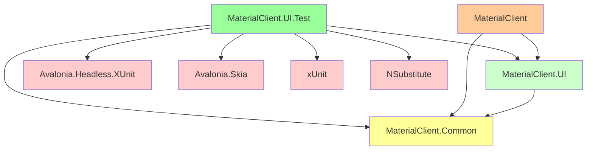
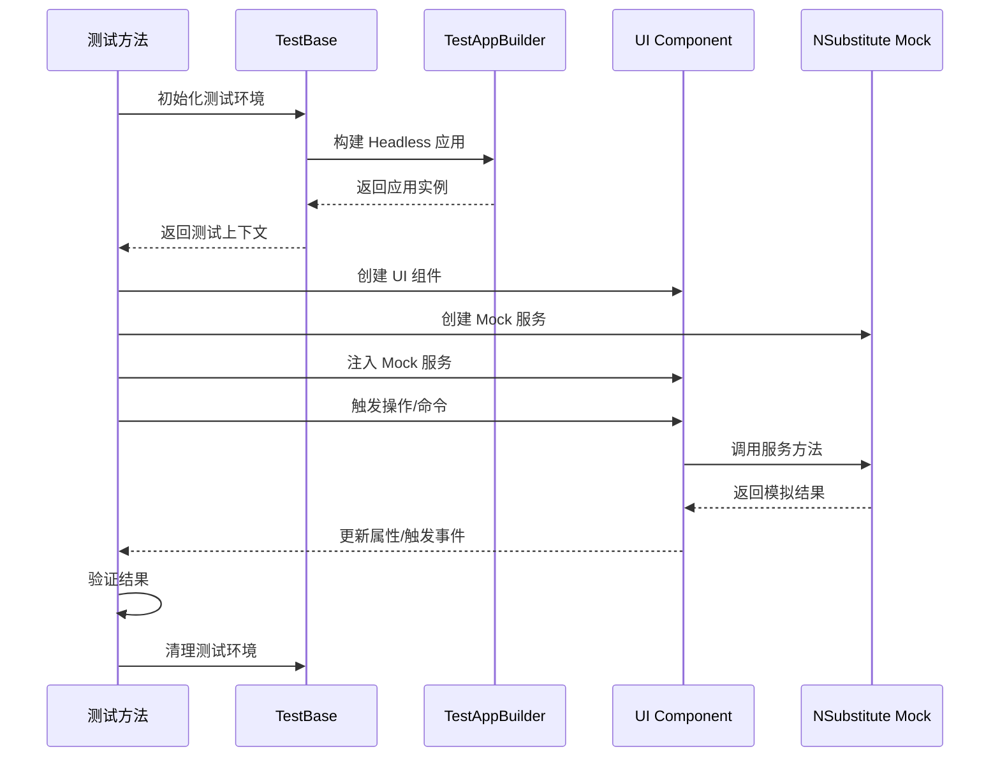

# 设计文档：UI 测试基础设施（Avalonia Headless）

## 概述

本文档详细说明了创建 MaterialClient.UI 项目和 MaterialClient.UI.Test 测试项目的技术设计和实现方案，重点关注 Avalonia Headless 模式的测试基础设施。

## 背景

**当前状态**：

1. **项目架构问题**：MaterialClient 项目采用单体架构，UI 层与业务逻辑混合在一起
2. **测试基础设施缺失**：没有专门的 UI 测试项目，UI 组件难以进行自动化测试
3. **CI/CD 限制**：现有的 UI 无法在无图形界面的环境中测试，限制了持续集成的能力

**相关变更**：
- `separate-ui-to-materialclient-ui`：正在将 UI 层分离到独立的 MaterialClient.UI 项目
- 本变更在 UI 项目分离的基础上，建立测试基础设施

**约束条件**：
- 必须与现有的测试框架（xUnit、NSubstitute）保持一致（MaterialClient.Common.Tests 已使用 xUnit）
- 必须支持 Avalonia 11.x 版本
- 必须能够在 CI/CD 环境中无头运行
- 应尽量减少对现有代码的影响

## 目标

### 主要目标

1. **创建 MaterialClient.UI 项目**：独立的 UI 类库项目，包含所有 UI 组件
2. **创建 MaterialClient.UI.Test 项目**：基于 Avalonia Headless 的测试项目
3. **配置测试环境**：支持在无头模式下运行 UI 测试
4. **建立测试框架**：提供测试基类和辅助工具，简化测试编写
5. **支持 CI/CD**：确保测试可以在持续集成环境中运行

### 非目标

1. 不改变 UI 的外观和行为
2. 不重写现有的业务逻辑
3. 不改变 MaterialClient.Common 项目的测试基础设施
4. 不立即编写所有 UI 组件的完整测试（渐进式添加）

## 技术决策

### 决策 1：使用 Avalonia.Headless.XUnit

**选择**：使用 `Avalonia.Headless.XUnit` 作为 UI 测试框架

**原因**：
- 官方推荐的 Avalonia UI 测试解决方案
- 完全支持 xUnit 测试框架（与现有测试基础设施一致）
- 可以在无图形界面的环境中运行测试
- 提供 UI 组件的完整交互和验证能力

**替代方案考虑**：
- **手动模拟 UI 组件**：工作量巨大，不可靠
- **使用 Selenium 或 Playwright**：适用于 Web 应用，不适用于 Avalonia
- **使用 UI Automation (UIA)**：适用于集成测试，但不适合单元测试
- **使用 NUnit**：MaterialClient.Common.Tests 已使用 xUnit，保持一致性更佳

**包版本**：
```xml
<PackageReference Include="Avalonia.Headless.XUnit" Version="11.2.3" />
<PackageReference Include="Avalonia.Skia" Version="11.2.3" />
```

### 决策 2：MaterialClient.UI 项目类型

**选择**：创建为类库项目（Library），而非应用程序项目

**原因**：
- 作为被测试项目，不需要独立运行
- MaterialClient 主项目可以作为启动器引用 UI 项目
- 遵循 Avalonia 推荐的分层架构模式

**项目配置**：
```xml
<Project Sdk="Microsoft.NET.Sdk">
    <PropertyGroup>
        <RootNamespace>MaterialClient.UI</RootNamespace>
        <OutputType>Library</OutputType>
        <TargetFramework>net8.0</TargetFramework>
        <Nullable>enable</Nullable>
        <BuiltInComInteropSupport>true</BuiltInComInteropSupport>
        <AvaloniaUseCompiledBindingsByDefault>true</AvaloniaUseCompiledBindingsByDefault>
    </PropertyGroup>
    <!-- ... -->
</Project>
```

### 决策 3：测试项目依赖关系

**选择**：MaterialClient.UI.Test 直接引用 MaterialClient.UI 项目

**原因**：
- 简单直接，可以测试真实的 UI 组件
- 避免额外的抽象层，减少复杂性
- 与 MaterialClient.Common.Tests 的模式保持一致

**依赖关系图**：

```
MaterialClient.UI.Test
    ├─ MaterialClient.UI (UI 项目)
    ├─ MaterialClient.Common (可选，用于 Mock)
    ├─ Avalonia.Headless.XUnit
    ├─ Avalonia.Skia
    ├─ xUnit
    └─ NSubstitute
```

### 决策 4：测试应用程序构建器

**选择**：创建专门的 TestAppBuilder 用于测试环境

**原因**：
- 分离测试和生产环境的配置
- 提供 Headless 模式的特定配置
- 便于测试项目的初始化

**实现示例**：

```csharp
[assembly: AvaloniaTestApplication(typeof(TestAppBuilder))]

public class TestAppBuilder
{
    public static AppBuilder BuildAvaloniaApp() =>
        AppBuilder.Configure<App>()
            .UseHeadless(new AvaloniaHeadlessPlatformOptions()
            {
                UseGpu = false,  // 禁用 GPU 以提高兼容性
                RenderingMode = new[] { "Software" }
            });
}
```

### 决策 5：测试覆盖范围

**选择**：采用渐进式测试策略，从高价值、低成本的测试开始

**优先级顺序**：

1. **ViewModel 单元测试**（高优先级）
   - 测试业务逻辑和状态管理
   - 成本低，价值高
   - 不依赖 UI 渲染

2. **Converter 单元测试**（高优先级）
   - 测试值转换逻辑
   - 成本低，价值高
   - 容易编写和维护

3. **Control 逻辑测试**（中优先级）
   - 测试自定义控件的行为
   - 成本中等，价值中等
   - 需要模拟部分 UI 环境

4. **Window 集成测试**（低优先级）
   - 测试完整的用户流程
   - 成本高，价值高
   - 复杂性高，维护成本高

## 架构设计

### 项目结构

```
MaterialClient/
├── MaterialClient (启动器)
│   ├── Program.cs
│   └── MaterialClientModule.cs
│
├── MaterialClient.UI/ (新增)
│   ├── MaterialClient.UI.csproj
│   ├── App.axaml
│   ├── App.axaml.cs
│   ├── Assets/
│   ├── Backgrounds/
│   ├── Converters/
│   ├── Controls/
│   ├── ViewModels/
│   └── Views/
│
└── MaterialClient.UI.Test/ (新增)
    ├── MaterialClient.UI.Test.csproj
    ├── TestAppBuilder.cs
    ├── TestBase.cs
    ├── Mocks/
    │   └── [Mock 工厂和辅助类]
    ├── ViewModels/
    │   ├── LoginViewModelTests.cs
    │   └── ...
    ├── Converters/
    │   └── ...
    └── Integration/
        └── [集成测试]
```

### 依赖关系图



### 测试执行流程



## 技术实现

### MaterialClient.UI 项目配置

#### 项目文件结构

```xml
<Project Sdk="Microsoft.NET.Sdk">
    <PropertyGroup>
        <RootNamespace>MaterialClient.UI</RootNamespace>
        <OutputType>Library</OutputType>
        <TargetFramework>net8.0</TargetFramework>
        <Nullable>enable</Nullable>
        <BuiltInComInteropSupport>true</BuiltInComInteropSupport>
        <ApplicationManifest>app.manifest</ApplicationManifest>
        <AvaloniaUseCompiledBindingsByDefault>true</AvaloniaUseCompiledBindingsByDefault>
    </PropertyGroup>

    <ItemGroup>
        <AvaloniaResource Include="Assets\**" />
        <AvaloniaResource Include="Backgrounds\**" />
    </ItemGroup>

    <ItemGroup>
        <PackageReference Include="Avalonia" />
        <PackageReference Include="Avalonia.ReactiveUI" />
        <PackageReference Include="Avalonia.Themes.Fluent" />
        <PackageReference Include="Avalonia.Fonts.Inter" />
        <PackageReference Include="Avalonia.Controls.DataGrid" />
        <PackageReference Include="Irihi.Avalonia.Shared" />
        <PackageReference Include="Irihi.Ursa" />
        <PackageReference Include="Irihi.Ursa.Themes.Semi" />
        <PackageReference Include="MessageBox.Avalonia" />
        <PackageReference Include="ReactiveUI.SourceGenerators">
            <PrivateAssets>all</PrivateAssets>
            <IncludeAssets>runtime; build; native; contentfiles; analyzers; buildtransitive</IncludeAssets>
        </PackageReference>
        <PackageReference Include="Semi.Avalonia" />
    </ItemGroup>

    <ItemGroup>
        <ProjectReference Include="..\MaterialClient.Common\MaterialClient.Common.csproj" />
    </ItemGroup>
</Project>
```

### MaterialClient.UI.Test 项目配置

#### 项目文件结构

```xml
<Project Sdk="Microsoft.NET.Sdk">
    <PropertyGroup>
        <RootNamespace>MaterialClient.UI.Test</RootNamespace>
        <IsPackable>false</IsPackable>
        <IsTestProject>true</IsTestProject>
        <TargetFramework>net8.0</TargetFramework>
    </PropertyGroup>

    <ItemGroup>
        <PackageReference Include="Avalonia.Headless.XUnit" Version="11.2.3" />
        <PackageReference Include="Avalonia.Skia" Version="11.2.3" />
        <PackageReference Include="xunit" Version="2.5.3" />
        <PackageReference Include="xunit.runner.visualstudio" Version="2.5.3">
            <PrivateAssets>all</PrivateAssets>
            <IncludeAssets>runtime; build; native; contentfiles; analyzers</IncludeAssets>
        </PackageReference>
        <PackageReference Include="coverlet.collector" Version="6.0.0">
            <PrivateAssets>all</PrivateAssets>
            <IncludeAssets>runtime; build; native; contentfiles; analyzers; buildtransitive</IncludeAssets>
        </PackageReference>
        <PackageReference Include="NSubstitute" Version="5.1.0" />
        <PackageReference Include="Shouldly" Version="4.2.1" />
    </ItemGroup>

    <ItemGroup>
        <ProjectReference Include="..\MaterialClient.UI\MaterialClient.UI.csproj" />
        <ProjectReference Include="..\MaterialClient.Common\MaterialClient.Common.csproj" />
    </ItemGroup>
</Project>
```

#### 测试基类实现

```csharp
using Avalonia;
using Avalonia.Headless;
using Xunit;

[assembly: AvaloniaTestApplication(typeof(TestAppBuilder))]

namespace MaterialClient.UI.Test
{
    public class TestAppBuilder
    {
        public static AppBuilder BuildAvaloniaApp() =>
            AppBuilder.Configure<App>()
                .UseHeadless(new AvaloniaHeadlessPlatformOptions
                {
                    UseGpu = false,
                    RenderingMode = new[] { "Software" }
                });
    }

    public static class TestHelper
    {
        public static T CreateControl<T>() where T : new()
        {
            // 初始化测试环境并创建控件
            return new T();
        }
    }
}
```

### 测试示例

#### ViewModel 测试示例

```csharp
using NSubstitute;
using Shouldly;
using Xunit;

namespace MaterialClient.UI.Test.ViewModels
{
    public class LoginViewModelTests
    {
        [Fact]
        public void Constructor_WithValidDependencies_InitializesCorrectly()
        {
            // Arrange
            var authService = Substitute.For<IAuthService>();

            // Act
            var viewModel = new LoginViewModel(authService);

            // Assert
            viewModel.ShouldNotBeNull();
            viewModel.Username.ShouldBeNullOrEmpty();
            viewModel.Password.ShouldBeNullOrEmpty();
            viewModel.CanLogin.ShouldBeFalse();
        }

        [Fact]
        public async Task LoginCommand_WithValidCredentials_LogsInSuccessfully()
        {
            // Arrange
            var authService = Substitute.For<IAuthService>();
            authService.AuthenticateAsync("user@example.com", "password")
                .Returns(Task.FromResult(true));

            var viewModel = new LoginViewModel(authService);
            viewModel.Username = "user@example.com";
            viewModel.Password = "password";

            // Act
            await viewModel.LoginCommand.ExecuteAsync(null);

            // Assert
            await authService.Received(1).AuthenticateAsync("user@example.com", "password");
            viewModel.IsLoggedIn.ShouldBeTrue();
        }
    }
}
```

#### Converter 测试示例

```csharp
using Shouldly;
using Xunit;
using MaterialClient.UI.Converters;

namespace MaterialClient.UI.Test.Converters
{
    public class NullOrEmptyImageConverterTests
    {
        private readonly NullOrEmptyImageConverter _converter;

        public NullOrEmptyImageConverterTests()
        {
            _converter = new NullOrEmptyImageConverter();
        }

        [Fact]
        public void Convert_WithNullValue_ReturnsPlaceholderImage()
        {
            // Act
            var result = _converter.Convert(null, typeof(Bitmap), null, null);

            // Assert
            result.ShouldNotBeNull();
            result.ShouldBeOfType<Bitmap>();
        }

        [Fact]
        public void Convert_WithValidPath_ReturnsBitmap()
        {
            // Arrange
            var validPath = "Assets/logo.png";

            // Act
            var result = _converter.Convert(validPath, typeof(Bitmap), null, null);

            // Assert
            result.ShouldNotBeNull();
            result.ShouldBeOfType<Bitmap>();
        }

        [Fact]
        public void Convert_WithEmptyString_ReturnsPlaceholderImage()
        {
            // Act
            var result = _converter.Convert("", typeof(Bitmap), null, null);

            // Assert
            result.ShouldNotBeNull();
            result.ShouldBeOfType<Bitmap>();
        }
    }
}
```

## 代码变更清单

### 新增文件

| 文件路径 | 说明 | 影响模块 |
|---------|-----|---------|
| `MaterialClient.UI/MaterialClient.UI.csproj` | UI 项目文件 | 项目结构 |
| `MaterialClient.UI/App.axaml` | 应用程序 XAML | UI 应用 |
| `MaterialClient.UI/App.axaml.cs` | 应用程序代码隐藏 | UI 应用 |
| `MaterialClient.UI/Assets/**` | 资源文件 | UI 资源 |
| `MaterialClient.UI/Backgrounds/**` | 背景文件 | UI 资源 |
| `MaterialClient.UI/Converters/**` | 值转换器 | UI 转换器 |
| `MaterialClient.UI/Controls/**` | 自定义控件 | UI 控件 |
| `MaterialClient.UI/ViewModels/**` | 视图模型 | MVVM |
| `MaterialClient.UI/Views/**` | 视图 | UI 视图 |
| `MaterialClient.UI.Test/MaterialClient.UI.Test.csproj` | 测试项目文件 | 测试基础 |
| `MaterialClient.UI.Test/TestAppBuilder.cs` | 测试应用构建器 | 测试配置 |
| `MaterialClient.UI.Test/TestBase.cs` | 测试基类 | 测试基础 |
| `MaterialClient.UI.Test/Mocks/**` | Mock 工厂和辅助类 | 测试 Mock |
| `MaterialClient.UI.Test/ViewModels/**` | ViewModel 测试 | 单元测试 |
| `MaterialClient.UI.Test/Converters/**` | Converter 测试 | 单元测试 |

### 修改文件

| 文件路径 | 变更类型 | 变更说明 | 影响模块 |
|---------|---------|---------|---------|
| `MaterialClient.sln` | 修改 | 添加 MaterialClient.UI 和 MaterialClient.UI.Test 项目引用 | 解决方案 |
| `MaterialClient/MaterialClient.csproj` | 修改 | 移除 UI 包引用，添加 MaterialClient.UI 项目引用 | 主项目 |
| `MaterialClient/Program.cs` | 修改 | 更新启动逻辑以使用 MaterialClient.UI | 启动器 |
| `MaterialClient/MaterialClientModule.cs` | 修改 | 更新依赖注入配置 | 依赖注入 |

### 删除/迁移文件

| 来源路径 | 目标路径 | 迁移类型 |
|---------|---------|---------|
| `MaterialClient/Views/**` | `MaterialClient.UI/Views/**` | 迁移 |
| `MaterialClient/ViewModels/**` | `MaterialClient.UI/ViewModels/**` | 迁移 |
| `MaterialClient/Controls/**` | `MaterialClient.UI/Controls/**` | 迁移 |
| `MaterialClient/Converters/**` | `MaterialClient.UI/Converters/**` | 迁移 |
| `MaterialClient/App.axaml` | `MaterialClient.UI/App.axaml` | 迁移 |
| `MaterialClient/App.axaml.cs` | `MaterialClient.UI/App.axaml.cs` | 迁移 |
| `MaterialClient/Assets/**` | `MaterialClient.UI/Assets/**` | 迁移 |
| `MaterialClient/Backgrounds/**` | `MaterialClient.UI/Backgrounds/**` | 迁移 |

## 风险和权衡

### 风险

1. **大规模代码迁移**
   - **风险**：迁移大量 UI 代码可能出现遗漏或错误
   - **缓解措施**：使用自动化脚本辅助迁移，逐步验证，创建详细的迁移检查清单

2. **Avalonia.Headless 兼容性**
   - **风险**：某些 UI 组件可能在 Headless 模式下行为异常
   - **缓解措施**：优先测试核心组件，逐步扩展覆盖范围；对于无法在 Headless 模式下测试的组件，标记为手动测试

3. **测试维护成本**
   - **风险**：UI 测试可能因为 UI 变更而频繁失败
   - **缓解措施**：专注于测试业务逻辑（ViewModel）而非 UI 渲染；使用 Page Object 模式提高测试稳定性

4. **与 `separate-ui-to-materialclient-ui` 变更的依赖**
   - **风险**：两个变更都涉及创建 MaterialClient.UI 项目，可能产生冲突
   - **缓解措施**：明确两个变更的关系和执行顺序；考虑合并或调整变更范围

### 权衡

1. **测试覆盖 vs 开发速度**
   - **权衡**：更多的测试覆盖可以提高质量，但需要更多时间
   - **平衡**：采用渐进式测试策略，优先测试高价值、低成本的组件

2. **Headless 测试 vs 手动测试**
   - **权衡**：Headless 测试可以在 CI/CD 中自动化，但可能遗漏某些 UI 问题
   - **平衡**：Headless 测试作为自动化回归测试，手动测试作为用户体验验证

3. **测试粒度**
   - **权衡**：细粒度的单元测试更容易定位问题，但维护成本高；粗粒度的集成测试更接近实际使用，但难以调试
   - **平衡**：主要使用单元测试（ViewModel、Converter），必要时使用集成测试

## 迁移计划

### 阶段 1：准备工作

1. 创建特性分支：`feature/ui-testing-infrastructure`
2. 与 `separate-ui-to-materialclient-ui` 变更协调执行顺序
3. 创建迁移检查清单

### 阶段 2：创建 MaterialClient.UI 项目

1. 创建项目结构和 csproj 文件
2. 配置项目依赖和资源嵌入规则
3. 迁移 UI 代码（Views、ViewModels、Controls、Converters、Resources）
4. 更新命名空间引用
5. 编译验证

### 阶段 3：创建 MaterialClient.UI.Test 项目

1. 创建测试项目结构
2. 配置测试依赖（Avalonia.Headless.XUnit、xUnit、NSubstitute）
3. 创建 TestAppBuilder 和测试基类
4. 编写示例测试（LoginViewModel、NullOrEmptyImageConverter）
5. 运行测试验证

### 阶段 4：更新 MaterialClient 主项目

1. 移除 UI 相关包引用
2. 添加 MaterialClient.UI 项目引用
3. 更新 Program.cs 启动逻辑
4. 更新 MaterialClientModule.cs 依赖注入配置
5. 编译和运行验证

### 阶段 5：CI/CD 集成

1. 配置测试命令（dotnet test）
2. 配置测试覆盖率报告
3. 在 CI/CD 管道中添加测试步骤
4. 验证 CI/CD 环境中的测试运行

### 阶段 6：渐进式测试添加

1. 为关键 ViewModel 添加单元测试
2. 为所有 Converter 添加单元测试
3. 为自定义 Control 添加逻辑测试
4. 根据需要添加 Window 集成测试

### 回滚计划

如果迁移过程中遇到严重问题：

1. 切换回迁移前的分支
2. 分析问题原因
3. 修复问题后重新迁移

## 未决问题

1. **与 `separate-ui-to-materialclient-ui` 变更的关系**
   - 是否应该合并两个变更？
   - 或者调整 `ui-testing-infrastructure-avalonia-headless` 的范围，仅创建测试项目？

2. **测试覆盖范围**
   - 是否需要立即为所有 UI 组件编写测试？
   - 还是采用渐进式策略，优先测试高价值组件？

3. **CI/CD 配置**
   - 当前的 CI/CD 工具链是什么（GitHub Actions、Azure DevOps、Jenkins）？
   - 如何集成测试覆盖率报告？

## 参考资料

- [Avalonia Headless Testing with XUnit 官方文档](https://docs.avaloniaui.net/zh-Hans/docs/concepts/headless/headless-xunit)
- [.NET Talks - 实战 Avalonia Headless 测试](https://developer.microsoft.com/en-us/reactor/events/24145/)
- [PixiEditor 的 UI 自动化测试指南](https://www.cnblogs.com/clnchanpin/p/19341290)
- [Ursa.Avalonia 无头测试](https://m.blog.csdn.net/gitblog_00842/article/details/151015992)
